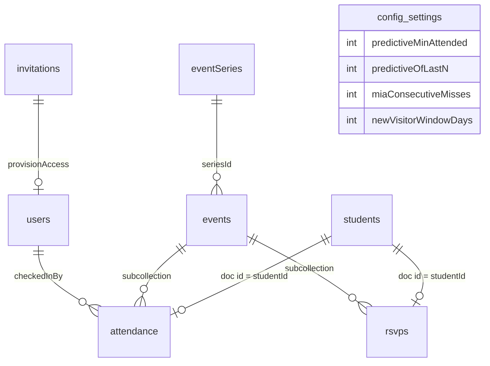

# Data model

Every collection Tally stores, what is in it, who is allowed to write it, and why it is shaped that
way.

`src/types/index.ts` is the contract. Types suffixed `Doc` are the stored Firestore shapes and use
`Timestamp`; the un-suffixed types are the hydrated application shapes, carrying a document `id` and
native `Date`. The converters in `src/services/converters.ts` translate between the two, so no
component ever handles a `Timestamp`. Access rules are in `firestore.rules`; the "who may write"
column below is a summary of them, not a substitute.

Roles rank `counselor` < `core` < `admin`. "Active" means a `users/{uid}` document exists and carries
`active: true` — being signed in is not, by itself, permission to read anything.

---

## Shape



```
users/{uid}                              counselor & core team profiles
invitations/{emailKey}                   who an admin has said may sign in
eventSeries/{seriesId}                   recurring templates (friday-fellowship, sunday-school)
students/{studentId}                     the roster itself — a document is a membership
events/{eventId}                         a single dated gathering
events/{eventId}/attendance/{studentId}  who showed up
events/{eventId}/rsvps/{studentId}       who said they were coming (one-offs)
config/settings                          tunable thresholds
config/planningCenter                    the non-secret Planning Center settings
config/attendees32                       the non-secret Attendees settings
config/backends                          cross-backend choices (default push target)
```

All paths are built from `src/lib/paths.ts`. Nothing constructs a path by string concatenation.

---

## The decisions worth explaining

### 1. Attendance and RSVP documents are keyed by student id

`events/{eventId}/attendance/{studentId}` — the document id *is* the student id, not a generated one.

Check-in happens on several phones at once, at a door, on church wifi. Two counselors tapping the
same student a second apart with auto-generated ids would produce two attendance rows, a head count
one too high, and a "checked in twice" row somebody has to notice and delete. Keying on the student
makes the write idempotent by construction: both taps address the same document and the second
harmlessly overwrites the first. No transaction, no client-side coordination, no read-before-write.

`firestore.rules` enforces `request.resource.data.studentId == studentId` rather than trusting the
client to key correctly, because idempotency that depends on well-behaved callers is not idempotency.

The same reasoning applies to `events/{eventId}/rsvps/{studentId}`: adding a student to a trip list
twice — off a paper sign-up sheet and again from a text message — addresses one document rather than
producing two rows for the same kid.

The cost is that a student can be present at most once per event, which is exactly the invariant we
want, and that history cannot be re-keyed if a student record is merged — which is why students are
deactivated rather than deleted.

### 2. Three denormalised fields on `students`, each carrying an invariant

Everything else the app shows is derived on the client by pure functions. These three are stored,
and each one is stored for a specific reason:

| Field | Invariant | Why it is stored |
| --- | --- | --- |
| `profileComplete` | `true` exactly when `parentPhone` or `parentEmail` is non-empty. Always written via `computeProfileComplete`. | "Incomplete Profiles" must be an indexed query (`status` + `profileComplete` + `createdAt`), not a scan of the whole collection. The converter recomputes it on read as well, so a profile edited through the Firebase console cannot leave a stale flag behind. |
| `searchName` | Lowercased, single-spaced `"first last"`. Always written via `buildSearchName`. | Firestore has no substring search. This is the key the roster's search bar matches against, without loading a secondary index. Recomputed on read if missing. Stored raw apart from case and spacing: accents, punctuation and typos are all folded at match time by `createSearchMatcher`, so the matching rules can change without a migration. |
| `firstAttendedAt` | Written on a student's first ever check-in, and never moved *later*. | "New Visitors" asks "who arrived in the last seven days". Deriving that from attendance would need history older than the loaded window to prove it is really a *first*. Because the field never moves later, back-filling an older event does not retroactively unmake somebody a visitor. It does move *earlier*, and only the Check-Ins history import moves it: that import is the one thing that can discover a student was here long before the date on file, and keeping the later date would read as "first seen in July" above a row saying they were present in May — and put a two-year regular on the New Visitors list. Earlier is safe in the direction that matters, since it can only ever remove somebody from that list, never invent one. The import moves `createdAt` with it, for the reason in the row below. |

`lastAttendedAt` is a fourth, weaker case: a display convenience that only ever moves forward, so
checking a student into a historical event does not rewrite their "last seen" into the past. Undoing
a check-in deliberately leaves both dates alone — recomputing them would need a scan of every past
event, and the dashboard derives its real numbers from attendance documents anyway. These fields are
conveniences, not the ledger.

Which makes both of them high-water marks rather than sightings: they can name a night the register
does not, because a taken-back tap, a deleted gathering or a `markPresentOnly` write leaves them
standing. Every screen that shows one has to decide what to do about that, and the rule is the same
everywhere — the ledger wins wherever the ledger can speak, and the stored field covers the rest. The
MIA list already worked this way (`computeMiaFor` reports the night it found; `computeUnseen` falls
back to `lastAttendedAt` only when the window holds no sighting), and the profile does it through
`reconcileSeen`, which has a year of the student's own attendance documents in hand and so can
overrule a stored date by pointing at the very night it names. Screens with no history loaded — the
roster's last-seen column — show the field as-is, because there is nothing to check it against.

### 3. A gathering with no attendance is a cancelled one

`status: 'cancelled'` is the honest answer to "did this happen?" only when somebody remembered to open
Tally and say so. Gatherings are called off for weather, for a funeral, for a burst pipe in the hall —
and on that evening nobody is thinking about the attendance app. The field is therefore reliable when
it is `'cancelled'` and unreliable when it is `'scheduled'`.

What is always reliable is the attendance subcollection. A gathering that ran has somebody in it; a
gathering that never ran is empty. So every derivation over history treats a finished gathering with
no attendance as cancelled, whether or not it is marked. The rule is one predicate,
`src/lib/sessionHistory.ts`, applied everywhere history is read:

| Where | Without the rule | With it |
| --- | --- | --- |
| MIA list | Every student in the ministry gains a miss for a night that did not happen, and three snow weeks flag all of them. | The night is neither a miss nor a reprieve; streaks close over it. |
| Recent filter | The cancelled Friday consumes one of the last three slots, and "2 of 3" becomes unreachable for regulars. | The window filters *before* it slices, so it reaches a week further back for a third real Friday. |
| Trend strip | A zero bar mid-strip, which reads as attendance collapsing, and an average dragged down with it. | The gathering is simply not plotted. |
| Student page | A chip labelled "Missed", accusing a student of an absence at an event nobody attended. | A faded chip labelled "Cancelled" or "No one", and the streak beside it skips the night. |

The cost is that a gathering somebody genuinely forgot to take attendance at also stops counting. That
is unavoidable — the two cases are identical in the data — and it is the forgiving direction: nobody
receives a "we've missed you" phone call over a night with no record of anyone at all. The screens say
what they inferred rather than hiding it: the dashboard header notes how many scheduled gatherings had
nobody checked in, and the event page says the night is being counted as cancelled and offers both
repairs (take the attendance now, or cancel the event on purpose).

An explicit `'cancelled'` still wins over the inference, even when a few students were checked in
before the call was made. A leader saying "this did not happen" outranks a guess, and the alternative
would make un-cancelling the only way to stop a cancelled night counting as everyone else's absence.

### 4. Check-out is a ternary state, and it never touches attendance

`events/{eventId}.requiresCheckOut` turns the roster ternary: absent (no document), present
(a document with no `checkedOutAt`), collected (a document with one). It is for a room children are
handed back from rather than a register of who came — a nursery, where the number a volunteer needs
mid-service is not how many arrived but how many are still here.

**A missed check-out is not a miss.** `presentStudentIds` still means everybody who was checked in,
so the head count, the MIA derivation, the trend strip and every dashboard metric read exactly what
they always read. The live number is a sibling, `inRoom`, and `inRoom + checkedOut === present` is
the invariant. Nothing on any screen marks a student without a pickup: no badge, no dash, no warning
colour. Half a nursery walking off without telling anybody is a normal morning.

**There is no sweeper.** Nothing ever invents a pickup time for a child somebody forgot to check
out. A fabricated timestamp on a custody record is worse than an absent one, and an absent one is
already the honest answer.

**Undo deletes the field rather than nulling it**, and that asymmetry is load-bearing. A pending
`serverTimestamp()` reads back as `null` in the optimistic local snapshot — the same substitution
`checkedInAt` needs — and `null` is exactly the state that means *still in the room*. Nulling an undo
would leave a child in the Present view until the server answered, and would make a hand-written
console document indistinguishable from a real pickup. So a check-out writes `serverTimestamp()` and
an undo writes `deleteField()`, and the converter can tell all four cases apart.

**A pickup is not gated on who did the check-in.** `validAttendance` demands
`checkedInBy == request.auth.uid`; a check-out deliberately does not, because a shift change would
otherwise either fail or overwrite the provenance of the arrival. It touches `checkedOutAt` and
`checkedOutBy` and nothing else, so the rest of the record survives being handed on.

**The kiosk may record a first pickup, and only that.** It may not move one already standing and may
not undo — correcting a recorded collection is a staff decision made on the roster, not something an
unattended lobby screen does. The rules enforce that rather than trusting the client to.

### 5. Tally does not track money or paperwork

An earlier version of the RSVP feature carried `waiverSigned`, `paymentReceived`, `amountPaidCents`
and an event-level `feeCents`, and rendered a red "blocked" badge at check-in for anyone outstanding.
All of it is gone.

The honest reason is that it was specified more thoroughly than it was built, and the half-built state
was worse than nothing:

- The security rules carefully let a **counselor** flip `waiverSigned` and `paymentReceived` and
  nothing else — the bus-door case — but the only screen with those toggles lived behind a `core`
  route. The person the red badge was aimed at could see it and had no way to clear it.
- `amountPaidCents` was written by the seed and by no screen ever, so a part payment could not be
  recorded. The "outstanding" total assumed the full fee per head and was therefore confidently wrong
  for exactly the students it most mattered for.

Underneath that, the feature claimed an authority the app does not have. A signed waiver lives in a
folder and a cheque lives in a cash box; Tally reading from neither could only ever hold a stale
second copy, and a counselor who trusts a green tick over the clipboard is worse off than one who
never had the tick. Deciding whether a student may board is also not a call an attendance app should
appear to make.

What this buys, beyond the deletion: `isEligible` reduces to "checked in, or active and not
declined"; `RosterWarning` loses its red tier, so nothing on a roster row looks like a stop sign; and
Tally contains no currency handling at all, which turns [the privacy claim below](#what-is-not-stored)
from a promise into something the code makes self-evident.

The RSVP list itself stayed. Closing a trip roster to the students who signed up is eleven lines and
it earns them.

---

## Collections

### `users/{uid}`

The authorisation table. Document id is the Firebase Auth uid.

| Field | Type | Notes |
| --- | --- | --- |
| `email` | string | The verified address the session signed in with. |
| `displayName` | string \| null | From the auth token, else from the access roster. |
| `role` | `'counselor' \| 'core' \| 'admin'` | Ranked; see above. |
| `active` | boolean | The switch. `false` means signed in but not admitted. |
| `createdAt` | Timestamp | Preserved across re-provisioning, so "member since" does not reset on every sign-in. |
| `lastSeenAt` | Timestamp \| null | Bumped by the app itself. |
| `pcoPersonId` | string \| null | The Planning Center person this counselor was matched to, by email. |

**Who writes:** created only by the `provisionAccess` Cloud Function (Admin SDK). Admins may update
and delete other people's documents. A user may update **only** `lastSeenAt` on their own.

Nobody, not even an admin, may write `role` or `active` on their **own** document. Those two fields
are all that stand between a signed-in stranger and the whole ministry's data, so granting a role is
always an act performed on somebody else. Reading your own document is always allowed, even
unauthorised — the app subscribes to it before it knows whether you are a member, and needs to tell
"pending" apart from "error".

### `students/{studentId}`

The youth roster. Ids are generated by Firestore for a Tally-created visitor; a student added *from*
a backend gets that backend's prefixed id (`pco_{personId}`, `a32_{uuid}`) because there the id is
the membership claim itself. Either way linkage is data, not destiny — a student can exist in Tally
before they exist anywhere upstream.

| Field | Type | Notes |
| --- | --- | --- |
| `firstName`, `lastName` | string | Owned by the linked backend once linked; read live off the roster, and kept here only for a student no backend holds. |
| `grade` | 0–12, or absent | Owned by the linked backend; `0` is kindergarten. **Absent is a real state**, and the honest one: a nursery child has no grade, and neither does an adult on a hand-picked roster. It used to be a required number paired with a `gradeOnFile` boolean — a nullable field spelled as a sentinel plus a flag, which every reader had to remember to consult and which the sync set from whether the upstream value was *blank* rather than whether it had been clamped. A real 3rd grader therefore arrived asserting they were in 6th. Absent rather than `null` because `validStudent` reads `!('grade' in d.keys()) || d.grade is int`. Which grades a deployment actually *reads* is `minGrade`/`maxGrade`, still 6–12 by default. |
| `notes` | string \| null | Tally's own, free text. |
| `status` | `'active' \| 'inactive'` | Inactive students leave the roster but keep their history. |
| `isVisitor` | boolean | Set by quick-add. Cleared automatically once a parent contact exists. |
| `profileComplete`, `searchName`, `firstAttendedAt`, `lastAttendedAt` | — | Denormalised; see above. |
| `pcoPersonId` | string \| null | The **Planning Center** person, and only that — the field predates the second backend and keeps its meaning forever. Null for a student Planning Center does not hold. |
| `upstreamBackend`, `upstreamPersonId` | `'pco' \| 'a32'` \| string, or absent | The generic linkage pair: which people-backend holds this student, and as whom. Planning Center writes both fields *and* the legacy `pcoPersonId`; Attendees writes only these. Absent generics with a bare `pcoPersonId` still mean Planning Center, which is what makes the scheme migration-free. |
| `upstreamPushPending` | boolean | A Tally-created student still waiting to be pushed — to the deployment's **default push backend**, decided server-side at push time (`config/backends`). It queues for every backend, which is why it no longer names one. |
| `upstreamRecordMissing` | boolean, or absent | Server-written: the linked upstream record is known gone (deleted, or merged with the trail ending dead). While it stands the rules freeze the student's whole attendance record — check-in, un-check-in and pickup alike, past nights included. Freezes for every backend, same as above. |
| `registrationId` | string, or absent | Written only by `registerFamily`: this child arrived through the kiosk's "first time here" wizard rather than a leader's thumb. Provenance, and only that — it points back at the [review record](#kioskregistrationsregistrationid) a support question or a reviewer needs. It used to double as the push gate, on the reasoning that a self-registration pushed its own children; `pendingReview` below is that job now, and it is the job the field was doing by accident rather than by meaning. Not writable from a kiosk session: the key set pinned by `kioskDatePatchKeys()` does not include it. |
| `pendingReview` | boolean, or absent | **The hold.** `true` while a self-registered family is waiting for somebody to approve them, and the *only* thing that keeps them out of the church's people database: every push path consults it — both backends' `pushStudent`, both pending sweeps, `onStudentCreated`, and the re-create repair. `upstreamPushPending` stays `true` alongside it, because the child genuinely is queued; what the hold adds is that the queue does not drain on its own. Cleared by `approveRegistration`, which then pushes. Server-written in both directions: `reviewHoldUnchanged()` in the rules refuses a client that sets *or* clears it, because a kiosk that could clear its own hold would be a kiosk with a direct line into Planning Center. Counted apart from `queued` on the Settings card — a family waiting for a person is not a stuck queue. |
| `mergedIntoStudentId` | string, or absent | Set on the loser of a merge: this row is really the student it names. The document stays, inactive, because every attendance record points at it. |
| `mergedFromStudentIds` | string[], or absent | Set on the winner: the rows folded into it. Attendance is never re-keyed by a merge — that would be a write per night against records already reported on — so the student's profile unions the histories at read time instead (`useStudentHistory`). A list rather than the older single-valued `mergedFromStudentId`, which silently overwrote the first duplicate when a keeper absorbed a second. |
| `createdAt`, `updatedAt`, `createdBy` | — | `createdBy` is a uid, or a source sentinel — `'planning-center'`, `'attendees32'` — for records an import created. For a student a history import touches, `createdAt` is their earliest attended gathering rather than the moment of import — `predictiveRoster` and the MIA derivation both drop history from before this date, so "created today" would excuse a student from every past night *and* leave their whole imported attendance somewhere no screen counts it. The import moves an existing `createdAt` earlier for the same reason: a student first checked in through Tally last week carries last week's date, and their two years of kiosk history sit before it. |

**A document here *is* the roster membership.** No document, not on the roster. For a student a
backend knows, that document holds the membership and Tally's own annotations only — the name, grade
and contact details are read live and stored nowhere. A prefixed id is a claim about which real
child the row refers to, so a client may not assert it: adding somebody goes through the
`addRosterMember` callable, which checks the person exists upstream first.

**Who writes:** any counselor may create and update. That is deliberate — quick-add happens at the
door, and check-in itself writes `firstAttendedAt` / `lastAttendedAt`.

**Nobody may delete.** Attendance documents reference students by id; deleting one would silently
orphan history and change past head counts. Set `status: 'inactive'` instead.

The linkage fields are the exception to counselor write access. A client may declare a student as
"mine, not yet pushed" (no linkage, `upstreamPushPending: true`) but may never assert an id — legacy
(`pcoPersonId`) or generic (`upstreamBackend` / `upstreamPersonId`). Forging one would let a browser
rebind a Tally student onto an arbitrary upstream person at the next read, so the rules require both
linkages to be unchanged on every client update and only the Cloud Functions (which bypass rules)
may set them. `upstreamRecordMissing` is guarded the same way, because it is what the attendance freeze
reads.

### `events/{eventId}`

One dated gathering.

| Field | Type | Notes |
| --- | --- | --- |
| `title` | string | |
| `description` | string \| null | A sentence for the people turning up — "Games, a talk and pizza". Distinct from `notes`, which is logistics for the other leaders; the description is what the check-in screen leads with when this is today's gathering. |
| `icon` | string \| null | A Material Symbols name from the bundled catalogue in `src/lib/eventIcons.ts`. Stored as the name, not as a glyph, and validated against the catalogue on read: an event carrying a name Tally no longer ships renders as one with no icon rather than as an empty tile. |
| `mode` | `'recurring' \| 'oneoff'` | Recurring is speed-first with a predictive roster. One-off does not repeat and never informs prediction — though it may borrow one, see `predictFromChain` — and its roster can be closed to the students who RSVP'd. |
| `seriesId` | string \| null | Optional link to an `eventSeries` template, on recurring events only. What it does is join this gathering to that template's chain; it is not what turns prediction on, which groups by `chainKey`. Nothing in the app creates a series document — they come from the seed — so most recurring events leave this null. |
| `predictFromChain` | string \| null | On one-off events only: the `chainKey` of the gathering whose regulars this trip borrows. A retreat has no history of its own, but the students on the coach are the ones who come on Friday nights, so a leader names that gathering and the trip's Recent filter reads its last few instances. A chain rather than a `seriesId`, so a weekly gathering created in the app can be borrowed too. Null means no prediction — the whole roster. |
| `recurrence` | object \| null | How the event repeats (RFC 5545 subset, anchored on `startAt`). Occurrences are projected at read time, not written ahead: a document exists only for a gathering somebody acted on — see `lib/materialize.ts` and `lib/eventProjection.ts`. |
| `recurrenceRootId` | string \| null | The hand-made event a chain of repeats grew from, or null when this event *is* that root. Copied onto every occurrence, so the chain has an identity that outlives any one instance. |
| `startAt`, `endAt` | Timestamp | For a recurring event these are the *next* occurrence, not the first ever. Instances already held are their own documents and keep the times they ran at. |
| `checkInOpensAt`, `checkInClosesAt` | Timestamp | The window during which this event counts as live. It no longer *selects* the event — a counselor picks that on the check-in screen — but it is what ringes the gathering in the chooser and sorts it to the top. Materialised per event rather than recomputed from the series, so moving one Friday does not need the template edited. |
| `location` | string \| null | |
| `notes` | string \| null | For the core team. Shown on the event page only — see `description` above. |
| `requiresRsvp` | boolean | Closes a one-off's roster to the students who RSVP'd. A one-off with no explicit flag still defaults to one. |
| `requiresCheckOut` | boolean | Turns the roster ternary: children are checked in and then collected. Off by default and unconditionally — unlike `requiresRsvp`, nothing about a gathering's shape implies it. Inherited by projected occurrences, because a nursery is exactly the kind of gathering that repeats. |
| `labelTemplate` | object \| null | What the kiosk prints when a child is checked in here — `{ lines: [{ text, size, bold, align }], copies }`, where `text` may contain `{{firstName}}`-style tokens. Null means this gathering prints nothing, which is the default: a printer plugged in for the nursery must not start producing stickers at youth group. Content and layout only — no label size, no printer model, because which roll is loaded is a fact about the kiosk in the lobby and lives in *its* localStorage. Inherited by projected occurrences alongside `requiresCheckOut`, and carried onto the kiosk's chooser row because the kiosk never reads an event document. Shape pinned by the rules for the same reason `recurrence` is: a screen on a shelf expands it and nobody is standing there. See [`src/lib/labelTemplate.ts`](../src/lib/labelTemplate.ts). |
| `status` | `'scheduled' \| 'cancelled'` | Cancelled events are never offered as live and never inform prediction. A *finished* event with no attendance is treated as cancelled too — see [decision 3](#3-a-gathering-with-no-attendance-is-a-cancelled-one). |
| `pcoCheckInsEventId`, `pcoCheckInsPeriodId` | string, on imported events only | Which Planning Center Check-Ins event and event period this gathering was imported from. Provenance for a re-import and for whoever is reading the console; nothing in the app renders them. |
| `createdAt`, `updatedAt`, `createdBy` | — | `createdBy` is a uid, or `'planning-center'` for a gathering imported from Check-Ins history. |

**Who writes:** core and up. A counselor cannot create or move an event — changing a date mid-check-in
would swap the active event out from under every phone in the building at once. Cancelling is the
reversible option and the one the event page leads with.

**Hard deletion goes through a callable**, not through the rules that permit it. A document delete
leaves the `attendance` and `rsvps` subcollections behind — unreachable from every screen, and still
counted by every collection-group query — so `deleteEvents` (see
[`functions/src/eventDeletion.ts`](../functions/src/eventDeletion.ts)) enumerates the children and
removes them first. It takes either one event or a whole chain, grouped by the same `chainKey` the
projection and the predictive roster use. A chain delete needs no separate handling for the future:
occurrences ahead are not documents, they are the rule speaking, and the rule is read off the
chain's own instances — so removing the last one empties the calendar ahead. It also nulls
`predictFromChain` on any one-off left pointing at the chain that has gone.

### `events/{eventId}/attendance/{studentId}`

| Field | Type | Notes |
| --- | --- | --- |
| `studentId` | string | Equal to the document id. Enforced by rules. |
| `eventId` | string | Equal to the parent document id. Enforced by rules. |
| `seriesId` | string \| null | Copied from the event so a collection-group query can count a series without joining. |
| `checkedInAt` | Timestamp | `serverTimestamp()`. Reads back as null in the optimistic local snapshot, which the converters handle. For imported history it is the instant the kiosk recorded, which can trail the gathering by days when attendance was taken late. |
| `checkedInBy` | string | Must equal the caller's uid — enforced by rules for client writes. Rows imported from Planning Center Check-Ins carry the sentinel `'planning-center'` instead (written by the Admin SDK, which rules do not govern). |
| `method` | `'tap' \| 'search' \| 'quick-add' \| 'manual' \| 'import' \| 'kiosk'` | Purely diagnostic: it tells the core team whether the predictive roster is earning its keep. `import` marks a row that came from Check-Ins history rather than from anybody's thumb; `kiosk` marks a self-serve tap in the lobby. |
| `isFirstEver` | boolean | True when this was the student's first ever check-in. |
| `checkedOutAt` | Timestamp, or **absent** | When somebody collected them, on an event with `requiresCheckOut`. The key being absent is the whole "still in the room" state, so it is never written as null — see below. |
| `checkedOutBy` | string, or absent | Who recorded the pickup. Deliberately not required to equal `checkedInBy`: the volunteer who takes a child in is rarely the one who hands them back. |
| `arrivalId` | string, or **absent** | Who came through the door together — the same opaque value on every child one press of the kiosk's confirm button put on the register. Written only by the kiosk; the main app checks students in one at a time and makes no claim. Rules pin it to a non-empty string of at most 64 characters. |

**Arrivals, and why absent is not empty.** A pickup asks "who else is going home with them", and
until this field existed the only answer available was the kiosk's guess at a family from four phone
digits — conservative by design, so it misses a child on a different number, and blind to a cousin
or a neighbour's boy who came in the same car. The arrival is a better answer because it is not a
guess: somebody stated it with their thumb an hour earlier. So the pickup screen ticks the arrival
and *lists* the phone guess unticked, since families do leave together after arriving apart.

The three states are distinct and all three matter. An arrival shared with others means "these came
in together". An arrival of one means "came alone", which is what stops a sibling dropped off half an
hour later from arriving pre-ticked for collection. **Absent** means nobody ever claimed either way —
every record predating the field, and everything the main app writes — and the kiosk reads it as
"fall back to the guess". Writing an empty string or a null for the solo case would collapse the
second into the third, so the key is omitted rather than emptied.

**Who writes:** any counselor may create, update and delete. Undoing a mistaken tap is a delete, and
has to be as fast as the tap was. A *check-out* is a second, narrower shape of update — two fields
and no others, permitted to any counselor rather than only the one who did the check-in — and it is
the one update a kiosk session may perform.

### `events/{eventId}/rsvps/{studentId}`

| Field | Type | Notes |
| --- | --- | --- |
| `studentId`, `eventId` | string | Both enforced against the path. |
| `status` | `'yes' \| 'no' \| 'maybe'` | `no` removes a student from the roster; `yes` and `maybe` keep them on it. A declined student keeps their document, because a `no` is often reversed. |
| `notes` | string \| null | Why somebody is a maybe. Written by the seed only — no screen edits it yet. |
| `updatedAt`, `updatedBy` | — | |

**Who writes:** core, for everything. A counselor reads the list — with `requiresRsvp` it *is* their
roster — but never writes it: who is on the trip is decided before the door, not at it.

There is deliberately no waiver, fee or payment state here. An earlier version tracked all three;
they were removed because Tally cannot be the system of record for money or signed paper, and a
partial copy of both was worse than neither. See
[decision 5](#5-tally-does-not-track-money-or-paperwork).

### `eventSeries/{seriesId}`

Reference data. Series carry `title`, `dayOfWeek`, `startTime` / `endTime` as local `"HH:mm"`,
`checkInOpensMinutesBefore` / `checkInClosesMinutesAfter`, `active` and `order`.

**Who writes:** core and up. Readable by anyone active.

### `skippedNights/{chainKey}`

Derived data, and the only collection here that is not a record of something. It answers, for one
repeat chain, "which of its nights did nobody come to" — the question decision 3 above turns into a
rule, and the one a student's profile has to ask of every night in a year.

Asking it per night meant reading every night's attendance subcollection: a year across four
gatherings is a couple of hundred reads, on every profile, on every device, to re-derive a handful of
dates that never change. Here it is one document per gathering.

| Field | Meaning |
| --- | --- |
| `chainKey` | The chain this answers for. Matches the document id — the rules enforce it, because a document disagreeing with its path would answer for a gathering it is not about. |
| `skipped` | Event ids examined and found with nobody checked in. |
| `examinedFrom` | Every finished night of this chain starting at or after this instant has been examined. Before it, the document claims nothing. |

`examinedFrom` is what makes the rest safe. A night's absence from `skipped` means "somebody came"
*or* "nobody has ever looked", and those lead opposite places — read as held, an unexamined night
becomes an absence, and absences are what the MIA list phones families about. `outcomeOf` in
`src/services/skippedNights.ts` returns three answers rather than two, and callers read the register
directly for the third.

Nothing here is authoritative: every claim can be re-derived from the registers it summarises, which
is why a counselor may write it where they may not write an event, and why a wrong entry costs only
the reads it was meant to save. Two paths correct it, both cheap. A night that gains its first
check-in is removed at the moment of the tap, for the first few taps — that is the back-fill case. An
examination that finds a night held which the list calls skipped removes it too, which catches
attendance arriving by any route that never taps a phone, an import included.

Adds and removes are `arrayUnion` / `arrayRemove`, never a rewritten array, so a device examining a
year cannot undo a correction another device made while it was reading.

**Who writes:** counselor and up. Readable by anyone active. Deletes are refused — forgetting the
document silently un-examines a year, and the way to correct one night is to remove one night.

### `eventAccess/{chainKey}`

Who may *work* one gathering. Absent for every gathering nobody has restricted, which is the whole
migration: deploying this changed nothing, and there was no backfill to get wrong.

Chain-keyed for the same reason `skippedNights` is. Most occurrences on the calendar are projected —
`eventProjection` expands a recurrence rule into occurrences with derived ids and no document until
somebody checks in — so an ACL on the event document could not cover next Friday, and nobody is going
to grant fifty-two Fridays one at a time.

| Field | Meaning |
| --- | --- |
| `chainKey` | The chain this governs. Matches the document id, as `skippedNights` does. |
| `restricted` | False — or no document at all — means every active member. |
| `members` | Uids. Kept when `restricted` goes false, so re-opening and changing your mind again does not mean rebuilding the list from memory. |
| `updatedAt` / `updatedBy` | Who last changed it. |

**Locked, not hidden.** A gathering you are not on still appears on the chooser, below a divider,
with a lock and the name of somebody who can add you. This is a deliberate limit on how much the
feature protects: a counselor standing at a door at 6:59pm who sees an empty screen concludes the app
is broken and files forty check-ins against the wrong thing, which is the worst failure this app has.
So what closes is check-in, undo, RSVPs, the register and editing. What stays open is that the
gathering exists, what it is called and when it is on.

**Who writes:** creating one — restricting a gathering — is core team and up. Adding somebody is
open to anybody already on the gathering, because handing out access you already hold is not an
escalation and it is the whole point of the volunteer-at-the-door case. Removing somebody, and
flipping `restricted`, are core team. The writer must stay on the list: otherwise one core member can
close *Friday Fellowship* and leave themselves off, and nobody below an admin could reopen it,
because reopening requires being on it. Admins pass regardless — that is the break-glass. Deletes are
refused, because deleting the document reopens the gathering; the way to reopen is `restricted:
false`, which keeps the list.

**One `get()` note that is not a detail.** Every rule reading this collection asks `exists()` before
`get()`. A `get()` at a path with no document *raises* rather than returning null, and a raised
lookup denies — so the natural `a == null || …` form would have denied every gathering nobody had
restricted, which is all of them on the day it deployed. `firestore-tests/getSemantics.test.ts` pins
that fact.

### What restriction does not protect

A fence whose gaps are undocumented is worse than none, so:

- **`students.lastAttendedAt` / `firstAttendedAt`.** Every check-in stamps the student document, and
  `students` is readable to any active member. Diffing those dates across the roster before and after
  a restricted gathering reconstructs most of its register. There is no fix that keeps the dashboard
  working, and this is the real boundary of "locked, not hidden": it protects the ledger and the
  working surface, not the fact that a given student was somewhere on a given evening.
- **Orphan ACLs.** Deleting a one-off leaves `eventAccess/{eventId}` behind. Left deliberately —
  "delete and recreate to unlock" would be worse than an orphan, and a recreated event gets a new id.
- **Not a data-protection boundary.** The problem being solved is clutter on a nursery volunteer's
  screen, not secrecy. Anything that genuinely must not be seen by part of the team does not belong
  in Tally.

### `kioskPairings/{code}`

The self-serve kiosk's pairing handshake — how a browser on a lobby shelf acquires a session
without anybody signing in to Google on it. The kiosk (served at `/kiosk`) calls an
unauthenticated callable and puts the returned six-character code on screen; a staff member
approves that code from `/pair-kiosk` under their real session; the kiosk then redeems the code
*plus a secret only it holds* for a custom token minted for the **approver's uid**, carrying a
`kiosk: true` claim. Every check-in the kiosk writes is attributed to the person who approved it.

**How long a kiosk stays on one gathering.** The binding lasts until
`max(endAt, checkInClosesAt)`. It used to end at `endAt`, which on a nursery Sunday is the moment
the parents arrive — the screen unbound itself, mid-queue, exactly when it was needed — and
`listKioskEvents` dropped anything ended, so it could not be sent back either. Both bounds moved
together; fixing only one leaves a kiosk that survives until somebody reloads it. `max` rather than
`checkInClosesAt` alone because the rules only require that field to be a timestamp, so a seed or a
migration can produce a window that closes before its event ends, and taking the later of the two
cannot shorten any binding. A gathering that has ended but is still collecting appears in the
chooser labelled `Ended — pickup only`.

| Field | Type | Notes |
| --- | --- | --- |
| `secretHash` | string | SHA-256 of the kiosk-held secret. The plaintext never touches Firestore — the code is public by design (it is on a screen in a lobby), and the secret is what stops a bystander who saw it from racing the kiosk for the token. |
| `status` | `'pending' \| 'approved'` | |
| `approvedBy`, `approvedAt` | — | The staff member whose identity the kiosk inherits. |
| `createdAt`, `expiresAt`, `claimedAt` | — | Ten-minute lifetime; expired documents are swept opportunistically by the next `startKioskPairing` call. |

**Who writes: nobody, from a client.** The rules deny every read and write; the three pairing
callables and the Admin SDK are the only parties. Claiming is idempotent while the pairing lives —
a kiosk whose claim response is lost to a wifi blip retries the same call — and the guardrails on
the unauthenticated ends are a cap on live pairings, the expiry, and the fact that no token exists
until an authenticated approval does.

The `kiosk: true` claim narrows the session rather than widening it: a kiosk may *create* an
attendance record and write the date patch a check-in makes (a pinned key set on `students`), and
may not update or delete attendance, read `users`, or touch anything else a full counselor session
can. The kill switch is the approver's `users/{uid}` document — deactivating it cuts the kiosk off
on its next request, like any other session.

### `kioskIndex/phones`

The kiosk's search-by-phone: one document mapping **the last four digits of a phone number → the
student ids whose family holds a number ending in them**. A parent types four digits and the kiosk
answers from this map locally; "family" means the student's own numbers plus every number belonging
to anyone sharing their household (Planning Center) or family folk (Attendees) — parents and
siblings alike.

| Field | Type | Notes |
| --- | --- | --- |
| `version` | `1` | |
| `builtAt`, `builtBy` | — | `builtBy` is a uid, or `'schedule'` for the nightly rebuild. |
| `last4` | map | `'1234' -> [studentId, …]`, sorted, deduped. |

Derived data in the fullest sense: rebuilt from the backends at any time (nightly on a schedule,
on demand from Settings, by a kiosk that finds it stale at bind time, and by a family the kiosk
could not find taking up its offer to look again — rate-limited there, since it is the one path a
parent can trigger), holding nothing but
tail digits and ids the same readers already see on every roster row. The full numbers are read
upstream by the server-side collectors and reduced to last-4s page by page — the whole church's
phone book is never held anywhere, and only the four digits are ever written down. That is the
bargain that lets this document exist in a database whose posture is
[storing no phone numbers at all](#what-is-not-stored).

**Who writes:** only the functions. A client that could write it could make any four digits answer
any student. Readable by any active member — the kiosk session is one.

**Read backwards, it is also the kiosk's family.** Inverting the map gives each student the set of
digits their family answers to, which is what lets the confirm screen offer to check the other
children on that number in — or collect them — in the same tap
([`src/kiosk/family.ts`](../src/kiosk/family.ts)). Two students count as family only when one's set
of digits contains the other's, never on a bare overlap: because each collector aggregates over
household or family-folk co-membership, real siblings always land on the same set (or a superset,
where a child belongs to a second household), while two unrelated families that happen to end a
number the same way each keep a digit the other lacks. The search can afford that coincidence —
both families' children appear and a parent picks their own — but an offer cannot, so it is held to
the stricter test. What is offered stays as wide as that guess; which of it arrives *ticked* is a
different question, answered by the document below.

**Its third reader is the review screen**, and for the same reason a parent types digits: to tell
two children of the same name apart. A merge is the one decision on that screen with a right
answer, and a name and a grade are often not enough to make it — two children can share both, and a
grade rolls over between terms, so "Elena Salgado · 8th grade" against an incoming "Elena Salgado ·
7th grade" is either the same girl a year later or a different girl. `listPendingRegistrations`
reads this map once per call and marks each duplicate candidate the church already finds under the
registering family's own four digits (`sharesFamilyDigits`). It is evidence and never a verdict:
the negative is rendered as plainly as the positive, so "different on both" is a visible answer
rather than a blank, and the reviewer still chooses.

### `kioskIndex/participation`

Who belongs to each gathering, and who comes to it regularly. One document, keyed by chain.

| Field | Type | Notes |
| --- | --- | --- |
| `version` | `1` | |
| `builtAt`, `builtBy` | — | `builtBy` is a uid, or `'schedule'` for the nightly rebuild. |
| `maxAgeDays`, `ofLastN`, `minAttended` | numbers | The windows the lists below were drawn with, recorded so a reader need not know the code. |
| `chains` | map | `chainKey -> { participated: [studentId, …], recent: [studentId, …] }`, both sorted. `recent` is always a subset of `participated`. |

The two answers the kiosk has never had, and both are already the app's. **`participated`** is
attendance at any instance of the chain in the last
[`PARTICIPATION_MAX_AGE_DAYS`](../src/lib/participation.ts) — the same year the roster's
"has been here before" filter uses. **`recent`** is the check-in screen's prediction: at least
`predictiveMinAttended` of the last `predictiveOfLastN` instances that actually happened, read from
`config/settings`. Cancelled instances and instances with nobody checked in are dropped before the
window is taken, so a snowed-out Friday costs it nothing.

The kiosk uses them for two different things, and the difference matters:

- **`participated` scopes the search.** The lobby screen used to search every active student in
  Tally, which is not the population standing in front of it — a parent at Friday Fellowship typing
  four digits could be shown a family who has only ever come to Sunday nursery, or, since four
  digits are four digits, a stranger's children looking exactly like the answer.
- **`recent` decides which siblings arrive ticked.** The phone guess above is often right about the
  household and wrong about tonight, and ticking a child who is not in the building writes them onto
  a register nobody can reconcile. Everyone the guess found is still listed, at full weight, one tap
  from being included.

Every failure widens rather than narrows — a chain with no history, a missing document, a binding
written before this existed, a failed read. The kiosk then searches the whole roster and ticks
everything, which is what it did before this document existed. A scope that failed closed would be a
family who cannot find themselves.

A gathering reads the chain that *predicts* for it, not simply the chain it is in: a recurring
gathering reads its own, and a one-off reads whatever `predictFromChain` names and nothing when it
names nothing. That is [`predictionChain`](../src/lib/gatherings.ts), and the kiosk mirrors it so the
lobby screen and the check-in screen cannot answer "who belongs here" differently about the same
evening. The lookup key rides on the kiosk's binding; the identity `materializeOccurrence` takes is
a separate field and still `chainKey`.

Rebuilt nightly at 03:20 by `rebuildKioskParticipation`, and on demand by a kiosk that finds it
stale at bind time. Its own scheduled job rather than a passenger on the phone index's: this build
touches no backend and needs no secrets, while the phone index build deliberately fails when a
backend is down — sharing one would let a Planning Center outage take the kiosk's idea of a
gathering with it. It reads a year of attendance subcollections, which is the only thing in this
codebase that sweeps attendance on a schedule.

**Who writes:** only the functions, like every other `kioskIndex` document. It holds nothing but
student ids the same readers already see on every roster row.

### `kioskIndex/pendingLast4`

The digits a family typed in themselves, held until the backends say the same thing.

A family who registers at the kiosk has to be findable by their phone number *immediately* — the
whole handoff is "next time, just type your last four digits" — but that number reaches the backends
at best a moment later, and on a deployment whose write-back cannot create a household, never. A
rebuild from the backends alone would therefore lose them: the 3:30am job would silently
un-register a family who registered that morning, and to a parent that looks like the church losing
their child. So `registerFamily` writes its digits here as well as patching `kioskIndex/phones`
directly, and every rebuild folds this document in before inverting the map. **A rebuild can only
ever add to what a registration made findable.**

| Field | Type | Notes |
| --- | --- | --- |
| `version` | `1` | |
| `entries` | map | `registrationId -> { last4, studentIds, addedAt }`. Keyed by registration rather than by digits, which makes it idempotent under a retry and prunable per family: two families sharing a last four are two entries, and one being adopted upstream does not take the other's answer away. |

An entry leaves on either of two conditions, both checked at rebuild time: the backends now answer
for **every** one of its students under the same digits, or it has sat here fourteen days without
that ever happening. The TTL is what stops a mistyped number answering forever — long enough for a
family to come back several times on digits the church office has not yet entered anywhere, short
enough that nobody builds a habit on a wrong one.

Same bargain as the document above, and no wider: four digits and student ids, never a whole number.
The guardian's full phone number exists only inside one `registerFamily` invocation — used to build
the family upstream, reduced to its tail, and discarded with the request.

**Who writes:** only the functions, like every other `kioskIndex` document.

### `kioskIndex/pulse`

The change signal every kiosk polls, so the caches above stop waiting out their TTLs.

| Field | Type | Notes |
| --- | --- | --- |
| `version` | `1` | |
| `roster` | map | `{ rev, at }` — bumped by anything that changes who the roster read returns: a registration, a student created by quick-add or import, a discarded registration, a merge, the nightly phone-index rebuild. |
| `phones` | map | `{ rev, at }` — bumped when the four-digit index changed: a registration that carried digits, the nightly rebuild. |
| `participation` | map | `{ rev, at }` — bumped when the participation document above is rebuilt. |

A live document may also carry a `registration` map — the retired phone form's auto-advance channel.
Nothing bumps or reads it any more; bumps merge whole channel objects and never delete keys, so the
stale entry simply sits with its revision frozen, which is also what keeps pre-retirement kiosk
bundles parsing this document until their nightly reload.

The revisions are **opaque change counters, not versions**. A kiosk remembers the last value it saw
per channel and refetches that channel when the value merely *differs* (`!==`, never `>`), so
nothing anywhere needs the numbers to be dense or ordered. They are written read-modify-write as
`max(previous + 1, now-in-milliseconds)` — no `FieldValue.increment`, matching the codebase's
injected-clock convention — and the epoch anchor is what makes the one dangerous race disappear:
two concurrent writers can lose one increment harmlessly (any observed change refetches the whole
channel; the pulse is a signal, never a delta), but they will virtually never write the *same*
value, which is the only shape a client could actually miss.

The kiosk reads this document every thirty seconds (`PULSE_POLL_MS`) — one small read beside an
attendance poll that already re-reads a whole subcollection every five minutes — and refetches
**only the channel whose revision moved**: an unforced roster read, the phone index, the
participation document. Last-seen revisions live on disk with the kiosk's other caches, so a tablet
that slept through an evening catches up on its first poll after waking instead of trusting
whatever it went to sleep holding.

Every write is best-effort and every read fails open. A bump that cannot be written is a logged
warning and a kiosk that finds out by TTL, exactly as before this document existed; a pulse that
cannot be read is "no signal", and the TTLs still govern. An old kiosk bundle that has never heard
of this document keeps working untouched, and the document needs no backfill — it springs into
existence on the first bump. The one high-volume writer, `onStudentCreated`, debounces itself
(a bump is skipped while the channel's `at` is within ~30 s), so a 400-person import writes a
couple of bumps rather than four hundred.

It holds no names, no digits, no student ids — nothing but counters, timestamps and a gathering id.

**Who writes:** only the functions, like every other `kioskIndex` document — and here that is also
the security argument: the attack on a client-writable pulse is spoofing "your caches changed" at
every kiosk and driving the fleet into refetch loops, so `set` fails even for an admin. The rules
test pins it.

### `kioskRegistrations/{registrationId}`

One document per run of the kiosk's "first time here" wizard. It does two jobs: it is the claim that
makes a retried registration answer instead of creating a second family, and it is the **review
record** a core-team member acts on afterwards.

A parent taps once. A wifi blip means the call runs twice, and the kiosk's retry queue is no help —
it replays direct Firestore writes, and a callable is not one. So the client mints a
`registrationId` once per wizard run and re-sends it, and the server claims this document with
`create()` (the same ALREADY_EXISTS handshake `startKioskPairing` uses). A second call with the same
id is recognised as a retry before anything else happens; the pre-allocated student ids below are
what make every write downstream safe to repeat.

| Field | Type | Notes |
| --- | --- | --- |
| `status` | `'pending' \| 'complete'` | A `pending` document is resumed rather than restarted: every write downstream is keyed by the ids below, so replaying is repeating, not duplicating. |
| `studentIds` | string[] | Pre-allocated before the batch, which is the whole mechanism. |
| `source` | `'kiosk' \| 'qr'` | `'qr'` is legacy — the retired phone form wrote it until Aug 2026; such records drain on the 30-day sweep. The read side (this table's parsers, the review card's "from their own phone" subtitle) stays tolerant until they are gone. |
| `eventId`, `checkedIn`, `childCount`, `last4` | — | Enough to answer a completed call again. |
| `guardian` | `{ firstName, lastName, phone }` \| null | **The exception below.** Null only on a sibling registration, where the family is already identified. |
| `children` | `{ firstName, lastName, grade }[]` | The form as typed, so a reviewer sees what the family wrote and not only what the roster now says. |
| `allergies` | `(string \| null)[]` | Index-aligned with `children`, from the wizard's allergies question — asked only where the backend takes full write-back, exactly the gate the retired phone form kept. Sent upstream on approval and held nowhere else. |
| `possibleDuplicateOf` | map | Child index → active student ids with the same name. Recorded, never acted on: it is what puts "this might be the Jacob Smith we have" in front of a human. |
| `anchorStudentIds` | string[] | Verified siblings, when a parent added a second child to a family the church already has. Decides which household is joined at approval. |
| `lastError` | string \| null | Why the last approval attempt did not finish. |
| `lastErrorKind` | `'children' \| 'guardian' \| 'both'` \| null | *Which half* did not finish, because the two halves want opposite moves. Children a backend refused are worth retrying — the usual cause is an outage that has passed. An adult it refused usually cannot be retried into working, since the usual cause is a number it already holds for somebody outside this household, and retrying reattempts exactly that refusal. The review screen reads this to decide whether to offer a retry or to offer finishing without the adult (`approveRegistration({ withoutGuardian: true })`, which pushes the children, never attempts the parent, and releases the record — number included — rather than holding it thirty days to serve a retry the reviewer declined). Null on records written before this existed, which the screen reads as "offer the ordinary foot". |
| `createdAt`, `completedAt` | — | Swept after **30 days**, or deleted the moment a reviewer approves or discards. |

#### The one place Tally holds a parent's phone number

This is a deliberate, documented exception to [what is *not* stored](#what-is-not-stored), and it
exists because the alternative was worse. Registration used to write the guardian straight through to
Planning Center while the parent stood at the screen — so nothing had to be kept. Deferring that push
until somebody has reviewed the family (which is the whole point: nothing upstream is reversible, and
a lobby screen cannot decide identity) would otherwise mean *losing* the guardian entirely, because
`noMirroredPersonalData` in `firestore.rules` forbids a parent's name or number on a student document
and there is nowhere else for it to go.

So it waits here, and "waits" is enforced rather than asserted:

- **No client can read it.** The collection is deny-all in both directions. The only way to see it is
  the `listPendingRegistrations` callable, which is core team only — the same role that may already
  push a student into the church's database.
- **It is deleted on decision.** Approve or discard, the document goes. An approval whose family
  write *failed* keeps it, with the reason, so pressing the button again can still finish the job —
  that is the only case where it survives a review.
- **It is deleted anyway.** Thirty days, swept from the review call. Long enough to cover a holiday
  and a volunteer who was away; short enough that it is a deletion date and not an archive. The
  review screen ages rows toward it, so a family about to be swept is visible as one first.

**Who writes: nobody, from a client.** Readable, it would say which families registered today, how
many children each brought, and how to ring them; writable, somebody could pre-claim an id and make a
family's registration hand them a stranger's students.

### `config/settings`

A single document holding the four thresholds the core team can tune:

| Field | Default | Meaning |
| --- | --- | --- |
| `predictiveMinAttended` | 2 | A student is "Recent" when they attended at least this many… |
| `predictiveOfLastN` | 3 | …of the last this-many instances of the *same* series — meaning the same repeat chain: a shared `seriesId` when there is one, a shared `recurrenceRootId` otherwise. Friday history never predicts Sunday either way. |
| `miaConsecutiveMisses` | 3 | Consecutive missed nights *of one gathering* before a student lands on the MIA list. Counted per repeat chain, like the Recent filter, and only for students that gathering could expect: `wasRegular` asks the two fields above as of the student's last visit to it, so a Friday regular is not missing from Sunday School and somebody who dropped in once is missing from nothing. A student the window has seen nowhere is listed under no gathering, provided Tally has checked them in at some point and one gathering has met that many times since they joined — a directory entry who has never come to youth group is not missing. |
| `newVisitorWindowDays` | 7 | How far back "New Visitors" looks. |

**Who writes:** core and up, and the rules validate the relationship — `predictiveOfLastN` must be at
least `predictiveMinAttended`, or the Recent filter could never be satisfied and would silently render
empty, which reads as a bug rather than a setting. The converter clamps on read as a second belt.

### `config/planningCenter`

The non-secret half of the Planning Center configuration, owned by the core team from Settings:
`minGrade`, `maxGrade`, `writeBack`, `cacheTtlSeconds`, `baseUrl`, plus `updatedAt` / `updatedBy`.

Absent on a fresh install, which is a normal state rather than a missing record — the deploy-time
parameters are the defaults, and this document only overrides them where it has an opinion.

**Who writes:** core and up, with one carve-out: `baseUrl` is admin-only, because every Planning
Center request carries the church's credentials and that field decides where they are sent. **Who
reads:** core and up. The shape is closed (`hasOnly`), so a credential cannot be stashed here even by
an admin — and it must not be, since a document a browser can write is one a browser can read.

### `config/attendees32`

The same idea for the second backend: the non-secret half of the Attendees configuration —
`enabled`, `baseUrl`, `divisionId`, `meetSlug`, `characterSlug`, `assemblySlug`, `minGrade`,
`maxGrade`, `writeBack`, `cacheTtlSeconds`, plus `updatedAt` / `updatedBy`. The DRF token lives in
Secret Manager (`A32_TOKEN`) and nowhere else.

Same access shape as `config/planningCenter`, for the same reasons: core-writable, closed key set,
and `baseUrl` admin-only — every Attendees request carries the token to whatever host that field
names. Absent means "not set up", which is the ordinary state of a deployment running on Planning
Center alone. See [attendees32.md](./attendees32.md).

### `config/backends`

Cross-backend choices — today, exactly one: `defaultPushBackend` (`'pco' | 'a32'`), where a student
Tally creates gets pushed. Absent means Planning Center, which is what keeps every deployment from
before this document existed behaving identically. Core-writable, closed shape, enum-checked. A
student already linked ignores it — writes dispatch to the backend that holds them.

The allowlist: an admin saying "this Google address may sign in, as this". `emailKey` is the
lowercased address with `.` replaced by `,` (`sam.smith@example.org` → `sam,smith@example,org`) —
Firestore ids may not contain `/`, and `.` is legal but awkward to read.

Fields: `email`, `role`, `active`, `invitedAt`, `invitedBy`, and an optional `note`.

Keyed by address rather than by uid because it is written *before* the person has ever signed in, and
a uid does not exist until they do. Once they have, `users/{uid}` is the live authorisation and this
is only the record of how they arrived — which is why withdrawing an invitation stops somebody
arriving but does not evict anybody who already has.

**Who writes:** admins, through the app. **Who reads:** admins only — this is a list of church staff
email addresses, and a counselor's phone has no reason to hold one. The shape is closed (`hasOnly`),
so nothing unvalidated can be smuggled into an access decision.

This collection used to be a Planning Center List. A List is generated from filter rules, so "these
particular twelve adults" was only expressible by inventing a custom field on every person in the
church — and it put an access decision in a system whose editors are a different set of people from
the ones who should be making it.

---

## What is *not* stored

No birthdates, addresses, photographs, student phone numbers or emails, medical information beyond a
single allergy line, and nothing financial whatsoever — not a card number, not a fee, not a record of
who has paid. See [Handling minors' data](minors-data.md).

There are exactly two deliberate brushes with contact data, and both are bounded on purpose.

[`kioskIndex/phones`](#kioskindexphones) is the kiosk's phone search: the **last four digits** of
family numbers, mapped to student ids, and nothing more. Never a full number, never a name attached
to a number, and always rebuildable — deleting the document costs one rebuild, not any data.

[`kioskRegistrations`](#kioskregistrationsregistrationid) is the newer one and the wider one: a
guardian's name and full phone number, waiting for somebody to review the family who typed them. It
is a **staging buffer, not a mirror**, and the difference is enforced — no client read path at all,
a core-team callable to see it, deletion the moment a reviewer decides, and a thirty-day sweep if
nobody does. It exists because holding a family out of the church's database until a person has
looked at them means holding *something* about them somewhere, and the honest place for that is one
TTL'd document nobody can read rather than a field on four hundred student records.

Everything the dashboard and the check-in screen display beyond the fields above is derived in the
browser: the Recent filter, MIA students, new visitors, roster warnings, head-count trends. Those live
in `src/features/roster/predictiveRoster.ts` and `src/features/dashboard/insights.ts` as pure
functions over data that is already loaded, so a threshold change in Settings takes effect everywhere
immediately with nothing to backfill.

The one exception is [`kioskIndex/participation`](#kioskindexparticipation), where the same two
derivations are precomputed nightly and written down — not because they are different, but because
the kiosk cannot run them: it holds no event history and could not download the code that reads it.
The rule is shared rather than reimplemented (`src/lib/participation.ts`, copied into
`functions/src/generated/` by `scripts/sync-functions-shared.mjs`), so the two answers cannot drift.
A threshold change in Settings reaches the kiosk at the next rebuild rather than immediately.

Both files group history by the same key — `chainKey` in `src/lib/materialize.ts`: the `seriesId` when
there is one, the recurrence root otherwise. That is what makes "the same gathering" mean one thing
across the app, so the check-in roster, the dashboard's tabs and a student's attendance card cannot
disagree about which nights predict, or accuse, each other. One-off events are outside it by
definition and get their own derivations, which never produce a streak.

A trip is the one thing that reaches across that line, and only in one direction: `predictFromChain`
lets it *read* a gathering's history for its own Recent filter. Nothing ever predicts from a one-off —
a retreat is not evidence about who turns up to a retreat — so the chains themselves stay untouched.
`predictionChain` in `src/lib/gatherings.ts` is where the two cases meet.

---

## Indexes

`firestore.indexes.json` declares what the queries above need:

- `events` by `seriesId` + `startAt desc` — no live query needs it today: the client loads a window of
  events once and picks a series' history out of it in memory, which is also how a chain with no
  series document gets predicted at all. Kept for a server-side reader that wants one series directly.
- `events` by `status` + `startAt asc` — upcoming events.
- `students` by `status` + `lastName` + `firstName` — the roster stream, alphabetical.
- `students` by `status` + `profileComplete` + `createdAt desc` — the Incomplete Profiles list, which
  is the whole reason `profileComplete` is denormalised.
- Collection-group indexes on `attendance` by `studentId`, `seriesId` and `isFirstEver`, each with
  `checkedInAt desc` — one student's history, one series' history, and first-ever check-ins. The
  first of these is what "Every night they came" on a student's page pages through
  (`fetchStudentHistory`), which is how that list reaches years further back than the calendar the
  app keeps loaded.

  These are read by the `getStudentAttendance` callable rather than from a browser, and that is the
  interesting part. A collection-group query is only authorised by a rule at a wildcard path — and a
  wildcard path has no single parent event, so no rule there can ask which gathering a record belongs
  to. With `seriesId` indexed, one line in a console returned an entire restricted gathering's
  register. Worse, a wildcard path also matches an ordinary subcollection query at
  `events/{id}/attendance`, and rules are OR'd across matching paths — so the rule that made a
  profile's history possible was also granting the `list` that the per-gathering gate denies.

  Neither can be fixed by narrowing the rule, because rules cannot tell a collection-group query from
  a subcollection one. So `match /{path=**}/attendance/{studentId}` is `allow list: if false`, and
  the query moved to a callable that reads each record's parent event and drops what the caller may
  not see.
