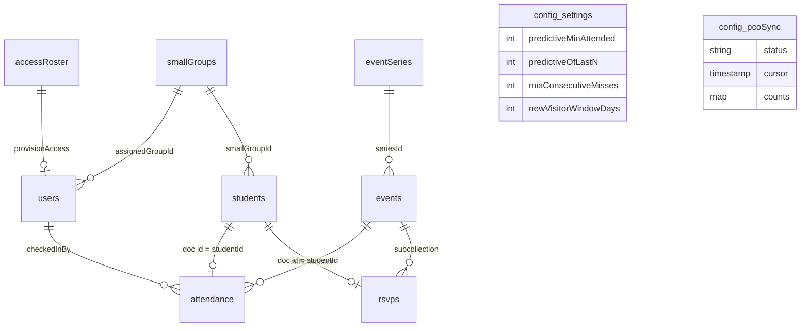

# Data model

Every collection Tally stores, what is in it, who is allowed to write it, and why it is shaped that
way.

`src/types/index.ts` is the contract. Types suffixed `Doc` are the stored Firestore shapes and use
`Timestamp`; the un-suffixed types are the hydrated application shapes, carrying a document `id` and
native `Date`. The converters in `src/services/converters.ts` translate between the two, so no
component ever handles a `Timestamp`. Access rules are in `firestore.rules`; the "who may write"
column below is a summary of them, not a substitute.

Roles rank `counselor` < `core` < `admin`. "Active" means a `users/{uid}` document exists and carries
`active: true` — being signed in is not, by itself, permission to read anything.

---

## Shape



```
users/{uid}                              counselor & core team profiles
smallGroups/{groupId}                    Sunday School groupings
eventSeries/{seriesId}                   recurring templates (friday-fellowship, sunday-school)
students/{studentId}                     the youth roster
events/{eventId}                         a single dated gathering
events/{eventId}/attendance/{studentId}  who showed up
events/{eventId}/rsvps/{studentId}       who said they were coming (one-offs)
config/settings                          tunable thresholds
config/pcoSync                            Planning Center sync state
accessRoster/{emailKey}                  Planning-Center-derived allowlist
```

All paths are built from `src/lib/paths.ts`. Nothing constructs a path by string concatenation.

---

## The two decisions worth explaining

### 1. Attendance and RSVP documents are keyed by student id

`events/{eventId}/attendance/{studentId}` — the document id *is* the student id, not a generated one.

Check-in happens on several phones at once, at a door, on church wifi. Two counselors tapping the
same student a second apart with auto-generated ids would produce two attendance rows, a head count
one too high, and a "checked in twice" row somebody has to notice and delete. Keying on the student
makes the write idempotent by construction: both taps address the same document and the second
harmlessly overwrites the first. No transaction, no client-side coordination, no read-before-write.

`firestore.rules` enforces `request.resource.data.studentId == studentId` rather than trusting the
client to key correctly, because idempotency that depends on well-behaved callers is not idempotency.

The same reasoning applies to `events/{eventId}/rsvps/{studentId}`, with a second benefit: a counselor
at the bus door ticking `waiverSigned` and a core member setting `paymentReceived` from the dashboard
a minute earlier are `merge` writes to one document, so neither clobbers the other.

The cost is that a student can be present at most once per event, which is exactly the invariant we
want, and that history cannot be re-keyed if a student record is merged — which is why students are
deactivated rather than deleted.

### 2. Three denormalised fields on `students`, each carrying an invariant

Everything else the app shows is derived on the client by pure functions. These three are stored,
and each one is stored for a specific reason:

| Field | Invariant | Why it is stored |
| --- | --- | --- |
| `profileComplete` | `true` exactly when `parentPhone` or `parentEmail` is non-empty. Always written via `computeProfileComplete`. | "Incomplete Profiles" must be an indexed query (`status` + `profileComplete` + `createdAt`), not a scan of the whole collection. The converter recomputes it on read as well, so a profile edited through the Firebase console cannot leave a stale flag behind. |
| `searchName` | Lowercased, single-spaced `"first last"`. Always written via `buildSearchName`. | Firestore has no substring search. This is the key the roster's search bar matches against, without loading a secondary index. Recomputed on read if missing. Stored raw apart from case and spacing: accents, punctuation and typos are all folded at match time by `createSearchMatcher`, so the matching rules can change without a migration. |
| `firstAttendedAt` | Written exactly once, on a student's first ever check-in, and never moved. | "New Visitors" asks "who arrived in the last seven days". Deriving that from attendance would need history older than the loaded window to prove it is really a *first*. Because the field never moves, back-filling an older event later does not retroactively unmake somebody a visitor. |

`lastAttendedAt` is a fourth, weaker case: a display convenience that only ever moves forward, so
checking a student into a historical event does not rewrite their "last seen" into the past. Undoing
a check-in deliberately leaves both dates alone — recomputing them would need a scan of every past
event, and the dashboard derives its real numbers from attendance documents anyway. These fields are
conveniences, not the ledger.

---

## Collections

### `users/{uid}`

The authorisation table. Document id is the Firebase Auth uid.

| Field | Type | Notes |
| --- | --- | --- |
| `email` | string | The verified address the session signed in with. |
| `displayName` | string \| null | From the auth token, else from the access roster. |
| `role` | `'counselor' \| 'core' \| 'admin'` | Ranked; see above. |
| `assignedGroupId` | string \| null | Ties a counselor to a Sunday School small group, so check-in opens pre-scoped. |
| `active` | boolean | The switch. `false` means signed in but not admitted. |
| `createdAt` | Timestamp | Preserved across re-provisioning, so "member since" does not reset on every sign-in. |
| `lastSeenAt` | Timestamp \| null | Bumped by the app itself. |
| `pcoPersonId` | string \| null | The Planning Center person this counselor was matched to, by email. |

**Who writes:** created only by the `provisionAccess` Cloud Function (Admin SDK). Admins may update
and delete other people's documents. A user may update **only** `lastSeenAt` on their own.

Nobody, not even an admin, may write `role` or `active` on their **own** document. Those two fields
are all that stand between a signed-in stranger and the whole ministry's data, so granting a role is
always an act performed on somebody else. Reading your own document is always allowed, even
unauthorised — the app subscribes to it before it knows whether you are a member, and needs to tell
"pending" apart from "error".

### `students/{studentId}`

The youth roster. Ids are generated by Firestore; Planning Center linkage is a field, not the key,
because a student can exist in Tally before they exist in Planning Center.

| Field | Type | Notes |
| --- | --- | --- |
| `firstName`, `lastName` | string | Managed by Planning Center once linked. |
| `grade` | 6–12 | Managed by Planning Center. The `Grade` type admits nothing else. |
| `gender` | `'male' \| 'female' \| 'unspecified'` | Recorded **only** because Sunday School groups split by it. Never surfaced as a standalone label. Managed by Planning Center. |
| `smallGroupId` | string \| null | Tally's own. Null falls back to the group's grade/gender definition. |
| `parentName`, `parentPhone`, `parentEmail` | string \| null | One guardian contact. Written by the sync only when Planning Center actually knows a value — blanking a number a counselor collected at a retreat would be unrecoverable data loss. |
| `allergies` | string \| null | Managed by Planning Center (`medical_notes`). Raises a badge on the roster row. |
| `notes` | string \| null | Tally's own, free text. |
| `status` | `'active' \| 'inactive'` | Managed by Planning Center. Inactive students leave the roster but keep their history. |
| `isVisitor` | boolean | Set by quick-add. Cleared automatically once a parent contact exists. |
| `profileComplete`, `searchName`, `firstAttendedAt`, `lastAttendedAt` | — | Denormalised; see above. |
| `pcoPersonId` | string \| null | Null for a student that exists only in Tally. |
| `pcoUpdatedAt` | Timestamp \| null | Planning Center's own `updated_at` at the last successful pull. The max of these is the incremental cursor. |
| `pcoSyncedAt` | Timestamp \| null | When Tally last wrote from Planning Center. |
| `pcoPushPending` | boolean | A Tally-created student still waiting to be pushed. |
| `createdAt`, `updatedAt`, `createdBy` | — | `createdBy` is a uid, or `'planning-center'` for synced records. |

**Who writes:** any counselor may create and update. That is deliberate — quick-add happens at the
door, and check-in itself writes `firstAttendedAt` / `lastAttendedAt`.

**Nobody may delete.** Attendance documents reference students by id; deleting one would silently
orphan history and change past head counts. Set `status: 'inactive'` instead.

The four `pco*` linkage fields are the exception to counselor write access. A client may declare a
student as "mine, not yet pushed" (`pcoPersonId: null`, `pcoPushPending: true`) but may never assert
an id. Forging one would let a browser rebind a Tally student onto an arbitrary Planning Center
person at the next sync, so the rules require the linkage to be unchanged on every client update and
only the Cloud Functions (which bypass rules) may set it.

### `events/{eventId}`

One dated gathering.

| Field | Type | Notes |
| --- | --- | --- |
| `title` | string | |
| `mode` | `'recurring' \| 'oneoff'` | Recurring is speed-first with a predictive roster; one-off is accountability-first with an RSVP roster. |
| `seriesId` | string \| null | Set for recurring events. Identifies which history informs prediction. |
| `startAt`, `endAt` | Timestamp | |
| `checkInOpensAt`, `checkInClosesAt` | Timestamp | The window during which this event is auto-selected as "active". Materialised per event rather than recomputed from the series, so moving one Friday does not need the template edited. |
| `location`, `notes` | string \| null | |
| `requiresRsvp`, `requiresWaiver`, `requiresPayment` | boolean | One-off accountability switches. A one-off with no explicit flag still defaults to an RSVP roster. |
| `feeCents` | number \| null | Integer cents. Never a float, never a card number. |
| `defaultGroupingMode` | `'all' \| 'smallGroup'` | How the roster opens. |
| `status` | `'scheduled' \| 'cancelled'` | Cancelled events are never auto-selected and never inform prediction. |
| `createdAt`, `updatedAt`, `createdBy` | — | |

**Who writes:** core and up. A counselor cannot create or move an event — changing a date mid-check-in
would swap the active event out from under every phone in the building at once. Hard deletion is
offered only for events with no attendance yet; cancelling is the reversible option everywhere else.

### `events/{eventId}/attendance/{studentId}`

| Field | Type | Notes |
| --- | --- | --- |
| `studentId` | string | Equal to the document id. Enforced by rules. |
| `eventId` | string | Equal to the parent document id. Enforced by rules. |
| `seriesId` | string \| null | Copied from the event so a collection-group query can count a series without joining. |
| `checkedInAt` | Timestamp | `serverTimestamp()`. Reads back as null in the optimistic local snapshot, which the converters handle. |
| `checkedInBy` | string | Must equal the caller's uid. Enforced by rules. |
| `method` | `'tap' \| 'search' \| 'quick-add' \| 'manual'` | Purely diagnostic: it tells the core team whether the predictive roster is earning its keep. |
| `isFirstEver` | boolean | True when this was the student's first ever check-in. |

**Who writes:** any counselor may create, update and delete. Undoing a mistaken tap is a delete, and
has to be as fast as the tap was.

### `events/{eventId}/rsvps/{studentId}`

| Field | Type | Notes |
| --- | --- | --- |
| `studentId`, `eventId` | string | Both enforced against the path. |
| `status` | `'yes' \| 'no' \| 'maybe'` | `no` removes a student from the roster; `yes` and `maybe` keep them on it. |
| `waiverSigned`, `paymentReceived` | boolean | Drive the blocking badges at the bus door. |
| `amountPaidCents` | number \| null | Integer cents, allows part payment. |
| `notes` | string \| null | |
| `updatedAt`, `updatedBy` | — | |

**Who writes:** core creates and deletes. Core may update anything. A **counselor** may update only
`waiverSigned`, `paymentReceived`, `updatedAt` and `updatedBy` — the bus-door case: they collect a
signed form or a cheque as students board, but do not get to decide who is on the trip.

### `eventSeries/{seriesId}` and `smallGroups/{groupId}`

Reference data. Series carry `title`, `dayOfWeek`, `startTime` / `endTime` as local `"HH:mm"`,
`checkInOpensMinutesBefore` / `checkInClosesMinutesAfter`, `defaultGroupingMode`, `active` and
`order`. Groups carry `name`, `grades`, `gender` (or `'mixed'`) and `order`.

A group describes itself by grade and gender as well as by name because `studentMatchesGroup` falls
back to that definition when a student has no explicit `smallGroupId` — a roster imported without
group assignments still splits sensibly for Sunday School.

**Who writes:** core and up. Readable by anyone active.

### `config/settings`

A single document holding the four thresholds the core team can tune:

| Field | Default | Meaning |
| --- | --- | --- |
| `predictiveMinAttended` | 2 | A student is "Recent" when they attended at least this many… |
| `predictiveOfLastN` | 3 | …of the last this-many instances of the *same* series. |
| `miaConsecutiveMisses` | 3 | Consecutive missed recurring gatherings before a student lands on the MIA list. |
| `newVisitorWindowDays` | 7 | How far back "New Visitors" looks. |

**Who writes:** core and up, and the rules validate the relationship — `predictiveOfLastN` must be at
least `predictiveMinAttended`, or the Recent block could never be satisfied and would silently render
empty, which reads as a bug rather than a setting. The converter clamps on read as a second belt.

### `config/pcoSync`

The one document the core team watches while a sync runs: `status`, `startedAt`, `finishedAt`,
`cursor`, `lastFullSyncAt`, a `counts` map, `lastError`, and an echo of the effective server config
(`rosterSource`, `writeBack`, `triggeredBy`) so the UI can explain what the run actually did.

**Who writes:** the Cloud Functions only, on the Admin SDK. Clients are flatly denied — the rule is
`allow write: if false`, not a condition a client could argue with. Readable by core and up.

Progress writes are throttled to one every five seconds, because the app holds a live listener on
this document and a 400-student sweep would otherwise emit a hundred snapshots nobody can read. The
run always lands on a terminal `ok` or `error`, even when it throws: a status stuck on `running`
forever is indistinguishable from a hung integration.

### `accessRoster/{emailKey}`

The Planning-Center-derived allowlist. `emailKey` is the lowercased address with `.` replaced by `,`
(`sam.smith@example.org` → `sam,smith@example,org`) — Firestore ids may not contain `/`, and `.` is
legal but awkward to read.

Fields: `email`, `displayName`, `role`, `pcoPersonId`, `assignedGroupId`, `active`, `syncedAt`.

**Who writes:** Cloud Functions only. A client that could write here could mint itself an admin entry
and then claim it through `provisionAccess`, so the rule is `allow write: if false`. Readable by core
and up, which is what makes the Settings team list possible.

This collection is why "who may use Tally" stays governed by Planning Center rather than by a
separate list somebody has to remember to update.

---

## What is *not* stored

No birthdates, addresses, photographs, student phone numbers or emails, medical information beyond a
single allergy line, and no payment details — a retreat payment is a boolean and an integer amount,
never a card. See the data-handling note in the [README](../README.md#handling-minors-data).

Everything the dashboard and the check-in screen display beyond the fields above is derived in the
browser: the Recent block, MIA students, new visitors, roster warnings, head-count trends. Those live
in `src/features/roster/predictiveRoster.ts` and `src/features/dashboard/insights.ts` as pure
functions over data that is already loaded, so a threshold change in Settings takes effect everywhere
immediately with nothing to backfill.

---

## Indexes

`firestore.indexes.json` declares what the queries above need:

- `events` by `seriesId` + `startAt desc` — the predictive roster's per-series history.
- `events` by `status` + `startAt asc` — upcoming events.
- `students` by `status` + `lastName` + `firstName` — the roster stream, alphabetical.
- `students` by `status` + `profileComplete` + `createdAt desc` — the Incomplete Profiles list, which
  is the whole reason `profileComplete` is denormalised.
- Collection-group indexes on `attendance` by `studentId`, `seriesId` and `isFirstEver`, each with
  `checkedInAt desc` — one student's history, one series' history, and first-ever check-ins.
