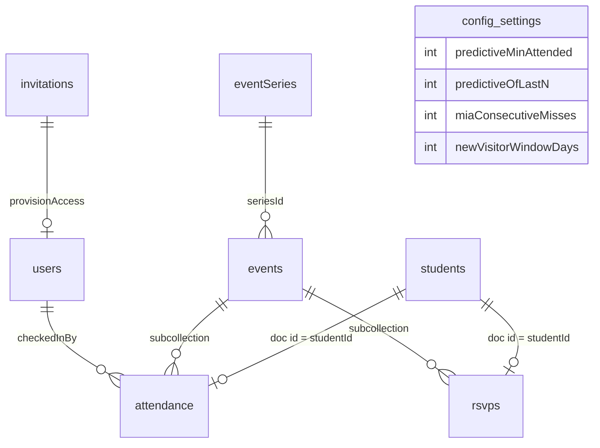

# Data model

Every collection Tally stores, what is in it, who is allowed to write it, and why it is shaped that
way.

`src/types/index.ts` is the contract. Types suffixed `Doc` are the stored Firestore shapes and use
`Timestamp`; the un-suffixed types are the hydrated application shapes, carrying a document `id` and
native `Date`. The converters in `src/services/converters.ts` translate between the two, so no
component ever handles a `Timestamp`. Access rules are in `firestore.rules`; the "who may write"
column below is a summary of them, not a substitute.

Roles rank `counselor` < `core` < `admin`. "Active" means a `users/{uid}` document exists and carries
`active: true` — being signed in is not, by itself, permission to read anything.

---

## Shape



```
users/{uid}                              counselor & core team profiles
invitations/{emailKey}                   who an admin has said may sign in
eventSeries/{seriesId}                   recurring templates (friday-fellowship, sunday-school)
students/{studentId}                     the roster itself — a document is a membership
events/{eventId}                         a single dated gathering
events/{eventId}/attendance/{studentId}  who showed up
events/{eventId}/rsvps/{studentId}       who said they were coming (one-offs)
config/settings                          tunable thresholds
config/planningCenter                    the non-secret Planning Center settings
```

All paths are built from `src/lib/paths.ts`. Nothing constructs a path by string concatenation.

---

## The decisions worth explaining

### 1. Attendance and RSVP documents are keyed by student id

`events/{eventId}/attendance/{studentId}` — the document id *is* the student id, not a generated one.

Check-in happens on several phones at once, at a door, on church wifi. Two counselors tapping the
same student a second apart with auto-generated ids would produce two attendance rows, a head count
one too high, and a "checked in twice" row somebody has to notice and delete. Keying on the student
makes the write idempotent by construction: both taps address the same document and the second
harmlessly overwrites the first. No transaction, no client-side coordination, no read-before-write.

`firestore.rules` enforces `request.resource.data.studentId == studentId` rather than trusting the
client to key correctly, because idempotency that depends on well-behaved callers is not idempotency.

The same reasoning applies to `events/{eventId}/rsvps/{studentId}`: adding a student to a trip list
twice — off a paper sign-up sheet and again from a text message — addresses one document rather than
producing two rows for the same kid.

The cost is that a student can be present at most once per event, which is exactly the invariant we
want, and that history cannot be re-keyed if a student record is merged — which is why students are
deactivated rather than deleted.

### 2. Three denormalised fields on `students`, each carrying an invariant

Everything else the app shows is derived on the client by pure functions. These three are stored,
and each one is stored for a specific reason:

| Field | Invariant | Why it is stored |
| --- | --- | --- |
| `profileComplete` | `true` exactly when `parentPhone` or `parentEmail` is non-empty. Always written via `computeProfileComplete`. | "Incomplete Profiles" must be an indexed query (`status` + `profileComplete` + `createdAt`), not a scan of the whole collection. The converter recomputes it on read as well, so a profile edited through the Firebase console cannot leave a stale flag behind. |
| `searchName` | Lowercased, single-spaced `"first last"`. Always written via `buildSearchName`. | Firestore has no substring search. This is the key the roster's search bar matches against, without loading a secondary index. Recomputed on read if missing. Stored raw apart from case and spacing: accents, punctuation and typos are all folded at match time by `createSearchMatcher`, so the matching rules can change without a migration. |
| `firstAttendedAt` | Written exactly once, on a student's first ever check-in, and never moved. | "New Visitors" asks "who arrived in the last seven days". Deriving that from attendance would need history older than the loaded window to prove it is really a *first*. Because the field never moves, back-filling an older event later does not retroactively unmake somebody a visitor. |

`lastAttendedAt` is a fourth, weaker case: a display convenience that only ever moves forward, so
checking a student into a historical event does not rewrite their "last seen" into the past. Undoing
a check-in deliberately leaves both dates alone — recomputing them would need a scan of every past
event, and the dashboard derives its real numbers from attendance documents anyway. These fields are
conveniences, not the ledger.

### 3. A gathering with no attendance is a cancelled one

`status: 'cancelled'` is the honest answer to "did this happen?" only when somebody remembered to open
Tally and say so. Gatherings are called off for weather, for a funeral, for a burst pipe in the hall —
and on that evening nobody is thinking about the attendance app. The field is therefore reliable when
it is `'cancelled'` and unreliable when it is `'scheduled'`.

What is always reliable is the attendance subcollection. A gathering that ran has somebody in it; a
gathering that never ran is empty. So every derivation over history treats a finished gathering with
no attendance as cancelled, whether or not it is marked. The rule is one predicate,
`src/lib/sessionHistory.ts`, applied everywhere history is read:

| Where | Without the rule | With it |
| --- | --- | --- |
| MIA list | Every student in the ministry gains a miss for a night that did not happen, and three snow weeks flag all of them. | The night is neither a miss nor a reprieve; streaks close over it. |
| Recent filter | The cancelled Friday consumes one of the last three slots, and "2 of 3" becomes unreachable for regulars. | The window filters *before* it slices, so it reaches a week further back for a third real Friday. |
| Trend strip | A zero bar mid-strip, which reads as attendance collapsing, and an average dragged down with it. | The gathering is simply not plotted. |
| Student page | A chip labelled "Missed", accusing a student of an absence at an event nobody attended. | A faded chip labelled "Cancelled" or "No one", and the streak beside it skips the night. |

The cost is that a gathering somebody genuinely forgot to take attendance at also stops counting. That
is unavoidable — the two cases are identical in the data — and it is the forgiving direction: nobody
receives a "we've missed you" phone call over a night with no record of anyone at all. The screens say
what they inferred rather than hiding it: the dashboard header notes how many scheduled gatherings had
nobody checked in, and the event page says the night is being counted as cancelled and offers both
repairs (take the attendance now, or cancel the event on purpose).

An explicit `'cancelled'` still wins over the inference, even when a few students were checked in
before the call was made. A leader saying "this did not happen" outranks a guess, and the alternative
would make un-cancelling the only way to stop a cancelled night counting as everyone else's absence.

### 4. Tally does not track money or paperwork

An earlier version of the RSVP feature carried `waiverSigned`, `paymentReceived`, `amountPaidCents`
and an event-level `feeCents`, and rendered a red "blocked" badge at check-in for anyone outstanding.
All of it is gone.

The honest reason is that it was specified more thoroughly than it was built, and the half-built state
was worse than nothing:

- The security rules carefully let a **counselor** flip `waiverSigned` and `paymentReceived` and
  nothing else — the bus-door case — but the only screen with those toggles lived behind a `core`
  route. The person the red badge was aimed at could see it and had no way to clear it.
- `amountPaidCents` was written by the seed and by no screen ever, so a part payment could not be
  recorded. The "outstanding" total assumed the full fee per head and was therefore confidently wrong
  for exactly the students it most mattered for.

Underneath that, the feature claimed an authority the app does not have. A signed waiver lives in a
folder and a cheque lives in a cash box; Tally reading from neither could only ever hold a stale
second copy, and a counselor who trusts a green tick over the clipboard is worse off than one who
never had the tick. Deciding whether a student may board is also not a call an attendance app should
appear to make.

What this buys, beyond the deletion: `isEligible` reduces to "checked in, or active and not
declined"; `RosterWarning` loses its red tier, so nothing on a roster row looks like a stop sign; and
Tally contains no currency handling at all, which turns [the privacy claim below](#what-is-not-stored)
from a promise into something the code makes self-evident.

The RSVP list itself stayed. Closing a trip roster to the students who signed up is eleven lines and
it earns them.

---

## Collections

### `users/{uid}`

The authorisation table. Document id is the Firebase Auth uid.

| Field | Type | Notes |
| --- | --- | --- |
| `email` | string | The verified address the session signed in with. |
| `displayName` | string \| null | From the auth token, else from the access roster. |
| `role` | `'counselor' \| 'core' \| 'admin'` | Ranked; see above. |
| `active` | boolean | The switch. `false` means signed in but not admitted. |
| `createdAt` | Timestamp | Preserved across re-provisioning, so "member since" does not reset on every sign-in. |
| `lastSeenAt` | Timestamp \| null | Bumped by the app itself. |
| `pcoPersonId` | string \| null | The Planning Center person this counselor was matched to, by email. |

**Who writes:** created only by the `provisionAccess` Cloud Function (Admin SDK). Admins may update
and delete other people's documents. A user may update **only** `lastSeenAt` on their own.

Nobody, not even an admin, may write `role` or `active` on their **own** document. Those two fields
are all that stand between a signed-in stranger and the whole ministry's data, so granting a role is
always an act performed on somebody else. Reading your own document is always allowed, even
unauthorised — the app subscribes to it before it knows whether you are a member, and needs to tell
"pending" apart from "error".

### `students/{studentId}`

The youth roster. Ids are generated by Firestore; Planning Center linkage is a field, not the key,
because a student can exist in Tally before they exist in Planning Center.

| Field | Type | Notes |
| --- | --- | --- |
| `firstName`, `lastName` | string | Managed by Planning Center once linked. |
| `grade` | 6–12 | Managed by Planning Center. The `Grade` type admits nothing else. |
| `parentName`, `parentPhone`, `parentEmail` | string \| null | One guardian contact. Written by the sync only when Planning Center actually knows a value — blanking a number a counselor collected at a retreat would be unrecoverable data loss. |
| `allergies` | string \| null | Managed by Planning Center (`medical_notes`). Raises a badge on the roster row. |
| `notes` | string \| null | Tally's own, free text. |
| `status` | `'active' \| 'inactive'` | Managed by Planning Center. Inactive students leave the roster but keep their history. |
| `isVisitor` | boolean | Set by quick-add. Cleared automatically once a parent contact exists. |
| `profileComplete`, `searchName`, `firstAttendedAt`, `lastAttendedAt` | — | Denormalised; see above. |
| `pcoPersonId` | string \| null | Null for a student that exists only in Tally. |
| `pcoUpdatedAt` | Timestamp \| null | Planning Center's own `updated_at` at the last successful pull. The max of these is the incremental cursor. |
| `pcoSyncedAt` | Timestamp \| null | When Tally last wrote from Planning Center. |
| `pcoPushPending` | boolean | A Tally-created student still waiting to be pushed. |
| `createdAt`, `updatedAt`, `createdBy` | — | `createdBy` is a uid, or `'planning-center'` for synced records. |

**A document here *is* the roster membership.** No document, not on the roster. For a student
Planning Center knows, that document holds the membership and Tally's own annotations only — the
name, grade and contact details are read live and stored nowhere. The id is `pco_{personId}`, which
is a claim about which real child the row refers to, so a client may not assert it: adding somebody
goes through the `addRosterMember` callable, which checks the person exists upstream first.

**Who writes:** any counselor may create and update. That is deliberate — quick-add happens at the
door, and check-in itself writes `firstAttendedAt` / `lastAttendedAt`.

**Nobody may delete.** Attendance documents reference students by id; deleting one would silently
orphan history and change past head counts. Set `status: 'inactive'` instead.

The four `pco*` linkage fields are the exception to counselor write access. A client may declare a
student as "mine, not yet pushed" (`pcoPersonId: null`, `pcoPushPending: true`) but may never assert
an id. Forging one would let a browser rebind a Tally student onto an arbitrary Planning Center
person at the next sync, so the rules require the linkage to be unchanged on every client update and
only the Cloud Functions (which bypass rules) may set it.

### `events/{eventId}`

One dated gathering.

| Field | Type | Notes |
| --- | --- | --- |
| `title` | string | |
| `description` | string \| null | A sentence for the people turning up — "Games, a talk and pizza". Distinct from `notes`, which is logistics for the other leaders; the description is what the check-in screen leads with when this is today's gathering. |
| `icon` | string \| null | A Material Symbols name from the bundled catalogue in `src/lib/eventIcons.ts`. Stored as the name, not as a glyph, and validated against the catalogue on read: an event carrying a name Tally no longer ships renders as one with no icon rather than as an empty tile. |
| `mode` | `'recurring' \| 'oneoff'` | Recurring is speed-first with a predictive roster. One-off does not repeat and never informs prediction — though it may borrow one, see `predictFromChain` — and its roster can be closed to the students who RSVP'd. |
| `seriesId` | string \| null | Optional link to an `eventSeries` template, on recurring events only. What it does is join this gathering to that template's chain; it is not what turns prediction on, which groups by `chainKey`. Nothing in the app creates a series document — they come from the seed — so most recurring events leave this null. |
| `predictFromChain` | string \| null | On one-off events only: the `chainKey` of the gathering whose regulars this trip borrows. A retreat has no history of its own, but the students on the coach are the ones who come on Friday nights, so a leader names that gathering and the trip's Recent filter reads its last few instances. A chain rather than a `seriesId`, so a weekly gathering created in the app can be borrowed too. Null means no prediction — the whole roster. |
| `recurrence` | object \| null | How the event repeats (RFC 5545 subset, anchored on `startAt`). Occurrences are projected at read time, not written ahead: a document exists only for a gathering somebody acted on — see `lib/materialize.ts` and `lib/eventProjection.ts`. |
| `recurrenceRootId` | string \| null | The hand-made event a chain of repeats grew from, or null when this event *is* that root. Copied onto every occurrence, so the chain has an identity that outlives any one instance. |
| `startAt`, `endAt` | Timestamp | For a recurring event these are the *next* occurrence, not the first ever. Instances already held are their own documents and keep the times they ran at. |
| `checkInOpensAt`, `checkInClosesAt` | Timestamp | The window during which this event counts as live. It no longer *selects* the event — a counselor picks that on the check-in screen — but it is what ringes the gathering in the chooser and sorts it to the top. Materialised per event rather than recomputed from the series, so moving one Friday does not need the template edited. |
| `location` | string \| null | |
| `notes` | string \| null | For the core team. Shown on the event page only — see `description` above. |
| `requiresRsvp` | boolean | Closes a one-off's roster to the students who RSVP'd. A one-off with no explicit flag still defaults to one. |
| `status` | `'scheduled' \| 'cancelled'` | Cancelled events are never offered as live and never inform prediction. A *finished* event with no attendance is treated as cancelled too — see [decision 3](#3-a-gathering-with-no-attendance-is-a-cancelled-one). |
| `createdAt`, `updatedAt`, `createdBy` | — | |

**Who writes:** core and up. A counselor cannot create or move an event — changing a date mid-check-in
would swap the active event out from under every phone in the building at once. Hard deletion is
offered only for events with no attendance yet; cancelling is the reversible option everywhere else.

### `events/{eventId}/attendance/{studentId}`

| Field | Type | Notes |
| --- | --- | --- |
| `studentId` | string | Equal to the document id. Enforced by rules. |
| `eventId` | string | Equal to the parent document id. Enforced by rules. |
| `seriesId` | string \| null | Copied from the event so a collection-group query can count a series without joining. |
| `checkedInAt` | Timestamp | `serverTimestamp()`. Reads back as null in the optimistic local snapshot, which the converters handle. |
| `checkedInBy` | string | Must equal the caller's uid. Enforced by rules. |
| `method` | `'tap' \| 'search' \| 'quick-add' \| 'manual'` | Purely diagnostic: it tells the core team whether the predictive roster is earning its keep. |
| `isFirstEver` | boolean | True when this was the student's first ever check-in. |

**Who writes:** any counselor may create, update and delete. Undoing a mistaken tap is a delete, and
has to be as fast as the tap was.

### `events/{eventId}/rsvps/{studentId}`

| Field | Type | Notes |
| --- | --- | --- |
| `studentId`, `eventId` | string | Both enforced against the path. |
| `status` | `'yes' \| 'no' \| 'maybe'` | `no` removes a student from the roster; `yes` and `maybe` keep them on it. A declined student keeps their document, because a `no` is often reversed. |
| `notes` | string \| null | Why somebody is a maybe. Written by the seed only — no screen edits it yet. |
| `updatedAt`, `updatedBy` | — | |

**Who writes:** core, for everything. A counselor reads the list — with `requiresRsvp` it *is* their
roster — but never writes it: who is on the trip is decided before the door, not at it.

There is deliberately no waiver, fee or payment state here. An earlier version tracked all three;
they were removed because Tally cannot be the system of record for money or signed paper, and a
partial copy of both was worse than neither. See
[decision 4](#4-tally-does-not-track-money-or-paperwork).

### `eventSeries/{seriesId}`

Reference data. Series carry `title`, `dayOfWeek`, `startTime` / `endTime` as local `"HH:mm"`,
`checkInOpensMinutesBefore` / `checkInClosesMinutesAfter`, `active` and `order`.

**Who writes:** core and up. Readable by anyone active.

### `config/settings`

A single document holding the four thresholds the core team can tune:

| Field | Default | Meaning |
| --- | --- | --- |
| `predictiveMinAttended` | 2 | A student is "Recent" when they attended at least this many… |
| `predictiveOfLastN` | 3 | …of the last this-many instances of the *same* series — meaning the same repeat chain: a shared `seriesId` when there is one, a shared `recurrenceRootId` otherwise. Friday history never predicts Sunday either way. |
| `miaConsecutiveMisses` | 3 | Consecutive missed nights *of one gathering* before a student lands on the MIA list. Counted per repeat chain, like the Recent filter, and only for students that gathering could expect: `wasRegular` asks the two fields above as of the student's last visit to it, so a Friday regular is not missing from Sunday School and somebody who dropped in once is missing from nothing. A student the window has seen nowhere is listed under no gathering, provided Tally has checked them in at some point and one gathering has met that many times since they joined — a directory entry who has never come to youth group is not missing. |
| `newVisitorWindowDays` | 7 | How far back "New Visitors" looks. |

**Who writes:** core and up, and the rules validate the relationship — `predictiveOfLastN` must be at
least `predictiveMinAttended`, or the Recent filter could never be satisfied and would silently render
empty, which reads as a bug rather than a setting. The converter clamps on read as a second belt.

### `config/planningCenter`

The non-secret half of the Planning Center configuration, owned by the core team from Settings:
`minGrade`, `maxGrade`, `writeBack`, `cacheTtlSeconds`, `baseUrl`, plus `updatedAt` / `updatedBy`.

Absent on a fresh install, which is a normal state rather than a missing record — the deploy-time
parameters are the defaults, and this document only overrides them where it has an opinion.

**Who writes:** core and up, with one carve-out: `baseUrl` is admin-only, because every Planning
Center request carries the church's credentials and that field decides where they are sent. **Who
reads:** core and up. The shape is closed (`hasOnly`), so a credential cannot be stashed here even by
an admin — and it must not be, since a document a browser can write is one a browser can read.

### `invitations/{emailKey}`

The allowlist: an admin saying "this Google address may sign in, as this". `emailKey` is the
lowercased address with `.` replaced by `,` (`sam.smith@example.org` → `sam,smith@example,org`) —
Firestore ids may not contain `/`, and `.` is legal but awkward to read.

Fields: `email`, `role`, `active`, `invitedAt`, `invitedBy`, and an optional `note`.

Keyed by address rather than by uid because it is written *before* the person has ever signed in, and
a uid does not exist until they do. Once they have, `users/{uid}` is the live authorisation and this
is only the record of how they arrived — which is why withdrawing an invitation stops somebody
arriving but does not evict anybody who already has.

**Who writes:** admins, through the app. **Who reads:** admins only — this is a list of church staff
email addresses, and a counselor's phone has no reason to hold one. The shape is closed (`hasOnly`),
so nothing unvalidated can be smuggled into an access decision.

This collection used to be a Planning Center List. A List is generated from filter rules, so "these
particular twelve adults" was only expressible by inventing a custom field on every person in the
church — and it put an access decision in a system whose editors are a different set of people from
the ones who should be making it.

---

## What is *not* stored

No birthdates, addresses, photographs, student phone numbers or emails, medical information beyond a
single allergy line, and nothing financial whatsoever — not a card number, not a fee, not a record of
who has paid. See the data-handling note in the [README](../README.md#handling-minors-data).

Everything the dashboard and the check-in screen display beyond the fields above is derived in the
browser: the Recent filter, MIA students, new visitors, roster warnings, head-count trends. Those live
in `src/features/roster/predictiveRoster.ts` and `src/features/dashboard/insights.ts` as pure
functions over data that is already loaded, so a threshold change in Settings takes effect everywhere
immediately with nothing to backfill.

Both files group history by the same key — `chainKey` in `src/lib/materialize.ts`: the `seriesId` when
there is one, the recurrence root otherwise. That is what makes "the same gathering" mean one thing
across the app, so the check-in roster, the dashboard's tabs and a student's attendance card cannot
disagree about which nights predict, or accuse, each other. One-off events are outside it by
definition and get their own derivations, which never produce a streak.

A trip is the one thing that reaches across that line, and only in one direction: `predictFromChain`
lets it *read* a gathering's history for its own Recent filter. Nothing ever predicts from a one-off —
a retreat is not evidence about who turns up to a retreat — so the chains themselves stay untouched.
`predictionChain` in `src/lib/gatherings.ts` is where the two cases meet.

---

## Indexes

`firestore.indexes.json` declares what the queries above need:

- `events` by `seriesId` + `startAt desc` — no live query needs it today: the client loads a window of
  events once and picks a series' history out of it in memory, which is also how a chain with no
  series document gets predicted at all. Kept for a server-side reader that wants one series directly.
- `events` by `status` + `startAt asc` — upcoming events.
- `students` by `status` + `lastName` + `firstName` — the roster stream, alphabetical.
- `students` by `status` + `profileComplete` + `createdAt desc` — the Incomplete Profiles list, which
  is the whole reason `profileComplete` is denormalised.
- Collection-group indexes on `attendance` by `studentId`, `seriesId` and `isFirstEver`, each with
  `checkedInAt desc` — one student's history, one series' history, and first-ever check-ins.
