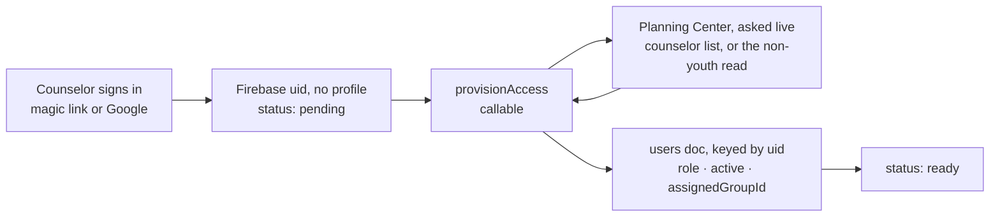

# Planning Center People integration

Planning Center People is the system of record for *people*. Students and counselors are created,
edited and retired there; Tally reads them when it needs them and owns only what Planning Center has
no concept of — attendance, small groups, RSVPs, waivers.

Tally keeps no copy of the church's people. There is no scheduled sync and no mirrored roster
collection: every screen that shows a person is answered by a Cloud Function that asks Planning
Center, holding the answer for at most `PCO_CACHE_TTL_SECONDS`. See §6.

This is the operational guide: how to get credentials, what every setting does, how counselor access
actually flows, and what to do when it breaks. `functions/src/config.ts` is the source of truth for
the parameter names and defaults; if this page and that file ever disagree, the file is right.

---

## 1. Credentials

Tally authenticates to Planning Center with a **Personal Access Token**, sent as HTTP Basic auth.

1. Sign in to Planning Center as an account that can read the youth roster (and, if you plan to turn
   on write-back, edit people).
2. Go to <https://api.planningcenteronline.com/oauth/applications>.
3. Under **Personal Access Tokens**, choose **New Personal Access Token**. Name it `Tally`.
4. Copy the **Application ID** and the **Secret**. Planning Center shows the secret exactly once.

A Personal Access Token belongs to a *person* and inherits that person's People permissions. Create
it under a shared office account rather than a volunteer's personal login, or Tally stops being able
to read the roster the week they leave the church.

### Where the settings live

Four places, and which one applies is decided by how the functions are being run — not by anything in
the code. `functions/src/config.ts` declares every parameter; the files below only supply values.
Use one local path or the other rather than both: `.env.demo-tally` and `.secret.local` are both read
by the emulator, and there is no reason to make yourself guess which one won.

| File | Committed? | Used when | Holds |
| --- | --- | --- | --- |
| `functions/.env.demo-tally` | **yes, deliberately** | The emulator, under the `demo-tally` project — `npm run dev:emulated`, `npm run e2e`, CI | Simulator settings only. No credentials: a `demo-` project id can only reach emulators, and the simulator accepts any Basic auth pair. |
| `functions/.secret.local` | no (gitignored) | The emulator, when you want your church's **real** data instead of the simulator | Your real token and params. Copy from `functions/.secret.local.example`. |
| `functions/.env.<projectId>` | no (gitignored) | `firebase deploy` against that project | Non-secret params for a real deployment. CI writes `functions/.env.tally-76406` from the `FUNCTIONS_ENV` repository secret. |
| Secret Manager | n/a | Deployed functions at runtime | `PCO_APP_ID` and `PCO_SECRET` only. |

`.env.demo-tally` **has to be committed.** The CLI resolves the params when it *starts* the Functions
emulator, before any function runs. With the file missing it stops and asks at the terminal, an
emulator sitting on a prompt loads no functions at all, and every sign-in dies on a 404 from
`provisionAccess`. Add a param to `config.ts` and you must add it there too.

**For the emulator against the simulator** — the normal way to work — there is nothing to do. That is
what `.env.demo-tally` already configures; just start the simulator alongside the emulators:

```bash
npm run pco-sim         # in its own terminal
npm run seed            # loads the demo ministry into it
```

**For the emulator against a real Planning Center account**, copy the example and fill it in. The
emulator loads that file and binds each line to the matching `defineSecret` / `defineString`
parameter, so local runs behave like production:

```bash
cp functions/.secret.local.example functions/.secret.local
$EDITOR functions/.secret.local
```

**For deployment**, the two credentials go into Secret Manager and the rest are deploy-time params:

```bash
firebase functions:secrets:set PCO_APP_ID
firebase functions:secrets:set PCO_SECRET
firebase deploy --only functions        # prompts for any unset param
```

Nothing here ever reaches the browser. Planning Center does not serve CORS headers for API clients
anyway, so every call runs inside a Cloud Function and the app talks to it through the callables in
`src/services/functions.ts`.

---

## 2. Configuration parameters

| Name | Default | What it does |
| --- | --- | --- |
| `PCO_APP_ID` | *(secret, required)* | Personal Access Token application id. Sent as the HTTP Basic username. |
| `PCO_SECRET` | *(secret, required)* | Personal Access Token secret. Sent as the HTTP Basic password. |
| `PCO_ROSTER_SOURCE` | `grade` | How the youth roster is selected: `list` (a curated Planning Center List) or `grade` (everyone in the grade band). Any other value falls back to `grade`. |
| `PCO_STUDENT_LIST_ID` | *(empty)* | The List whose members are the roster. **Required** when `PCO_ROSTER_SOURCE=list`; the read refuses to run without it. The id is the number in the List's URL. |
| `PCO_COUNSELOR_LIST_ID` | *(empty)* | Optional second List holding adult counselors and core team. This is the list `provisionAccess` looks a sign-in up against, so anyone who needs to use Tally at all belongs on it. Left blank, the team is derived from the non-youth people the roster read saw, or failing that from Planning Center's own administrators. |
| `PCO_MIN_GRADE` | `6` | Bottom of the grade band. Clamped into 6–12, because those are the only grades the app's `Grade` type admits. |
| `PCO_MAX_GRADE` | `12` | Top of the grade band. Clamped into `PCO_MIN_GRADE`–12. |
| `PCO_WRITE_BACK` | `create` | How much Tally may change in Planning Center: `off`, `create` or `full`. See §4. Any other value falls back to `create`. |
| `PCO_CACHE_TTL_SECONDS` | `30` | How long a Planning Center read may be reused, in seconds. `0` disables reuse entirely; anything above `300` is clamped to `300`. See §6. |
| `PCO_SMALL_GROUP_FIELD` | *(empty)* | Name or slug of a Planning Center custom field holding a person's small-group name. When set, a counselor's group comes back with their access check as a slugified id, so Sunday School check-in opens pre-filtered. |

A missing or contradictory setting is a *configuration state*, not a crash: `loadConfig()` never
throws, it carries a `configError` that every entry point checks first, and the Settings screen names
the value that is missing rather than showing a counselor an opaque internal error.

---

## 3. Which people are "the roster"

### List mode (recommended)

`PCO_ROSTER_SOURCE=list` with `PCO_STUDENT_LIST_ID` pointing at a Planning Center List. Open the list
in People (**People → Lists → your list**); the id is the number in the URL:

```
https://people.planningcenteronline.com/lists/1234567    ->    PCO_STUDENT_LIST_ID=1234567
```

**Use a List.** A youth pastor already maintains one, so there is no second thing to keep in sync,
and it survives all the cases a grade band cannot: the 5th grader who comes every week with an older
sibling, the graduated senior who still leads worship, the kid whose grade nobody ever filled in. In
list mode Tally does not second-guess the list on grade — if the pastor put them on it, they are on
the roster.

### Grade mode

`PCO_ROSTER_SOURCE=grade` sweeps every person flagged as a child whose grade falls inside
`PCO_MIN_GRADE`–`PCO_MAX_GRADE`. Zero setup, and a reasonable way to start. Its cost is silent: a
person with neither a grade nor a graduation year is *not* assumed to be a youth (an adult volunteer
with a blank grade would otherwise be swept into the student roster), so anyone whose grade is empty
simply never appears, and nothing tells you.

Grade mode also queries children only, which means it maps no counselors. Set
`PCO_COUNSELOR_LIST_ID`, or the team lookup falls back to Planning Center's own administrators so a
fresh install is not locked out of its own app.

---

## 4. Write-back: what actually changes in the church database

`PCO_WRITE_BACK` decides how much Tally may alter a system it does not own. Everything below is
biased toward doing nothing, because a mistake here does not look like a broken screen — it looks
like a duplicate child in the permanent people database that somebody has to merge by hand months
later.

| Mode | Will change in Planning Center | Will never change |
| --- | --- | --- |
| `off` | Nothing at all. | Everything. Quick-added visitors stay queued (`pcoPushPending: true`) so switching the mode on later picks them up with nobody re-editing anything. |
| `create` *(default)* | Creates a **Person** for a quick-added visitor — first name, last name, grade, `child: true`, and allergies as `medical_notes` — but only after searching for an exact first + last + grade match and linking to that instead. | Any existing person. No edits, ever. Planning Center still owns every field on everyone it already knows. |
| `full` | Everything `create` does, plus patches drifted managed fields on **linked** people: `first_name`, `last_name`, `grade`, `medical_notes`. | Parent contacts, households, emails, phone numbers, membership, notes, anything not in that list. Nothing is ever deleted or deactivated in Planning Center; a student who leaves is deactivated in Tally only. |

In every mode, before creating a person Tally searches `where[search_name]` plus grade and filters
the results again locally through the same accent- and punctuation-insensitive normalisation used to
collapse duplicate visitors. If several people match exactly, the church database already has
duplicates and Tally links to the lowest id rather than adding a third.

The fields Planning Center owns once a student is linked are listed in `PCO_MANAGED_STUDENT_FIELDS`:
first name, last name, grade, gender, allergies, status. The student editor shows them read-only with
a "managed in Planning Center" note unless write-back is `full`, because Planning Center is where
they are read from and a Tally-side edit would simply not survive the next read. Small group, notes,
attendance and RSVP data are Tally's alone and are never pushed upstream.

---

## 5. How counselor access works, end to end

Authentication grants nothing. Authorisation is an active `users/{uid}` document, and no client may
create one — a rule that lets you write your own role is a rule that lets anyone with a Google
account become an admin.



1. The counselor signs in. They now have a Firebase uid and no `users/{uid}` document, which the app
   shows as "Checking your access".
2. The app calls `provisionAccess`. It verifies the email was actually *proven* — a magic link or a
   Google account, not an unverified password registration — asks Planning Center for the person
   with that address, and creates the profile server-side. The role comes from Planning Center, never
   from anything the caller sent. A person with no email address there can never be matched: Tally
   authenticates by email, so there is nothing to match a sign-in against.
3. The live listener on `users/{uid}` flips the app to ready. No reload.

**The lookup is live, and that is the point.** Tally used to mirror an `accessRoster` collection,
refreshed by a scheduled sweep — which meant a volunteer added in Planning Center on Friday afternoon
could not sign in until the next sweep, and a volunteer removed could still sign in until then too.
Asking at the moment somebody knocks is both fresher and less to store: Tally now holds no list of
church staff email addresses at all.

A failure reaching Planning Center is deliberately *not* collapsed into "not on the roster". Those
two outcomes look identical to a volunteer standing at the door and mean completely different things
— one is "ask a leader to add you", the other is "the integration is down".

**Revoke in Planning Center, not in Tally.** Marking the person inactive there makes the next
`provisionAccess` call return `inactive` and refuse the profile. Clearing `active` on the
`users/{uid}` document does take effect immediately — the live listener drops them mid-event with no
reload — but it does not last: an inactive profile puts the app back in the `pending` state
(`src/context/AuthProvider.tsx:398`), which calls `provisionAccess` again, which restores
`active: true` for anyone Planning Center still says is active. Use it to eject someone right now,
and Planning Center to keep them out.

### Role mapping

| Planning Center | Tally role | Gets |
| --- | --- | --- |
| `site_administrator: true` | `admin` | Everything, plus granting roles to other people. |
| `people_permissions` = `Manager` | `core` | Dashboard, roster editing, events, RSVPs, settings. |
| `people_permissions` = `Editor` | `core` | The same. |
| anything else | `counselor` | Check-in only. |

Manager and Editor are the people who already maintain the roster in Planning Center, which is why
they are the two levels that imply the dashboard. Everyone else is a door volunteer.

One deliberate exception: **a role already set in Tally wins over Planning Center's.** An admin who
promoted a volunteer inside Tally must not be silently demoted the next time that volunteer is
provisioned.

---

## 6. Freshness: a cache, not a cadence

There is no schedule. Tally does not sweep Planning Center, does not mirror it into Firestore, and
holds no cursor. Every screen that needs a person calls a function that asks Planning Center:

| Callable | Asks for | Called by |
| --- | --- | --- |
| `getRoster` | The whole youth roster | Check-in, roster, dashboard |
| `getPersonDetails` | One person's profile and parent contact | A student's page |
| `provisionAccess` | Is this email on the team, and as what | The sign-in handoff (§5) |
| `getPlanningCenterStatus` | A real roster query, used as a health check | Settings → Planning Center |

That design replaced a scheduled sweep that copied every person in the church into Firestore and kept
the copy in step. It was a lot of machinery, and a lot of stored personal data about minors, to
answer questions as small as "what grade is Marcus in". The trade it makes is a Planning Center
round-trip on the cold path, and `PCO_CACHE_TTL_SECONDS` is what pays for it.

**The cache.** A read is held in memory for `PCO_CACHE_TTL_SECONDS` (default 30, `0` to disable, hard
ceiling 300). It exists for one shape of load: eight counselors opening the app in the same minute at
the door, which without it is eight identical roster pulls. The ceiling is deliberately low — a cache
measured in minutes is a mirror again, and a name corrected in Planning Center should show up on the
next tap.

It lives in the function instance's memory, not in Firestore, which has two consequences worth
knowing:

- **It is per-instance.** Two warm instances can hold two copies with different ages. This is fine at
  a 30-second TTL and would not be at 30 minutes.
- **`refreshPlanningCenter` is best-effort.** It drops the cache on whichever instance the call
  happens to land on and does nothing for the others. "Refresh" in the app therefore does not rely on
  it: it passes `force` on the read itself, which works wherever the read lands.

**What Tally still owns about a person** is only what Planning Center has no opinion about — which
small group they are in, and when they first turned up. Those live in `students/{id}`, written only
when Tally itself has something to record, so that collection is sparse rather than a mirror.

**Nothing disappears.** With no sweep there is no pass that marks a departed student `inactive`: a
person removed in Planning Center simply stops coming back in the roster read. Their attendance
history at `events/{id}/attendance/{studentId}` stays exactly where it is, which is the point — it
has to outlive them.

**No duplicates.** A student read from Planning Center is keyed `pco_{personId}`, which can never
collide with an id Tally minted for a visitor itself. A quick-added visitor who has not been pushed
yet is additionally matched on normalised name + grade, so the kid a counselor thumb-typed as "Jose"
at the door and the "José" the office entered on Monday collapse into one record.

There is no `config/pcoSync` document and nothing subscribes to one. The old sweep wrote its progress
into Firestore so a bar could follow it, which meant every core-team member's phone lit up on a
schedule. A read has no progress to follow — Settings asks `getPlanningCenterStatus` instead, and
that call runs the real roster query rather than a cheap ping, because "we can reach the API" and "we
can see your students" are different claims and only the second is worth showing a leader.

---

## 7. Troubleshooting

Start at **Settings → Planning Center** in the app. It shows the last run's status, counts, and the
verbatim error message. `firebase functions:log` has the rest.

**`401 Unauthorized`** — the token is wrong. Either the app id and secret were swapped, one of them
picked up a trailing space on the way into Secret Manager, or the token was revoked in Planning
Center. Mint a fresh Personal Access Token and re-set both values; they are a pair and must be
replaced together. Locally, check `functions/.secret.local` exists and that you restarted the
emulator after editing it.

**`403 Forbidden`** — the token authenticates but the *person* it belongs to cannot read People. A
Personal Access Token inherits its owner's permissions exactly. Give that account at least Viewer
access to People (Editor or Manager if you use `PCO_WRITE_BACK=full`), or create the token under an
account that already has it.

**`429 Too Many Requests`** — Planning Center is rate limiting. Nothing to do: the client honours the
`Retry-After` header, backs off exponentially up to 20 seconds, and retries four times before giving
up. If it keeps happening, the roster source is probably too wide — a `PCO_ROSTER_SOURCE=grade` read
pointed at a large church fetches one request per household. Switch to list mode, and consider
raising `PCO_CACHE_TTL_SECONDS` so a busy door reuses one read instead of making several. (A read is
also capped at 400 household fetches so a misconfiguration stops rather than billing for it.)

**A student appears twice** — the name + grade match failed, so a quick-added visitor was never
collapsed onto the Planning Center person. Usually a nickname ("Nate" vs "Nathaniel"), a hyphenated
surname typed one way at the door, or a grade that was off by one. To fix it by hand:

1. In Tally, open the duplicate that has **no** Planning Center badge — that is the Tally-only one.
2. Move anything worth keeping (small group, notes) onto the linked record.
3. Set the Tally-only duplicate to inactive. Do not delete it; its attendance rows would be orphaned,
   and the head count for those past events would silently drop.
4. If the student's attendance is on the wrong record, re-check them in on the correct one from the
   event's detail screen before deactivating.
5. To stop it recurring, make Planning Center's `first_name` (or nickname) match what counselors
   actually call the student, and correct the grade.

**Settings says it is not configured** — `loadConfig()` refused to build a client. The message names
the value: a missing `PCO_APP_ID` or `PCO_SECRET`, or `PCO_ROSTER_SOURCE=list` with no
`PCO_STUDENT_LIST_ID`. Locally, this is usually the emulator having been started before the settings
file existed; the params are resolved at emulator start, so restart it after editing.

**Nobody can sign in after a fresh install** — Planning Center is returning no team members for
`provisionAccess` to match against. In grade mode the read sees only children, so set
`PCO_COUNSELOR_LIST_ID`. The fallback to Planning Center's own administrators exists for exactly this
case, but only fires when the read produced no non-youth candidates at all.

**Everyone is locked out locally** — the simulator is not running. Against `demo-tally` the roster
and the team both come from `npm run pco-sim`, seeded by `npm run seed`; without it `provisionAccess`
correctly reports that nobody is on the roster. `npm run dev:emulated` does not start it for you.
