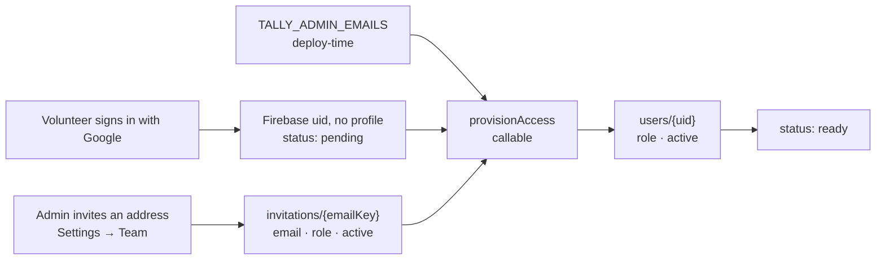

# Planning Center People integration

Planning Center People is the system of record for *people*. Students and counselors are created,
edited and retired there, and Tally reads them live and stores none of it.

Planning Center is one **people backend** — the first, and the one every deployment starts with.
The abstraction that makes it one-of-N lives in [backends.md](./backends.md), and the second
backend has its own page ([attendees32.md](./attendees32.md)); everything below is about Planning
Center specifically, and none of it changes when another backend is connected alongside.

One People custom field is special when both backends are connected: a field with slug
`attendees_uuid` holding a person's Attendees UUID marks the two records as the same human, and
Tally reads it to keep them one student. See
[backends.md](./backends.md#when-both-backends-hold-the-same-person).

**Tally owns the two memberships.** Who is a student, and who may sign in to Tally, are
Tally's own lists. They used to be Planning Center Lists, and that was a mistake worth explaining,
because it is the reason this page reads the way it does now: a List is *generated from filter
rules*. There is no way to say "these forty-three teenagers" in a List — only "everyone in grades
6–12 flagged as a child", which is wrong in both directions at the edges every ministry has. The
5th grader who comes every week with an older sibling is excluded; the senior who graduated in May
and still leads worship is dropped the moment the grades roll over. The only workaround is to invent
a custom field on every person in the church and filter on that, which is a schema change to the
church database in order to express a decision that was never Planning Center's to hold.

So the split is now:

| | Owner | Where |
| --- | --- | --- |
| Who is on the roster | Tally | `students/{id}` — a document *is* the membership |
| Who may sign in | Tally | `invitations/{emailKey}`, plus `TALLY_ADMIN_EMAILS` |
| Names, grades, parent contact, allergies | Planning Center | read on demand, stored nowhere |
| Attendance, RSVPs | Tally | Planning Center has no concept of them |

This is the operational guide: how to get credentials, what every setting does, how counselor access
actually flows, and what to do when it breaks. `functions/src/config.ts` is the source of truth for
the parameter names and defaults; if this page and that file ever disagree, the file is right.

---

## 1. Credentials

Tally authenticates to Planning Center with a **Personal Access Token**, sent as HTTP Basic auth.

1. Sign in to Planning Center as an account that can read the youth roster (and, if you plan to turn
   on write-back, edit people).
2. Go to <https://api.planningcenteronline.com/oauth/applications>.
3. Under **Personal Access Tokens**, choose **New Personal Access Token**. Name it `Tally`.
4. Copy the **Application ID** and the **Secret**. Planning Center shows the secret exactly once.

A Personal Access Token belongs to a *person* and inherits that person's People permissions. Create
it under a shared office account rather than a volunteer's personal login, or the sync stops working
the week they leave the church.

### Where the two values go

**For the emulator**, copy `functions/.secret.local.example` to `functions/.secret.local` and fill it
in. That file is gitignored; the Firebase emulator loads it and binds each line to the matching
`defineSecret` / `defineString` parameter, so local runs behave like production.

```bash
cp functions/.secret.local.example functions/.secret.local
$EDITOR functions/.secret.local
```

**For deployment**, the two credentials go into Secret Manager and the rest are deploy-time params:

```bash
firebase functions:secrets:set PCO_APP_ID
firebase functions:secrets:set PCO_SECRET
firebase deploy --only functions        # prompts for any unset param
```

Non-secret parameters can also be committed per project in `functions/.env.<projectId>`.

Nothing here ever reaches the browser. Planning Center does not serve CORS headers for API clients
anyway, so every call runs inside a Cloud Function and the app talks to it through the three
callables in `src/services/functions.ts`.

---

## 2. Configuration

There are two layers, and only the first one needs a deploy.

**Settings → Planning Center → Change** is where the core team edits everything non-secret: the
grade band, write-back, and how long a read may be reused. Saving writes `config/planningCenter`, the
server reads it on the next call, and the change is live for every counselor's next read. No
redeploy, no restart. (Who is on the roster is not here — that is the Students screen, one student at
a time.)

**Deploy-time parameters** are the defaults an install starts from, before anybody has opened
Settings. They still matter — a fresh deploy, a CI environment and the end-to-end suite all configure
themselves this way — but they are now the *fallback*, not the source of truth.

**Secrets** are the Personal Access Token pair, and they are not editable from the app at all. They
live in Secret Manager, because a value a browser can write is a value a browser can read.

### Precedence

For each setting: the saved document wins where it has an opinion, otherwise the deploy-time
parameter, otherwise the built-in default. A key that is *absent* from the document means "no
opinion"; a key that is present but empty means "deliberately cleared".

`PCO_API_BASE_URL` is the one exception: an empty saved value means "no override" rather than
"cleared". The app writes every field on save, including ones the person cannot see, so the other
reading would silently repoint a proxied install at the real Planning Center the first time somebody
changed an unrelated setting.

### Who may change what

`config/planningCenter` is readable and writable by the **core team**, with one carve-out: the API
address is **admin-only**, because every request carries the church's credentials and that field
decides where they are sent. The security rules enforce both, plus the shape — the document is a
closed set of keys, so credentials cannot be stashed in it even by an admin.

### The parameters themselves

| Name | Default | What it does |
| --- | --- | --- |
| `PCO_APP_ID` | *(secret, required)* | Personal Access Token application id. Sent as the HTTP Basic username. Secret Manager only. |
| `PCO_SECRET` | *(secret, required)* | Personal Access Token secret. Sent as the HTTP Basic password. Secret Manager only. |
| `TALLY_ADMIN_EMAILS` | *(empty)* | Google addresses that are admins on every sign-in, whatever the database says. The bootstrap for a fresh install and the break-glass for a lockout. Comma- or whitespace-separated. Not a Planning Center setting at all — see §6. |
| `PCO_MIN_GRADE` | `6` | Bottom of the grade band. Clamped into 6–12, because those are the only grades the app's `Grade` type admits. Selects nobody; see §3. |
| `PCO_MAX_GRADE` | `12` | Top of the grade band. Clamped into `PCO_MIN_GRADE`–12. |
| `PCO_WRITE_BACK` | `create` | How much Tally may change in Planning Center: `off`, `create` or `full`. See §4. Any other value falls back to `create`. |
| `PCO_CACHE_TTL_SECONDS` | `30` | How long a Planning Center read may be reused. `0` turns retention off; the ceiling is 300, past which a cache becomes a mirror. |
| `PCO_API_BASE_URL` | *(empty)* | API root. Empty means the real Planning Center. Anything else is reported as an override wherever the connection is shown, because a test rig must never be mistaken for production. |

Every one of these except the two secrets and `TALLY_ADMIN_EMAILS` can be changed from Settings, and
every one is re-parsed, re-clamped and re-validated server-side whichever way it arrived — the
security rules are the first check, not the only one. `TALLY_ADMIN_EMAILS` is deliberately *not*
editable from the app: it is what gets you back in when the app is what went wrong.

A missing or contradictory setting is a *configuration state*, not a crash: `loadConfig()` and
`resolveConfig()` never throw, every entry point checks `configError` first, and the Settings screen
names the value that is missing. Where it tells you to go depends on who owns the value: an install
running on deploy-time parameters is told which parameter is unset, and one being managed from the
app is pointed at Settings.

---

## 3. Which people are "the roster"

The ones somebody put on it. **Students → Add from Planning Center** searches the church directory
and adds the person you pick; a `students/pco_{personId}` document is the membership, and it holds
no name, grade or contact detail of its own.

The search is deliberately unfiltered — no grade band, no "is a child" — because those filters are
wrong at exactly the edges a hand-picked roster exists for. Both facts are *shown* on each result so
the leader can see what they are choosing, and shown as Planning Center holds them: a person with no
grade on file reads "No grade in Planning Center" rather than being floored to `PCO_MIN_GRADE`, which
would put "6th" under every adult in the church.

### How a name is written

Planning Center composes a display name as `first_name “nickname” last_name` — `Benson “蔡秉洲” Tsai`
— treating the nickname as an addition rather than a replacement. Tally follows that exactly, so the
name on a roster row is the name on the profile page. Because `searchName` is built from the same
string, either spelling finds the student; and because write-back splits the halves apart again
before sending them, the two fields Planning Center actually stores are never conflated.

Adding goes through a callable rather than a direct write. The document id is a claim about which
real child a row refers to, so the security rules forbid a browser asserting it; the server checks
the person exists upstream first.

### Taking somebody off

**Remove from roster** on the student's page. That marks the membership inactive rather than
deleting it, for two reasons: every attendance record points at the student id, so deleting the row
would silently drop past head counts, and an inactive membership stops Tally reading anything at all
about a child who has left the ministry. Adding them again later restores the same record, with
their history intact.

### Moving across from a Planning Center list

**Students → Add from Planning Center → Import a Planning Center list.** Everyone on the list today
joins the roster. It is a copy, not a link, and that is the point — a list is a saved query whose
membership moves on its own, which is what made it a poor roster in the first place.

### What the grade band is still for

`PCO_MIN_GRADE`/`PCO_MAX_GRADE` no longer select anybody, and no longer rewrite anybody either.
They are the band a deployment reads — used for the roster cache key and to warn on a profile edit
that would take somebody out of it. A student outside the band can be on the roster, and arrives
saying what grade they are actually in.

**A grade is either real or absent.** There is no clamp to shade. Anybody Planning Center holds
neither a grade nor a graduation year for — every adult a hand-picked roster deliberately carries,
and every child too young to have one — arrives with `grade: null`, and screens say "No grade", drop
the clause, or leave them out of a grade filter accordingly. Nothing writes an invented grade down
either: not the check-in batch, not an annotation document, not a push.

This replaced a `gradeOnFile` boolean carried alongside the number. The flag tracked whether the
upstream value was *blank*, not whether it had been clamped, so a real 3rd grader was reported as
`{ grade: 6, gradeOnFile: true }` — Tally asserting as a fact that a child in 3rd grade was in 6th.
`Grade` now spans K–12 (`0` is kindergarten), so most of those children are simply representable;
anything still outside it is null, which loses information but says something true.

A graduation year still counts as a grade: the mapper derives one, and deriving is not inventing.
Only a person with neither is grade-less.

The one place the clamp is still a plain number is arithmetic: `Student.grade` is always defined, so
counting and sorting never have to special-case it.

---

## 4. Write-back: what actually changes in the church database

`PCO_WRITE_BACK` decides how much Tally may alter a system it does not own. Everything below is
biased toward doing nothing, because a mistake here does not look like a broken screen — it looks
like a duplicate child in the permanent people database that somebody has to merge by hand months
later.

| Mode | Will change in Planning Center | Will never change |
| --- | --- | --- |
| `off` | Nothing at all. | Everything. Quick-added visitors stay queued (`pcoPushPending: true`) so switching the mode on later picks them up with nobody re-editing anything. |
| `create` *(default)* | Creates a **Person** for a quick-added visitor — first name, last name, grade, `child: true`, and allergies as `medical_notes` — but only after searching for an exact first + last + grade match and linking to that instead. | Any existing person. No edits, ever. Planning Center still owns every field on everyone it already knows. |
| `full` | Everything `create` does, plus edits to **linked** people — `first_name`, `nickname`, `last_name`, `grade`, `medical_notes`, `birthdate` — from the student editor (`updateStudentProfile`) and from the reconcile push. Adds a **PhoneNumber** or **Email** to an adult already in a student's household. And, for a student with no adult on file, creates the **parent** — plus a **Household** and **HouseholdMembership** when there is none — through `addParent`, after offering any existing people of that name for a human to choose from. | Notes and anything not in that list. Nothing on file is ever overwritten, no person is created for a name a leader has not confirmed is new, and nothing is ever deleted or deactivated in Planning Center; a student who leaves is deactivated in Tally only. |

In every mode, before creating a person Tally searches `where[search_name]` plus grade and filters
the results again locally through the same accent- and punctuation-insensitive normalisation used to
collapse duplicate visitors. If several people match exactly, the church database already has
duplicates and Tally links to the lowest id rather than adding a third.

A name Tally holds as `Benson “蔡秉洲”` is split back into `first_name` and `nickname` before any of
this: the server's fuzzy search indexes the halves separately, and writing the composite into
`first_name` would render as `Benson “蔡秉洲” “蔡秉洲” Tsai` on the next read and stop the matcher
recognising the person at all — which is how a duplicate child gets created.

### Editing a linked student (`full` only)

Under `create` the student editor shows the managed fields disabled, with a link to Planning Center:
Tally keeps no copy of a linked student's name, grade, birthday or allergies, so anything typed into
them would be gone on the next read. Under `full` the same boxes are editable and Save calls
`updateStudentProfile`, which patches the person upstream.

The edit goes **straight** to Planning Center — nothing is written to Firestore on the way, and this
is the reason the callable exists rather than the form writing a student document and letting the
reconcile sweep notice the drift:

- `mergeRoster` reads name and grade off the roster, so a copy in Firestore would not even show.
- A copy left behind is a copy that gets pushed again later, over a correction somebody makes in
  Planning Center next month.

Only the attributes that actually differ from a fresh read of the person are sent, so a Save that
changed the grade does not restate the name. A blank name or a grade outside 6–12 is refused before
anything is written, and a new grade that leaves the configured band is saved *with* a warning that
the student is about to drop off the roster.

The call answers with the student's **roster row** as Planning Center now holds it — the same shape
`getRoster` returns, built by the same function — and the browser puts that one row into the roster
it already has (`applyRosterPerson`). Save blocks on Planning Center confirming the write, and on
nothing else. It used to also wait on `refreshRoster(true)`: a forced, uncached, paged sweep of every
child in the church, to be told back the date somebody had just typed, with the leader watching a
spinner through it. The row is carried on `unchanged` as well as `updated`, because "Planning Center
already matches" is often a browser discovering that *it* is the stale one.

Two fields are not part of this. **Status** is never written upstream in any mode — who is on the
roster is Tally's own list, and the control for it is Remove from roster on the student's page.
**Allergies** can be cleared here, on a form showing the value being deleted, but a reconcile push
will only ever *add* a `medical_notes` value, never blank one: a linked student's document holds no
allergy note at all, and reading that absence as "there are none" would erase a real one.

### The birthday, and where its year comes from (`full` only)

`birthdate` reaches a browser in two different shapes, and which one depends on who asked.

The **roster** carries `MM-DD` and never the year — see §3 — because the year is the identifying half
of a date of birth and a phone at a door holding eighty-five students has no use for it. The
**one-person read**, `getPersonDetails`, carries the whole date: `PcoPersonDetails.birthdate`,
`YYYY-MM-DD`. That is the same read that hands over a child's allergy note and a parent's phone
number, it is core team only, and it happens because somebody is looking at that one student — so
withholding the year there bought no privacy that the rest of the payload had not already spent, and
cost the edit form the one thing it could not work around: a leader could see the day, could type a
year, and could never see the year already on file to correct it.

`fullBirthdayOf` is the mapping, and it refuses one year: **1885**, Planning Center's own "nobody
knows" (below), comes back as a bare `MM-DD` rather than as a date of birth in the nineteenth
century. So a `MM-DD` from that read means "no year upstream", and a form can say so.

The callable takes the same two shapes, and the difference is the whole design:

- **`MM-DD`** — "this day, keeping the year Planning Center holds". Resolved against a fresh read of
  the person, like every other field here. This is what a box whose year was left out or rubbed out
  sends, and it is never read as a request to delete the year.
- **`YYYY-MM-DD`** — the whole date, for a leader who knows the year or is correcting the one they
  have just been shown.

On a person with no `birthdate` at all there is no year to keep, and none is invented: an age is
displayed from this field, and a guessed year is a wrong age on a child's permanent record that
nobody would ever think to check. Planning Center's own answer is used instead — a birthday nobody
knows the year of is stored as **1885**, which its help asks people to type and which makes it show
no age at all. So a day-only edit on a blank birthday writes `1885-MM-DD`, and a later day-only
correction keeps the 1885 that is by then on file. (One consequence upstream, from the same help
page: Groups and Services chat is 13-and-up, and a person with no year on their birthday cannot join
one.)

`29-02` is the single date this cannot do, because 1885 is not a leap year: on a person with no
birthdate it asks for the year, and against a year on file that has no 29 February it is refused
rather than rounded to 1 March by the far end.

The form is **one box** — on the student editor, behind the roster's birthday badge, and on the
student's own page, which are the three places somebody notices, usually with the student in front
of them having just said when it is. Behind the badge it is open on arrival: there is no "Add a
birthday" press between a leader and the one thing that panel is for. On the profile it sits under
the date itself, which that page states whether or not the day is near — the badge is a fortnight
wide by design, and a birthday in August read in March is exactly the case only the profile can
answer.

The box takes digits and punctuates itself, drawing the rest of `MM / DD / YYYY` faded after what
has been typed. Slots fill greedily and forwards — a slot takes a second digit only when a second
digit would still leave a value it can hold — so `1214` is 14 December, `112` is 2 November, `13` is
3 January and `4` is April the moment it is typed. A separator somebody types closes the slot it
follows, which is how `4/2/2013` says the second where `422013` says the twenty-second. The date is
printed back in words under the box as it is typed, because a reading made in silence is one nobody
can correct. See `src/lib/birthdayInput.ts` for the slot rules and `src/lib/birthdayField.ts` for
what the box means. Under anything other than `full` every one of those places says where the field
lives and links to it, as they always did.

Each box **opens on what Planning Center holds**, year included where it holds one — the details read
above is what supplies it, so the form seeds from the roster's day and fills the year in a moment
later, without disturbing anything already typed. A box opened on `03 / 14 / 2011` and pressed
untouched sends nothing at all, where it used to carry the day upstream for the server to find
identical.

A birthday cannot be **deleted** from Tally, unlike allergies. An empty box means "leave it alone" —
including an empty *year* on a box that was showing one, which is a day-only edit and keeps whatever
is upstream. Deleting a date of birth is not a correction anybody makes from a roster badge.

`PcoPersonDetails.profileWritable` carries the gate, for the same reason `contactWritable` does — the
browser cannot see the setting, and offering an editable box that the write path then refuses is
worse than showing it read-only.

### Parent contacts (`full` only)

Every screen that finds a student nobody can reach says so and points at Planning Center, because
that is where the answer lives — Tally has held no parent contact of its own since the mirror was
removed. Under `full`, one screen can also fix it in place: the student's page offers a phone/email
form, and `setParentContact` writes it upstream.

What that path may do is deliberately narrow:

- It writes onto the adult **already** in the student's household, chosen by `findParentCandidate` —
  the same ranking the read path uses to decide whose number to *show*. If the two disagreed, a
  leader could add a number and watch the row go on saying nobody can be reached.
- It creates nothing: no Person, no Household, no HouseholdMembership. A student whose family is not
  on file is the other path's job, below.
- It never overwrites. A field already on file is left alone and reported as skipped — the form is
  only ever opened on the premise that there was nothing there, and that premise expires while
  somebody is typing.

`PcoPersonDetails.contactWritable` carries both halves of the gate (an adult to write onto, *and*
`full`) so the browser never guesses at either. The token needs Editor or Manager access to People.

### Building a family (`full` only)

A student with no adult in their household used to be a dead end: nothing to write a number onto, so
every screen could only point upstream. For a ministry whose visitors arrive at the door with nobody
in Planning Center yet, that was the common case. Under `full`, the same place offers **Add a
parent**, and `addParent` creates what is missing — the adult, and the Household too if Planning
Center has none for the student.

This is the widest thing Tally writes, and the only one that makes a claim about a *family* rather
than about a field, so it has a human in the loop at the one point that matters:

- **A name is a question before it is a record.** Sent a name it has not been told to accept,
  `addParent` searches Planning Center for adults who already have it and returns them as
  `existing-people` without writing anything. The form shows them, and a person decides: *this is
  them* (`personId`) or *this is somebody else* (`createNew: true`). A church's parents are nearly
  always already in People — they attend — just not linked to their child; and the two ways of
  getting this wrong are not symmetric. A duplicate person is a merge somebody does by hand. A child
  attached to the wrong household shows one family another family's phone number.
- **It joins before it builds.** A student who already has a household gets the parent added to it
  via `POST /households/{id}/household_memberships`. A new Household — `POST /households`, with the
  parent as `primary_contact` and both of them in `people` — is created only when Planning Center
  has none for that student at all.
- **It refuses once there is an adult.** That is `setParentContact`'s job, and the refusal is
  re-checked against a live read rather than against what the screen believed: a form opened on
  "nobody can be reached" may have been sitting there while somebody fixed the family upstream, and
  a second mother beside the first is not the repair.
- **Everything is created as itself.** The parent is `child: false`, the membership carries
  `household_role: parent_guardian`. The read path ranks by that role and falls back to the person's
  own `child` flag, so the new parent resolves correctly even if Planning Center declines to set the
  role on create.
- **It still never overwrites a contact.** The phone and email go on through the same
  `writeContactOnto` the narrow path uses, which skips a field already on file — including on an
  adult somebody picked from the candidate list, who may well already have a mobile recorded.

`PcoPersonDetails.parentCreatable` is the gate: `full` *and* nobody in the household yet. It and
`contactWritable` are mirror images — on a `full` install exactly one of them is true — which is what
lets one screen offer "add a number" and "add a parent" from the same place without deciding which.

The fields Planning Center owns once a student is linked are listed in `PCO_MANAGED_STUDENT_FIELDS`:
first name, last name, grade, allergies, status. Notes, attendance and RSVP data are Tally's alone
and are never written from the sync.

---

## 5. Importing a gathering's history from Check-Ins

Check-Ins is the other Planning Center product this church runs: the door kiosk that has been
counting Footprints, Shining Stars, Little Foot and The Rock since before Tally existed. **Events →
Import** (core team) brings one of those events across whole, so the dashboard's trends, the
predictive roster and a student's attendance history reach back into the kiosk era instead of
starting the day Tally was adopted.

Its API is read-only — Planning Center publishes no way to write a check-in — so the import is
structurally incapable of changing anything upstream. The same Personal Access Token authenticates
both products; whether it may *read* Check-Ins is Planning Center's call, and comes back as an
ordinary 403 if the token's owner lacks access to that product. The Check-Ins API root is derived
from `PCO_API_BASE_URL` (`…/people/v2` → `…/check-ins/v2`), so a simulator or proxy configured once
covers both.

What one import writes, and why it is shaped that way:

- **One recurrence chain of events.** Every upstream "event period" (one night of the gathering)
  that anybody attended becomes a Tally event, under the same identity scheme the app itself uses —
  a root document `pco-checkins-{eventId}` and occurrences at `{root}-{YYYY-MM-DD}` in the
  ministry's own calendar days. The chain carries a recurrence rule derived from the upstream
  frequency, so after an import the gathering simply continues as a native Tally event: future
  nights project from the latest imported one, and prediction groups the whole history. Nights
  nobody attended are skipped — a Tally gathering with no attendance *is* a cancelled one (see
  [data-model.md](data-model.md)), and two years of holiday weeks would render as a column of
  "No one" rows.
- **Roster memberships.** Check-Ins shares Planning Center's person store, so every attendee
  becomes the same sparse `students/pco_{personId}` document **Students → Add from Planning
  Center** writes, and the roster read puts live names on them. `createdAt` is their earliest
  attended night — not the moment of import — because the dashboard uses that date to decide which
  past gatherings a student could plausibly have missed.
- **Attendance records**, keyed by student id like every other check-in, with
  `checkedInBy: 'planning-center'` and `method: 'import'` so provenance is visible per row.

What is deliberately *not* imported, each reported with a count rather than silently dropped:
**volunteer check-ins** (they are leaders; Tally's attendance is a record of students), **one-time
guests** (a name typed at the kiosk with no person record behind it — nothing to put on a roster),
**duplicate check-ins** (checked out and back in; the earliest record is the arrival), and
**empty nights** (above).

**Re-importing is the supported way to top a chain up** — say, weekly while the church transitions
door duty from the kiosk to Tally. Every id is derived, so a re-run converges on the same
documents; an event a leader has since renamed, moved or cancelled in Tally is left exactly as they
left it; attendance rows are only ever rewritten when the import itself wrote them; and a student
somebody removed from the roster stays removed. Students who already exist in Tally keep the parts of their
record the import cannot improve on, and have two dates corrected where it can. `firstAttendedAt`
and `createdAt` are moved *earlier* when the imported history proves the student was here before
the date on file — the ordinary case for a church that adopted Tally first and imported afterwards,
where a student checked in live last week carries last week's date above two years of kiosk
attendance. Neither is ever moved later, so a back-filled night cannot reshuffle the "New Visitors"
list; earlier can only ever take a long-standing regular *off* it. `lastAttendedAt` moves forward
only, because a night from the archive is not news about when somebody was last seen.

Grades outside 6–12 (the elementary and preschool ministries) are clamped for display, exactly as
they are for any other out-of-band roster member — see §3, "What the grade band is still for".
Archived Check-Ins events are not offered.

---

## 6. How counselor access works, end to end

Authentication grants nothing. Authorisation is an active `users/{uid}` document, and no client may
create one — a rule that lets you write your own role is a rule that lets anyone with a Google
account become an admin.

**Google sign-in only.** Tally decides what somebody may do from their email address, so what
matters is not that they typed one but that a provider Tally trusts has confirmed it is theirs. The
email magic link that used to be the primary path is gone: one door is easier to watch than two, and
a mailbox left signed in on a shared phone was a way in that nobody was watching.



`provisionAccess` checks three things, in this order:

1. **`TALLY_ADMIN_EMAILS`** — a standing admin grant, re-asserted on every sign-in. Nobody can invite
   the first admin of a fresh install, because there is nobody to do the inviting; this breaks that
   circle. It is also the break-glass: an admin who deactivates the last other admin has not locked
   the ministry out, because whoever is named here still gets in — even if their own profile says
   `active: false`. Removing somebody's standing admin rights means editing the variable and
   deploying, which is the point. A break-glass should need a key.
2. **An existing `users/{uid}` profile** — somebody who has signed in before. Their role is whatever
   an admin has since made it, so this path deliberately does *not* reset it from the invitation they
   originally arrived on.
3. **`invitations/{emailKey}`** — an admin said this address may sign in, and with what starting
   role. Consumed on first sign-in.

Anything else is "not on the roster", reported as a refusal rather than an error: a volunteer who has
not been added yet is a normal thing to be.

### Inviting and revoking

**Settings → Team** (admin only). Invite a Google address with a role; they appear in the "Signed in"
list the first time they use it.

The two lists do different jobs, and the difference matters when somebody has to be removed:

- **Withdrawing an invitation** stops somebody *arriving*. It does nothing to anybody who already
  has a profile.
- **Deactivating a profile** is how access is actually removed. It takes effect on their next
  operation, not at their next sign-in, because the security rules read that document on every
  request.

The invitation list is admin-only to read as well as to write: it is a list of church staff email
addresses, and a counselor's phone has no reason to hold one.

### Role mapping

Roles are set in Tally, by an admin, and no longer derived from Planning Center permissions — the
people who administer a church database are not necessarily the people who should decide who sees a
roster of minors.

| Role | Gets |
| --- | --- |
| `counselor` | Check-in. The door volunteer. |
| `core` | Counselor, plus the dashboard, roster management, events, RSVPs and settings. |
| `admin` | Core, plus granting access: invitations, roles, and deactivation. |

## 7. What Tally reads, and when

There is no scheduled anything. Five reads, and each one is somebody looking at a screen:

| Read | Triggered by | Cost |
| --- | --- | --- |
| The roster | Opening check-in, the students list, or a refresh | One sweep of `where[child]=true`, plus one request per roster member the sweep did not cover |
| One person's details | Opening a student's page | One request, plus one per household |
| The allergy notes | Check-in, for the rows the roster already flagged | One request per flagged student, once per session |
| Who has a parent contact | Opening Insights | One sweep of `where[child]=false`, on top of the roster read it reuses |
| A directory search | Typing in "Add from Planning Center" | One request per keystroke burst |

The roster read is the interesting one, because it has to turn Tally's membership into people. It
sweeps the children in one request per hundred, which answers for nearly everybody, and then fetches
whoever is left individually — the graduated senior, the 5th grader. Past sixty stragglers it stops
and *reports* the remainder rather than dropping them: a roster quietly short by three students is
the failure nobody notices. Settings shows the count.

Every answer is held for `PCO_CACHE_TTL_SECONDS`, keyed by the roster itself. Adding a student
changes the key, so they appear on the next read rather than whenever the previous answer expires.

The allergy read (`getAllergyNotes`) is the narrowest call in the app, and the only detail read a
door volunteer's device makes. The roster carries `hasAllergies` and never the note, which is what
keeps four hundred children's medical notes off every phone that opens Tally — but a badge saying
`Allergy` with no way to see what it is on the screen where somebody is about to hand out pizza is a
warning nobody can act on. So check-in asks about the students its own rows have flagged, gets one
line of text each and nothing else — no parent, no number, no household — and prints it on the badge.
It sits behind `requireMember` rather than the core-team gate for the same reason: `counselor` is the
role that stands at the door, and it is the role that needs the answer. A student whose note cannot
be read is simply absent from the reply, and their row keeps the plain badge.

The parent-contact read (`getParentContactStatus`) is the one that is deliberately *not* part of the
roster. A roster row reports `profileComplete: null` — "we did not look" — because a parent's phone
number lives on the parent, and hydrating households would put a second sweep in front of the first
name a counselor sees at a door. Insights asks the question separately, gets a boolean per student
and no contact details at all, and that is what fills the "incomplete profiles" list. Answering it
with `false` on the roster instead would badge every student in the ministry as unreachable; leaving
it at `null` everywhere left the list permanently empty, which is the bug this read exists to fix.

Every list on Insights that says a student is unreachable must resolve the same three states the
same way — `student.profileComplete ?? reachable.get(id) ?? null`, and only `false` is a problem.
"New faces" consulted the flag alone for a release, so a roster student it already knew nobody could
reach got a sentence explaining that while the row above them had a button. Tally's own flag wins
where it has one (a quick-added visitor exists nowhere else and cannot be looked up); `null` on both
sides means unasked, and must never render as "nobody can reach them".

## 8. Troubleshooting

Start at **Settings → Planning Center** in the app. It shows the last run's status, counts, and the
verbatim error message. `firebase functions:log` has the rest.

### Getting the details out of the app

Anywhere Tally says it could not reach Planning Center — **Students → Add from Planning Center** is
the usual one — the red banner has a **Show details** link under it. That panel is the request Tally
sent, the status and body Planning Center sent back, how many times it retried, and Planning Center's
own `errors[]`. **Copy debug details** puts the lot on the clipboard as markdown, which is the useful
thing to paste into a message to whoever set the connection up, or into an issue.

The panel is safe to share. The Personal Access Token never leaves the Cloud Function:
`Authorization` is replaced with `[redacted]` where the request is recorded
(`functions/src/pco/client.ts`), and the payload carries transport facts about a request rather than
anything about a person (`functions/src/pco/debug.ts`). The same information is in
`firebase functions:log` under `Failed to …`, for whoever has console access — the panel exists
because the person looking at the failure usually does not.

**`401 Unauthorized`** — the token is wrong. Either the app id and secret were swapped, one of them
picked up a trailing space on the way into Secret Manager, or the token was revoked in Planning
Center. Mint a fresh Personal Access Token and re-set both values; they are a pair and must be
replaced together. Locally, check `functions/.secret.local` exists and that you restarted the
emulator after editing it.

**`403 Forbidden`** — the token authenticates but the *person* it belongs to cannot read People. A
Personal Access Token inherits its owner's permissions exactly. Give that account at least Viewer
access to People (Editor or Manager if you use `PCO_WRITE_BACK=full`), or create the token under an
account that already has it.

**`429 Too Many Requests`** — Planning Center is rate limiting. Nothing to do: the client honours the
`Retry-After` header, backs off exponentially up to 20 seconds, and retries four times before giving
up. If it keeps happening on the roster read, the likely cause is a roster full of people the child
sweep does not cover, each costing a request of their own — Settings shows how many. Otherwise raise
`PCO_CACHE_TTL_SECONDS` so eight counselors arriving at once cost one read instead of eight.

**A student appears twice** — the name + grade match failed, so a quick-added visitor was never
collapsed onto the Planning Center person. Usually a nickname ("Nate" vs "Nathaniel"), a hyphenated
surname typed one way at the door, or a grade that was off by one. To fix it by hand:

1. In Tally, open the duplicate that has **no** Planning Center badge — that is the Tally-only one.
2. Move anything worth keeping (notes) onto the linked record.
3. Set the Tally-only duplicate to inactive. Do not delete it; its attendance rows would be orphaned,
   and the head count for those past events would silently drop.
4. If the student's attendance is on the wrong record, re-check them in on the correct one from the
   event's detail screen before deactivating.
5. To stop it recurring, put what counselors actually call the student in Planning Center's
   `first_name` or `nickname` — Tally carries both, so either one matches — and correct the grade.

**A parent appears several times after one "Add parent"** — fixed, but worth knowing how to clean up
if it already happened. Adding a parent is one `POST`, and the client used to resend it when the
answer did not come back: on a dropped connection or a `5xx` it tried five times in all. A write that
*reached* Planning Center and lost only its reply looks identical from Tally's side to one that never
arrived, so each resend created another person — and because the last attempt failed too, the screen
said Planning Center could not be reached while five copies had just been made. Pressing the button
again then showed all five in the "which of these is the parent?" chooser, which is the same code
correctly reporting the mess.

A `POST` is now sent once and never replayed; a lost answer is reported as such, and the choice of
what to do about it goes to a person. Reads and `PATCH`es still retry, because repeating them changes
nothing. To clear duplicates already in the church database, merge them in Planning Center
(**People → the person → Actions → Merge**), keeping whichever record the household points at; Tally
follows the merge on its next read and needs no change of its own.

**It says it is not configured** — the config refused to build a client, and the message names the
value: a missing `PCO_APP_ID` or `PCO_SECRET`. Both are a Secret Manager job.

**Settings says N students could not be read** — those roster entries name a Planning Center person
that is gone: deleted upstream, or merged into another record. Their attendance history is intact.
Add the surviving record from **Students → Add from Planning Center**, and remove the stale entry.

**Nobody can sign in after a fresh install** — `TALLY_ADMIN_EMAILS` is unset or does not match the
address anybody is actually using. Nobody can invite the first admin, so that variable is the only
way in; set it to a Google address and redeploy.

**Somebody was invited and still cannot get in** — check the address on the invitation is the *Google
account* they sign in with, not a forwarding alias. Tally matches on the address the provider
confirms, and an alias is a different string.
