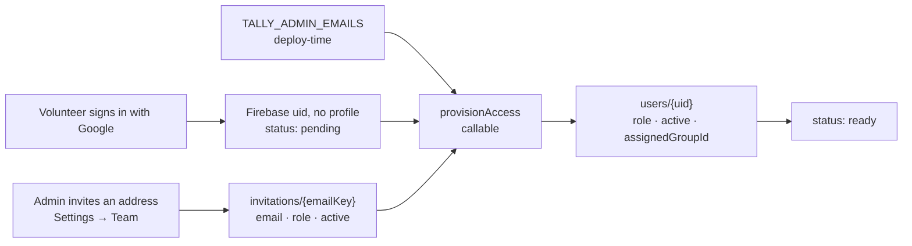

# Planning Center People integration

Planning Center People is the system of record for *people*. Students and counselors are created,
edited and retired there, and Tally reads them live and stores none of it.

**Tally owns the two memberships.** Who is a student, and who may sign in to Tally, are
Tally's own lists. They used to be Planning Center Lists, and that was a mistake worth explaining,
because it is the reason this page reads the way it does now: a List is *generated from filter
rules*. There is no way to say "these forty-three teenagers" in a List — only "everyone in grades
6–12 flagged as a child", which is wrong in both directions at the edges every ministry has. The
5th grader who comes every week with an older sibling is excluded; the senior who graduated in May
and still leads worship is dropped the moment the grades roll over. The only workaround is to invent
a custom field on every person in the church and filter on that, which is a schema change to the
church database in order to express a decision that was never Planning Center's to hold.

So the split is now:

| | Owner | Where |
| --- | --- | --- |
| Who is on the roster | Tally | `students/{id}` — a document *is* the membership |
| Who may sign in | Tally | `invitations/{emailKey}`, plus `TALLY_ADMIN_EMAILS` |
| Names, grades, parent contact, allergies | Planning Center | read on demand, stored nowhere |
| Attendance, small groups, RSVPs | Tally | Planning Center has no concept of them |

This is the operational guide: how to get credentials, what every setting does, how counselor access
actually flows, and what to do when it breaks. `functions/src/config.ts` is the source of truth for
the parameter names and defaults; if this page and that file ever disagree, the file is right.

---

## 1. Credentials

Tally authenticates to Planning Center with a **Personal Access Token**, sent as HTTP Basic auth.

1. Sign in to Planning Center as an account that can read the youth roster (and, if you plan to turn
   on write-back, edit people).
2. Go to <https://api.planningcenteronline.com/oauth/applications>.
3. Under **Personal Access Tokens**, choose **New Personal Access Token**. Name it `Tally`.
4. Copy the **Application ID** and the **Secret**. Planning Center shows the secret exactly once.

A Personal Access Token belongs to a *person* and inherits that person's People permissions. Create
it under a shared office account rather than a volunteer's personal login, or the sync stops working
the week they leave the church.

### Where the two values go

**For the emulator**, copy `functions/.secret.local.example` to `functions/.secret.local` and fill it
in. That file is gitignored; the Firebase emulator loads it and binds each line to the matching
`defineSecret` / `defineString` parameter, so local runs behave like production.

```bash
cp functions/.secret.local.example functions/.secret.local
$EDITOR functions/.secret.local
```

**For deployment**, the two credentials go into Secret Manager and the rest are deploy-time params:

```bash
firebase functions:secrets:set PCO_APP_ID
firebase functions:secrets:set PCO_SECRET
firebase deploy --only functions        # prompts for any unset param
```

Non-secret parameters can also be committed per project in `functions/.env.<projectId>`.

Nothing here ever reaches the browser. Planning Center does not serve CORS headers for API clients
anyway, so every call runs inside a Cloud Function and the app talks to it through the three
callables in `src/services/functions.ts`.

---

## 2. Configuration

There are two layers, and only the first one needs a deploy.

**Settings → Planning Center → Change** is where the core team edits everything non-secret: the
grade band, write-back, and how long a read may be reused. Saving writes `config/planningCenter`, the
server reads it on the next call, and the change is live for every counselor's next read. No
redeploy, no restart. (Who is on the roster is not here — that is the Students screen, one student at
a time.)

**Deploy-time parameters** are the defaults an install starts from, before anybody has opened
Settings. They still matter — a fresh deploy, a CI environment and the end-to-end suite all configure
themselves this way — but they are now the *fallback*, not the source of truth.

**Secrets** are the Personal Access Token pair, and they are not editable from the app at all. They
live in Secret Manager, because a value a browser can write is a value a browser can read.

### Precedence

For each setting: the saved document wins where it has an opinion, otherwise the deploy-time
parameter, otherwise the built-in default. A key that is *absent* from the document means "no
opinion"; a key that is present but empty means "deliberately cleared".

`PCO_API_BASE_URL` is the one exception: an empty saved value means "no override" rather than
"cleared". The app writes every field on save, including ones the person cannot see, so the other
reading would silently repoint a proxied install at the real Planning Center the first time somebody
changed an unrelated setting.

### Who may change what

`config/planningCenter` is readable and writable by the **core team**, with one carve-out: the API
address is **admin-only**, because every request carries the church's credentials and that field
decides where they are sent. The security rules enforce both, plus the shape — the document is a
closed set of keys, so credentials cannot be stashed in it even by an admin.

### The parameters themselves

| Name | Default | What it does |
| --- | --- | --- |
| `PCO_APP_ID` | *(secret, required)* | Personal Access Token application id. Sent as the HTTP Basic username. Secret Manager only. |
| `PCO_SECRET` | *(secret, required)* | Personal Access Token secret. Sent as the HTTP Basic password. Secret Manager only. |
| `TALLY_ADMIN_EMAILS` | *(empty)* | Google addresses that are admins on every sign-in, whatever the database says. The bootstrap for a fresh install and the break-glass for a lockout. Comma- or whitespace-separated. Not a Planning Center setting at all — see §5. |
| `PCO_MIN_GRADE` | `6` | Bottom of the grade band. Clamped into 6–12, because those are the only grades the app's `Grade` type admits. Selects nobody; see §3. |
| `PCO_MAX_GRADE` | `12` | Top of the grade band. Clamped into `PCO_MIN_GRADE`–12. |
| `PCO_WRITE_BACK` | `create` | How much Tally may change in Planning Center: `off`, `create` or `full`. See §4. Any other value falls back to `create`. |
| `PCO_CACHE_TTL_SECONDS` | `30` | How long a Planning Center read may be reused. `0` turns retention off; the ceiling is 300, past which a cache becomes a mirror. |
| `PCO_API_BASE_URL` | *(empty)* | API root. Empty means the real Planning Center. Anything else is reported as an override wherever the connection is shown, because a test rig must never be mistaken for production. |

Every one of these except the two secrets and `TALLY_ADMIN_EMAILS` can be changed from Settings, and
every one is re-parsed, re-clamped and re-validated server-side whichever way it arrived — the
security rules are the first check, not the only one. `TALLY_ADMIN_EMAILS` is deliberately *not*
editable from the app: it is what gets you back in when the app is what went wrong.

A missing or contradictory setting is a *configuration state*, not a crash: `loadConfig()` and
`resolveConfig()` never throw, every entry point checks `configError` first, and the Settings screen
names the value that is missing. Where it tells you to go depends on who owns the value: an install
running on deploy-time parameters is told which parameter is unset, and one being managed from the
app is pointed at Settings.

---

## 3. Which people are "the roster"

The ones somebody put on it. **Students → Add from Planning Center** searches the church directory
and adds the person you pick; a `students/pco_{personId}` document is the membership, and it holds
no name, grade or contact detail of its own.

The search is deliberately unfiltered — no grade band, no "is a child" — because those filters are
wrong at exactly the edges a hand-picked roster exists for. Both facts are *shown* on each result so
the leader can see what they are choosing, and shown as Planning Center holds them: a person with no
grade on file reads "No grade in Planning Center" rather than being floored to `PCO_MIN_GRADE`, which
would put "6th" under every adult in the church.

### How a name is written

Planning Center composes a display name as `first_name “nickname” last_name` — `Benson “蔡秉洲” Tsai`
— treating the nickname as an addition rather than a replacement. Tally follows that exactly, so the
name on a roster row is the name on the profile page. Because `searchName` is built from the same
string, either spelling finds the student; and because write-back splits the halves apart again
before sending them, the two fields Planning Center actually stores are never conflated.

Adding goes through a callable rather than a direct write. The document id is a claim about which
real child a row refers to, so the security rules forbid a browser asserting it; the server checks
the person exists upstream first.

### Taking somebody off

**Remove from roster** on the student's page. That marks the membership inactive rather than
deleting it, for two reasons: every attendance record points at the student id, so deleting the row
would silently drop past head counts, and an inactive membership stops Tally reading anything at all
about a child who has left the ministry. Adding them again later restores the same record, with
their history intact.

### Moving across from a Planning Center list

**Students → Add from Planning Center → Import a Planning Center list.** Everyone on the list today
joins the roster. It is a copy, not a link, and that is the point — a list is a saved query whose
membership moves on its own, which is what made it a poor roster in the first place.

### What the grade band is still for

`PCO_MIN_GRADE`/`PCO_MAX_GRADE` no longer select anybody. They are the range the app understands
(`Grade` is 6–12) and the landing spot for a student Planning Center has no grade for. A student
outside the band can be on the roster; their grade is clamped for display. The clamp applies to
roster rows and student documents, which must carry *some* grade — not to the Add-from-Planning-Center
search, which reports a missing grade as missing.

---

## 4. Write-back: what actually changes in the church database

`PCO_WRITE_BACK` decides how much Tally may alter a system it does not own. Everything below is
biased toward doing nothing, because a mistake here does not look like a broken screen — it looks
like a duplicate child in the permanent people database that somebody has to merge by hand months
later.

| Mode | Will change in Planning Center | Will never change |
| --- | --- | --- |
| `off` | Nothing at all. | Everything. Quick-added visitors stay queued (`pcoPushPending: true`) so switching the mode on later picks them up with nobody re-editing anything. |
| `create` *(default)* | Creates a **Person** for a quick-added visitor — first name, last name, grade, `child: true`, and allergies as `medical_notes` — but only after searching for an exact first + last + grade match and linking to that instead. | Any existing person. No edits, ever. Planning Center still owns every field on everyone it already knows. |
| `full` | Everything `create` does, plus patches drifted managed fields on **linked** people: `first_name`, `last_name`, `grade`, `medical_notes`. | Parent contacts, households, emails, phone numbers, membership, notes, anything not in that list. Nothing is ever deleted or deactivated in Planning Center; a student who leaves is deactivated in Tally only. |

In every mode, before creating a person Tally searches `where[search_name]` plus grade and filters
the results again locally through the same accent- and punctuation-insensitive normalisation used to
collapse duplicate visitors. If several people match exactly, the church database already has
duplicates and Tally links to the lowest id rather than adding a third.

A name Tally holds as `Benson “蔡秉洲”` is split back into `first_name` and `nickname` before any of
this: the server's fuzzy search indexes the halves separately, and writing the composite into
`first_name` would render as `Benson “蔡秉洲” “蔡秉洲” Tsai` on the next read and stop the matcher
recognising the person at all — which is how a duplicate child gets created.

The fields Planning Center owns once a student is linked are listed in `PCO_MANAGED_STUDENT_FIELDS`:
first name, last name, grade, gender, allergies, status. The student editor shows them read-only with
a "managed in Planning Center" note unless write-back is `full`, because editing them in Tally would
just be overwritten on the next pull. Small group, notes, attendance and RSVP data are Tally's alone
and are never written from the sync.

---

## 5. How counselor access works, end to end

Authentication grants nothing. Authorisation is an active `users/{uid}` document, and no client may
create one — a rule that lets you write your own role is a rule that lets anyone with a Google
account become an admin.

**Google sign-in only.** Tally decides what somebody may do from their email address, so what
matters is not that they typed one but that a provider Tally trusts has confirmed it is theirs. The
email magic link that used to be the primary path is gone: one door is easier to watch than two, and
a mailbox left signed in on a shared phone was a way in that nobody was watching.



`provisionAccess` checks three things, in this order:

1. **`TALLY_ADMIN_EMAILS`** — a standing admin grant, re-asserted on every sign-in. Nobody can invite
   the first admin of a fresh install, because there is nobody to do the inviting; this breaks that
   circle. It is also the break-glass: an admin who deactivates the last other admin has not locked
   the ministry out, because whoever is named here still gets in — even if their own profile says
   `active: false`. Removing somebody's standing admin rights means editing the variable and
   deploying, which is the point. A break-glass should need a key.
2. **An existing `users/{uid}` profile** — somebody who has signed in before. Their role is whatever
   an admin has since made it, so this path deliberately does *not* reset it from the invitation they
   originally arrived on.
3. **`invitations/{emailKey}`** — an admin said this address may sign in, and with what starting
   role. Consumed on first sign-in.

Anything else is "not on the roster", reported as a refusal rather than an error: a volunteer who has
not been added yet is a normal thing to be.

### Inviting and revoking

**Settings → Team** (admin only). Invite a Google address with a role; they appear in the "Signed in"
list the first time they use it.

The two lists do different jobs, and the difference matters when somebody has to be removed:

- **Withdrawing an invitation** stops somebody *arriving*. It does nothing to anybody who already
  has a profile.
- **Deactivating a profile** is how access is actually removed. It takes effect on their next
  operation, not at their next sign-in, because the security rules read that document on every
  request.

The invitation list is admin-only to read as well as to write: it is a list of church staff email
addresses, and a counselor's phone has no reason to hold one.

### Role mapping

Roles are set in Tally, by an admin, and no longer derived from Planning Center permissions — the
people who administer a church database are not necessarily the people who should decide who sees a
roster of minors.

| Role | Gets |
| --- | --- |
| `counselor` | Check-in. The door volunteer. |
| `core` | Counselor, plus the dashboard, roster management, events, RSVPs and settings. |
| `admin` | Core, plus granting access: invitations, roles, and deactivation. |

## 6. What Tally reads, and when

There is no scheduled anything. Three reads, and each one is somebody looking at a screen:

| Read | Triggered by | Cost |
| --- | --- | --- |
| The roster | Opening check-in, the students list, or a refresh | One sweep of `where[child]=true`, plus one request per roster member the sweep did not cover |
| One person's details | Opening a student's page | One request, plus one per household |
| A directory search | Typing in "Add from Planning Center" | One request per keystroke burst |

The roster read is the interesting one, because it has to turn Tally's membership into people. It
sweeps the children in one request per hundred, which answers for nearly everybody, and then fetches
whoever is left individually — the graduated senior, the 5th grader. Past sixty stragglers it stops
and *reports* the remainder rather than dropping them: a roster quietly short by three students is
the failure nobody notices. Settings shows the count.

Every answer is held for `PCO_CACHE_TTL_SECONDS`, keyed by the roster itself. Adding a student
changes the key, so they appear on the next read rather than whenever the previous answer expires.

## 7. Troubleshooting

Start at **Settings → Planning Center** in the app. It shows the last run's status, counts, and the
verbatim error message. `firebase functions:log` has the rest.

### Getting the details out of the app

Anywhere Tally says it could not reach Planning Center — **Students → Add from Planning Center** is
the usual one — the red banner has a **Show details** link under it. That panel is the request Tally
sent, the status and body Planning Center sent back, how many times it retried, and Planning Center's
own `errors[]`. **Copy debug details** puts the lot on the clipboard as markdown, which is the useful
thing to paste into a message to whoever set the connection up, or into an issue.

The panel is safe to share. The Personal Access Token never leaves the Cloud Function:
`Authorization` is replaced with `[redacted]` where the request is recorded
(`functions/src/pco/client.ts`), and the payload carries transport facts about a request rather than
anything about a person (`functions/src/pco/debug.ts`). The same information is in
`firebase functions:log` under `Failed to …`, for whoever has console access — the panel exists
because the person looking at the failure usually does not.

**`401 Unauthorized`** — the token is wrong. Either the app id and secret were swapped, one of them
picked up a trailing space on the way into Secret Manager, or the token was revoked in Planning
Center. Mint a fresh Personal Access Token and re-set both values; they are a pair and must be
replaced together. Locally, check `functions/.secret.local` exists and that you restarted the
emulator after editing it.

**`403 Forbidden`** — the token authenticates but the *person* it belongs to cannot read People. A
Personal Access Token inherits its owner's permissions exactly. Give that account at least Viewer
access to People (Editor or Manager if you use `PCO_WRITE_BACK=full`), or create the token under an
account that already has it.

**`429 Too Many Requests`** — Planning Center is rate limiting. Nothing to do: the client honours the
`Retry-After` header, backs off exponentially up to 20 seconds, and retries four times before giving
up. If it keeps happening on the roster read, the likely cause is a roster full of people the child
sweep does not cover, each costing a request of their own — Settings shows how many. Otherwise raise
`PCO_CACHE_TTL_SECONDS` so eight counselors arriving at once cost one read instead of eight.

**A student appears twice** — the name + grade match failed, so a quick-added visitor was never
collapsed onto the Planning Center person. Usually a nickname ("Nate" vs "Nathaniel"), a hyphenated
surname typed one way at the door, or a grade that was off by one. To fix it by hand:

1. In Tally, open the duplicate that has **no** Planning Center badge — that is the Tally-only one.
2. Move anything worth keeping (small group, notes) onto the linked record.
3. Set the Tally-only duplicate to inactive. Do not delete it; its attendance rows would be orphaned,
   and the head count for those past events would silently drop.
4. If the student's attendance is on the wrong record, re-check them in on the correct one from the
   event's detail screen before deactivating.
5. To stop it recurring, put what counselors actually call the student in Planning Center's
   `first_name` or `nickname` — Tally carries both, so either one matches — and correct the grade.

**It says it is not configured** — the config refused to build a client, and the message names the
value: a missing `PCO_APP_ID` or `PCO_SECRET`. Both are a Secret Manager job.

**Settings says N students could not be read** — those roster entries name a Planning Center person
that is gone: deleted upstream, or merged into another record. Their attendance history is intact.
Add the surviving record from **Students → Add from Planning Center**, and remove the stale entry.

**Nobody can sign in after a fresh install** — `TALLY_ADMIN_EMAILS` is unset or does not match the
address anybody is actually using. Nobody can invite the first admin, so that variable is the only
way in; set it to a Google address and redeploy.

**Somebody was invited and still cannot get in** — check the address on the invitation is the *Google
account* they sign in with, not a forwarding alias. Tally matches on the address the provider
confirms, and an alias is a different string.
