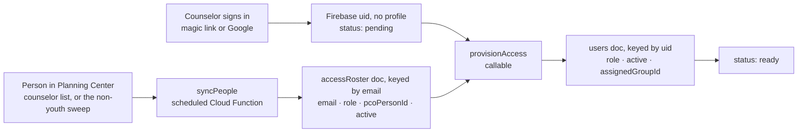

# Planning Center People integration

Planning Center People is the system of record for *people*. Students and counselors are created,
edited and retired there; Tally pulls them in on a schedule and owns only what Planning Center has no
concept of — attendance, small groups, RSVPs, waivers.

This is the operational guide: how to get credentials, what every setting does, how counselor access
actually flows, and what to do when it breaks. `functions/src/config.ts` is the source of truth for
the parameter names and defaults; if this page and that file ever disagree, the file is right.

---

## 1. Credentials

Tally authenticates to Planning Center with a **Personal Access Token**, sent as HTTP Basic auth.

1. Sign in to Planning Center as an account that can read the youth roster (and, if you plan to turn
   on write-back, edit people).
2. Go to <https://api.planningcenteronline.com/oauth/applications>.
3. Under **Personal Access Tokens**, choose **New Personal Access Token**. Name it `Tally`.
4. Copy the **Application ID** and the **Secret**. Planning Center shows the secret exactly once.

A Personal Access Token belongs to a *person* and inherits that person's People permissions. Create
it under a shared office account rather than a volunteer's personal login, or the sync stops working
the week they leave the church.

### Where the two values go

**For the emulator**, copy `functions/.secret.local.example` to `functions/.secret.local` and fill it
in. That file is gitignored; the Firebase emulator loads it and binds each line to the matching
`defineSecret` / `defineString` parameter, so local runs behave like production.

```bash
cp functions/.secret.local.example functions/.secret.local
$EDITOR functions/.secret.local
```

**For deployment**, the two credentials go into Secret Manager and the rest are deploy-time params:

```bash
firebase functions:secrets:set PCO_APP_ID
firebase functions:secrets:set PCO_SECRET
firebase deploy --only functions        # prompts for any unset param
```

Non-secret parameters can also be committed per project in `functions/.env.<projectId>`.

Nothing here ever reaches the browser. Planning Center does not serve CORS headers for API clients
anyway, so every call runs inside a Cloud Function and the app talks to it through the three
callables in `src/services/functions.ts`.

---

## 2. Configuration parameters

| Name | Default | What it does |
| --- | --- | --- |
| `PCO_APP_ID` | *(secret, required)* | Personal Access Token application id. Sent as the HTTP Basic username. |
| `PCO_SECRET` | *(secret, required)* | Personal Access Token secret. Sent as the HTTP Basic password. |
| `PCO_ROSTER_SOURCE` | `grade` | How the youth roster is selected: `list` (a curated Planning Center List) or `grade` (everyone in the grade band). Any other value falls back to `grade`. |
| `PCO_STUDENT_LIST_ID` | *(empty)* | The List whose members are the roster. **Required** when `PCO_ROSTER_SOURCE=list`; the sync refuses to run without it. The id is the number in the List's URL. |
| `PCO_COUNSELOR_LIST_ID` | *(empty)* | Optional second List holding adult counselors and core team. Everyone on it with an email address becomes an `accessRoster` entry. Left blank, the team is derived from the non-youth people the main sweep saw, or failing that from Planning Center's own administrators. |
| `PCO_MIN_GRADE` | `6` | Bottom of the grade band. Clamped into 6–12, because those are the only grades the app's `Grade` type admits. |
| `PCO_MAX_GRADE` | `12` | Top of the grade band. Clamped into `PCO_MIN_GRADE`–12. |
| `PCO_WRITE_BACK` | `create` | How much Tally may change in Planning Center: `off`, `create` or `full`. See §4. Any other value falls back to `create`. |
| `PCO_SYNC_SCHEDULE` | `every 6 hours` | Schedule for the background sync. App Engine cron syntax or `every N <unit>`. |
| `PCO_SMALL_GROUP_FIELD` | *(empty)* | Name or slug of a Planning Center custom field holding a person's small-group name. When set, a counselor's access entry carries a slugified group id so Sunday School check-in opens pre-filtered. |

A missing or contradictory setting is a *configuration state*, not a crash: `loadConfig()` never
throws, the sync writes a terminal `error` status carrying the exact problem, and the Settings screen
names the value that is missing.

---

## 3. Which people are "the roster"

### List mode (recommended)

`PCO_ROSTER_SOURCE=list` with `PCO_STUDENT_LIST_ID` pointing at a Planning Center List. Open the list
in People (**People → Lists → your list**); the id is the number in the URL:

```
https://people.planningcenteronline.com/lists/1234567    ->    PCO_STUDENT_LIST_ID=1234567
```

**Use a List.** A youth pastor already maintains one, so there is no second thing to keep in sync,
and it survives all the cases a grade band cannot: the 5th grader who comes every week with an older
sibling, the graduated senior who still leads worship, the kid whose grade nobody ever filled in. In
list mode Tally does not second-guess the list on grade — if the pastor put them on it, they are on
the roster.

### Grade mode

`PCO_ROSTER_SOURCE=grade` sweeps every person flagged as a child whose grade falls inside
`PCO_MIN_GRADE`–`PCO_MAX_GRADE`. Zero setup, and a reasonable way to start. Its cost is silent: a
person with neither a grade nor a graduation year is *not* assumed to be a youth (an adult volunteer
with a blank grade would otherwise be swept into the student roster), so anyone whose grade is empty
simply never appears, and nothing tells you.

Grade mode also queries children only, which means it maps no counselors. Set
`PCO_COUNSELOR_LIST_ID`, or the sync falls back to Planning Center's own administrators so a fresh
install is not locked out of its own app.

---

## 4. Write-back: what actually changes in the church database

`PCO_WRITE_BACK` decides how much Tally may alter a system it does not own. Everything below is
biased toward doing nothing, because a mistake here does not look like a broken screen — it looks
like a duplicate child in the permanent people database that somebody has to merge by hand months
later.

| Mode | Will change in Planning Center | Will never change |
| --- | --- | --- |
| `off` | Nothing at all. | Everything. Quick-added visitors stay queued (`pcoPushPending: true`) so switching the mode on later picks them up with nobody re-editing anything. |
| `create` *(default)* | Creates a **Person** for a quick-added visitor — first name, last name, grade, `child: true`, and allergies as `medical_notes` — but only after searching for an exact first + last + grade match and linking to that instead. | Any existing person. No edits, ever. Planning Center still owns every field on everyone it already knows. |
| `full` | Everything `create` does, plus patches drifted managed fields on **linked** people: `first_name`, `last_name`, `grade`, `medical_notes`. | Parent contacts, households, emails, phone numbers, membership, notes, anything not in that list. Nothing is ever deleted or deactivated in Planning Center; a student who leaves is deactivated in Tally only. |

In every mode, before creating a person Tally searches `where[search_name]` plus grade and filters
the results again locally through the same accent- and punctuation-insensitive normalisation used to
collapse duplicate visitors. If several people match exactly, the church database already has
duplicates and Tally links to the lowest id rather than adding a third.

The fields Planning Center owns once a student is linked are listed in `PCO_MANAGED_STUDENT_FIELDS`:
first name, last name, grade, gender, allergies, status. The student editor shows them read-only with
a "managed in Planning Center" note unless write-back is `full`, because editing them in Tally would
just be overwritten on the next pull. Small group, notes, attendance and RSVP data are Tally's alone
and are never written from the sync.

---

## 5. How counselor access works, end to end

Authentication grants nothing. Authorisation is an active `users/{uid}` document, and no client may
create one — a rule that lets you write your own role is a rule that lets anyone with a Google
account become an admin.



1. The scheduled sync maps each team member to `accessRoster/{emailKey}`, where `emailKey` is the
   lowercased address with `.` replaced by `,` (`sam.smith@example.org` → `sam,smith@example,org`).
   A person with no email address is skipped, not failed: Tally authenticates by email, so there is
   nothing to match a sign-in against.
2. The counselor signs in. They now have a Firebase uid and no `users/{uid}` document, which the app
   shows as "Checking your access".
3. The app calls `provisionAccess`. It verifies the email was actually *proven* — a magic link or a
   Google account, not an unverified password registration — looks the address up in `accessRoster`,
   and creates the profile server-side. The role comes from the roster, never from anything the
   caller sent.
4. The live listener on `users/{uid}` flips the app to ready. No reload.

Revoking works the same way in reverse: marking the person inactive in Planning Center sets
`active: false` on the roster entry, and an admin flipping `active` on the user document takes effect
mid-event without anyone reloading.

### Role mapping

| Planning Center | Tally role | Gets |
| --- | --- | --- |
| `site_administrator: true` | `admin` | Everything, plus granting roles to other people. |
| `people_permissions` = `Manager` | `core` | Dashboard, roster editing, events, RSVPs, settings. |
| `people_permissions` = `Editor` | `core` | The same. |
| anything else | `counselor` | Check-in only. |

Manager and Editor are the people who already maintain the roster in Planning Center, which is why
they are the two levels that imply the dashboard. Everyone else is a door volunteer.

One deliberate exception: **a role already set in Tally wins over the roster's.** An admin who
promoted a volunteer inside Tally must not be silently demoted by the next sync.

---

## 6. Sync cadence and the incremental cursor

The scheduled function runs on `PCO_SYNC_SCHEDULE` (default every 6 hours). The core team can also
force a run from Settings, which calls `syncPlanningCenterNow`.

Most runs are **incremental**. The sync records the maximum `Person.updated_at` it has ever observed
in `config/pcoSync.cursor` and asks Planning Center only for people modified since
(`where[updated_at][gt]`). On a few hundred students that is usually a single page.

The cursor is advanced **only on success**. A run that throws half-way finishes with an `error`
status and the previous cursor intact, so the next attempt re-reads from the last known-good point
rather than skipping whatever it never got to.

A **full sweep** is promoted automatically when there is no cursor, no record of a previous full
sweep, or the last one was more than 24 hours ago. It is not optional, because an incremental pull is
defined by what *changed* and can therefore never see what *disappeared*: a student removed from the
roster list, or a person deleted outright, produces no `updated_at` for anyone. Only a full sweep can
notice that a linked student is no longer returned — at which point they are marked `inactive` in
Tally. They are never deleted; the attendance history at `events/{id}/attendance/{studentId}` has to
outlive them.

Two more properties worth knowing:

- **No churn.** Every write is diffed against the stored document first, and an unchanged student
  produces no write at all — not even a touched `pcoSyncedAt`. The app holds a live listener on the
  whole roster, so a sweep that bumped 400 unchanged students would wake every counselor's phone for
  nothing.
- **No duplicates.** A student is keyed by `pcoPersonId`. A quick-added visitor who has not been
  pushed yet is additionally matched on normalised name + grade, so the kid a counselor thumb-typed
  as "Jose" at the door and the "José" the office entered on Monday collapse into one record.

Progress is written to `config/pcoSync`, throttled to one update every five seconds, and always lands
on a terminal `ok` or `error` — a status stuck on `running` forever is indistinguishable from a hung
integration.

---

## 7. Troubleshooting

Start at **Settings → Planning Center** in the app. It shows the last run's status, counts, and the
verbatim error message. `firebase functions:log` has the rest.

**`401 Unauthorized`** — the token is wrong. Either the app id and secret were swapped, one of them
picked up a trailing space on the way into Secret Manager, or the token was revoked in Planning
Center. Mint a fresh Personal Access Token and re-set both values; they are a pair and must be
replaced together. Locally, check `functions/.secret.local` exists and that you restarted the
emulator after editing it.

**`403 Forbidden`** — the token authenticates but the *person* it belongs to cannot read People. A
Personal Access Token inherits its owner's permissions exactly. Give that account at least Viewer
access to People (Editor or Manager if you use `PCO_WRITE_BACK=full`), or create the token under an
account that already has it.

**`429 Too Many Requests`** — Planning Center is rate limiting. Nothing to do: the client honours the
`Retry-After` header, backs off exponentially up to 20 seconds, and retries four times before giving
up. If it keeps happening, the roster source is probably too wide — a `PCO_ROSTER_SOURCE=grade`
sweep pointed at a large church fetches one request per household. Switch to list mode. (The run is
also capped at 400 household fetches so a misconfiguration stops rather than billing for it.)

**A student appears twice** — the name + grade match failed, so a quick-added visitor was never
collapsed onto the Planning Center person. Usually a nickname ("Nate" vs "Nathaniel"), a hyphenated
surname typed one way at the door, or a grade that was off by one. To fix it by hand:

1. In Tally, open the duplicate that has **no** Planning Center badge — that is the Tally-only one.
2. Move anything worth keeping (small group, notes) onto the linked record.
3. Set the Tally-only duplicate to inactive. Do not delete it; its attendance rows would be orphaned,
   and the head count for those past events would silently drop.
4. If the student's attendance is on the wrong record, re-check them in on the correct one from the
   event's detail screen before deactivating.
5. To stop it recurring, make Planning Center's `first_name` (or nickname) match what counselors
   actually call the student, and correct the grade.

**The sync says it is not configured** — `loadConfig()` refused to build a client. The message names
the value: a missing `PCO_APP_ID` or `PCO_SECRET`, or `PCO_ROSTER_SOURCE=list` with no
`PCO_STUDENT_LIST_ID`.

**Nobody can sign in after a fresh install** — `accessRoster` is empty. In grade mode the sweep sees
only children, so no team members are mapped; set `PCO_COUNSELOR_LIST_ID`. The fallback to Planning
Center's own administrators exists for exactly this case, but only fires when the sweep produced no
non-youth candidates at all.
