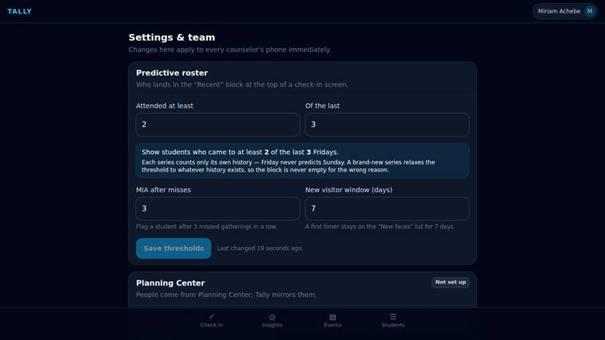
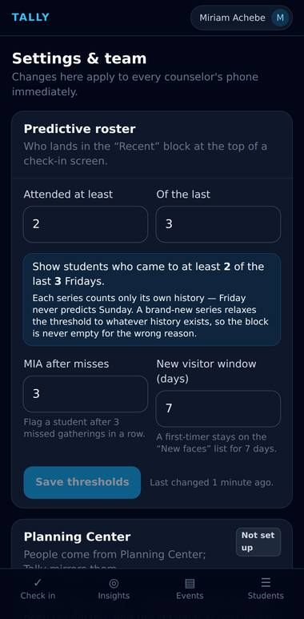
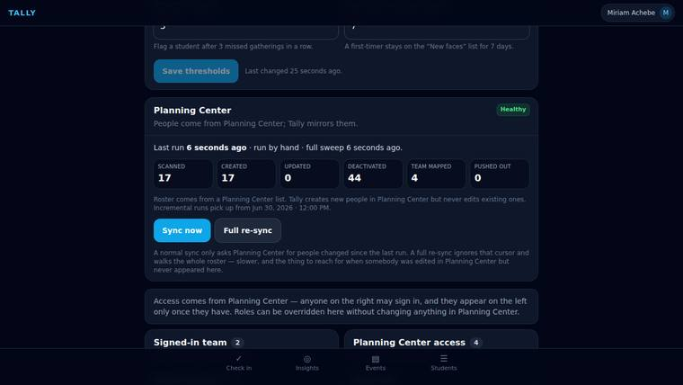
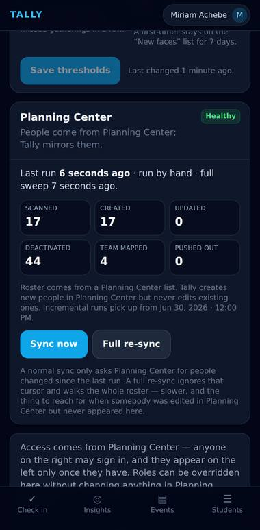
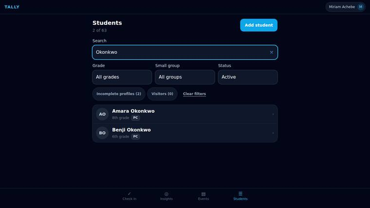
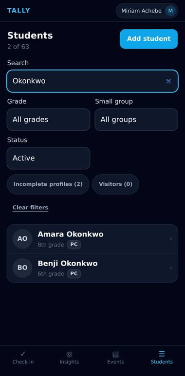

# Tally — a walkthrough

Every screenshot below is the real application, captured by Playwright against a
live Firebase Emulator Suite and a seeded 45-student ministry. Nothing is a mockup;
the Planning Center sync in the last three shots really did make HTTP calls.

Regenerate with:

```bash
npm run dev:emulated                  # in one terminal
npm run walkthrough                   # capture, then build the page
```

## Getting in

### Sign in

The only screen a signed-out volunteer sees. An email link is the primary path — counselors are handed a phone at the door and never set a password. Google is secondary, and hides itself in browsers that cannot do OAuth.


## Journey 1 — high-volume check-in

### The predictive roster

Tally picked tonight’s event from the clock; nobody chose it. The “Recent” block is the predictive roster: students who came to at least 2 of the last 3 Fridays, most consistent first. Friday history predicts Friday — Sunday’s regulars are not in this list.


### One tap checks a student in

Maya Adebayo moved to “Checked in” at the bottom, and the header count went up. The row flashed green and buzzed before the write left the device — the authoritative state then arrives back through Firestore, so a second counselor at the same door sees it too.


### Search for anyone not in the Recent block

Two letters, filtered instantly against the in-memory roster. The header counts deliberately do not move: they describe the event, not the query, so nobody watches the number drop as they type and thinks they broke something.


## Journey 3 — bring a friend

### Quick-add a visitor

A first name, a last name, a grade. Nothing else, because anything more forms a queue at the door. “Save & check in” is one atomic write: the student is created and marked present together, then the modal closes.


### The visitor is already checked in

Back on the roster with no interruption. Behind the scenes the profile carries a “missing info” flag, which is what puts them on the core team’s follow-up list later that evening.


## Journey 5 — pastoral follow-up

### Insights, not a data table

Monday evening. The PRD asks for actionable insight rather than raw numbers, so every row leads somewhere: tap-to-call, tap-to-text, or through to the student. “Missing in action” is students who missed three or more gatherings in a row.


### New faces and incomplete profiles

First-timers from the past week, and the profiles still missing a way to reach a parent — the visitors quick-added at the door. “Copy list” puts names and numbers on the clipboard for a group chat, which is what actually happens.


### Attendance trend

Head count per gathering, per series. Eight bars, no gridlines, no chart library — enough to see a slide starting, which is all this needs to do.


## Journey 4 — the field trip

### The event calendar

Recurring gatherings and one-offs together. “Schedule next Friday Fellowship” is two taps, because somebody has to do it every single week.


### RSVPs, waivers and payments

A one-off event is about accountability rather than speed. The numbers a leader is actually chasing the week before a retreat — waivers outstanding, payments outstanding — are the prominent ones.


## The roster

### Students

The whole ministry, filterable by grade, small group and status. Each row says whether the record came from Planning Center or was created in Tally, so it is obvious which fields are safe to edit here.


## Planning Center

### Settings and the sync

The predictive thresholds are configurable with a plain-language preview. Below them, the Planning Center card: what the last sync did, and a button to run one now.





### A sync, end to end

Browser → callable → Cloud Function → the Planning Center API → Firestore → back through onSnapshot. Students and counselors both come from Planning Center; access is derived from it rather than from a list somebody maintains by hand.





### People pulled from Planning Center

Amara Okonkwo existed only in Planning Center a moment ago. Her grade, allergies and parent contact all came across — the contact resolved through her household, since Planning Center keeps it on the parent’s record, not the child’s.




