# Tally — a walkthrough

Every screenshot below is the real application, captured by Playwright against a
live Firebase Emulator Suite and a seeded 45-student ministry. Nothing is a mockup:
the taps are real writes, the roster arrived over HTTP from a Planning Center standing
in for the real one, and the parent contact near the end was fetched while the shutter
was open.

Regenerate with:

```bash
npm run dev:emulated                  # in one terminal
npm run walkthrough                   # capture, then build the page
```

## Getting in

### Sign in

The only screen a signed-out volunteer sees, and the only way in. A leader adds somebody by their Google address; signing in with that address is the whole of it, because authorisation is keyed on an address and one door is easier to watch than two. Nobody sets a password they would have to remember at a door.


## Journey 1 — high-volume check-in

### Which gathering are you at?

The first question, and the only one. Tally used to answer it from the clock and open straight into a roster — one fewer tap, and one way to be confidently, silently wrong: on a night with two things on, or one running late, forty students could be filed against the wrong gathering before anybody noticed. The card is the size of the answer because the person giving it is holding the phone one-handed with a queue in front of them, and the gathering whose window is actually open is ringed and sorted first.

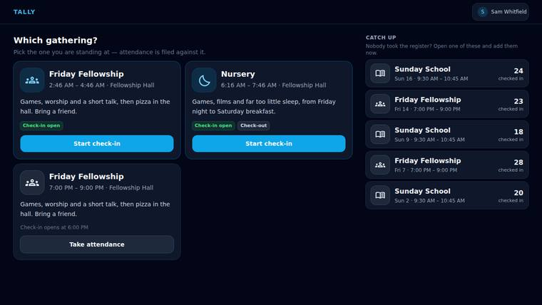

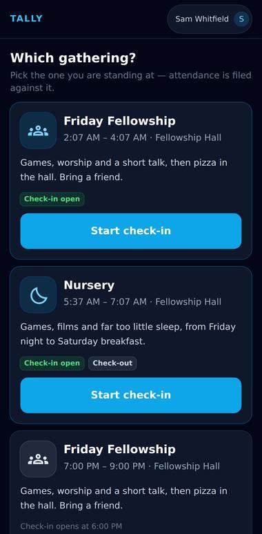

### The predictive roster

One tap later. The screen opens on “Recent”, the predictive filter: students who came to at least 2 of the last 3 Fridays. Friday history predicts Friday — Sunday’s regulars are not in this list — and “Show all” is right underneath it. The event is named in the bar above, with the date beside it, and it keeps saying so for as long as somebody is tapping.

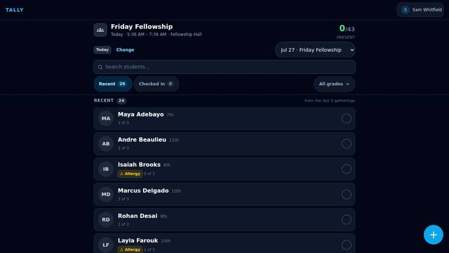

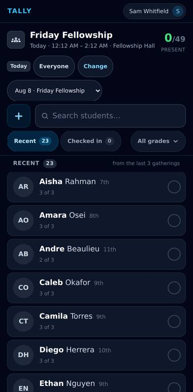

### One tap checks a student in

Aisha Rahman turned green exactly where they stood, and the header count went up. Nothing moves on a tap: with two counselors working one queue, a list that re-sorts on every write slides the next name out from under a thumb. The row flashed and buzzed before the write left the device — the authoritative state then arrives back through Firestore, so the second phone sees it too.

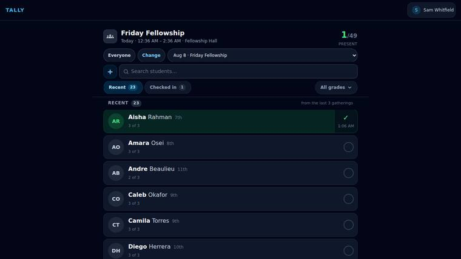

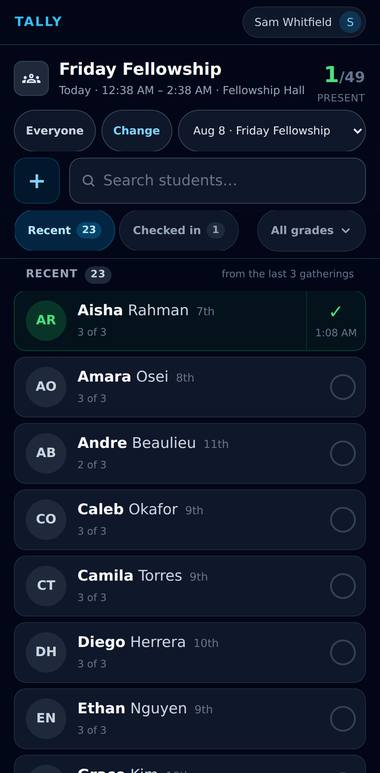

### Search for anyone the prediction missed

Two letters, filtered instantly against the in-memory roster. A search reaches the whole ministry — the Recent filter stands itself down while a query is running, so typing a visitor’s name can never report that nobody by that name exists. The header counts deliberately do not move: they describe the event, not the query.

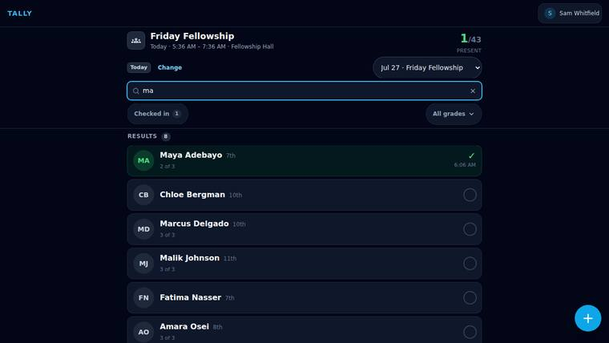

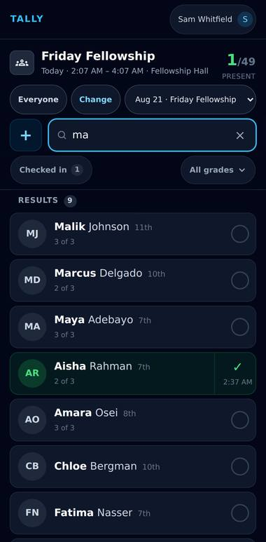

## Journey 3 — bring a friend

### Quick-add a visitor

A first name, a last name, a grade. Nothing else, because anything more forms a queue at the door. “Save & check in” is one atomic write: the student is created and marked present together, then the modal closes.

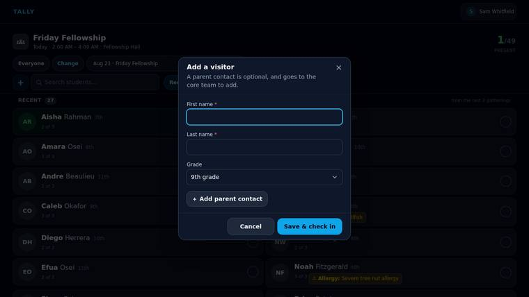

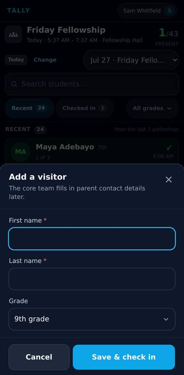

### The visitor is already checked in

Back on the roster with no interruption. The record is Tally’s own and is queued for Planning Center — a Cloud Function pushes it upstream, and until it lands the student carries a “not pushed yet” flag rather than a half-filled profile.

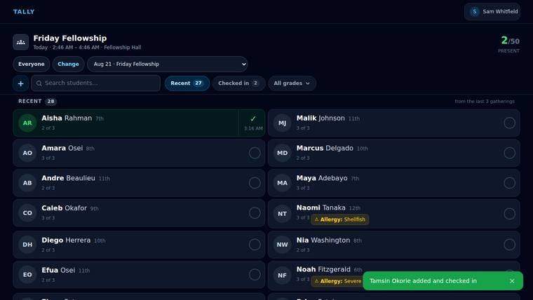

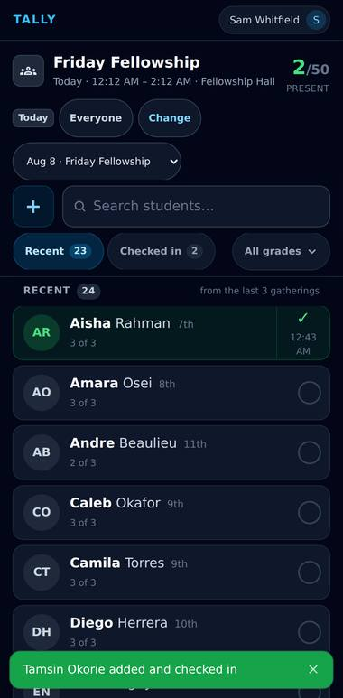

## Journey 5 — pastoral follow-up

### Insights, not a data table

Monday evening. The PRD asks for actionable insight rather than raw numbers, so every row leads somewhere: tap-to-call, tap-to-text, or through to the student. “Missing in action” is students who missed three or more gatherings in a row.

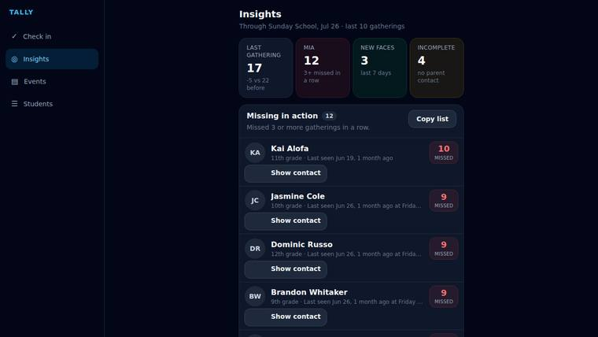

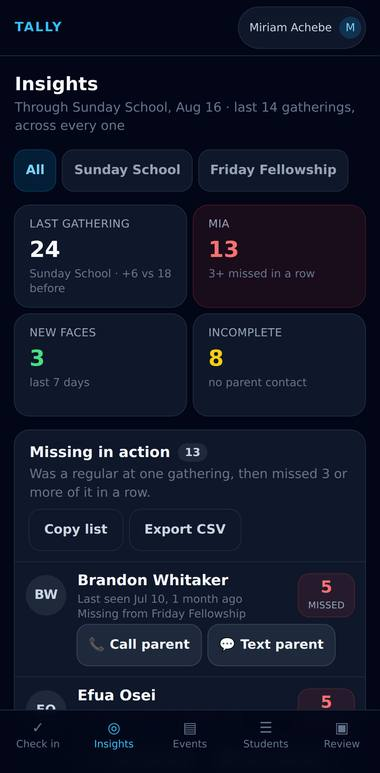

### New faces and incomplete profiles

First-timers from the past week, and the profiles with no way to reach a parent — the visitors quick-added at the door, before anyone in the church office has met them. “Copy list” puts names and numbers on the clipboard for a group chat, which is what actually happens.

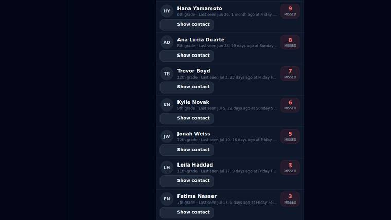

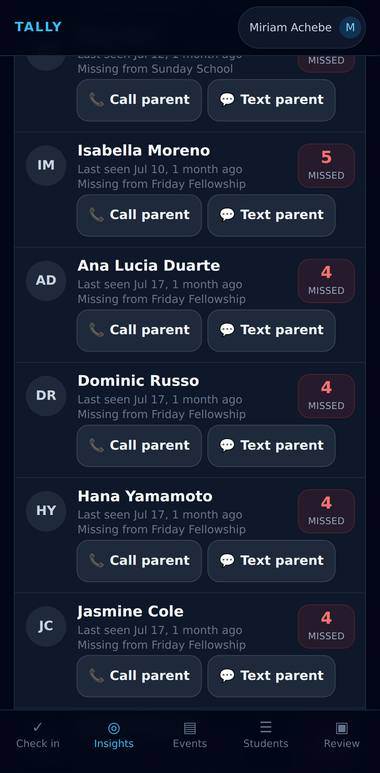

### Attendance trend

Head count per gathering, per series. Eight bars, no gridlines, no chart library — enough to see a slide starting, which is all this needs to do.

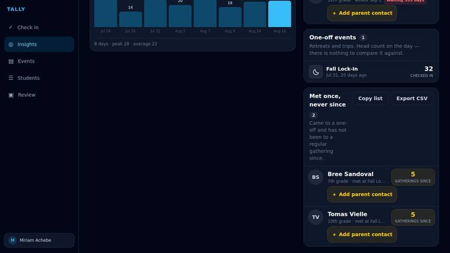

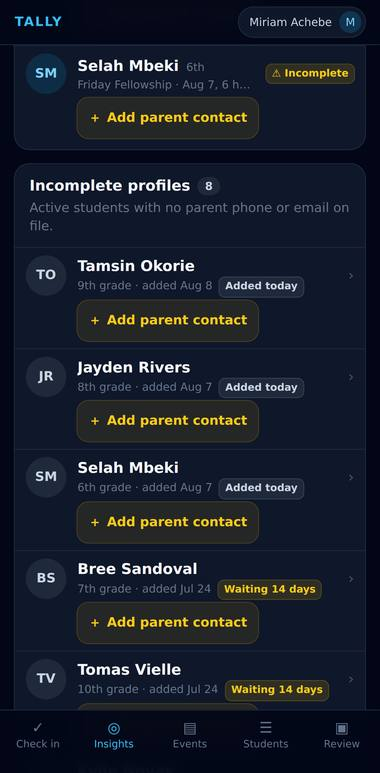

## Journey 4 — the field trip

### The event calendar

Recurring gatherings and one-offs together. “Schedule next Friday Fellowship” is two taps, because somebody has to do it every single week.

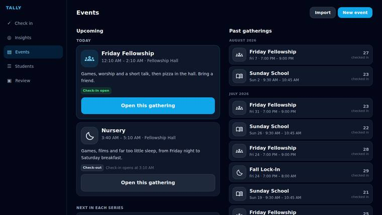


### A gathering with a face

An event carries a description and an icon. The icon is searchable by what the thing is rather than by what Google called it — “campfire” finds it — and the glyphs are bundled with the app rather than fetched from a font CDN, because Tally’s home is a hallway with one bar of signal and a missing icon is a missing icon on exactly the night it mattered. The description is the sentence the check-in screen leads with; the “Notes” field on the right stays what one leader leaves for another.

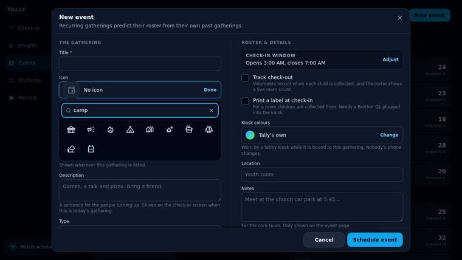

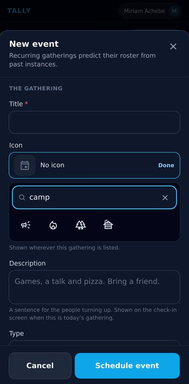

### The RSVP list

A one-off event carries its own guest list, and with “RSVP only” set that list is the check-in roster: going, maybe and declined, with declined students kept on the page but off the roster.

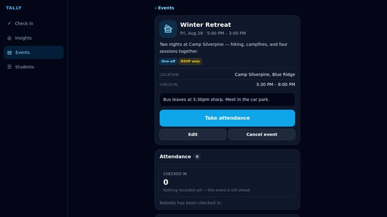

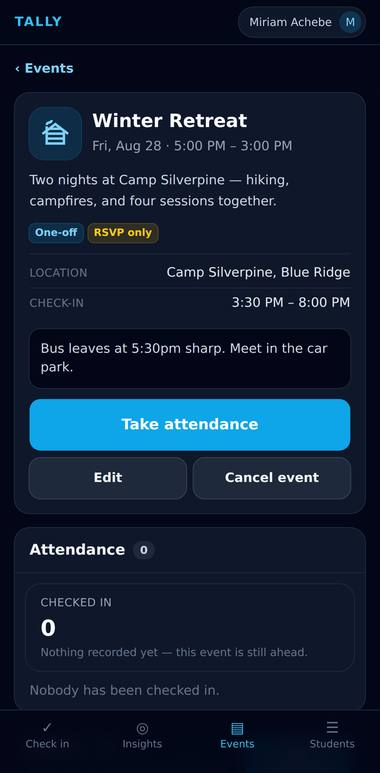

## The roster

### Students

The whole ministry, filterable by grade and status. Each row says whether the record came from Planning Center or was created in Tally, so it is obvious which fields are safe to edit here.

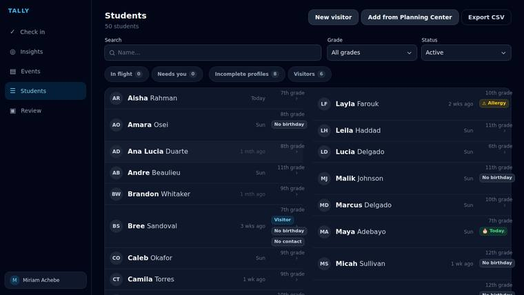

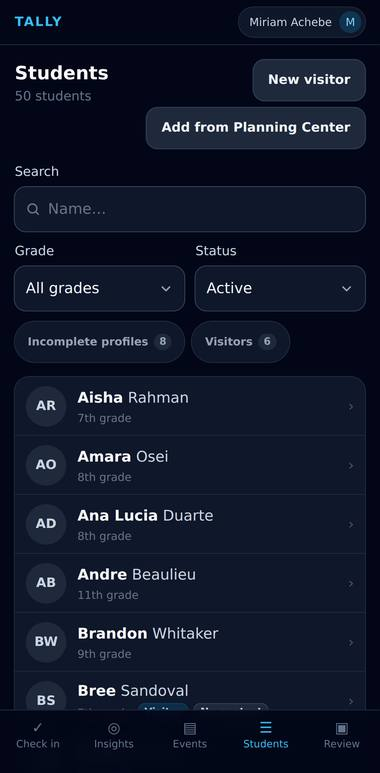

## Settings

### Thresholds, in plain language

The prediction window is the one genuinely dangerous control here — it silently reshapes what every counselor sees at the door — so each number is restated as the behaviour it causes, and the panel beside it counts the students the change would actually move. Nobody should have to reason about “2 of 3” at 6:55pm.

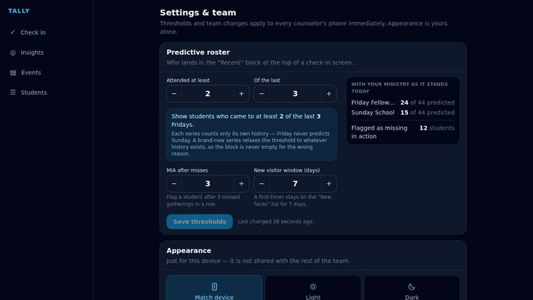

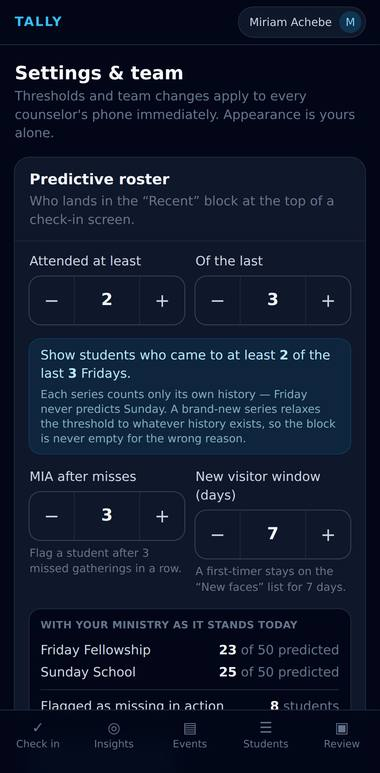

## Planning Center

### Connected, and holding nothing

Tally reads its people from Planning Center and keeps no copy of them. “Refresh” is a live read: browser → callable → Cloud Function → the Planning Center API → back. Between reads a short cache (30 seconds by default, 0 to turn it off) keeps a busy door from becoming a rate limit.

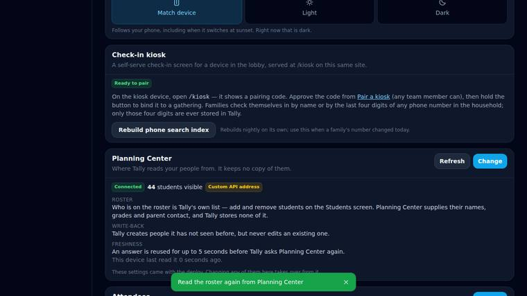

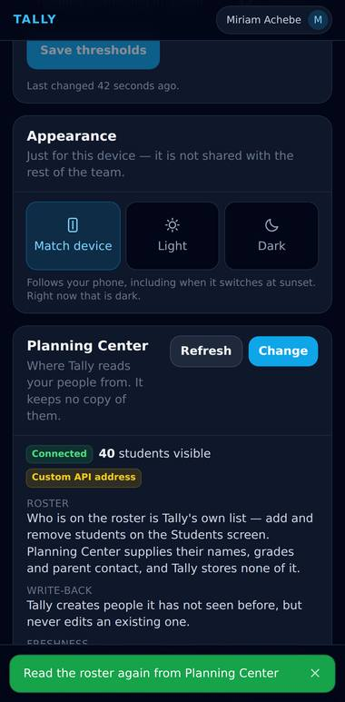

## Settings

### The same screen, in daylight

Dark is the default because Tally’s home is a dim room on a Friday night, but a Sunday morning classroom is not that room. Light, dark, or follow the device — the choice is per-person and local, unlike the thresholds above it, which are ministry-wide the instant they save.

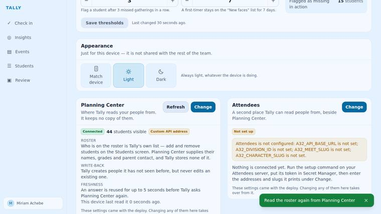

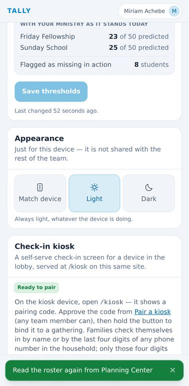

## The roster

### A roster nobody stores

These names are not in Tally’s database. They arrived from Planning Center on this page load, merged with the handful of things Planning Center has no opinion about — a note, when somebody first turned up.

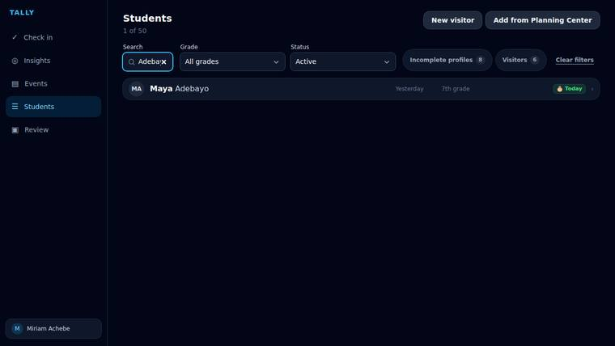

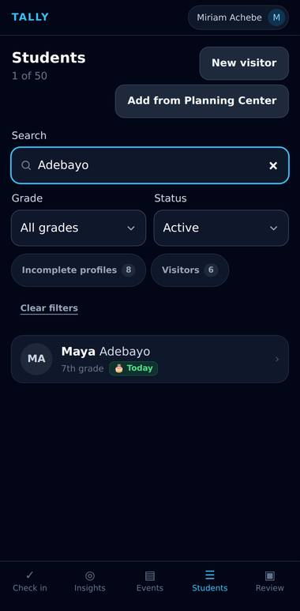

### Who do I call, and only when asked

A parent’s number, fetched for one student at the moment somebody needs it — resolved through her household, since Planning Center keeps contact on the parent’s record rather than the child’s. Firestore holds none of it: no parent name, no phone, no email, no allergies. For a database full of minors, the safest copy is the one that was never made.

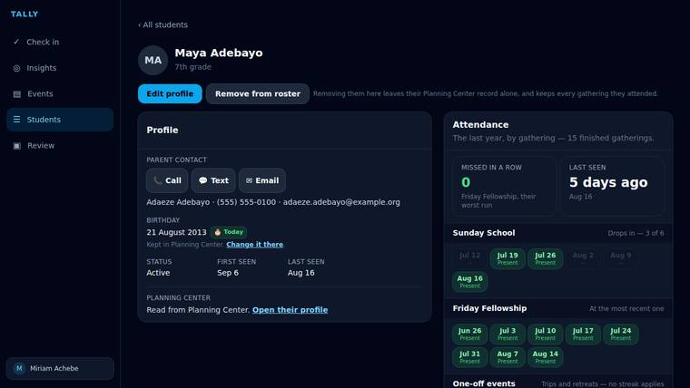

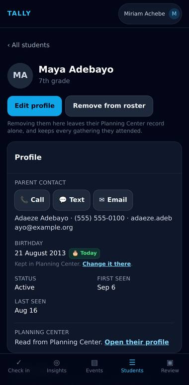

## Journey 6 — the calendar

### Today, in full

The Events tab, read from where the leader is standing. Today is the hero: whatever is on, with its icon and the sentence describing it, and a line that answers the actual question — check-in opens at seven, or it is open now, or it finished and twenty-two people came. A gathering that ended this afternoon stays up here rather than dropping into the history, because the boundary is midnight and somebody looking at it at teatime is still thinking about “today”.


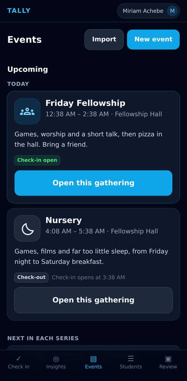

### The week ahead, then everything held

The next seven days as rows — a glance, not a decision — and then whatever the recurrence rules put further out, so a retreat four weeks away is still somewhere. Under all of it the history, newest first, cut into months and paging further back as you scroll. Each row carries the one fact that makes a past gathering recognisable: how many students were checked in.

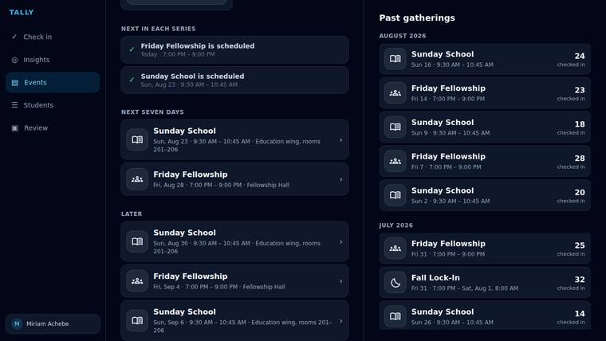

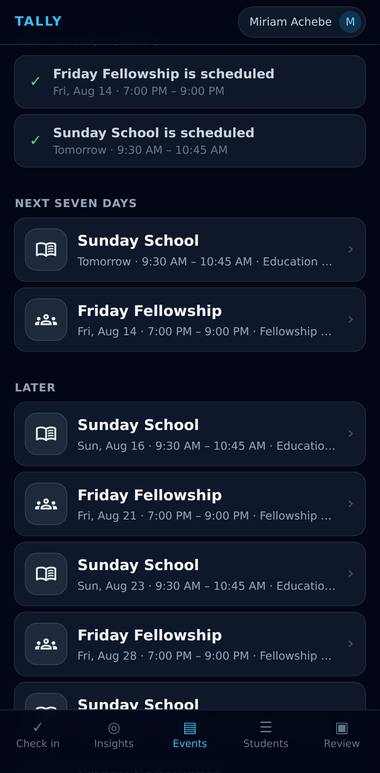

### Scrolling into the ministry’s past

The pages come straight out of Firestore, a dozen gatherings at a time, cursored rather than counted — the calendar the rest of the app holds in memory is a bounded window, and its far edge is exactly the boundary somebody looking for last March is trying to cross. The head counts come from the same cache the predictive roster fills, so scrolling back over a fortnight the roster already read costs nothing.

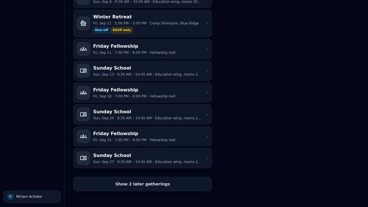

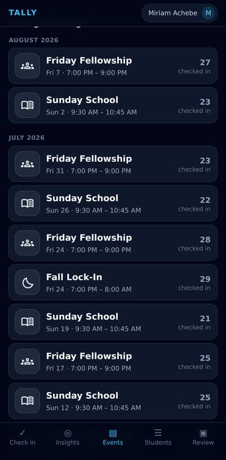

## Journey 8 — a gathering that is not everybody’s

### Who’s on this gathering

A ministry running Friday Fellowship, Sunday School, a Wednesday group and a retreat gives its nursery volunteers a chooser carrying three gatherings they will never stand at. The problem is clutter, not secrecy. The sheet says what it covers before it does anything — the person is standing on one night’s page and this changes every Sunday School, past and future — and it opens from the night itself rather than from a settings screen, because that is where somebody is when they think of it.

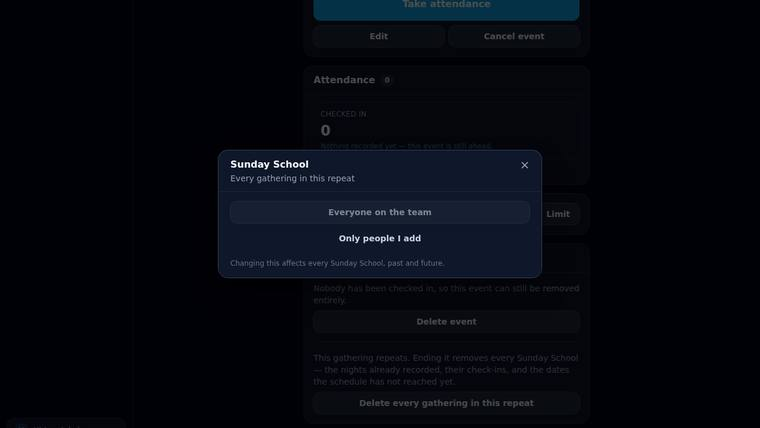

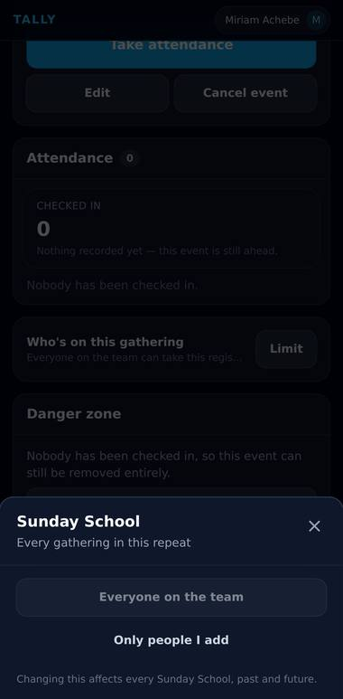

### The list starts from whoever already works it

Closing a gathering pre-fills from the people who have recently taken its register, which is the safety net under the one mistake this feature makes easiest: nothing stops a core member restricting Friday Fellowship — the gathering the whole ministry works — and it is three taps. Starting from the team already working it makes the default outcome of a mis-tap “no change”. The writer cannot leave themselves off, so somebody can always reopen it, and admins pass every gathering regardless.

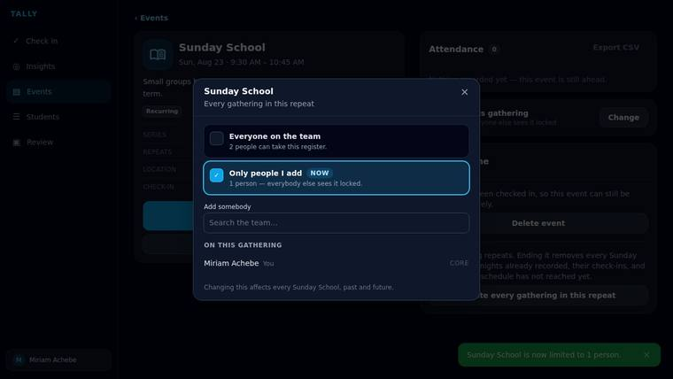

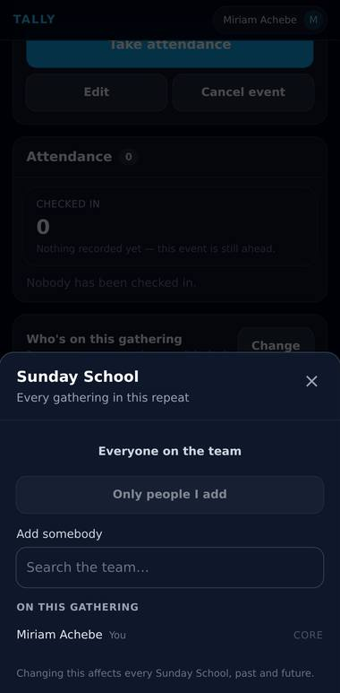

### Demoted, never hidden

Sam’s chooser now leads with the gatherings he actually works. Sunday School has dropped below a divider into a collapsed “Not yours” section, with a lock and the name of somebody who can add him. Hiding it outright would have been easier and is the wrong answer: a volunteer at a door at 6:59pm who opens Tally and sees an empty screen does not conclude “I have not been added to this” — they conclude the app is broken, and then they find something else to file forty check-ins against. When nothing today is theirs the section opens by itself and the heading reads “Nothing you’re on today”, which is the difference between an app that is empty and one that is refusing.

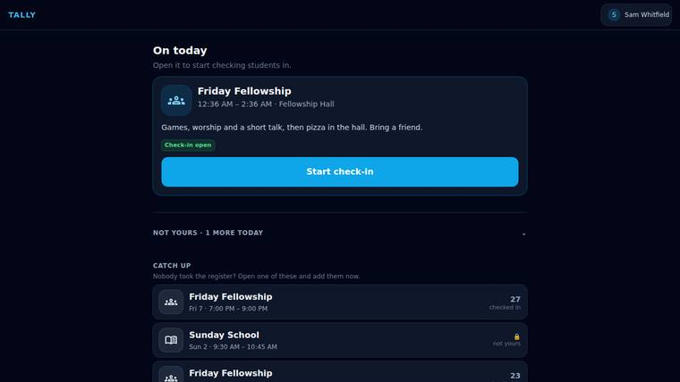

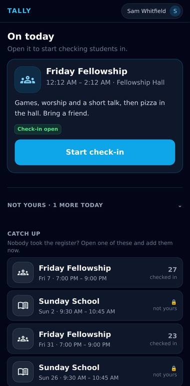

### A lock, and a name to ask

One tap opens it. The row is deliberately less appealing than the card above it and is not a link, because there is nowhere useful to go — the gathering’s own page would refuse him too — so it states the situation instead of promising a screen that cannot help. The name matters more than the lock: anybody already on a gathering can add somebody else to it, so the person standing next to Sam at the door is usually the person who can fix it, and neither of them has to find an admin.

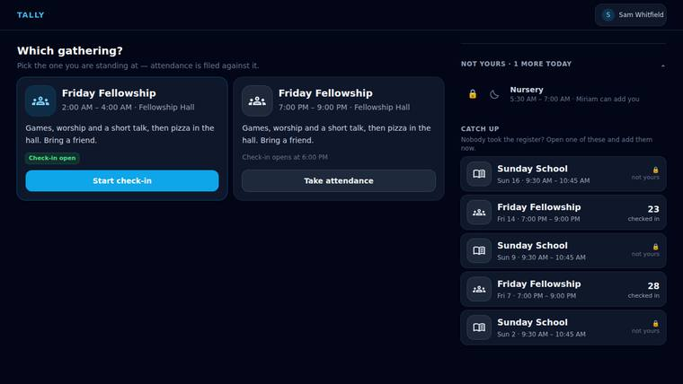

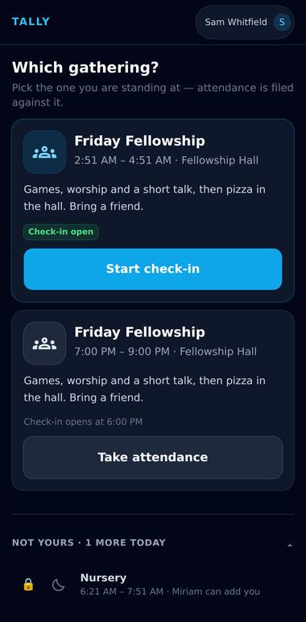
