# Tally — a walkthrough

Every screenshot below is the real application, captured by Playwright against a
live Firebase Emulator Suite and a seeded 45-student ministry. Nothing is a mockup:
the taps are real writes, the roster arrived over HTTP from a Planning Center standing
in for the real one, and the parent contact near the end was fetched while the shutter
was open.

Regenerate with:

```bash
npm run dev:emulated                  # in one terminal
npm run walkthrough                   # capture, then build the page
```

## Getting in

### Sign in

The only screen a signed-out volunteer sees. An email link is the primary path — counselors are handed a phone at the door and never set a password. Google is secondary, and hides itself in browsers that cannot do OAuth.


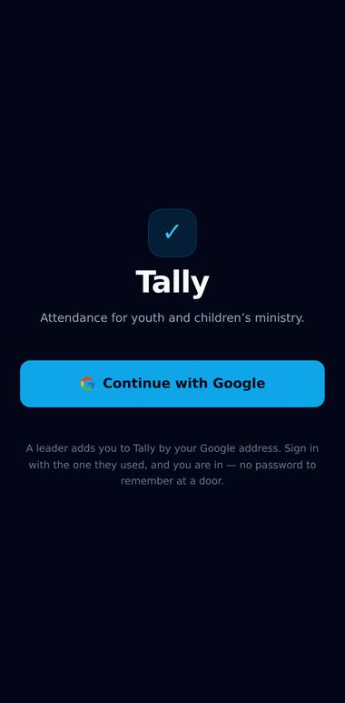

## Journey 1 — high-volume check-in

### The predictive roster

Tally picked tonight’s event from the clock; nobody chose it. The “Recent” block is the predictive roster: students who came to at least 2 of the last 3 Fridays, most consistent first. Friday history predicts Friday — Sunday’s regulars are not in this list.

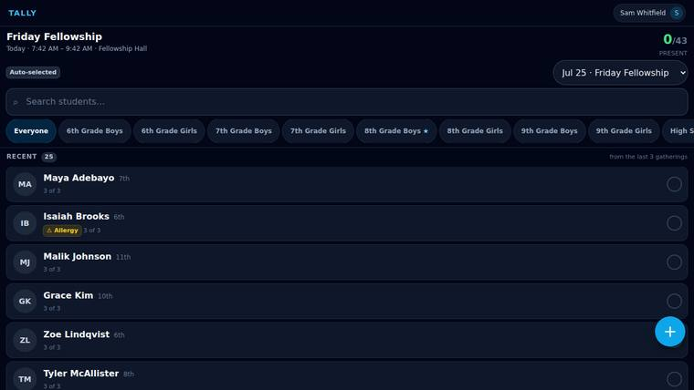

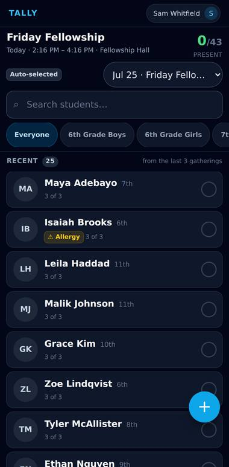

### One tap checks a student in

Maya Adebayo moved to “Checked in” at the bottom, and the header count went up. The row flashed green and buzzed before the write left the device — the authoritative state then arrives back through Firestore, so a second counselor at the same door sees it too.

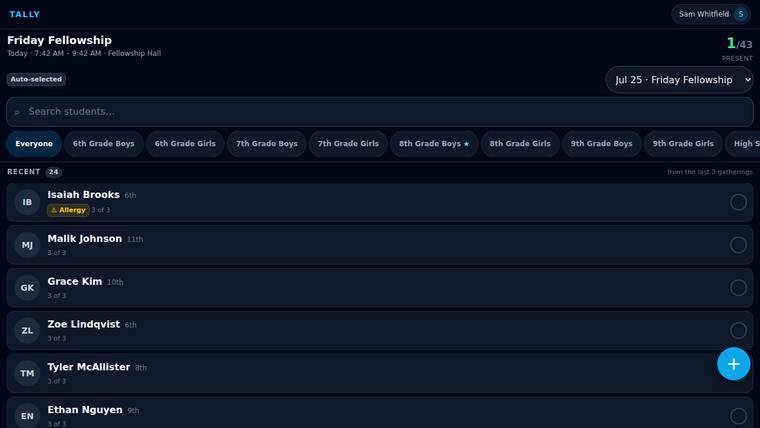

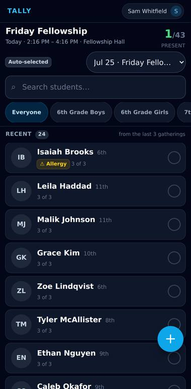

### Search for anyone not in the Recent block

Two letters, filtered instantly against the in-memory roster. The header counts deliberately do not move: they describe the event, not the query, so nobody watches the number drop as they type and thinks they broke something.

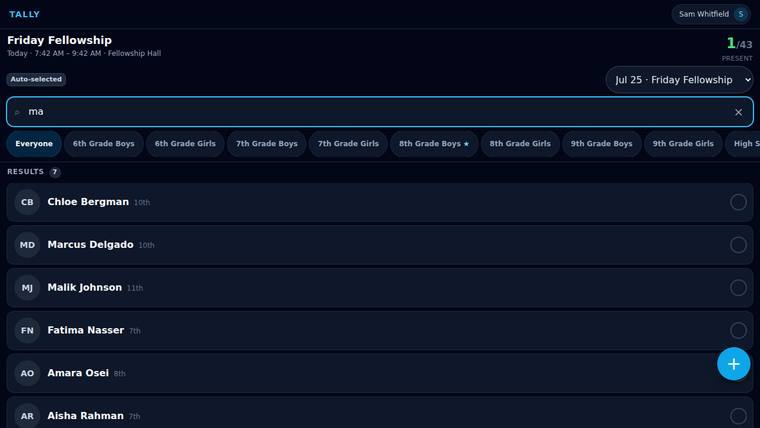

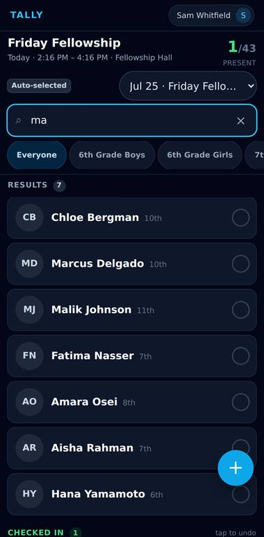

## Journey 3 — bring a friend

### Quick-add a visitor

A first name, a last name, a grade. Nothing else, because anything more forms a queue at the door. “Save & check in” is one atomic write: the student is created and marked present together, then the modal closes.

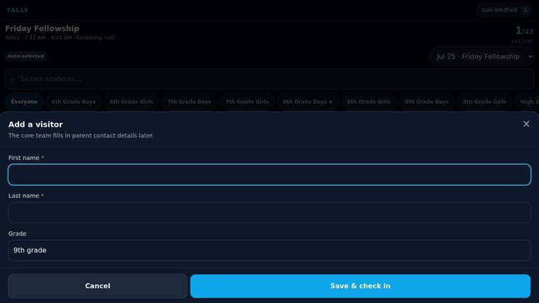


### The visitor is already checked in

Back on the roster with no interruption. The record is Tally’s own and is queued for Planning Center — a Cloud Function pushes it upstream, and until it lands the student carries a “not pushed yet” flag rather than a half-filled profile.

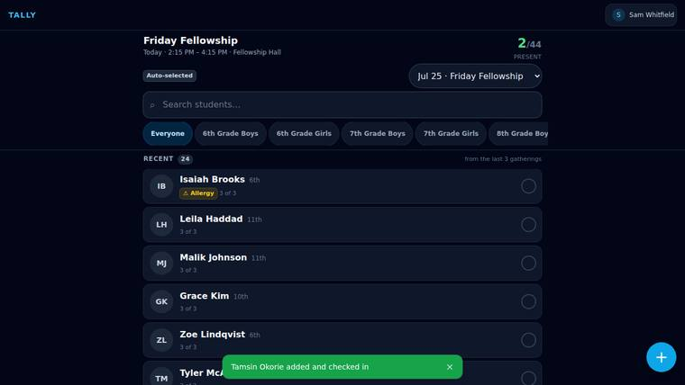

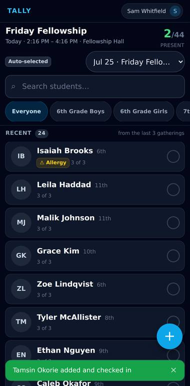

## Journey 5 — pastoral follow-up

### Insights, not a data table

Monday evening. The PRD asks for actionable insight rather than raw numbers, so every row leads somewhere: tap-to-call, tap-to-text, or through to the student. “Missing in action” is students who missed three or more gatherings in a row.


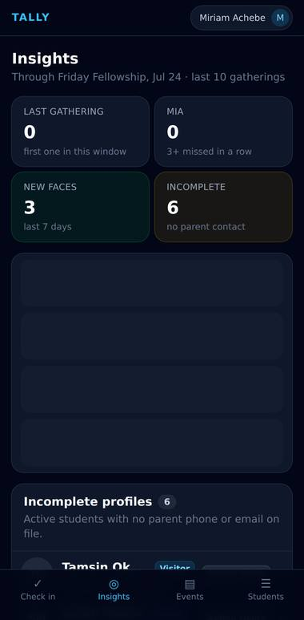

### New faces and incomplete profiles

First-timers from the past week, and the profiles with no way to reach a parent — the visitors quick-added at the door, before anyone in the church office has met them. “Copy list” puts names and numbers on the clipboard for a group chat, which is what actually happens.

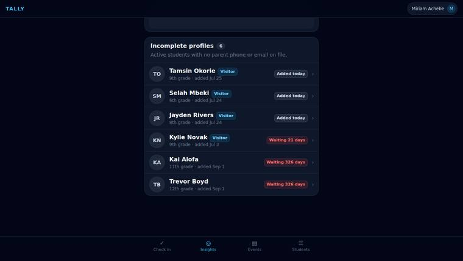

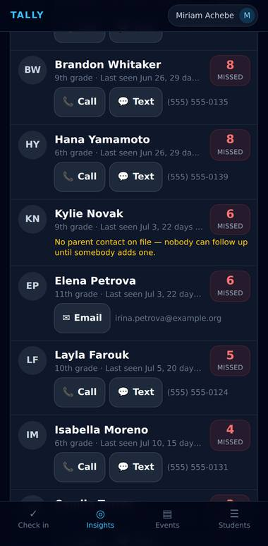

### Attendance trend

Head count per gathering, per series. Eight bars, no gridlines, no chart library — enough to see a slide starting, which is all this needs to do.

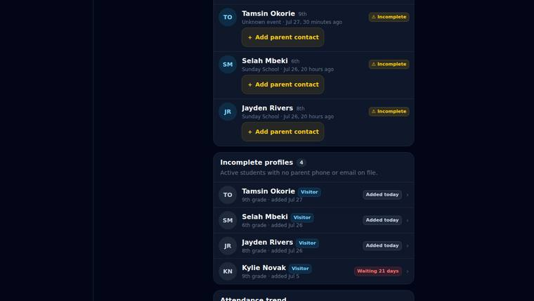

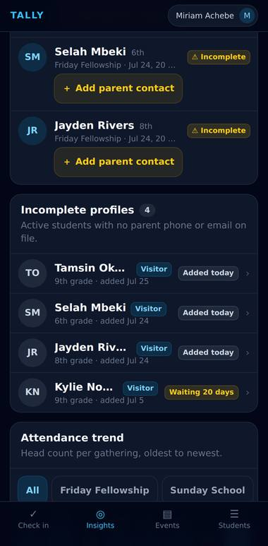

## Journey 4 — the field trip

### The event calendar

Recurring gatherings and one-offs together. “Schedule next Friday Fellowship” is two taps, because somebody has to do it every single week.

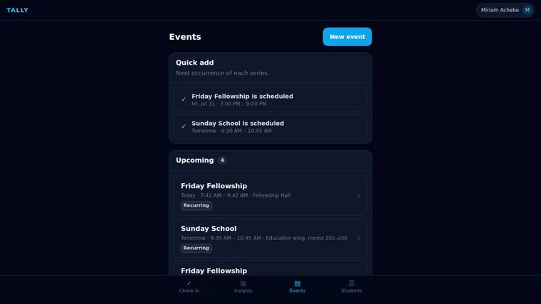

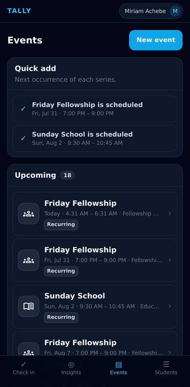

### RSVPs, waivers and payments

A one-off event is about accountability rather than speed. The numbers a leader is actually chasing the week before a retreat — waivers outstanding, payments outstanding — are the prominent ones.

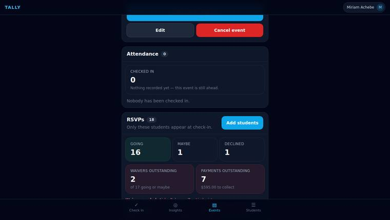

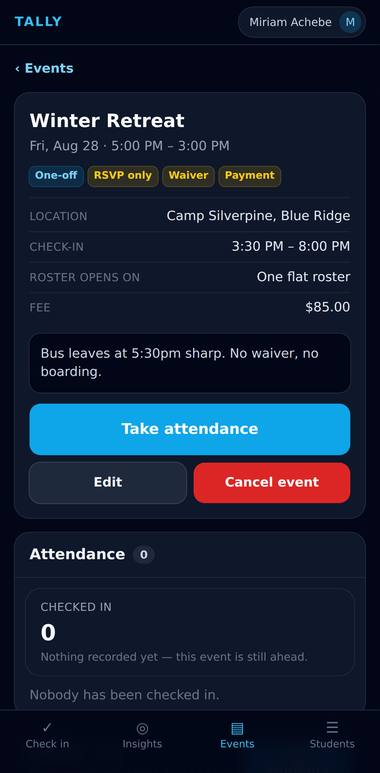

## The roster

### Students

The whole ministry, filterable by grade and status. Each row says whether the record came from Planning Center or was created in Tally, so it is obvious which fields are safe to edit here.

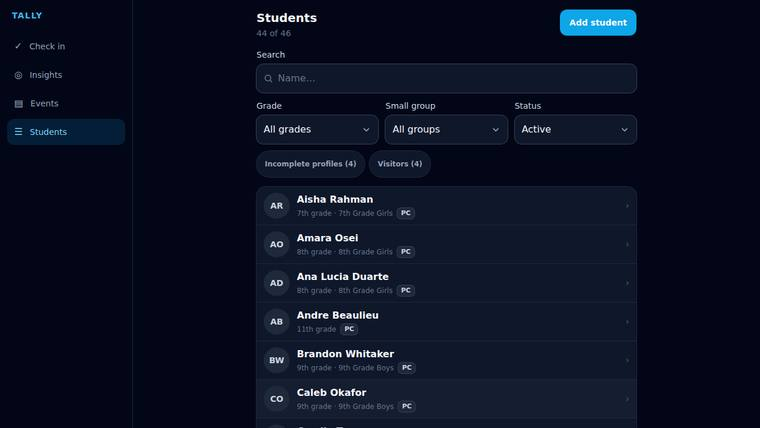

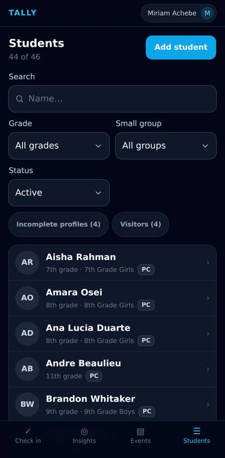

## Settings

### Thresholds, in plain language

The prediction window is the one genuinely dangerous control here — it silently reshapes what every counselor sees at the door — so each number is restated as the behaviour it causes, and the panel beside it counts the students the change would actually move. Nobody should have to reason about “2 of 3” at 6:55pm.

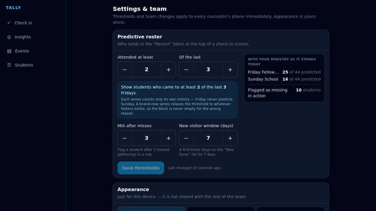

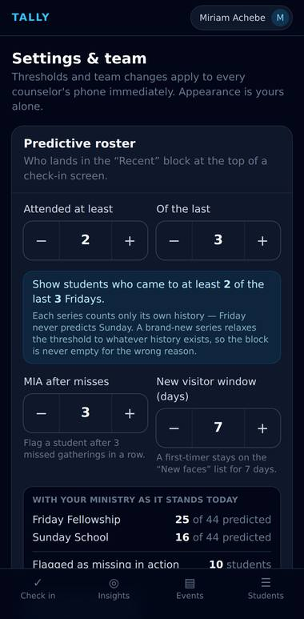

## Planning Center

### Connected, and holding nothing

Tally reads its people from Planning Center and keeps no copy of them. “Refresh” is a live read: browser → callable → Cloud Function → the Planning Center API → back. Between reads a short cache (30 seconds by default, 0 to turn it off) keeps a busy door from becoming a rate limit.

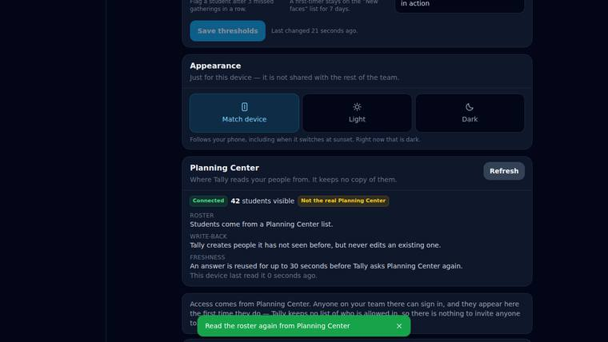

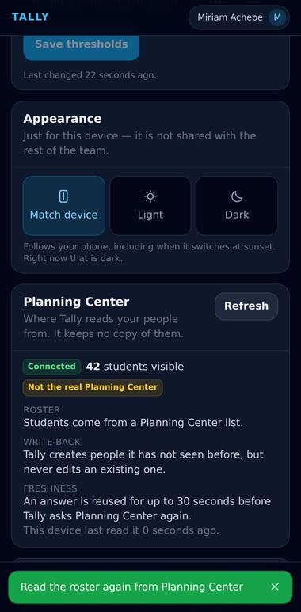

## Settings

### The same screen, in daylight

Dark is the default because Tally’s home is a dim room on a Friday night, but a Sunday morning classroom is not that room. Light, dark, or follow the device — the choice is per-person and local, unlike the thresholds above it, which are ministry-wide the instant they save.

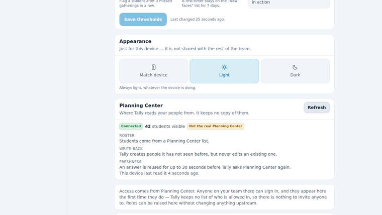

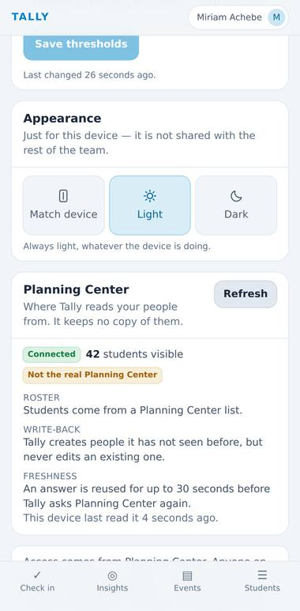

## The roster

### A roster nobody stores

These names are not in Tally’s database. They arrived from Planning Center on this page load, merged with the handful of things Planning Center has no opinion about — a note, when somebody first turned up.

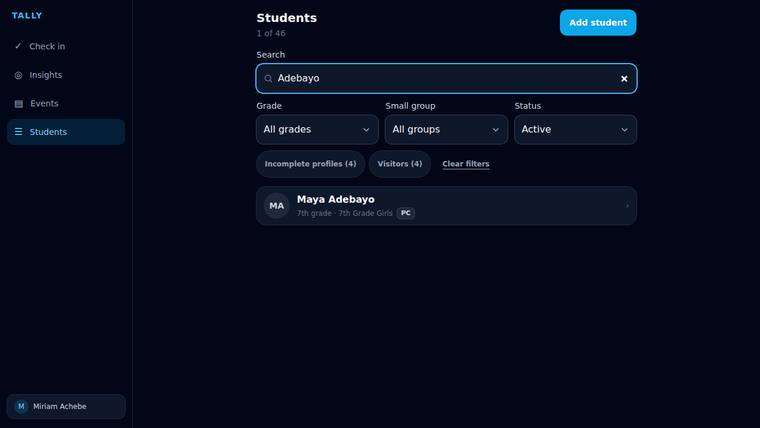

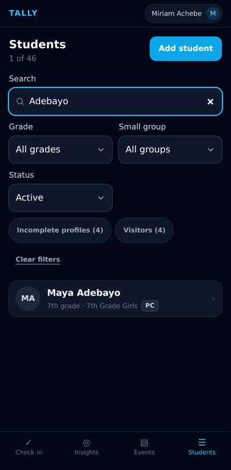

### Who do I call, and only when asked

A parent’s number, fetched for one student at the moment somebody needs it — resolved through her household, since Planning Center keeps contact on the parent’s record rather than the child’s. Firestore holds none of it: no parent name, no phone, no email, no allergies. For a database full of minors, the safest copy is the one that was never made.

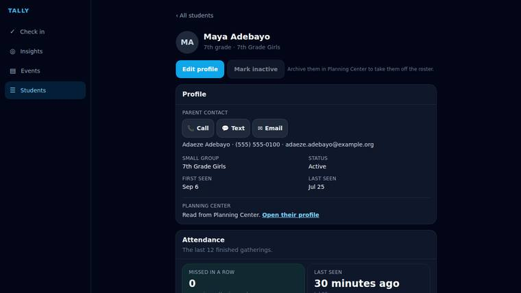

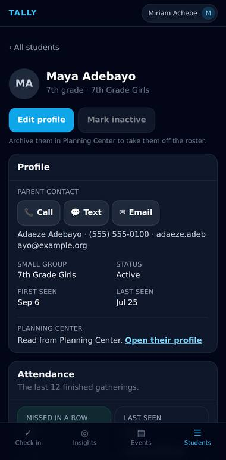
