# The allergy note on a check-in row — a walkthrough

What a roster row does with an allergy note, before and after. The rule and
the measurements behind it are in [layout-stability.md](../../layout-stability.md).

Every frame is the application’s own `RosterList` — the same component `CheckInPage` renders — mounted by Vite with the app’s own stylesheet and its own Tailwind build. Nothing is stubbed: the list takes its roster, its open row and its allergy notes as props, so the fixture in `uxr/allergy-live/` is an argument rather than a replaced module, and the two transitions on this page are the two prop changes `CheckInPage` makes — `useAllergyNotes` answering, and a row gaining a check-in. The heights quoted in the captions were measured off the list in the frame above them. The students are the seeded ministry’s and the notes were written for these frames; no real medical note appears here.

Regenerate with:

```bash
npx tsx uxr/allergy-live/shoot.ts   # capture
npx tsx scripts/build-allergy-walkthrough.ts   # build the page
```

## What it did before

### The roster, still waiting on Planning Center

A Friday queue as it stands a second after the screen paints. The names and the flags come from the roster, which the device already had; the notes behind the flags do not — `useAllergyNotes` asks Planning Center for the flagged rows only, and on a church’s wifi that answer is still in the air. Four amber badges, every row the same height, and a counselor already scrolling. *Measured here: the list is 644px tall on a phone and 355px on a laptop.*

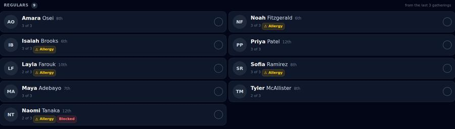

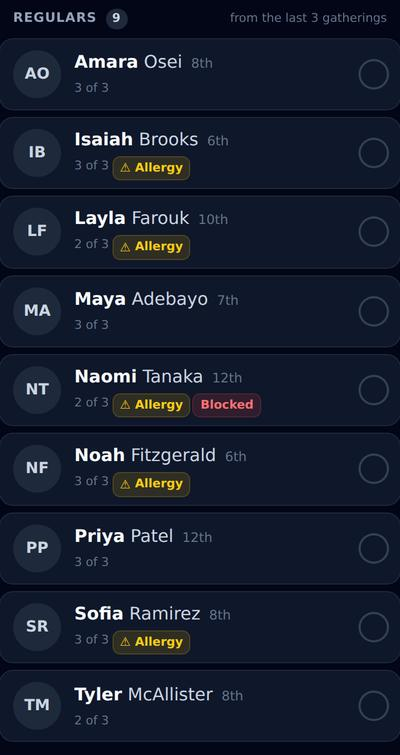

### The answer lands, and the list is a different length

Nobody touched anything. The notes arrived, each badge grew to as many lines as its note needed — three, for **Noah Fitzgerald** — and every row underneath moved down the screen. This is the whole defect: the one thing on the row that is sized by the network rather than by the roster was also the one thing allowed to change the row’s height, so a list somebody had started reading rewrote itself under their thumb. *Measured here: the list is 874px tall on a phone and 425px on a laptop.*

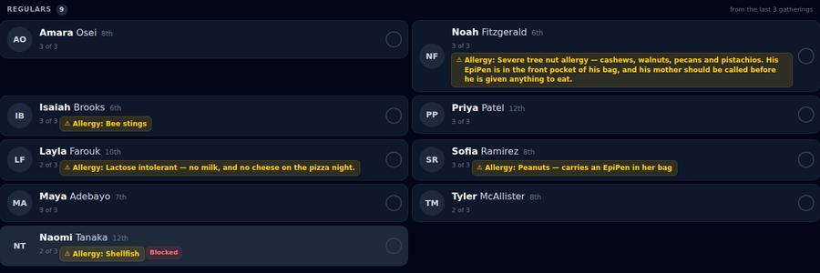

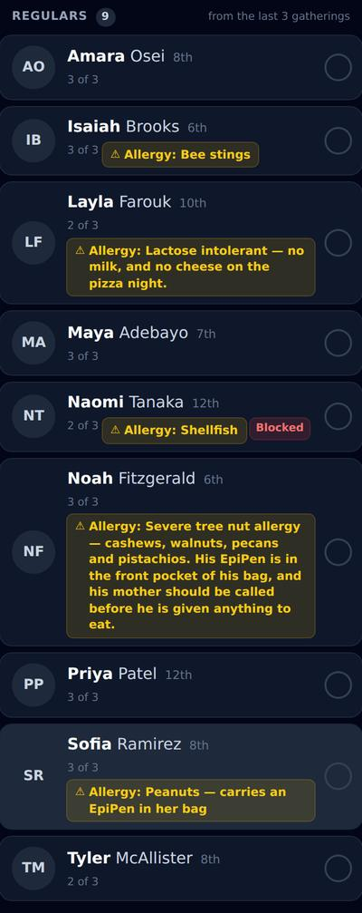

## The list at the start of a night

### The flag, and only the flag

The same moment, after the change: the roster is in and Planning Center has not answered. Identical to the frame above, and deliberately so — the badge before the answer was never the problem. *Measured here: the list is 644px tall on a phone and 355px on a laptop.*


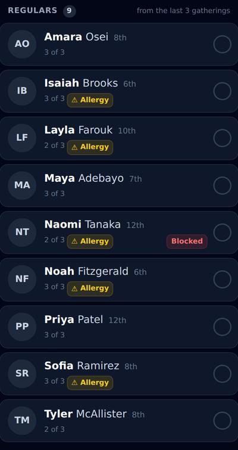

### The answer lands, and nothing moves

The notes are in. Nothing on this screen is different, because a student who has not arrived is a student whose row says `⚠ Allergy` and stops there. The long list is the one that gets scrolled and searched, and it is now one height per row whatever the network is holding — which is the property the check-in screen is supposed to have and did not. *Measured here: the list is 644px tall on a phone and 355px on a laptop.*

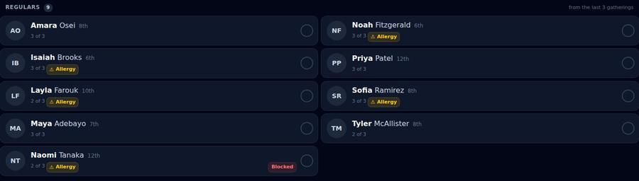


## A student arrives

### The note lands on the row that just turned green

**Noah Fitzgerald** is here. One tap checked him in, and the same tap spelled his allergy out on the row — in front of the person standing at the door, without leaving the queue to go and look it up. The note is held to one line and ellipsised, so the row is exactly the height it was a moment ago: the tap changed the badge and nothing else, and the rows below him did not move. *Measured here: the list is 644px tall on a phone and 355px on a laptop.*

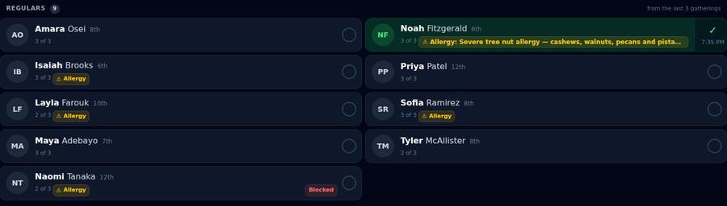

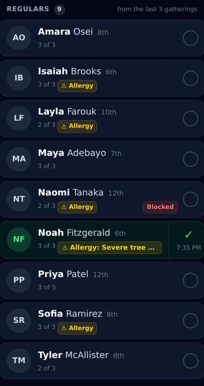

### The crowded row, and what it costs

**Naomi Tanaka** carries a red flag after her amber one, and this is the worst the rule looks. The lane the note sits in is whatever the chips before it left — `flex-1 basis-0`, so it never decides where the badge line breaks — and on a phone, on a checked-in row, after a hint and a second badge, that is about 110px. `Shellfish` becomes `Sh…`. The badge says so rather than pretending, the whole word is one tap away, and `Blocked` is where it was in the frame above and will be in the frame below: what a crowded row costs is characters, never position. Giving the note a line of its own here would buy eight more of them on every checked-in row with an allergy, which is a line of the queue for a word. *Measured here: the list is 644px tall on a phone and 355px on a laptop.*

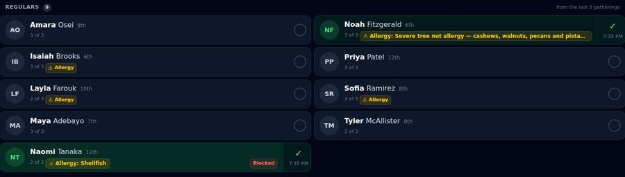

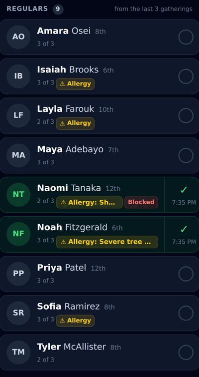

## Reading the whole note

### The row opens, and the note is spelled out

A second tap on **Noah**’s row opens the corrections strip — Undo, Profile, Move check-in — and the note comes with it, wrapped to as many lines as it takes. A row that is already giving up its height for three buttons can afford the rest of a sentence, and only one row on the screen is ever open. Nothing was hidden while it was clipped, either: the ellipsis says there is more, the row’s own label reads the whole note out to a screen reader from the first frame onwards, and a pointer gets it from the badge’s tooltip. *Measured here: the list is 845px tall on a phone and 474px on a laptop.*

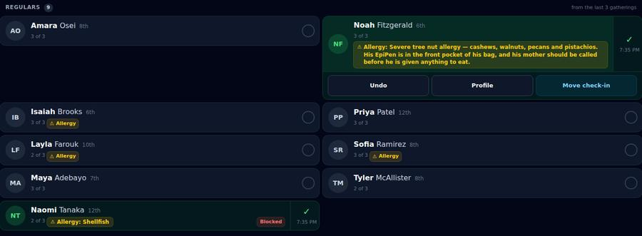

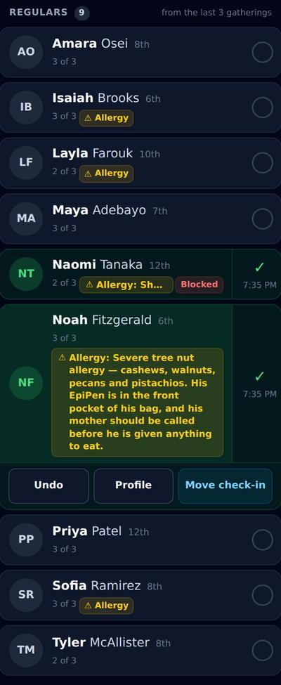
