# Correcting a family — a walkthrough

One registration, wrong in every way a real one is wrong, walked through the
five journeys in [review-corrections.md](../../review-corrections.md).

Every frame is the application’s own Review screen — the same component `src/App.tsx` routes to, rendered by Vite with the app’s own stylesheet. What is faked is Firestore and the three callables behind it (`uxr/review-live/`), and the fakes follow the server’s rules, because those consequences are the subject: a rename really does re-scan the roster here, and the collision it reveals is the collision the real one reveals.

Regenerate with:

```bash
npx tsx uxr/review-live/shoot.ts   # capture
npx tsx scripts/build-corrections-walkthrough.ts   # build the page
```

## The card that had no proportionate answer

### A form a stranger typed

A family who registered themselves at the lobby kiosk on Friday, waiting on Tuesday. Everything here was typed on a glass keyboard with a queue behind it, and everything here is wrong in a way the screen cannot see: the child’s name is misspelled, the grade is a guess, the adult is called MOM, and two digits of the phone number are transposed. There is no duplicate warning and the blue button is live — because the roster scan at the door matched on the name as typed, and “Micheal” collides with nobody. Until now the only two answers were to approve the misspelling permanently into a database with no delete, or to press “Not ours” and lose a real family along with the only phone number Tally holds for them.

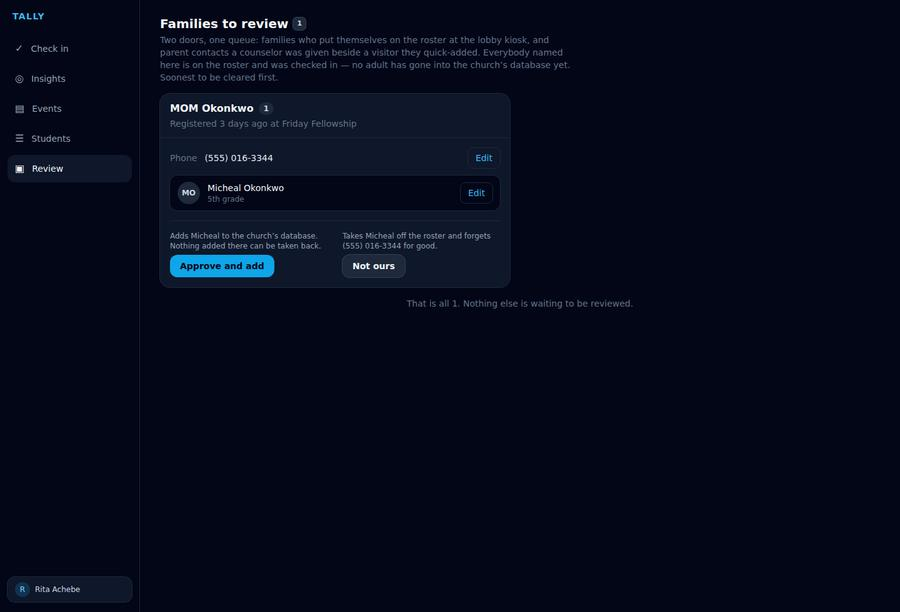

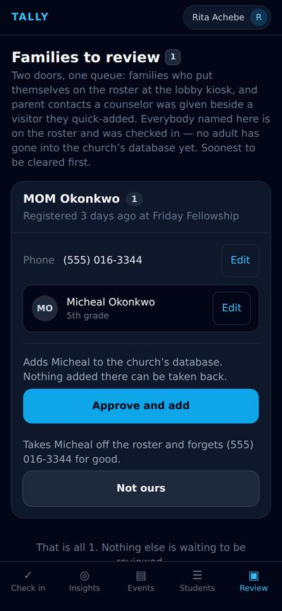

## Journey A — the misspelling that would have become permanent

### The editor takes the row, not a dialog

One person at a time, in place. A dialog would cover the duplicate candidates — which are exactly what this edit may change — and on a phone it would cover the card entirely. Notice what has gone grey: approve, “Not ours”, and every other Edit button on the card. A card mid-correction is a card whose facts are in flux, and the approve caption names children by names somebody is in the middle of changing. Each control carries its sentence above it, in the card’s own grammar — and the one above Save changes as soon as the name does, which is the next frame but one.

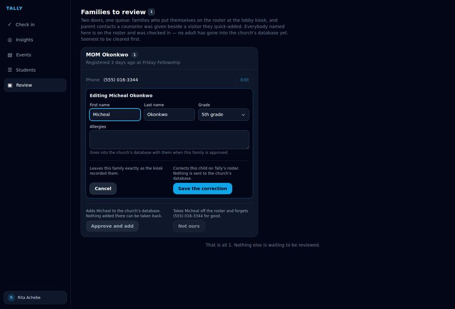

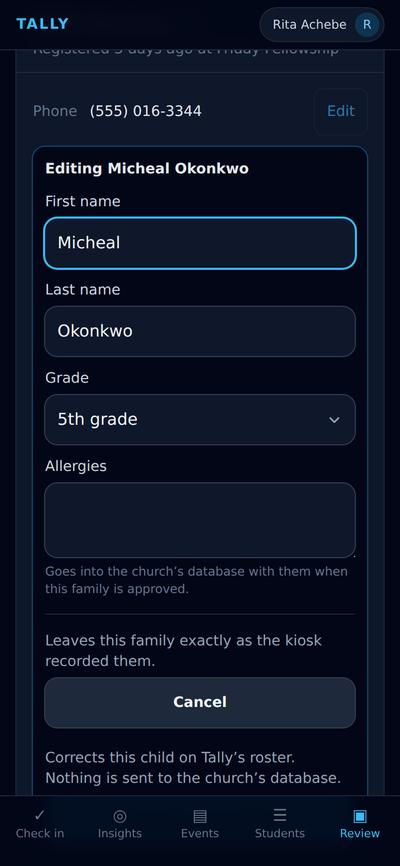

### Refused in the door’s own words

No round trip. The form and the Cloud Function share one module of field rules — `src/lib/registrationFields.ts`, copied verbatim into the functions package — so a digit typed into a name is refused under the box that holds it, immediately, in the sentence the kiosk itself uses. “Room 3” in a name field is somebody misreading the question, and silently keeping “Room” would put that on a sticker.

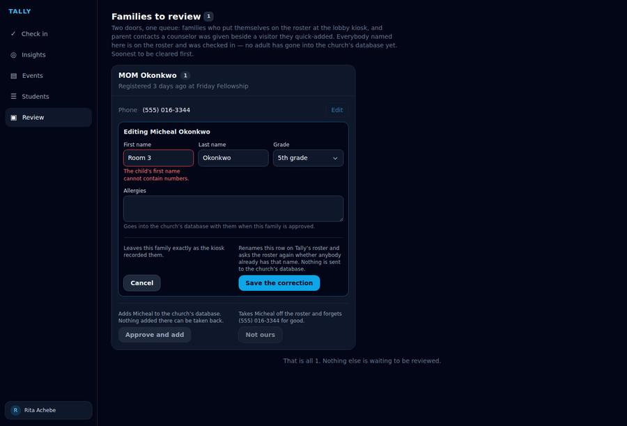

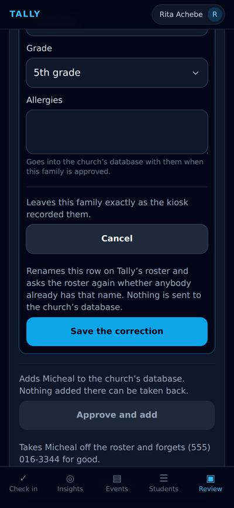

### The fix reveals the duplicate the door missed

This is the whole reason a correction is a server call and not a field write. The roster scan re-runs in the same breath, and the corrected spelling collides with a child the church already has — so the card comes back with a “Possible duplicate” badge, the approve button held, and the candidate offered with the two facts that separate two children of one name: whether the church already finds that row under this family’s own four digits, and whether the grade matches. The toast says so out loud, because a button going grey under a reviewer’s hand otherwise reads as the app breaking. A correction that only fixed the spelling would have handed them a clean-looking card over a duplicate the fix itself created.

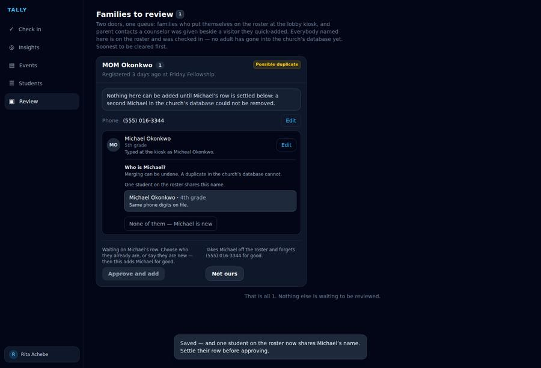

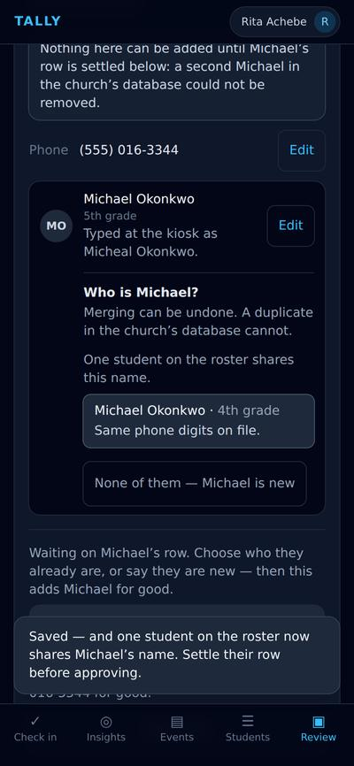

## Journey B — the parent who is not a person yet

### The one field that becomes a contact card

Under the corrected name, a rung quieter, the card has stopped claiming to be the form: “Typed at the kiosk as Micheal Okonkwo.” A colleague opening this on Thursday can see at a glance why the roster’s Michael was not offered at the door. Now the adult. Approving this would create a person in Planning Center called MOM, attached to a household, for ever — and it is the one field on this screen somebody will later try to phone. The kiosk asked “who is bringing them?” and a parent in a hurry answered the question they thought was being asked.

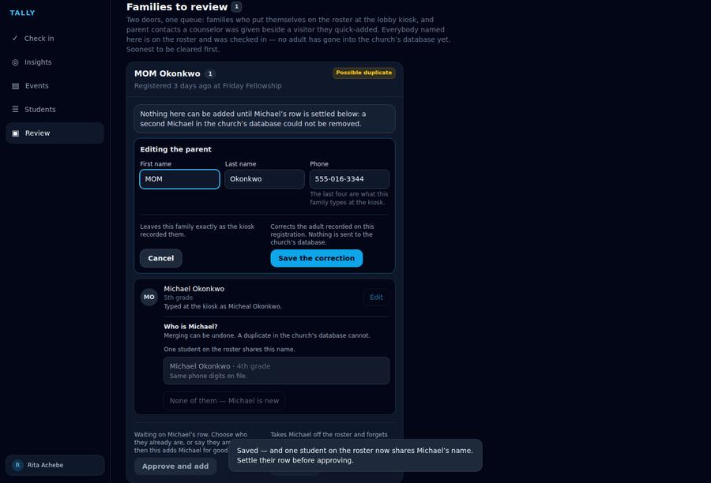

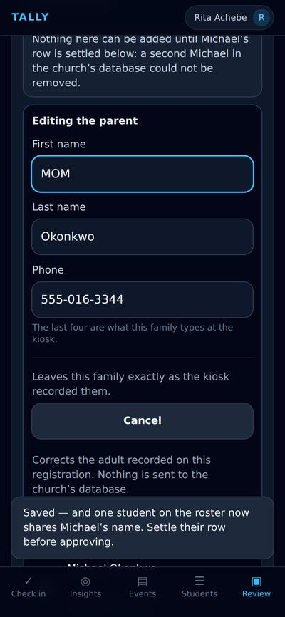

## Journey C — the wrong digit

### The number is an index, not a field

The most expensive typo on the screen and the least visible. Those four digits are the key this family types at the lobby kiosk next week to find their own children — so a wrong number means the family is unfindable at the door on Friday, and somebody else’s real number finds these children by name, which is the exact failure the kiosk’s search screen is built around. The sentence above Save names both sets of digits before the press, because “your old four stop working” is something a reviewer may have to say to the family on the phone.

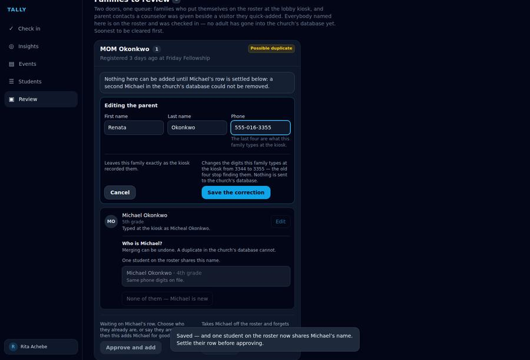

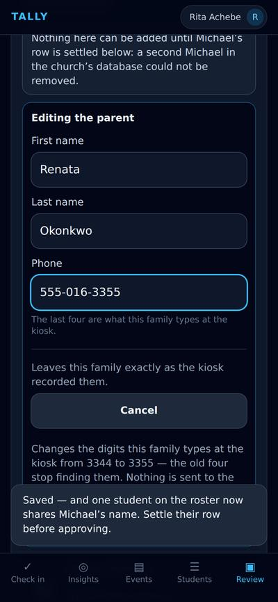

### Kept: the name they typed. Never kept: the number

The card reads Renata now, and under the phone: “Typed at the kiosk as MOM Okonkwo. The number was corrected here.” The original name is held on the registration record from the first correction onwards — once, never overwritten, because the point is what the family wrote and not what the last reviewer saw. The original number is deliberately not held at all: a mistyped one belongs to a stranger, and keeping a stranger’s number for thirty days to caption a correction is exactly the retention this record’s TTL exists to prevent. That one was corrected is all a second reviewer needs.

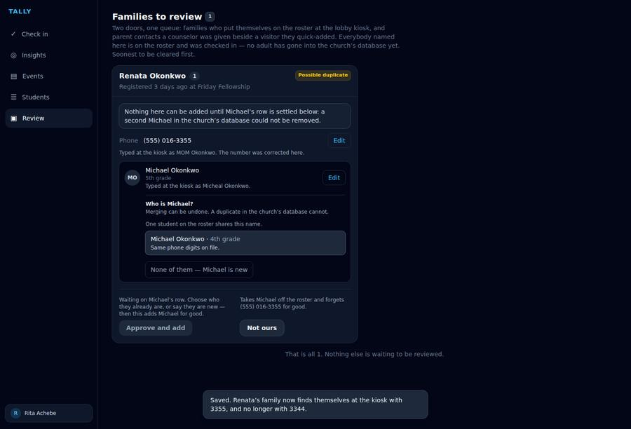

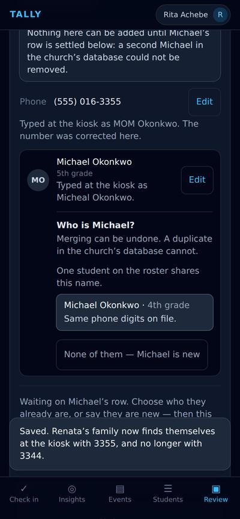

## Journeys D and E — the grade, and the allergy note

### Two fields that are not cosmetic

The grade is a filter on the check-in roster and one of the two discriminators on the merge picker above — a candidate whose grade matches is drawn emphasised, because a name alone often cannot tell two children apart, so a wrong grade makes the duplicate comparison worse exactly where somebody is leaning on it. “No grade” is the first option and an answer rather than a blank: a child too young for one has none. The allergy note is pushed into the church’s medical notes on approval and is what a leader reads afterwards — the only field on this screen with a safety consequence, and the last chance to fix it.

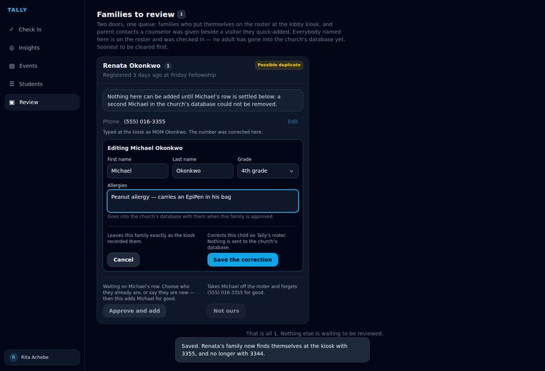

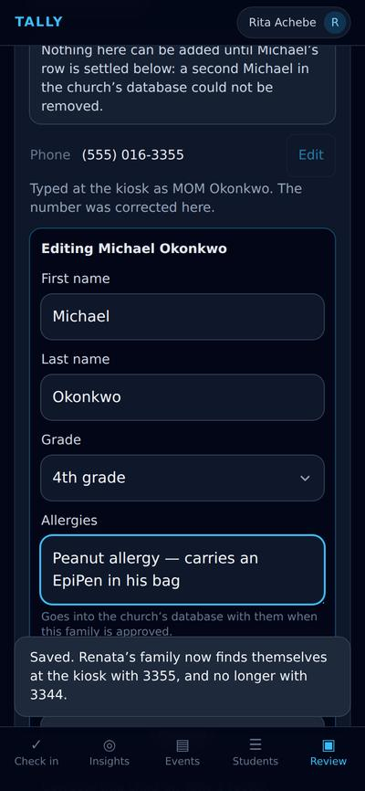

## The end of the job

### A corrected family, and a decision that can now be made

Saved, and the grade now matches the roster row it is being compared against — which is the comparison a reviewer settles next. Every fact on the card is one somebody has checked; the collision the correction surfaced is still held, deliberately, because it is a real question and the approve button stays shut until it is answered. Nothing corrected here has touched the church’s database: that is what makes it safe, and it is why a child who has already been pushed gets no Edit button at all but a pointer to their own page, which knows how to carry a rename upstream.

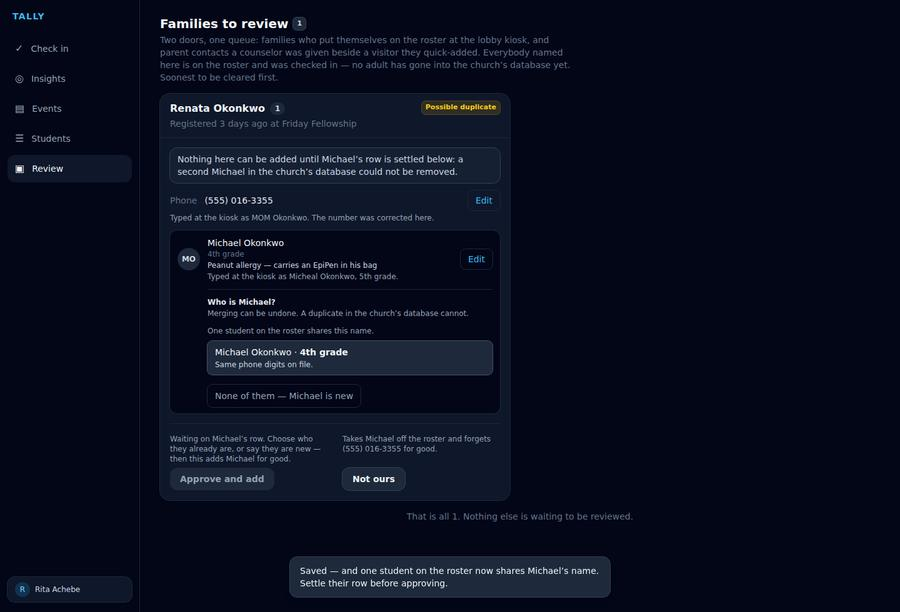

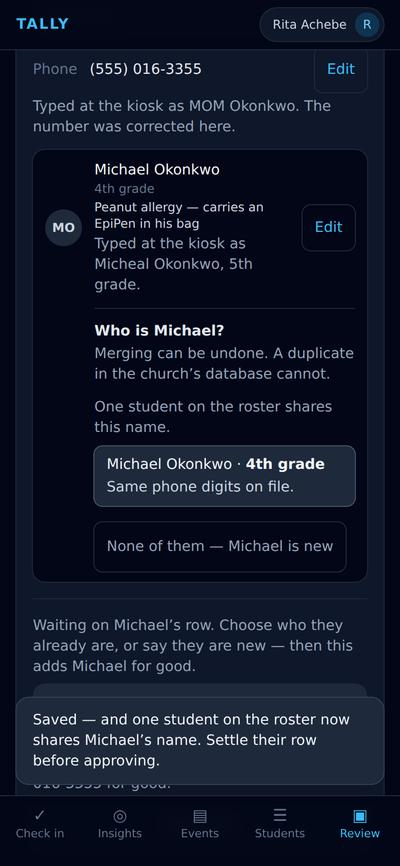
