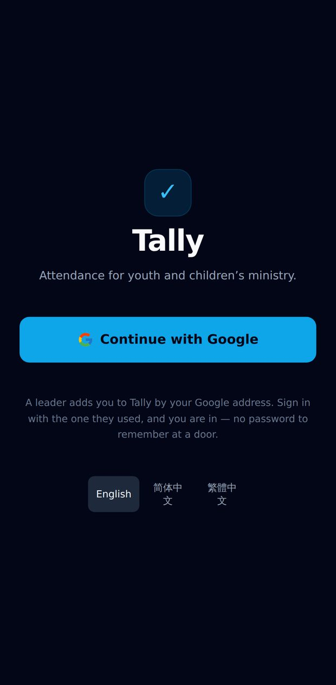
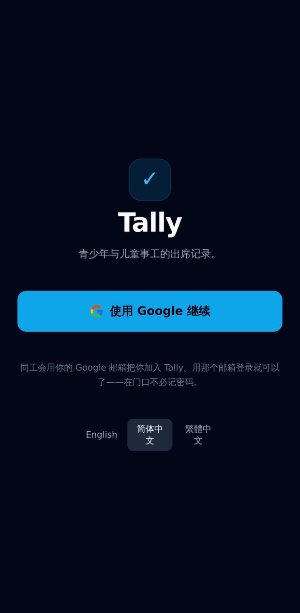
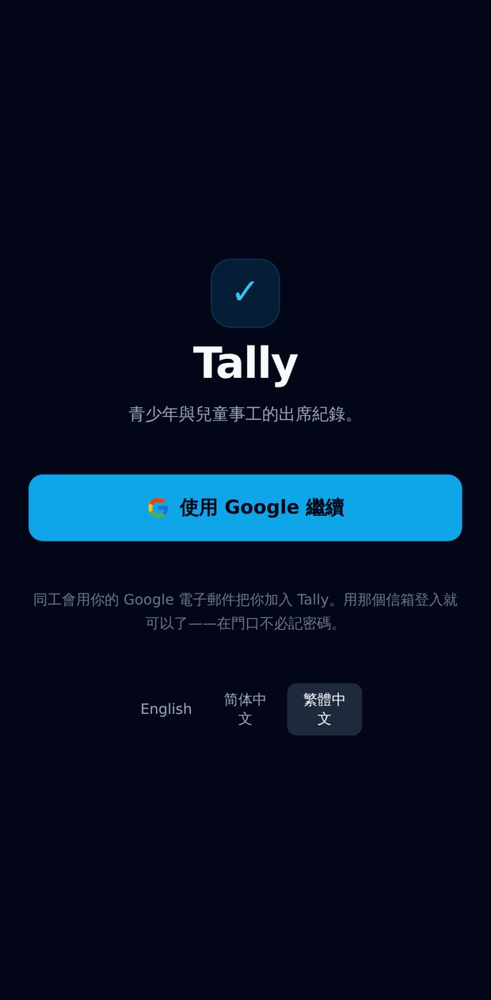
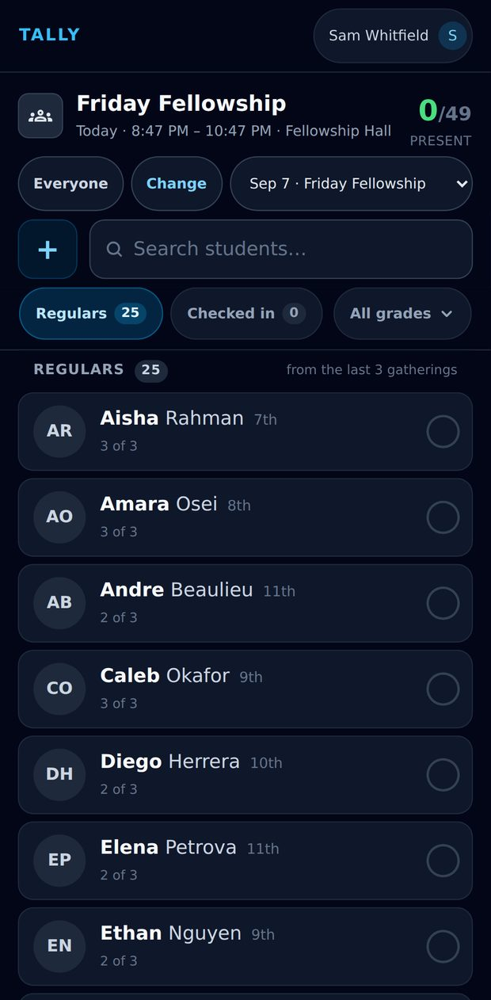
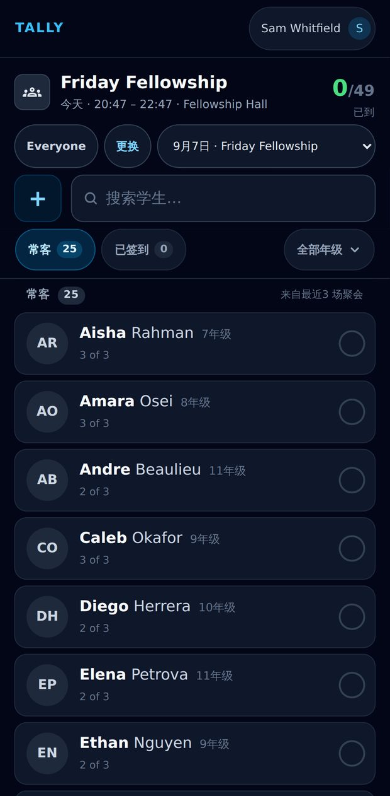
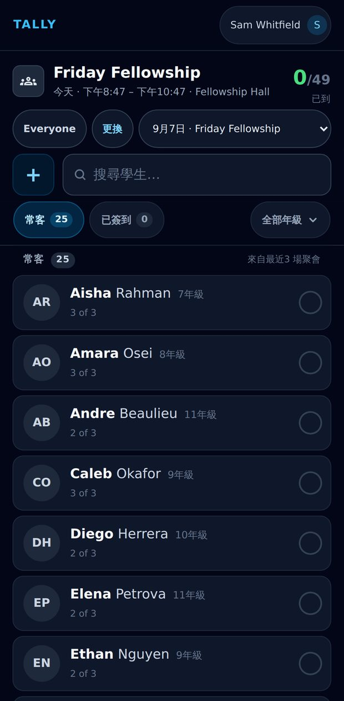
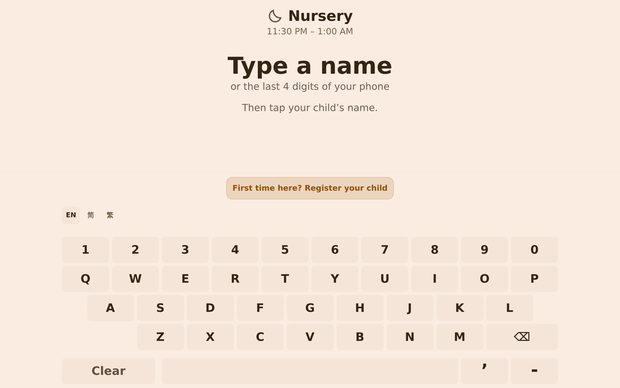
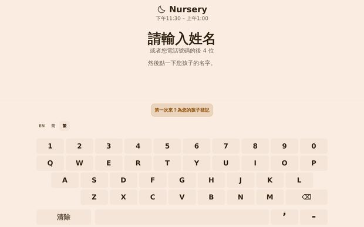
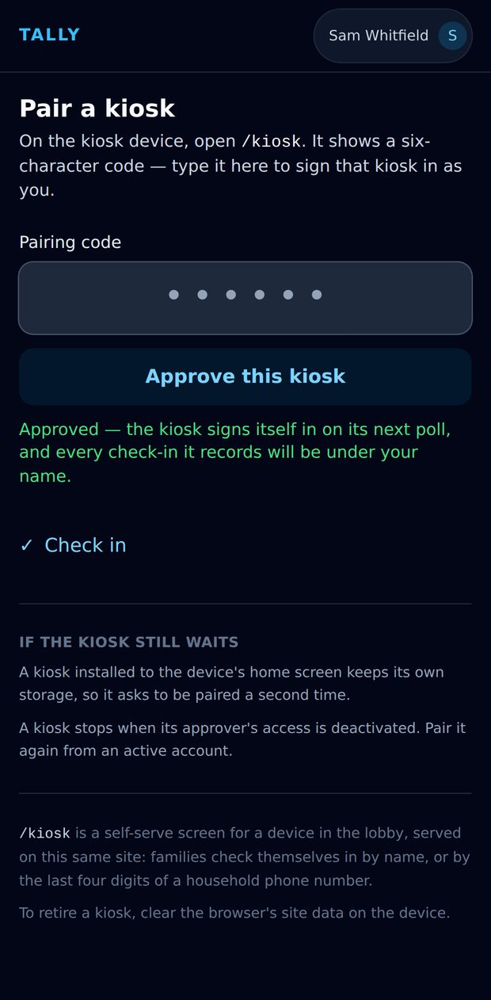
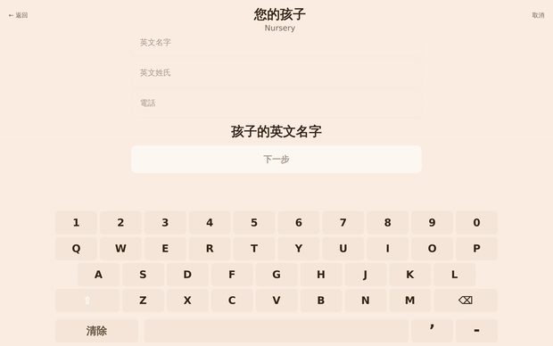

# Tally, in three languages

Every frame below is the real application, captured by Playwright against a live
Firebase Emulator Suite and a seeded ministry. Nothing is a mockup and nothing is
a paste: each language was chosen through the control a person would press, and
the Chinese is what the catalogues actually contain.

The frames are grouped rather than listed, because the claim is a comparison. An
i18n pass that has translated the shell and left the content in English looks
perfect one screenshot at a time; it only fails in a row.

**No bilingual reviewer has read this Chinese.** Every key in
`messages/zh-Hans.json` and `messages/zh-Hant.json` is marked `machine`,
never `reviewed` — the review gate is real, and it is still open.

Regenerate with:

```bash
npm run walkthrough:i18n
```


## The way in

### Sign in

The switcher is on the sign-in screen because this is the one screen a reader cannot get past if they cannot read it. Everywhere else the control lives behind the account menu, which is behind a sign-in — fine for a counselor who is already in, useless to the person who is not. The languages name themselves in their own script and are never translated: a control for changing language that renamed its own options would be unusable by exactly the person reaching for it.






## All the way down

### The check-in roster

The screen a counselor works a queue on, and the one that decides whether this was a translation or a veneer. The usual failure of a half-finished i18n pass is a translated shell over English content — a Chinese nav bar above English filter chips, English counts, an English search placeholder and an English empty state. Three whole screens side by side is the only arrangement in which the absence of that can be checked rather than believed. Nothing here is assembled by concatenation: a sentence that counts is one ICU message, because a language that reorders the pieces cannot put a sentence back together from halves.






## The lobby glass

### The kiosk at rest

Where every family journey starts. On a counselor's phone language is a preference; here it is access — a parent who cannot read this screen cannot ask the person behind them to read it either, because the next question is their child's allergies. The chip that changes it sits on the glass rather than in a settings screen a family will never open, and it is quiet rather than prominent: the language is a property of the tablet on the wall, set once by whoever mounted it, not a decision every family has to make before they can type a name.






## A name this keyboard cannot type

### The first question, in Chinese, asking for English

The label says 英文名字 — *English* first name — and it says it in Chinese. The kiosk keyboard is a fixed Latin QWERTY with no IME, so 蔡秉洲 is not a hard thing to type here, it is an impossible one; a form that asked for a name in Chinese and then offered no way to write one would strand the family at question one with no way to understand why. Six keys are pinned to this wording in both catalogues by `REQUIRED_WORDING` in `src/lib/translationState.ts`, so a future translator improving the phrasing cannot quietly drop the one word that makes the question answerable. The English catalogue is free — an English reader has no such problem. The constraint only binds one direction: a name this keyboard cannot *type* it can still *find*, because `withPinyin` widens the stored `searchName` before it is ever searched — `benson “蔡秉洲” tsai` is indexed as `caibingzhou cbz choibingzhou chuabingzhou tbz tsaibingzhou`, so the initials, the full reading, the Wade-Giles spelling on an older passport and the Cantonese one all land on the same child. Nothing about the matcher changed; the kiosk still only asks `includes` of one string.


## Whose language is it

### The counselor’s phone, in English

The same browser, at the same moment, disagreeing with itself on purpose. A kiosk's language belongs to the tablet in the lobby — set once by whoever mounted it, for whoever walks up to it — and a counselor's belongs to the counselor. They live under two different keys, `tally:locale` and `tally:kiosk:locale`, so a volunteer who switches their own phone to Traditional Chinese on the way to the door does not switch the lobby, and a lobby set to Chinese for a congregation does not follow a counselor home. The assertion that keeps the two apart is in `e2e/i18n.spec.ts`; this is what it looks like.




