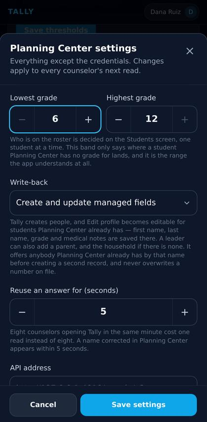
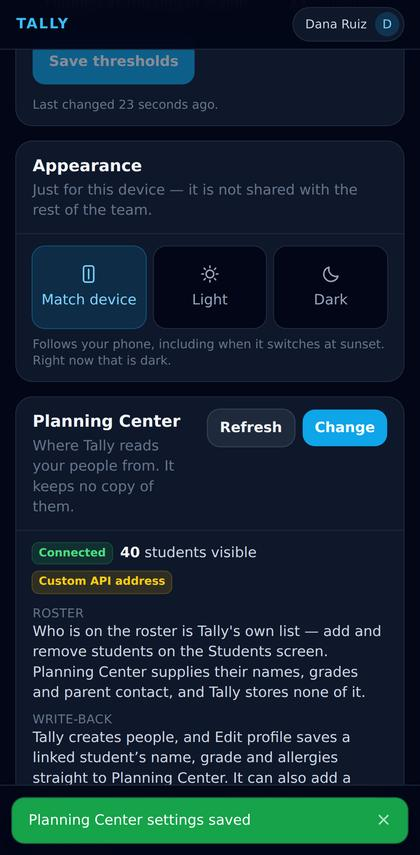
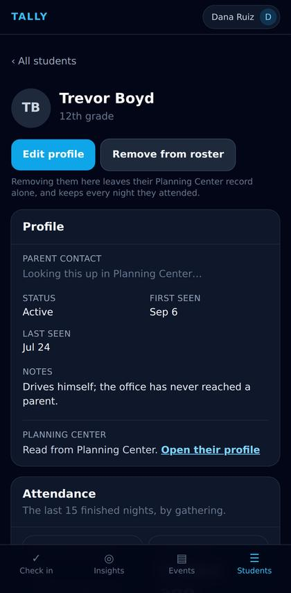
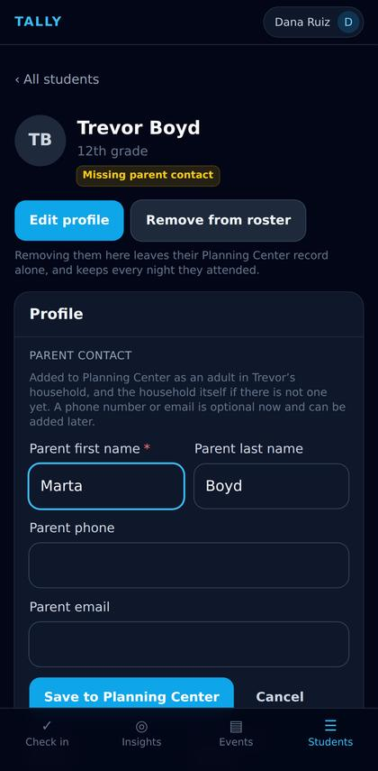
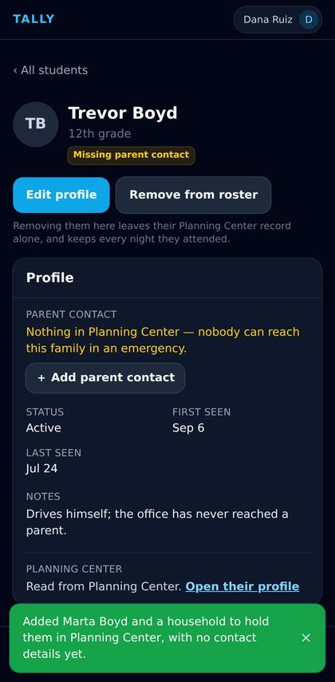
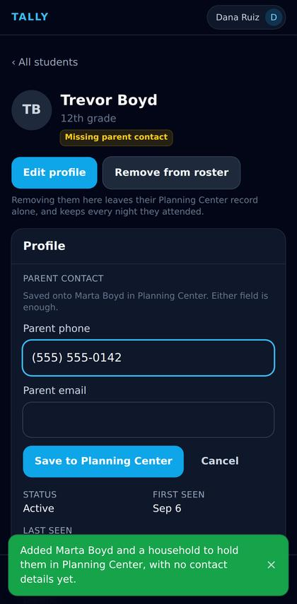
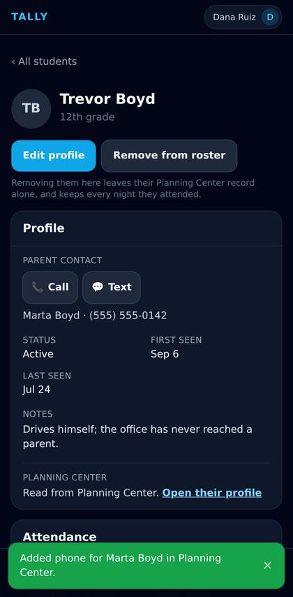
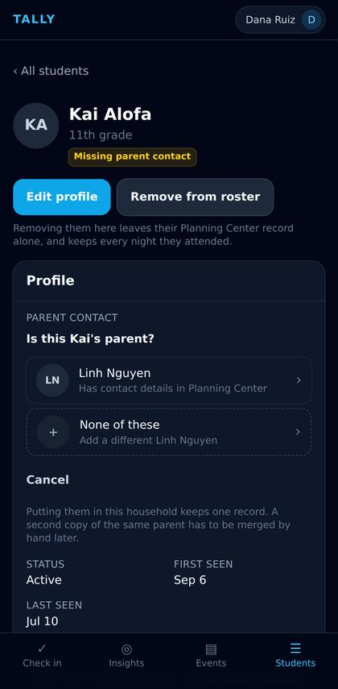
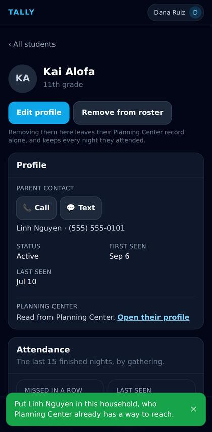

# Adding a parent, and adding their phone number

Captured from the running app by `e2e/parent-walkthrough.spec.ts`. Rebuild the page with
`npx tsx scripts/build-parent-walkthrough.ts`.

## 1. Turn write-back up to full

*Setting up*

Settings → Planning Center → Change. Everything below is off until this says “Create and update managed fields”, and the app never guesses at it — each screen asks the server what it is allowed to do, because the browser cannot see this setting. The hint under the box is the whole contract, in the order Tally will exercise it.

## 2. What full write-back means

*Setting up*

Saved. The card states what Tally may now change in the church’s database, in plain language rather than as a mode name — creating people, saving an edit to a linked student, adding a parent and a household, putting a number on them. Nothing here is retroactive: it changes what the next screen offers, not what already happened.

## 3. Nobody to ring

*Adding a parent*

Trevor is on the roster and Planning Center has no adult in his household at all — the office has never reached a parent. Until write-back was turned up, this said so and pointed at Planning Center, which is a dead end on a phone at a door. It now offers to fix it, and says exactly what is missing: not a phone number, a person.

## 4. Who they are

*Adding a parent*

The surname starts at the student’s own, which is right far more often than it is wrong and is one edit away when it is not. The phone and email are optional here on purpose: a leader who has a name but no number should still be able to record the name, and the sentence above says where this lands — an adult in Trevor’s household, and the household itself if Planning Center has none.

## 5. A household that did not exist a second ago

*Adding a parent*

The toast is Planning Center’s answer, not Tally’s optimism: it created Marta as an adult, built the household, and put Trevor in it with her as primary contact. The screen has re-read and changed its offer — there is somebody here now, so the question is no longer “who is the parent” but “how do we reach her”. That is the second flow, and it is the same button a student who always had a parent on file would show.

## 6. Either field is enough

*Adding a phone number*

Two fields, and the sentence above names the adult it will land on — the same adult the row would tell you to ring, chosen by the same ranking, so a number added here cannot end up on somebody the screen does not look at. A number nobody could ring is refused before the round trip rather than after it, and a mistyped one is never quietly dropped alongside a good email.

## 7. Reachable

*Adding a phone number*

Call and Text, on a student nobody could reach four screens ago. The number lives in Planning Center and nowhere else — Tally has kept no copy of a parent’s phone number since the mirror was removed, so this row is a live read, and a correction made in Planning Center tomorrow shows up here without anybody syncing anything.

## 8. Planning Center already has a Linh Nguyen

*The duplicate check*

Nothing has been written. A church’s parents are already in People — they attend — they are simply not linked to their child’s household, so the first Save is a question rather than a record. The two ways of getting this wrong are not symmetric: a duplicate person is a merge somebody does by hand months later, while attaching a child to the wrong household shows one family another family’s phone number. Neither is a decision worth automating, so a person makes it.

## 9. Joined, not duplicated

*The duplicate check*

Kai is in Linh’s household and reachable on the number the church already had for her. No second Linh Nguyen was created, and her existing phone number was not copied — a contact already on file is left exactly as it is, which is the one rule every write on this screen shares.
