# Registering a family at the kiosk

Captured from the running app by `e2e/registration-walkthrough.spec.ts`. Rebuild the page with
`npx tsx scripts/build-registration-walkthrough.ts`.

Every frame is the real lobby screen driving the real callable against a seeded emulator: the
pairing handshake happens, and the family at the end exists in Firestore and is checked in
against a real gathering.

## Finding the door

### 1. No match

*Not on the roster*

What a family nobody has met used to meet here was "No match — please see a leader", and nothing else. Seeing a leader is still the right last word when something is wrong with the search; it was never the right first one for being new. Two offers sit under the empty result and they answer different questions: a family somebody added while they queued needs the kiosk to look again, and a family nobody has ever met needs a form.

### 2. The standing offer

*Not on the roster*

The door is also on the screen before anybody types, in the row above the keyboard. It has to be: a parent told "just put your name in" types their child's name, gets somebody else's Noah back, and never fails a search to be offered anything. Low-key and fixed-height, so a keystroke still never moves the keyboard.

## Right here

### 3. The field says what it is

*Registering*

One tap from the offer and the first question is up — the QR screen that used to stand between them retired with the phone form it pointed at. One question per screen in the frame the search already uses. The readout names the field rather than saying "type here", which matters most on the two steps where the answer could belong to either person in the room: "Child's last name" and "Your last name" are the same box until one of them says which.

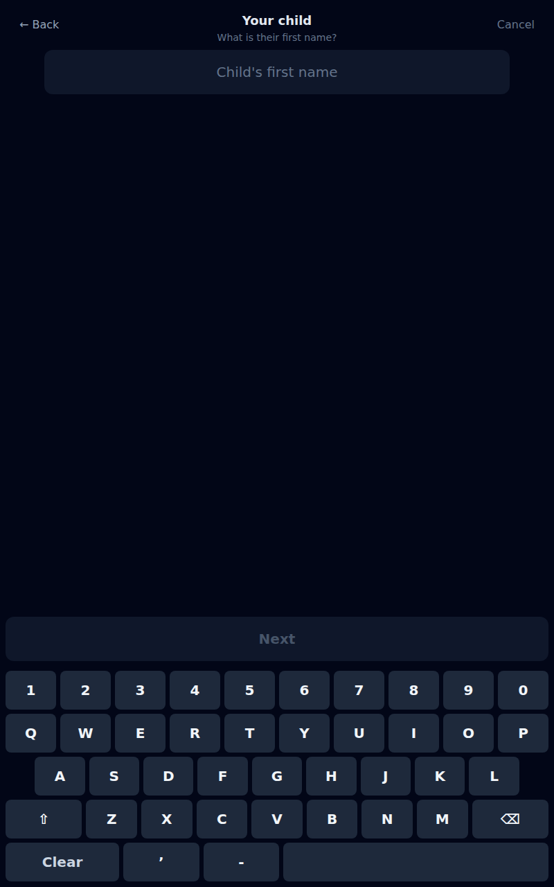

### 4. Capitals, and a key to argue with them

*Registering*

The first letter is a capital without anybody asking, and so is the letter after every space, hyphen and apostrophe — the boundaries a name actually has, which is what makes Anne-Marie and O'Brien come out right on their own. But no rule short of a dictionary gets McDonald and van der Berg too, so the shift key is there beside them: it cycles off, on and locked the way every phone does, and the letters wear the state so a key shows exactly what it will produce.

### 5. Grade, or none

*Registering*

Thirteen chips and "No grade", which is an answer rather than a blank somebody fills in later: a child too young for a grade has none. On a gathering that hands children back the question opens on "No grade" for the same reason — making a parent clear a field is the same mistake as making a volunteer reach for undo.

### 6. Allergies, only where they can land

*One child*

The fourth question, and it only exists when the church's own database takes full write-back — the same gate the retired phone form kept, because collecting a medical note into a screen that silently drops it is worse than never asking. The common answer is the button itself: "No allergies" until a letter is typed, Next the moment one is. The note goes to the reviewer and then upstream; the kiosk keeps a marker, never the text.

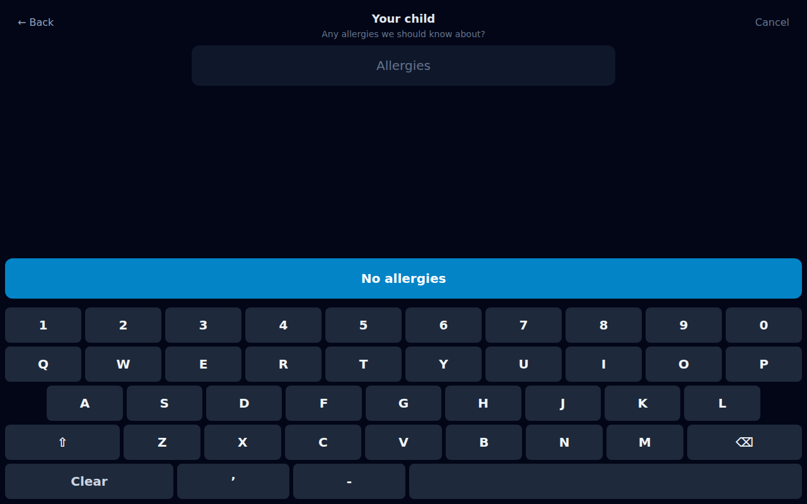

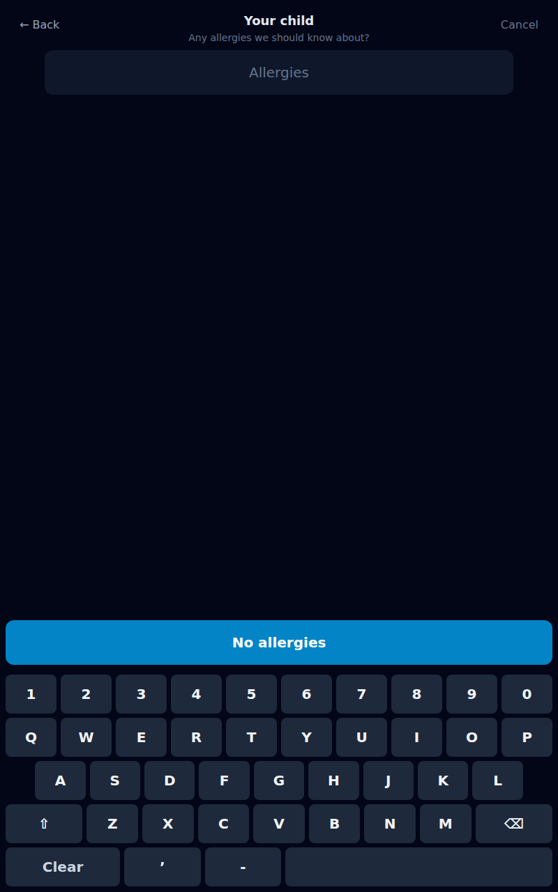

### 7. Anybody else?

*One child*

The fork that makes this worth doing at a kiosk at all: a parent with three children walks the loop three times rather than queueing three times. Who is on the list so far is named above the buttons, because the question cannot be answered against a parent's memory of what they typed forty seconds ago — least of all the parent of four, who is exactly who this loop is for. It is also the last chance to catch a child entered twice, or one whose name went in wrong.

### 8. The surname, carried

*Two children*

The second child's last name arrives already typed, and the shift key is down rather than up — the next keystroke belongs mid-word, not at the start of one. This is the whole argument for a wizard over a form: the questions know what the family has already said, and a form cannot.

### 9. Both of them, named

*Two children*

The same fork one child later. Nothing about this screen asks a parent to remember anything.

### 10. A dialer, for the one question that is a number

*Two children, one adult*

The QWERTY row can type digits, but picking ten targets out of forty-three on a tablet while a queue watches is asking for a mistake in the one field where a mistake is expensive: four of these digits become the family's key for every visit after this one. The line above says why it is being asked for while a parent decides whether to give it — and it is the only thing on this screen Tally will not keep. The number lives inside one call, long enough to build the family in the church's own database and to be reduced to four digits for the kiosk index.

### 11. Ten digits

*Two children, one adult*

Grouped as they are typed. A number nobody could ring is refused here rather than after the round trip, and a repdigit — the thing somebody types to get past a field they do not want to answer — is refused too.

### 12. Does this look right?

*Ready to check in*

The whole family on one screen, and one button. Everything before this was reversible with Back; this is the point where two children join the ministry's roster and are marked present, as a single act.

### 13. Next time, just type those four digits

*On the roster, checked in*

Both children exist, both are checked in against tonight's gathering, and a sticker is coming out of the printer for each of them. The sentence under the tick is the part that matters next week: the last four digits of the number they just gave are the search this kiosk already had, and this is where the family learns it. That is the entire handoff — no account, no password, no app.

### 14. And it works immediately

*Findable*

Typed on the same screen, seconds later. Nothing was refetched: the answer came back with the registration and went straight into what this kiosk holds. It survives the nightly rebuild too — that job reads the church's backends, which may not know this number for hours or, on a deployment that cannot write households, ever, so a registration keeps its digits in an overlay the rebuild folds in rather than overwrites.

## The second child

### 15. The other door, in the same slot

*On the confirm screen*

A parent whose next child is finally old enough starts here, not at the front door: they have already found their family by phone and tapped a name. The offer sits below the main action in the smaller weight, because it is the rarer of the two things somebody came to this screen to do — and it is on this screen at all because this is where the kiosk knows which family is standing in front of it.

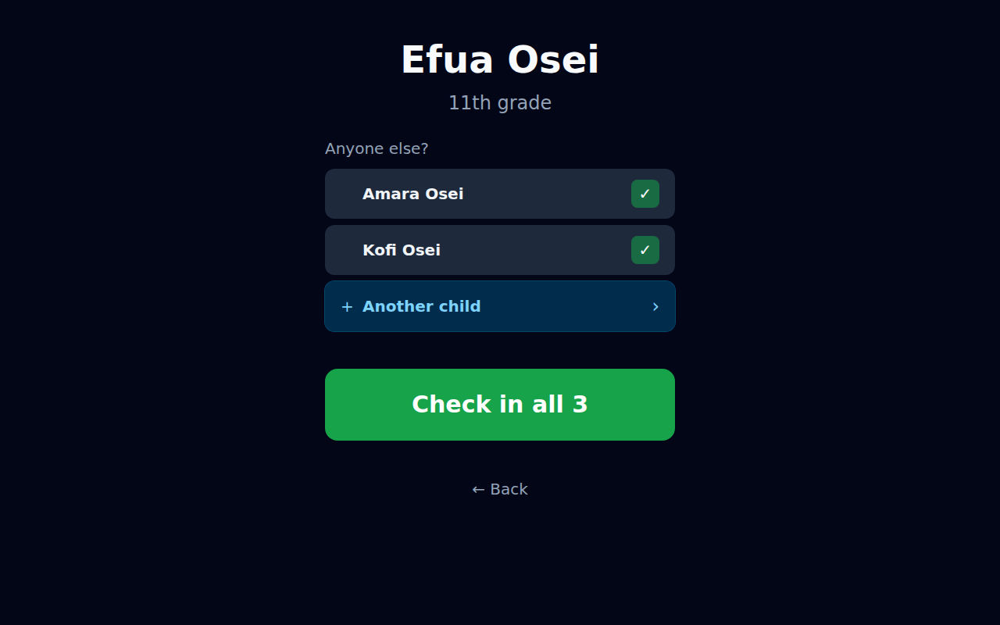

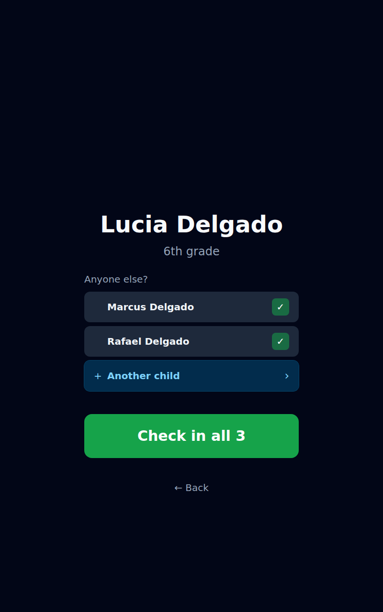

### 16. The cheaper answer, offered first

*Searching the roster first*

Both readings of that link are real journeys. The common one is a sibling already on the roster whom the phone search did not surface — the church has them, the family folk simply do not line up — and finding them costs nothing and creates nothing. So this screen searches by name, shows the family's own rows greyed and inert so nobody taps a child twice, and keeps "add a new child" as a standing offer rather than the destination. A registration is the expensive answer and it is one tap further away.

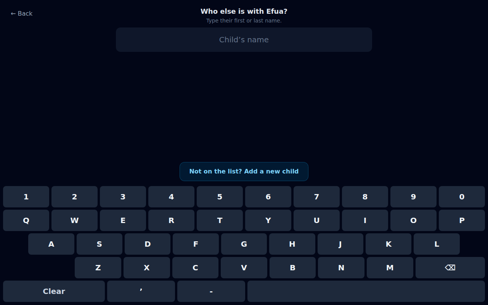

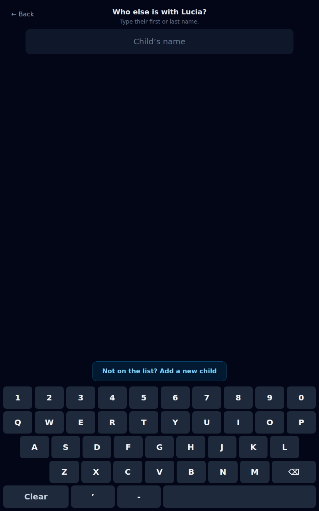

### 17. Joining the family that exists

*Two questions, no adult*

No name, no phone number, no second household invented — the confirm names the siblings this child is being added to and that is the whole of it. The kiosk resolved the family from the four digits it searched with; the server re-verifies every one of those ids before it believes any of them, and at approval the household comes from an existing sibling rather than from the children in the run. That last part is the fix for a real bug: a family gaining a second child used to gain a second household, with the first child left behind in the original and invisible from the new one.

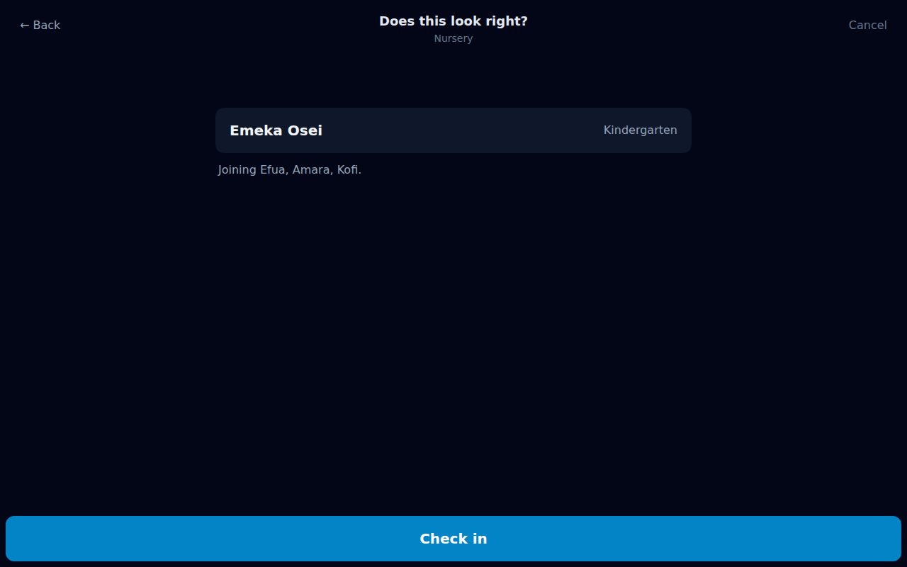

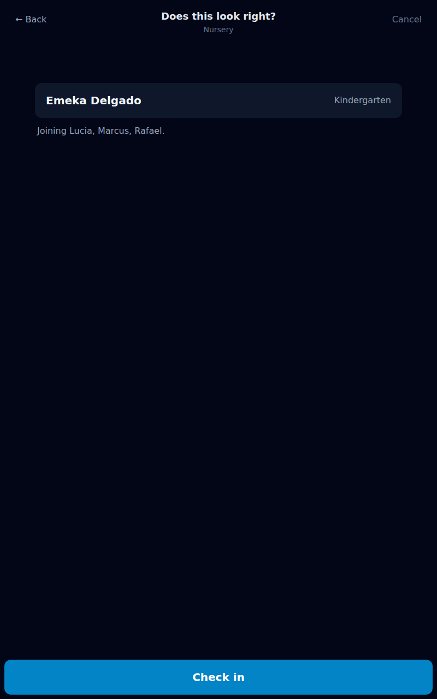

### 18. Recorded, not decided

*Checked in, held for review*

Nothing reached Planning Center. Every child a family registers is written held, and the hold is the only thing that gates the push — both backends, both sweeps, the on-create trigger and the re-create repair all consult it. What happens next happens on a weekday, on a core-team screen, with the form as the family typed it beside any roster row that shares a name: approve, merge, or discard. The door records; a person decides.

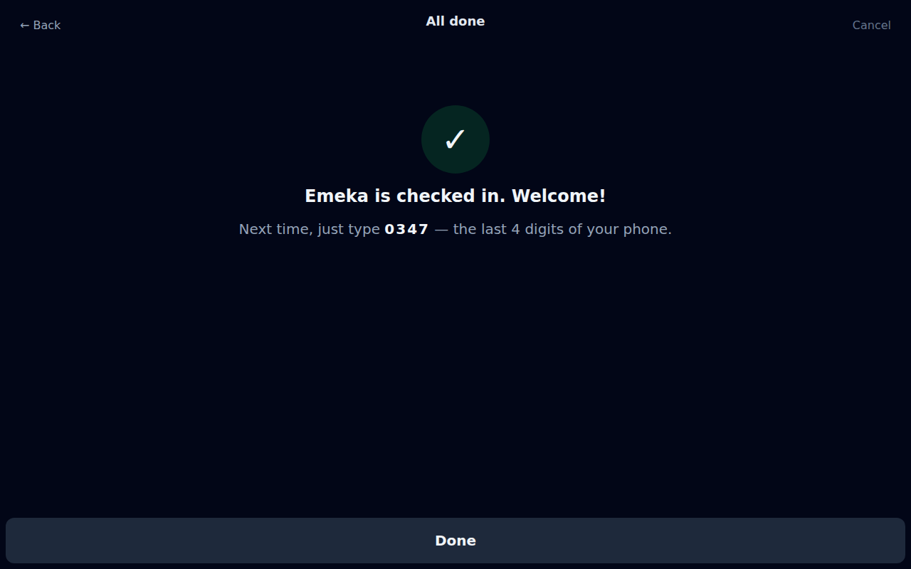

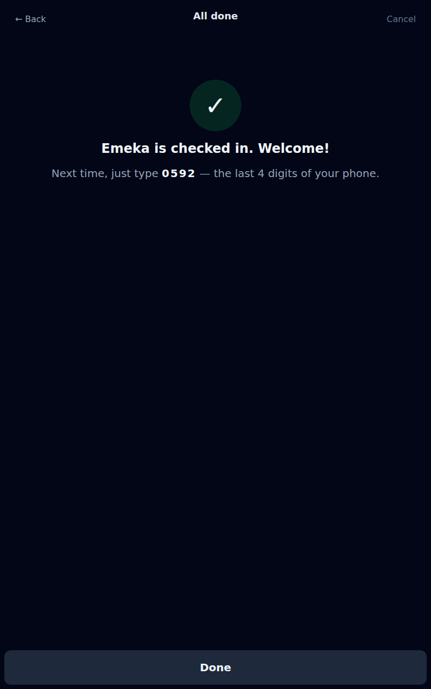
