# Registering a family at the kiosk

Captured from the running app by `e2e/registration-walkthrough.spec.ts`. Rebuild the page with
`npx tsx scripts/build-registration-walkthrough.ts`.

Every frame is the real lobby screen driving the real callable against a seeded emulator: the
pairing handshake happens, the QR code is minted by `mintRegistrationCode`, and the family at the
end exists in Firestore and is checked in against a real gathering.

## Finding the door

### 1. No match

*Not on the roster*

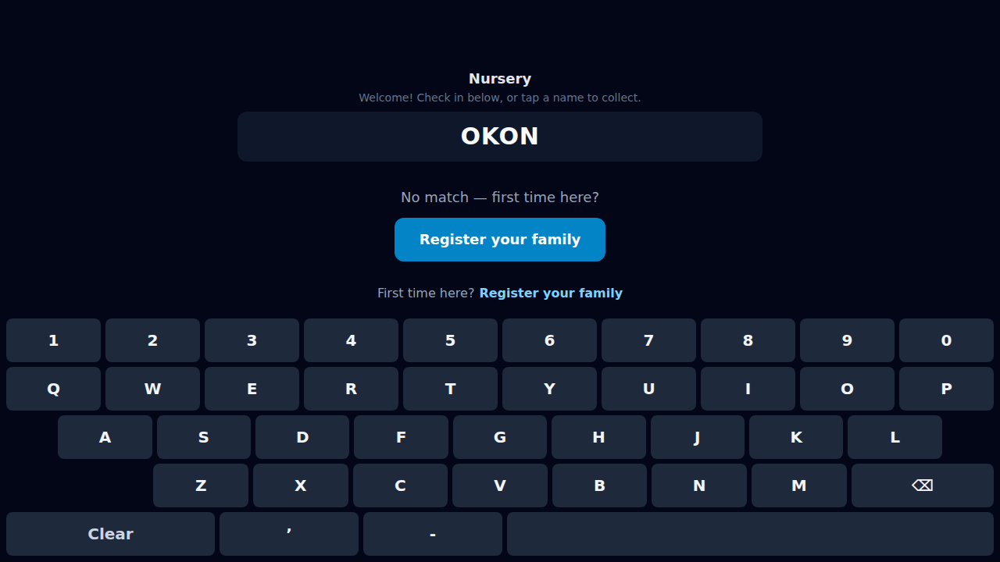

What a family nobody has met used to meet here was "No match — please see a leader", and nothing else. Seeing a leader is still the right last word when something is wrong with the search; it was never the right first one for being new. The offer in frame answers the question a genuinely new family is asking. A second, quieter one — "Just registered? Check online", for the different problem of a family somebody added while they queued — sits under it and is below the fold here: at this window height the block outgrows the scrolling results region. On a lobby tablet's taller screen it clears, but it is tight, and the frame is left as shot rather than scrolled to flatter it.

### 2. The standing offer

*Not on the roster*

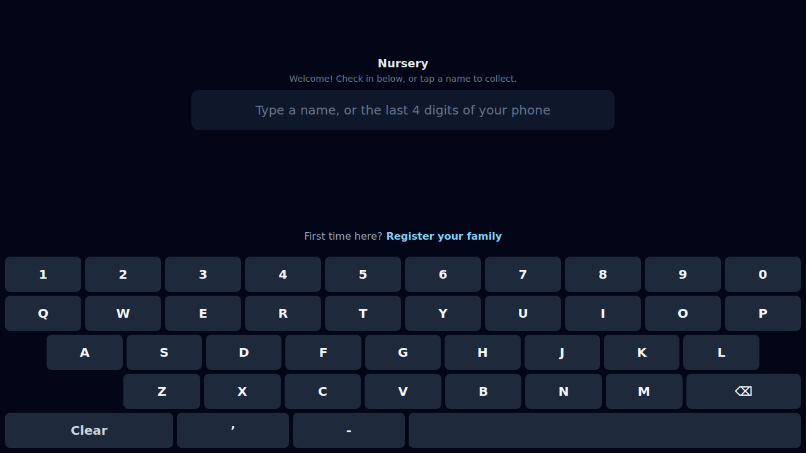

The door is also on the screen before anybody types, in the row above the keyboard. It has to be: a parent told "just put your name in" types their child's name, gets somebody else's Noah back, and never fails a search to be offered anything. Low-key and fixed-height, so a keystroke still never moves the keyboard.

## On your own phone

### 3. Scan this

*Choosing a door*

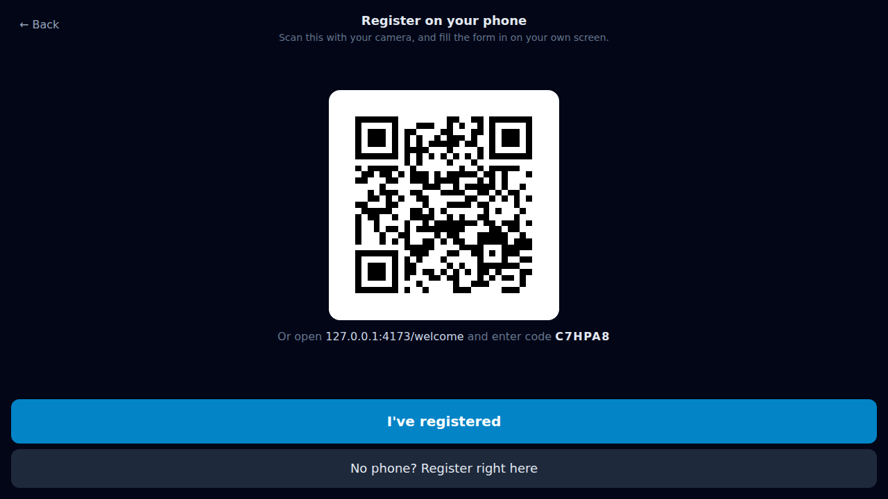

The first thing offered, because a parent holding a phone would rather type on it than on a tablet bolted to a shelf — their keyboard, their autocorrect, and the queue behind them does not have to watch. The code under it is minted by the kiosk and lives twenty minutes: a stable public registration URL would be a form on the open internet whose submissions land in a church's real people database, so registering remotely means being in the room. The address is spelled out in words too, for a camera that will not focus.

## Right here

### 4. One question at a time

*Registering*

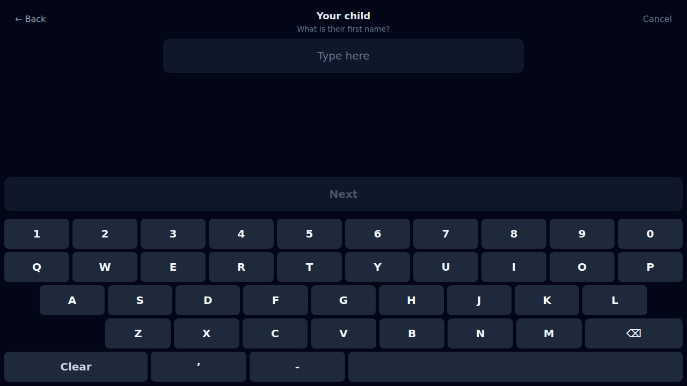

For the family without a phone, one tap behind the QR — the right way round, because this is the longer of the two flows on the harder keyboard. One question per screen in the frame the search already uses, and the keyboard has gained an apostrophe and a hyphen: what is typed here goes on the roster and onto a sticker, and O'Brien and Anne-Marie are names.

### 5. Capitals, without a shift key

*Registering*

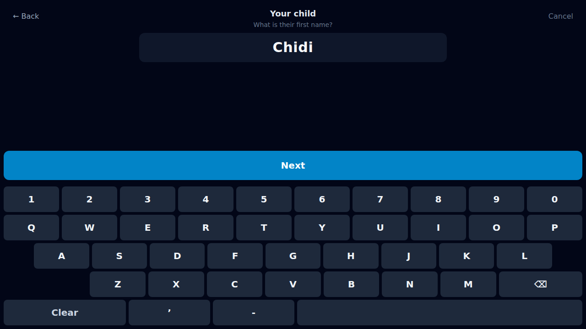

The kiosk keyboard is one static uppercase layout, because a shift key is a mode and a mode is a thing to get wrong at a door. The readout capitalises as it goes, the way a phone does, so what a parent reads back is exactly what will be written down. Without it every child registered here would arrive on the roster, in the church's database and on their own sticker as CHIDI OKONKWO.

### 6. Grade, or none

*Registering*

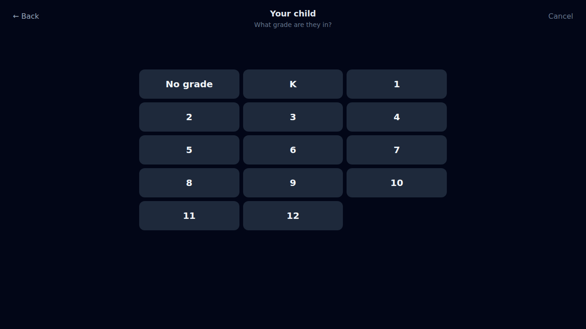

Thirteen chips and "No grade", which is an answer rather than a blank somebody fills in later: a child too young for a grade has none. On a gathering that hands children back the question opens on "No grade" for the same reason — making a parent clear a field is the same mistake as making a volunteer reach for undo.

### 7. Anybody else?

*One child*

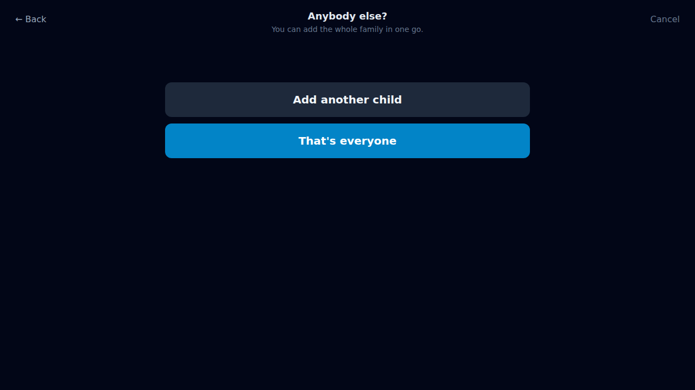

The fork that makes this worth doing at a kiosk at all. A parent with three children walks the loop three times rather than queueing three times, and the next child's surname opens already filled in from the last — right far more often than it is wrong, and one Clear away when it is not.

### 8. The surname, carried

*Two children*

The second child's last name arrives already typed. This is the whole argument for a wizard over a form: the questions know what the family has already said, and a form cannot.

### 9. Why the number is asked for

*Two children, one adult*

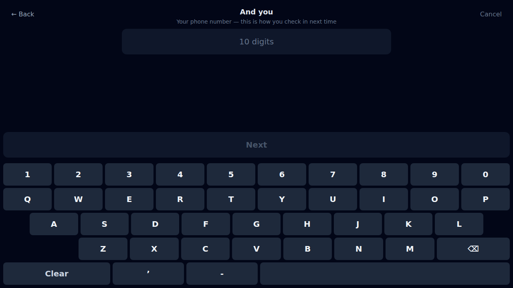

Said before it is typed rather than after: this is how the family checks in from next week, and it is the only thing on this screen Tally will not keep. The number lives inside one call — long enough to build the family in the church's own database, and to be reduced to four digits for the kiosk's index. Nothing stores a parent's phone number, which is why there is no screen anywhere in Tally that can show you one.

### 10. Ten digits

*Two children, one adult*

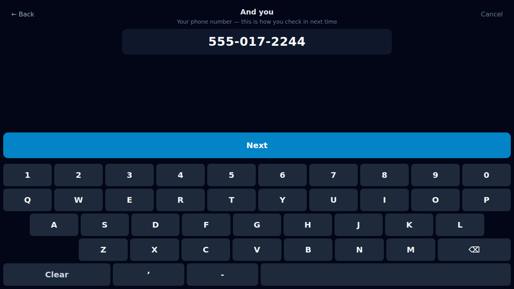

Digits only, grouped as they are typed. A number nobody could ring is refused here rather than after the round trip, and a repdigit — the thing somebody types to get past a field they do not want to answer — is refused too, because four of these digits are a key the family will use every week.

### 11. Does this look right?

*Ready to check in*

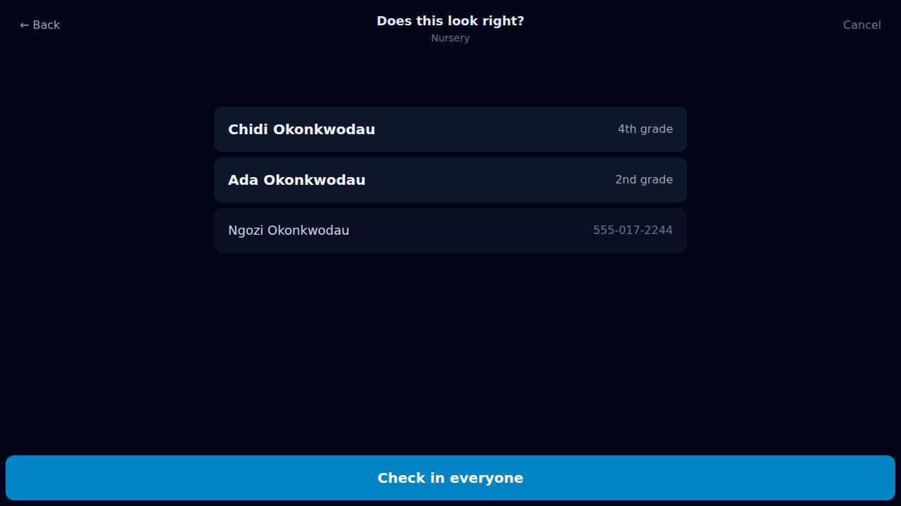

The whole family on one screen, and one button. Everything before this was reversible with Back; this is the point where two children join the ministry's roster and are marked present, as a single act.

### 12. Next time, just type 2244

*On the roster, checked in*

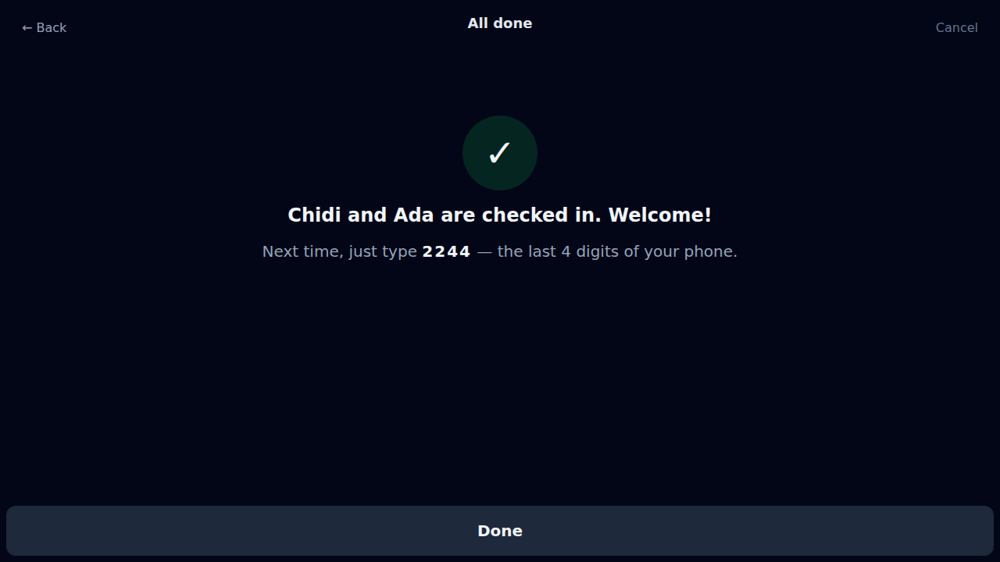

Both children exist, both are checked in against tonight's gathering, and a sticker is coming out of the printer for each of them. The sentence under the tick is the part that matters next week: the last four digits of the number they just gave are the search this kiosk already had, and this is where the family learns it. That is the entire handoff — no account, no password, no app.

### 13. And it works immediately

*Findable*

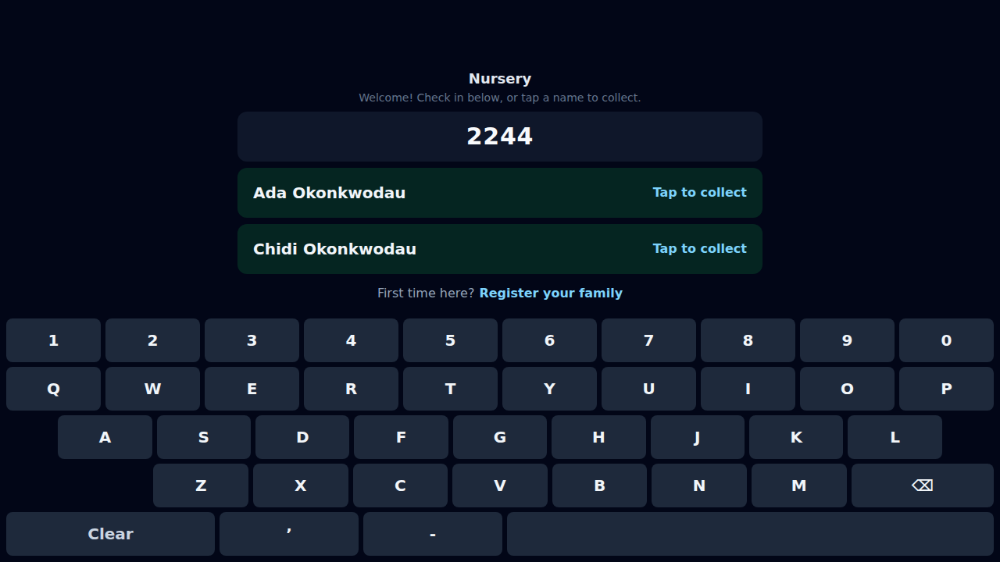

Typed on the same screen, seconds later. Nothing was refetched: the answer came back with the registration and went straight into what this kiosk holds. It survives the nightly rebuild too — that job reads the church's backends, which may not know this number for hours or, on a deployment that cannot write households, ever, so a registration keeps its digits in an overlay the rebuild folds in rather than overwrites.

## What it will not do

### 14. Already on our list

*Refused, nothing written*

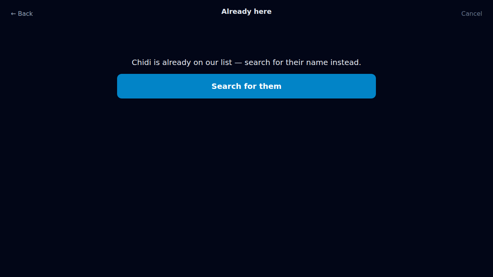

The same family again, five minutes later — the child who wandered off, the parent who was not sure it saved. Nothing is created. Not one of the two, either: a half-registered family is worse than one told to search, so a name already on the roster stops the whole thing. This is also what a retry meets, and why the server takes its claim on the registration before it reads the roster — otherwise a retried call would find the children it created a second ago and report them as duplicates of themselves.
