# Regulars on check-out gatherings — a walkthrough

A children’s room that hands children back to parents — usually checked in at a
lobby kiosk — now shows its regulars on the check-in screen: who usually comes,
and who hasn’t arrived yet.

Every frame is the app’s real check-in screen — the same screen and app shell, with the app’s own styles — mounted against a made-up Kids’ Church: 34 children, four past Sundays, fourteen of whom count as regulars by the app’s own rule. Taps are real taps through the screen’s own buttons; what is pretend is the database behind them, and the lobby kiosk, which the script stands in for. The “before” frames were taken from the same setup on the version just before this change.

The kiosk itself is not shown — only what its check-ins do to this screen. Gatherings without pickup are shown once, to say they did not change.

Regenerate with:

```bash
npm run walkthrough:regulars:capture   # npx tsx uxr/checkout-live/walkthrough.ts
npm run walkthrough:regulars:build     # npx tsx scripts/build-regulars-walkthrough.ts
```

The standalone, shareable page is [regulars.html](regulars.html).

## Before and after

### The same Sunday, the same 9:14

Kids’ Church at 9:14, two children in the room. Before this change the screen on a gathering with pickup showed only who was in the room and who had gone home — nothing about the fourteen children who come most weeks. Now a Regulars chip sits in the row, and the thirteen regulars who have not arrived yet are listed right under the room.

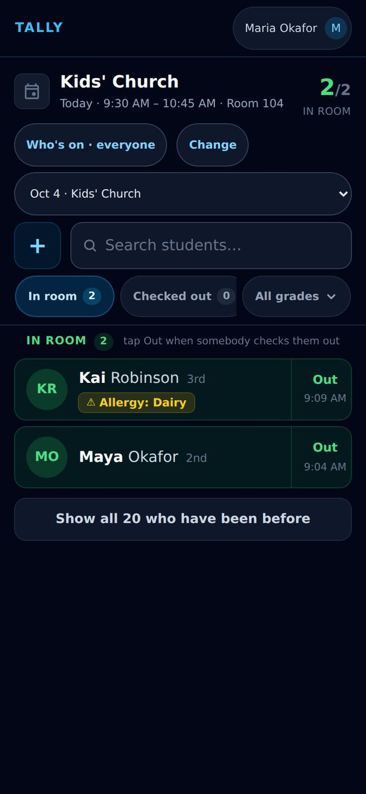

<sub>Before · Phone · 390×844</sub>

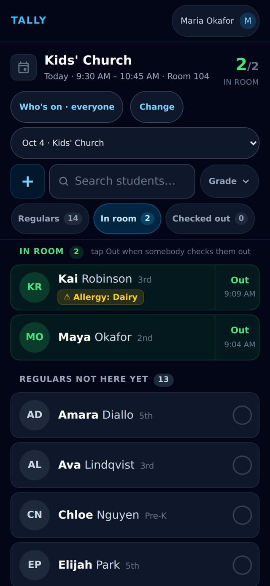

<sub>After · Phone · 390×844</sub>

### And on a laptop

The same moment on a laptop. Before, the wide screen was mostly empty; now the regulars still expected fill it, two columns wide, and the Regulars and Been before chips are both in the row.

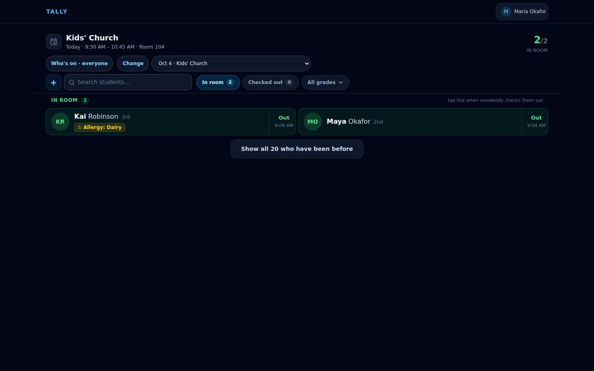

<sub>Before · Laptop · 1440×900</sub>

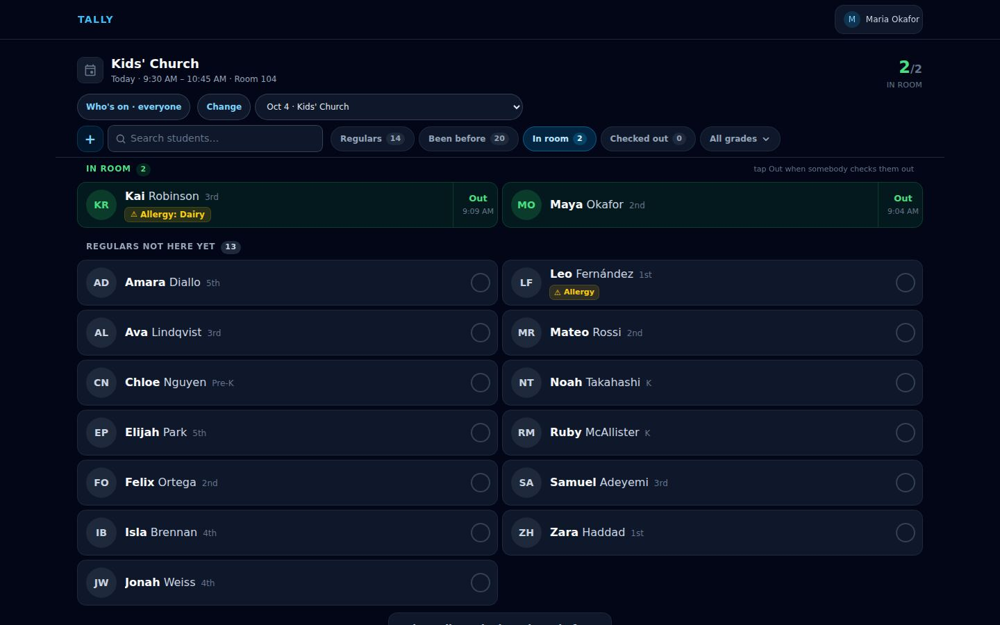

<sub>After · Laptop · 1440×900</sub>

## At the door: checking in a regular

### Opens on who is in the room

A volunteer at the classroom door opens the screen at 9:14. It starts on In room — Maya and Kai are here — and straight underneath is a second list: Regulars not here yet, 13.


<sub>Phone · 390×844</sub>

### The regulars still expected

Scrolling down shows them by name, A to Z. Amara Diallo has just walked up with her dad and did not go through the lobby kiosk, so the volunteer taps her name here.

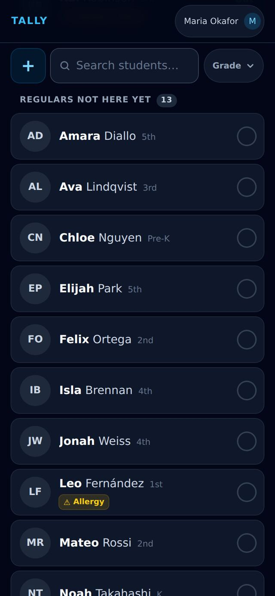

<sub>Phone · 390×844</sub>

### She turns green right where she was

Amara is checked in. Her row turns green in place, with an Out button for pickup, and the list does not move under the volunteer’s thumb. The heading now says 12 still to come, and “1 just checked in” explains the green row that is still in the list.

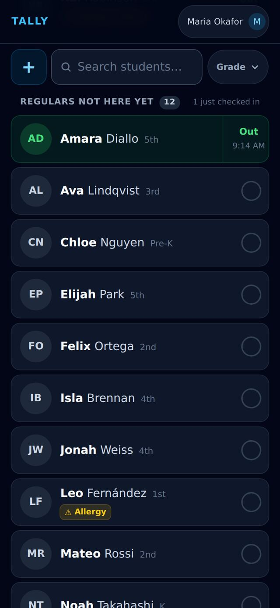

<sub>Phone · 390×844</sub>

### And she counts in the room

Up top, the In room chip, the big count and the In room heading all read 3 — the room count never disagrees with itself. Amara’s row stays in the regulars list for now so nothing jumps; she moves up into the In room list the next time the filter changes or the page is reloaded.

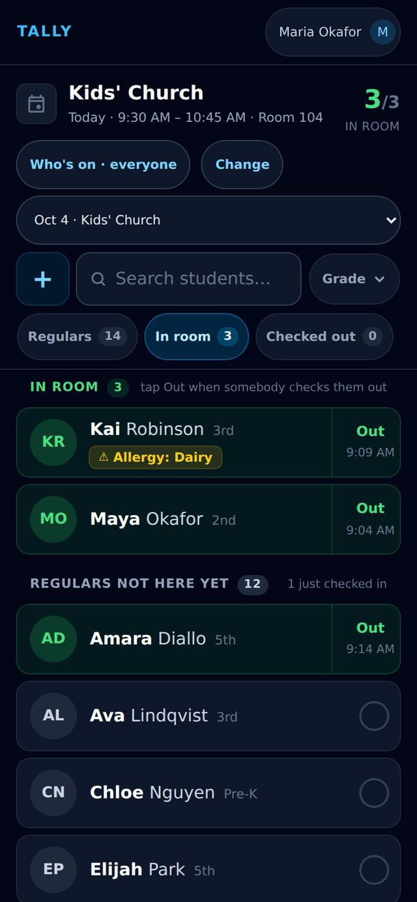

<sub>Phone · 390×844</sub>

## At the door: the lobby kiosk checks someone in

### Seven regulars still to come

It is 9:27 and nine children are in the room. The volunteer is watching the seven regulars who have not arrived yet. Mateo Rossi is one of them.

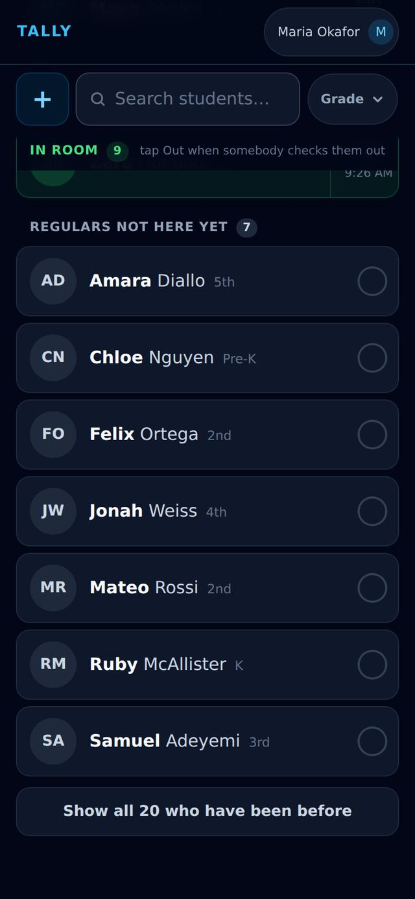

<sub>Phone · 390×844</sub>

### Checked in at the kiosk, he leaves the list

Mateo’s family checked him in on the lobby kiosk. Nobody tapped anything on this phone, so there is no reason to hold him in place: he simply drops off the regulars list, which now reads 6.

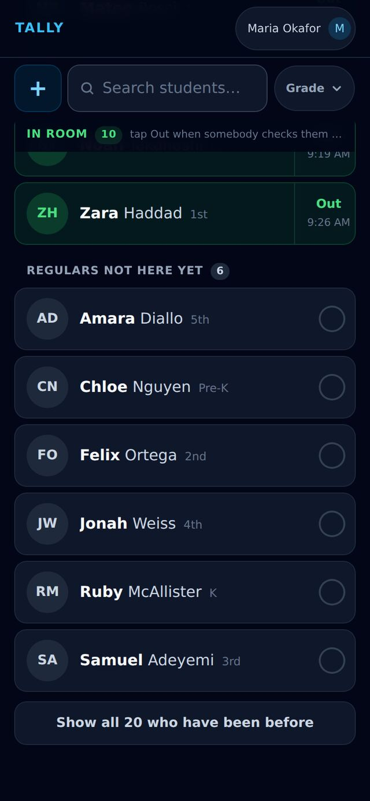

<sub>Phone · 390×844</sub>

### And shows up in the room

Scrolling back up, Mateo is in the In room list, green, with the time he arrived at the kiosk, and the room count is 10. Children who come through the kiosk appear here the same way they always have.

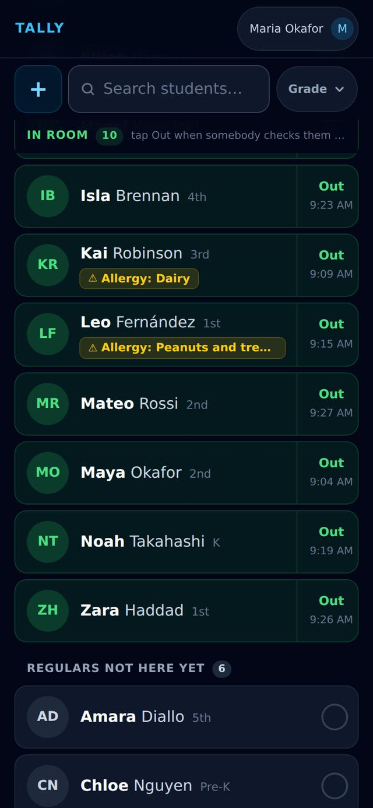

<sub>Phone · 390×844</sub>

## Seeing every regular at once

### One tap on Regulars

The Regulars chip lists the 14 children who came at least 2 of the last 3 Sundays, A to Z, with the ones already here in green. The list says 16 because it also keeps anyone already checked in today — Kai and Hazel came, though they aren’t regulars.

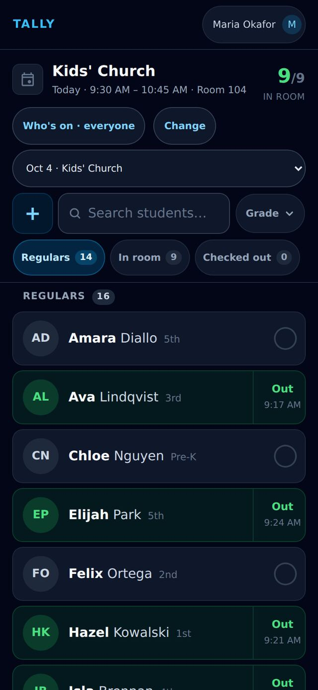

<sub>Phone · 390×844</sub>

### The rest of the list

The end of the list. Tapping a grey name here checks that child in, just like anywhere else on this screen.

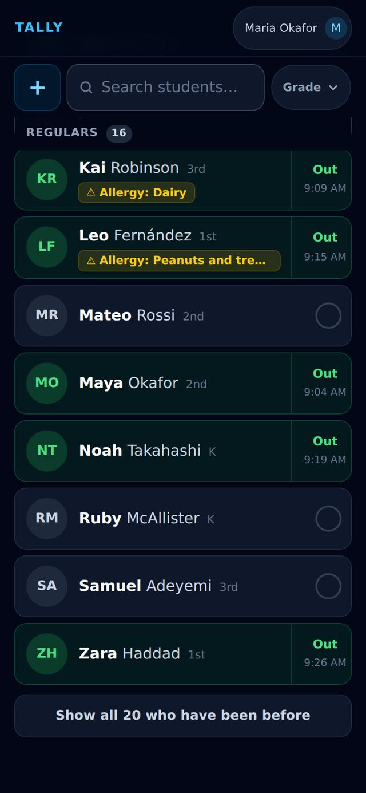

<sub>Phone · 390×844</sub>

### Back to the room

Tapping In room goes back to the usual view: who is here, and the regulars not here yet underneath. (Tapping Regulars a second time instead turns the filter off and shows every child on the roster.)

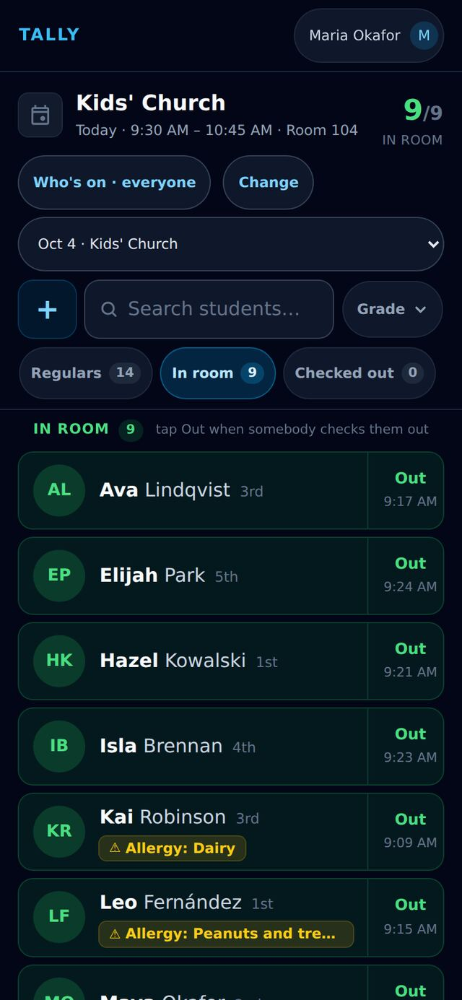

<sub>Phone · 390×844</sub>

## Narrowing to one grade

### The grade filter moved next to search

With three chips in the row there is no room for the grade filter beside them on a phone, so on these gatherings it now sits next to the search box as a small “Grade” button.


<sub>Phone · 390×844</sub>

### Pick a grade

Tapping it opens the same checklist of grades as before.

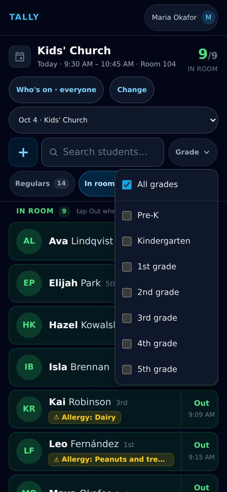

<sub>Phone · 390×844</sub>

### Both lists narrow to that grade

With 2nd grade picked, the button says so, and both lists — In room and Regulars not here yet — show only 2nd graders: Maya is here, Felix and Mateo are still to come. The counts follow the grade too. Picking “All grades” undoes it.

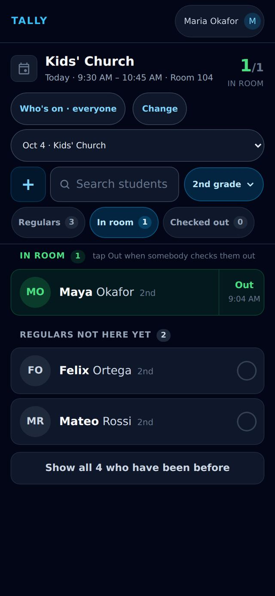

<sub>Phone · 390×844</sub>

## Pickup time

### Pickup works as before

It is 10:51, after the service. In room 7 and Checked out 5, exactly as before this change. Each child still in the room has an Out button for when a parent collects them.

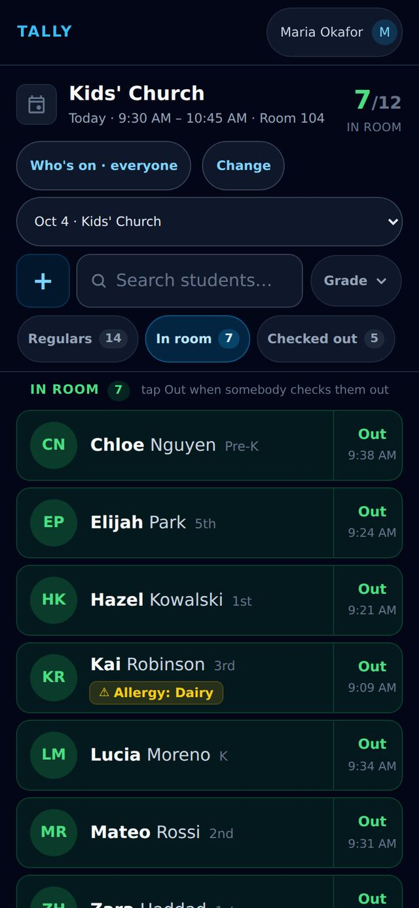

<sub>Phone · 390×844</sub>

### One tap on Out

Chloe’s mum arrives; one tap on Out records the pickup. Chloe leaves the In room list, In room drops to 6 and Checked out goes up to 6 — the same as before this change.

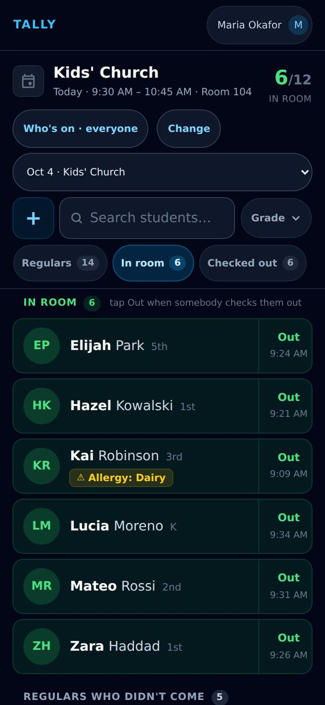

<sub>Phone · 390×844</sub>

### Regulars who didn’t come

Once the service has ended the second list changes its name to “Regulars who didn’t come”: the five regulars who missed today. That is the list worth a phone call or a note this week.

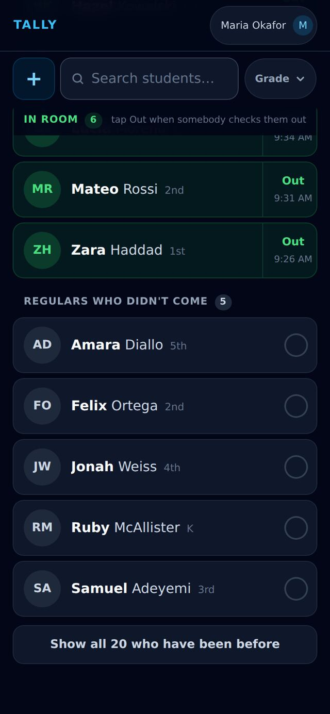

<sub>Phone · 390×844</sub>

## A leader on a laptop

### Everything on one screen

On a laptop there is room for every chip — Regulars, Been before, In room, Checked out and All grades — and both lists sit side by side in two columns: the nine children in the room, and right under them the seven regulars not here yet, without scrolling.

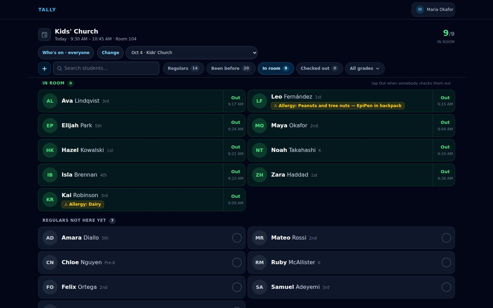

<sub>Laptop · 1440×900</sub>

### After the service

At 10:51 the same screen shows who is still waiting for pickup, and the five regulars who didn’t come today.

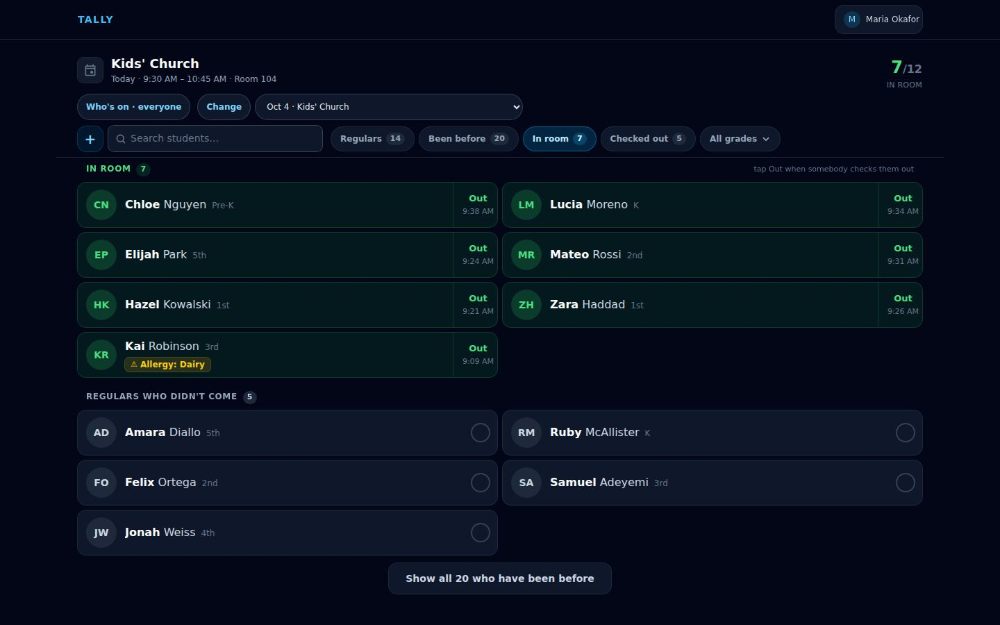

<sub>Laptop · 1440×900</sub>

## Gatherings without pickup are unchanged

### A youth night looks the same as before

The same room with pickup turned off. The row is still Regulars, Checked in and All grades, the screen opens on the regulars, and there is no second list — none of this change applies.

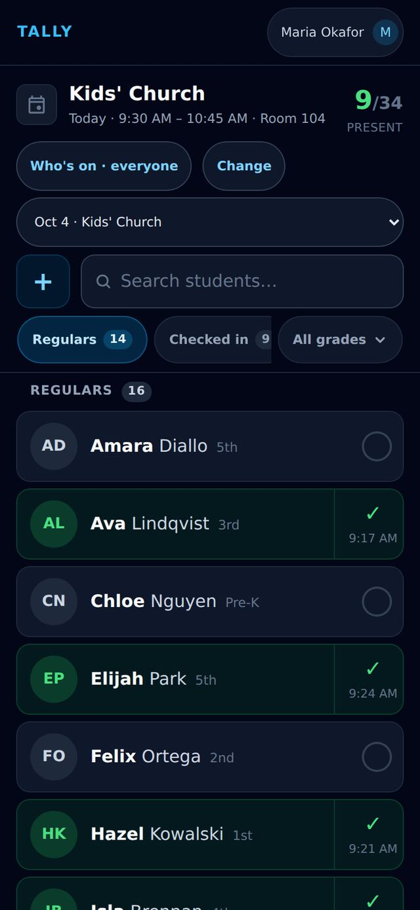

<sub>Phone · 390×844</sub>
