# Reprinting a name tag — a walkthrough

A child at the desk with no sticker on, and the two people who can do
something about it. The design, and what four rounds of critique threw out on
the way to it, are in [kiosk-reprint.md](../../kiosk-reprint.md).

Every frame is the kiosk’s own screens — the same components `KioskApp` renders, mounted by Vite with the app’s own stylesheet (`uxr/kiosk-reprint/`). What is faked is the roster and the printing module’s handle, which is a WebUSB transport in real life. The parent-facing offer is not faked: its four states are decided here by `reprintOffer` — the shipped policy — from minutes since check-in and whether a label has already gone, so what these frames show is the rule holding rather than a claim that it does.

Regenerate with:

```bash
npx tsx uxr/kiosk-reprint/walkthrough.ts           # capture
npx tsx scripts/build-reprint-walkthrough.ts       # build the page
```

## A volunteer, mid-service

### The screen everybody finds

A lobby tablet on a stand, in the middle of a gathering, with a queue at it. Ramona’s name tag came out blank ten minutes ago and she is standing at the desk without one. Until this change there was exactly one way to get her another, and its first step was to take this screen away from everybody standing in front of it: hold **Clear**, answer *Change event?*, and the kiosk unbinds. A family walking up finds an event list and can do nothing about it.

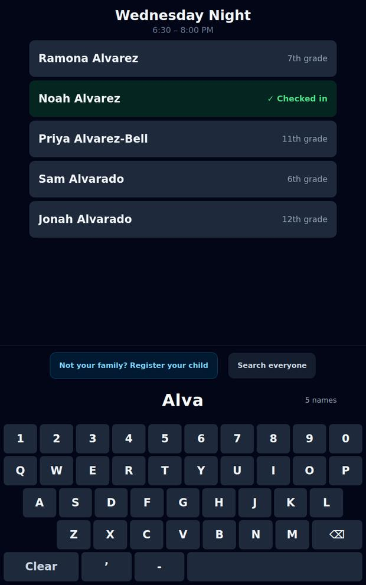

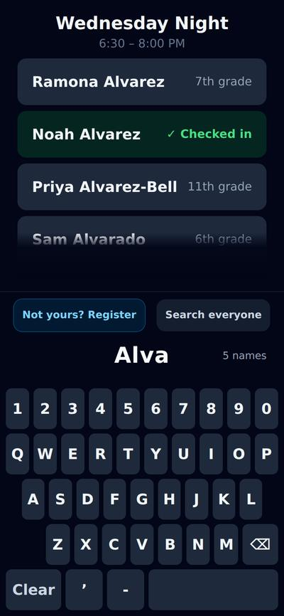

### The gate opens the doors, not the one door

The same two-second hold on **Clear**, and the same gate — a labelled key in a fixed place that can be described to a volunteer over the phone. What has changed is what is behind it. Leaving the gathering is now one door of three rather than all of them, and it keeps its warning on the screen after this one, because that warning belongs to that choice and not to the act of looking. The loud control is still the way back to the queue. The kiosk is still bound to Wednesday Night the whole time anybody is in here.

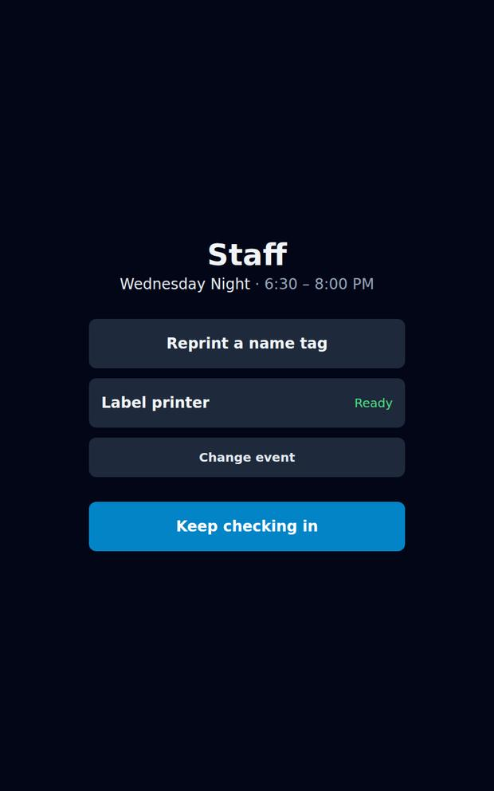

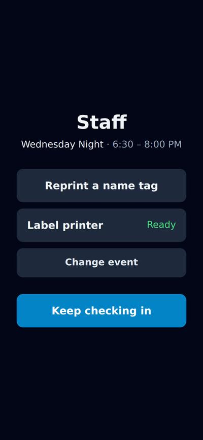

### The search screen, staffed

This is the check-in screen with the parent’s doors taken off it — same grid, same keyboard, same rows, same rule that a keystroke changes text and never geometry. A second way to find a name would be a second way to get it wrong. What is different is the quiet chip saying whose screen this is, the standing line promising that nothing here touches the register, and *Done — back to check-in* where the register offer stands on the parent’s version. Presence is context on this screen and never a gate: staff may reprint for anybody, checked in or not.

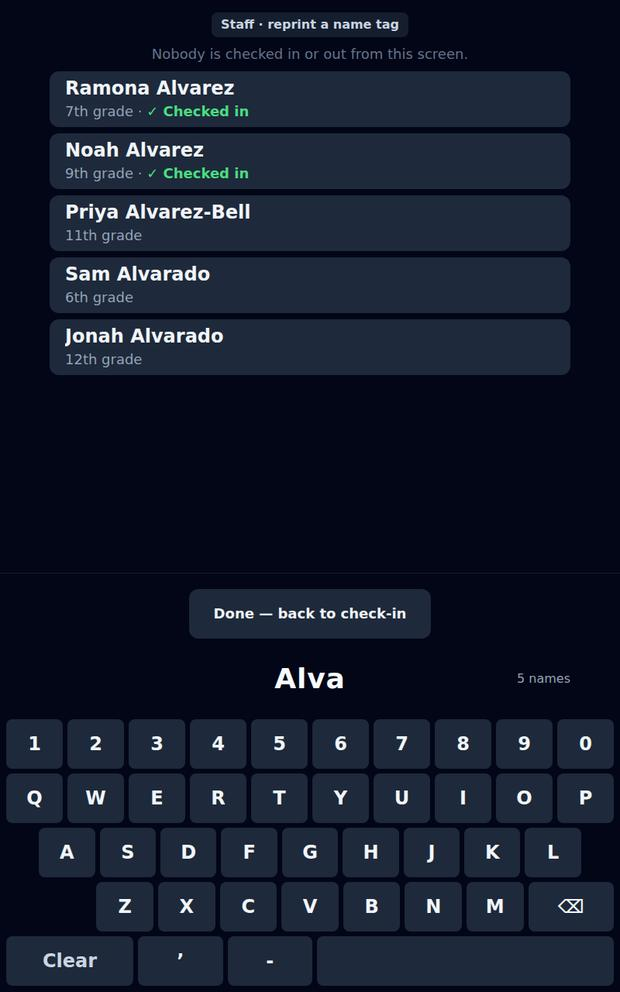

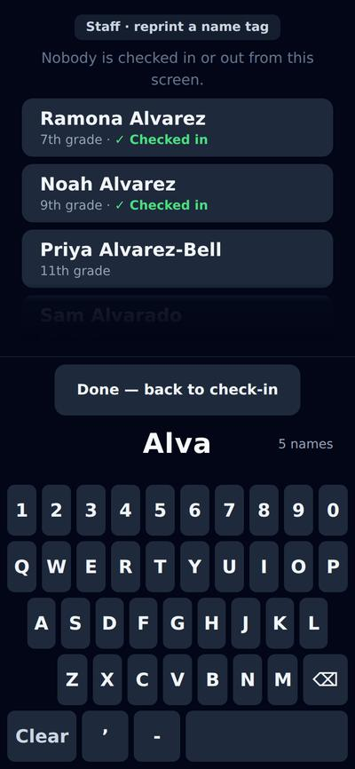

### The sticker, before the tape moves

Every door that spends a label arrives here. A volunteer is usually reprinting because they suspect something — it came out blank, it came out with a line missing, it came out at all — and the cheapest way to answer that is to show the words. The facsimile is paper-coloured because it is an object in the room rather than another surface on the device, and it carries the identity: this is the check that the right Alvarez was tapped, in a list that also holds an Alvarez-Bell and two Alvarados. Above it, the one fact a screen can add: when this child’s tag last printed.

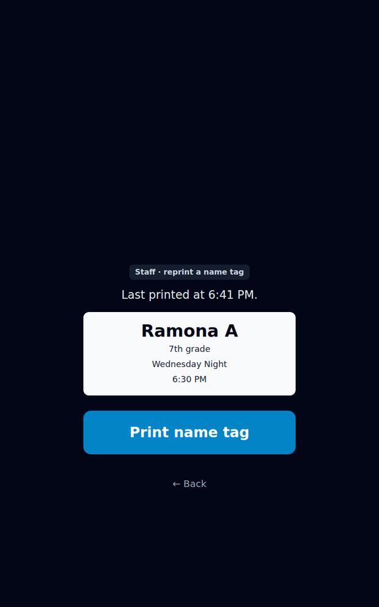

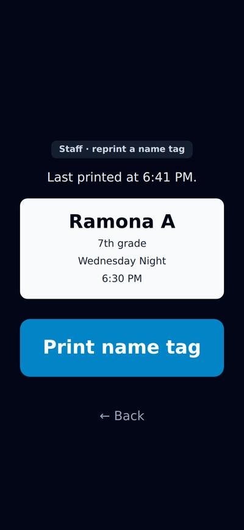

### Back to the list, with a receipt on the row

The buffer is kept, because the next thing a volunteer does is usually the sibling — a family whose labels all failed shares a surname. The receipt sits on the row it belongs to and wears the app’s own accent, not the green that means *checked in*: an earlier draft put “Name tag sent” in that green, directly above the same child’s row reading “✓ Checked in”, and the sequence read as though the reprint had checked her in. The promise that nothing here moves the register is a standing line now, not a slot the receipt borrows.

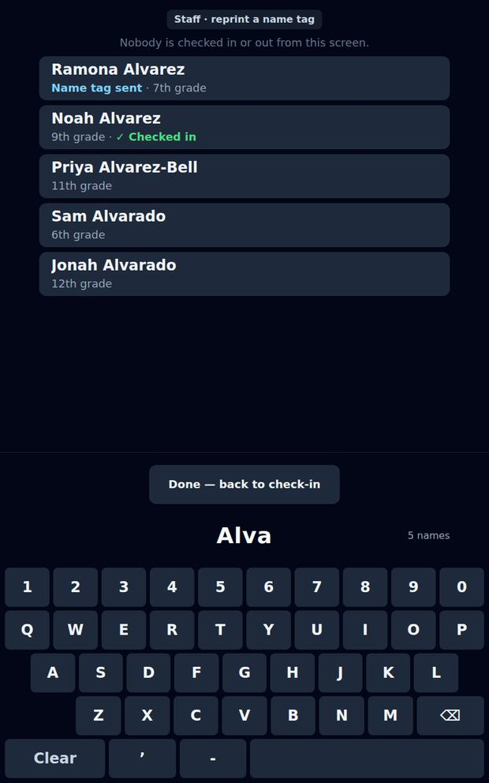

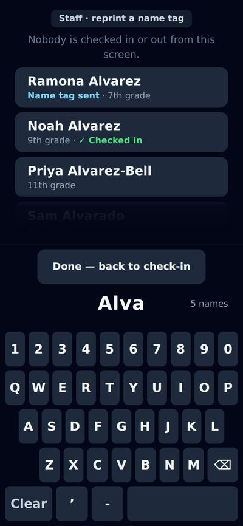

### The evening, instead of a guess

The other door. **Reprint the last label** used to live here — the only reprint the product had, and a guess about which label anybody wants: by the time a volunteer has walked to the kiosk, the last one is whoever checked in behind them. What replaces it is the evening’s attempts, and *attempts* is the point — Alethea Alford’s never came out, and the row that says so is the row somebody is most often here for. Tapping any of them opens the same confirm; they used to print on contact, in a pane you have to scroll to reach the rest of.

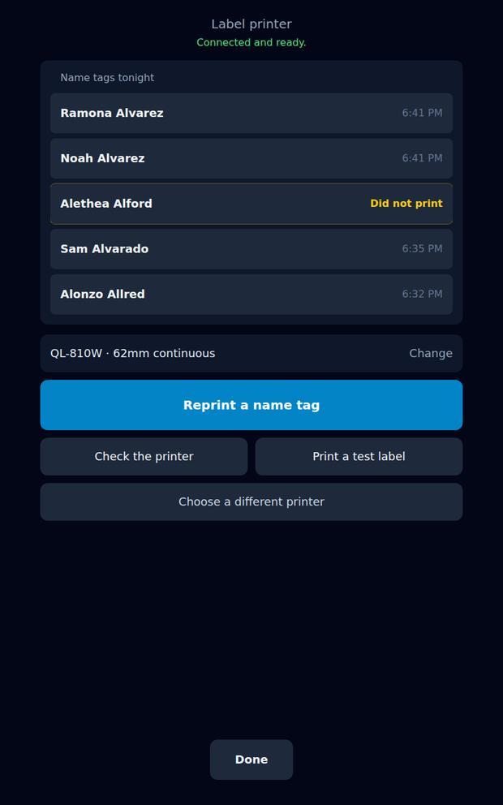

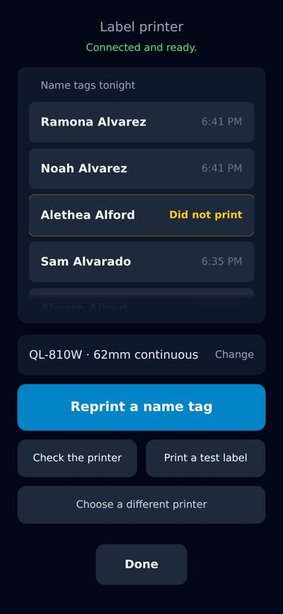

## A parent, inside ten minutes

### The dead end, given one thing to press

A parent taps a child the register already holds, and gets a statement: they are checking, and the answer is on the screen. That is also the exact spot where somebody notices the sticker is missing — the child is beside them, the name is already on the glass. The offer appears only for a child **this kiosk checked in within the last ten minutes**, once, and only where a label would actually come out. A cap of one per child is not a cap on a person: without the window, anybody in the lobby could walk the register and take a badge for every name on it.

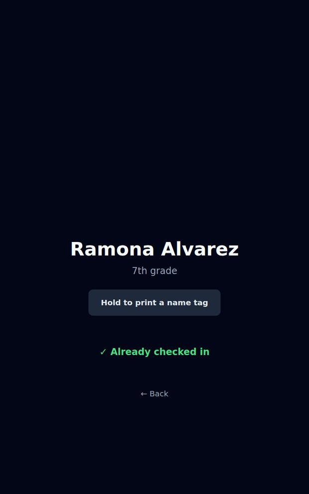

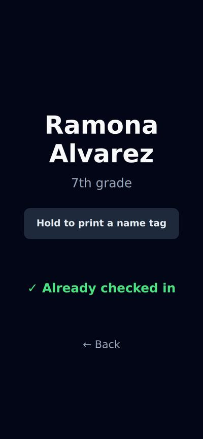

### The receipt is the whole of the signal

Two seconds of holding, and this is what says it worked: `haptic()` is `navigator.vibrate`, which the iPads these kiosks are do not implement, so nothing happens in the hand. The line that replaces the control is the brightest thing in the frame for that reason — a receipt arriving as the dimmest line is how a parent concludes nothing happened, goes to find a leader, and gets a second label out of one held button. It says *sent*, because a queued job is all the kiosk knows. The second line is for the other arrival: a parent who pressed nothing, whose child’s tag was reprinted at the desk, since the counter is shared.

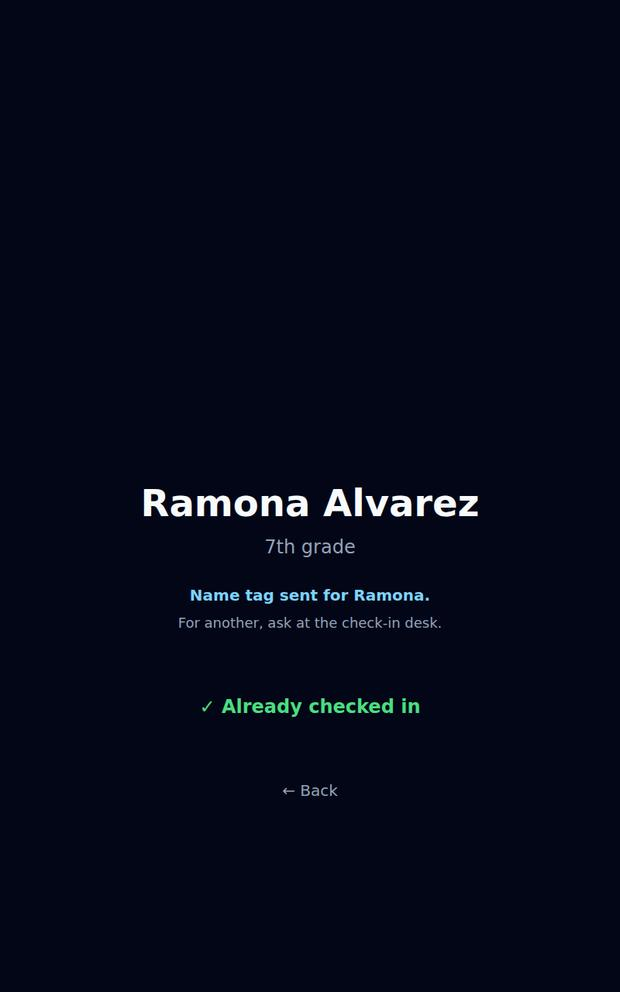

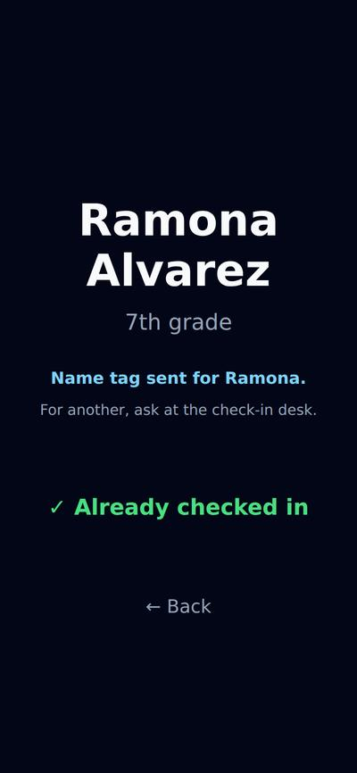

### Eleven minutes later, and for everybody else

The common case, and the one that had to be today’s screen and nothing more. Outside the window there is nothing to press — one line saying where a name tag comes from, which is the whole of the discoverability fix and costs nothing. A parent whose child’s badge is on the floor of the hall at half past seven had no way of knowing a second copy was even possible. Where no label would come out at all — no printer, or one with its cover open — even this line is absent: a parent is never told about a printer, and pointing somebody at a desk that cannot help is a second queue for the same answer.

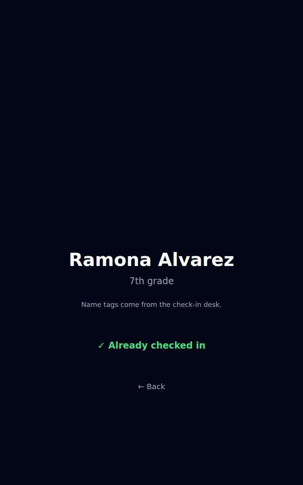

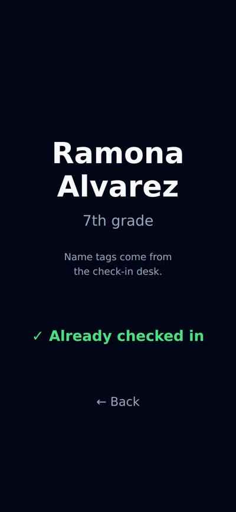
