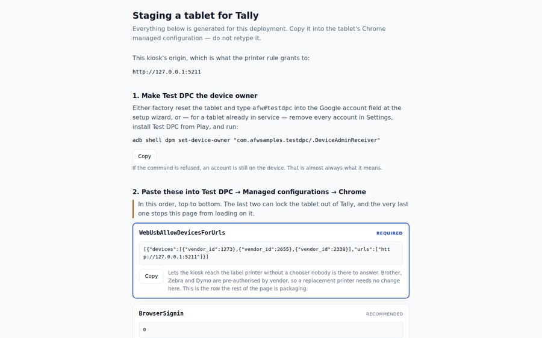
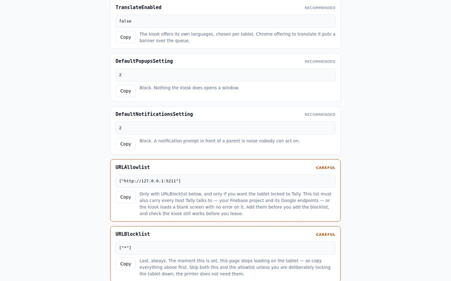
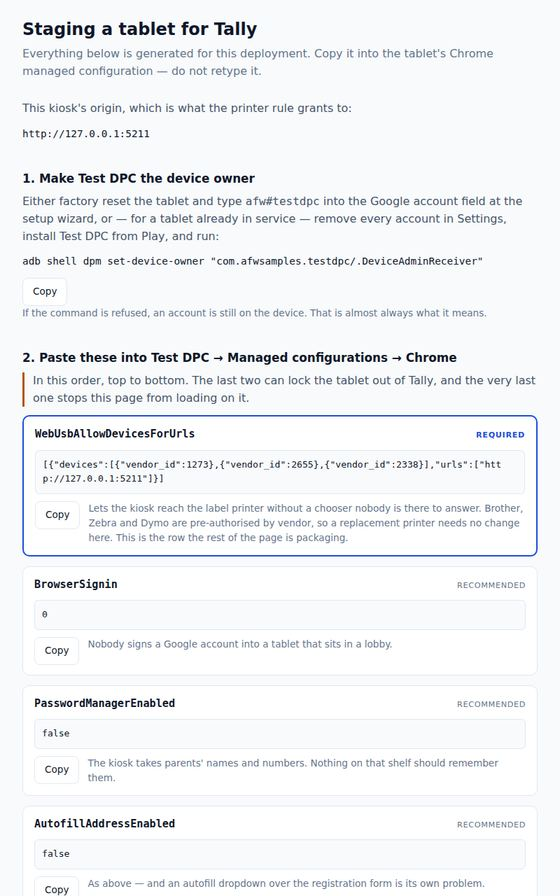
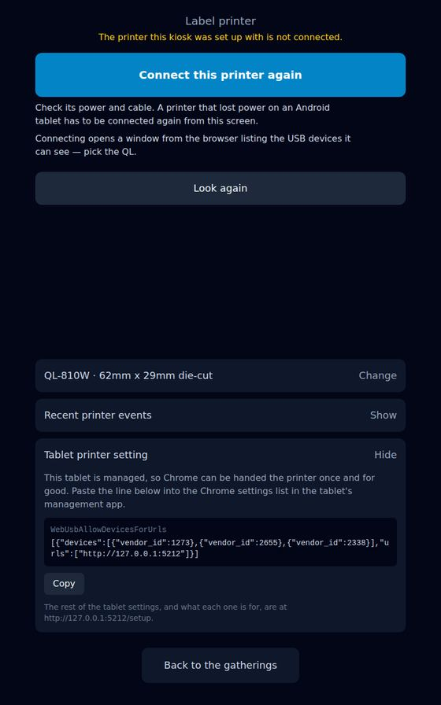
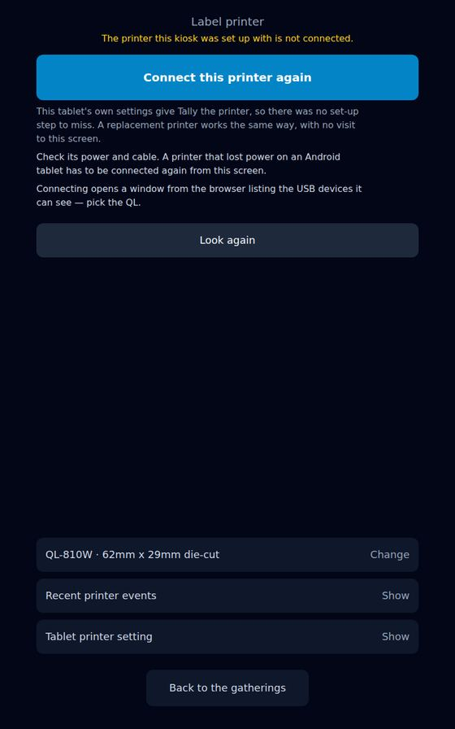
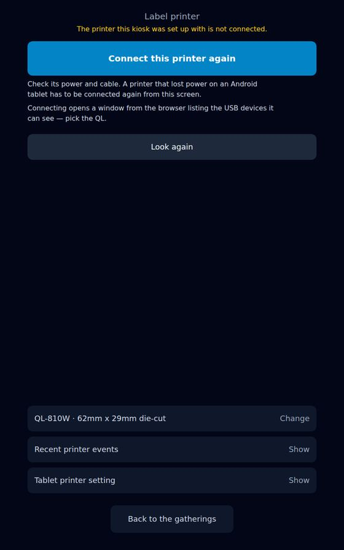
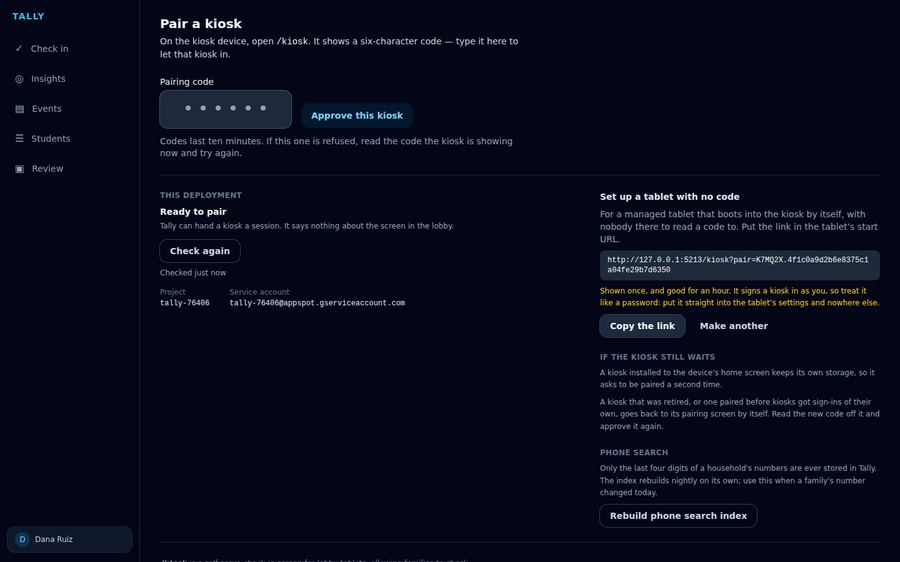
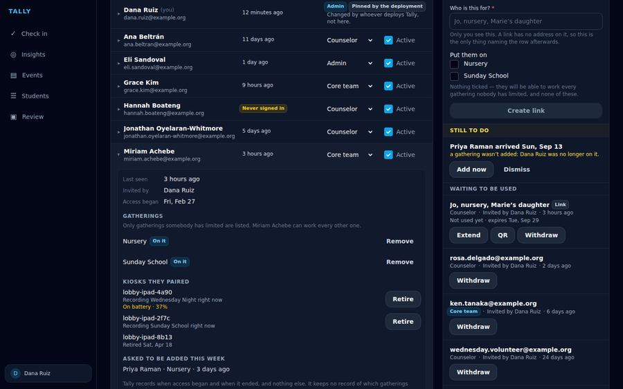

# Managing the shelf tablet — a walkthrough

Seven surfaces, in the order somebody meets them: staging a tablet, the kiosk
noticing what the staging did, and the two places it shows up afterwards. The
reasoning behind all of it, and the argument for why Tally emits the policy
rather than applying it, is [tablet-management.md](../../tablet-management.md).

Every frame is the real thing. `/setup` is the page the app serves, rendered by Vite from `setup.html` and reading the origin it was served from — which is why the values on it say `127.0.0.1` here and will say the church’s host in a deployment. The three app screens are the components `src/` exports, mounted with the app’s own stylesheet by the `uxr/*-live/` harnesses, with Firestore and the callables answered from fixtures. What is faked is the data and the printing module’s handle, which is a WebUSB transport in real life. Nothing here is a mock-up of a screen: the line about a policy-granted printer is drawn by `PrinterScreen` from a config carrying `viaPolicy`, exactly as a managed tablet would hand it one.

**None of this is proof that the policy works on hardware.** These frames show what Tally does once a tablet has been staged; whether Chrome on a real Android tablet honours `WebUsbAllowDevicesForUrls` for the Brother is Phase 0 of [tablet-management.md](../../tablet-management.md) §10, and it needs somebody holding a tablet.

Regenerate with:

```bash
npx tsx uxr/tablet-live/walkthrough.ts           # capture
npx tsx scripts/build-tablet-walkthrough.ts      # build the page
```

## Staging a tablet

### The page that generates its own answers

Opened **on the tablet being staged**, before that tablet is a kiosk. What somebody types is the short path `/setup`; what they paste is everything else — and that is the whole trick, because every way of getting the WebUSB value wrong fails silently. Nothing here is configured: the origin it grants to is the origin it was served from, so this page is correct wherever Tally is deployed. It is not behind a sign-in either, on purpose — a login would mean signing a staff Google account into the browser of a tablet about to be handed to the public, which is the exact thing the kiosk’s pairing design exists to avoid.



### The required row, and the two that can lock you out

The blue row is the one the whole page exists for. It pre-grants Brother, Zebra and Dymo by vendor — a grant is free and a printer bought in a hurry on a Sunday morning is not — and it names no `product_id`, because a model-pinned rule has to be edited the first time a printer is replaced. The amber rows at the bottom are ordered last and a test pins that order: pasting `URLBlocklist: ["*"]` into the tablet’s Chrome cuts off the very page these values are being copied from.



### The same page, on the glass it is read from

The shelf tablet, stood on end, which is where this is actually used: Chrome on one side of the screen and Test DPC’s managed-configuration editor on the other. Copy, switch, long-press, paste, next key. The copy button falls back to selecting the value when the clipboard API is refused — which it is on an insecure origin — because a button that silently does nothing during staging is worse than no button at all.



### The same value, on the glass it has to be pasted from

The page above is the right thing for a laptop and the wrong thing for the moment that matters. The paste target is Test DPC — an Android app on *this* tablet — and the only clipboard that can reach it is this tablet’s own. So the one required value is also here, folded, on the screen already open on the device: hold *Clear*, printer screen, unfold, copy, switch apps, paste. Nothing is typed, not even a URL. It is composed from this page’s own origin and three published vendor ids, so it is right by construction wherever Tally is deployed — which is why the frame shows `localhost`: the harness is serving it, and the value says so.



## A volunteer at the kiosk

### No set-up step was missed

A managed kiosk whose printer is not answering at this moment. Before the change this screen offered *Connect the printer* and said nothing else, and on a tablet nobody ever set up the absence of a set-up step reads as a step somebody skipped. The reference line says the tablet’s own settings supplied the printer and a replacement will work the same way — and the advice that is actually actionable, power and cable, stays exactly where it was. A test pins that it stays.



### And nothing of the sort on a kiosk somebody paired

The same screen, same state, on an ordinary kiosk. The line is absent, because it would be untrue: somebody did connect this printer by hand, and there was a set-up step. Provenance is carried on the stored config and survives both places that rewrite it — `configure()`, which every roll change goes through, and `checkPrinter`’s settle. Without that carry, the first time anybody picked the other spindle a policy-granted printer would start describing itself as one somebody paired.



## A leader, staging in the office

### A pairing for a tablet nobody will be standing at

The ordinary handshake wants a volunteer holding a tablet that is already showing six characters. A managed tablet is the other shape entirely — reset in an office, booting into the kiosk by itself — so the pairing is minted ready and travels in the tablet’s start URL. Shown once, good for an hour, and the warning is written as *treat it like a password* rather than in security language nobody reads. The kiosk strips it out of the address before it makes any network call, and unconditionally: a link that failed is no less a credential than one that worked.



## Whoever notices before Sunday

### Somebody unplugged the lobby tablet

The one thing on the tablet-management list that never needed a device-management product at all. `lastSeenAt` already said a kiosk was alive on Tuesday; it did not say the tablet has been off its charger since Thursday, which is the sentence somebody can act on. Said only when it is worth saying — a plugged-in tablet and a retired row both stay silent, because "87%, charging" is a fact nobody can act on and one more line on a screen that is already dense. Four tests pin each of those silences.


