# Per-event kiosk themes

*Generated by `npm run walkthrough:themes`. Do not edit by hand.*

A ground and three hues, chosen per gathering. Every frame below was photographed from the running app against the emulators — the real lobby screen, bound to a real evening, wearing colours the same resolver worked out that a church’s kiosk would be served.

The three slots are named for the job each does rather than for a rank. There is no *primary* and *secondary*, because the kiosk has no second tier of button to rank; what it has is a palette that already means something. So: **what you touch**, **what just happened**, and **the room**. A fourth colour is deliberately not offered — amber belongs to the allergy line, and no gathering may recolour it.

## Choosing

### Every gathering starts with Tally’s own colours

**Untouched** — The field sits with the label template, because both are about the screen in the lobby rather than the phone at the door. Shut, it states the current answer — and the ordinary answer is that there is no answer: an unthemed gathering is the kiosk that shipped, stored as null and costing nothing anywhere down the path.

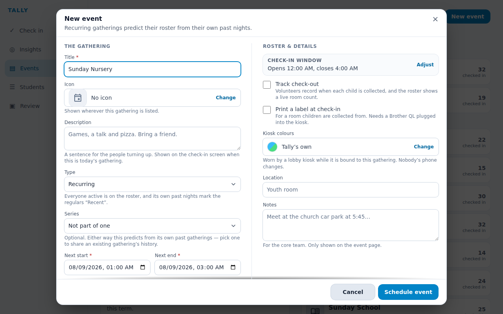

### Three slots, named for the job rather than the rank

**Open** — Not primary, secondary and tertiary. Those are a ranking, and the kiosk has nothing to rank — there is no secondary button and no tertiary chip, so two of the three would need screen furniture invented to justify them. Its palette is already semantic, so the slots follow it: what you touch, what just happened, and the room.

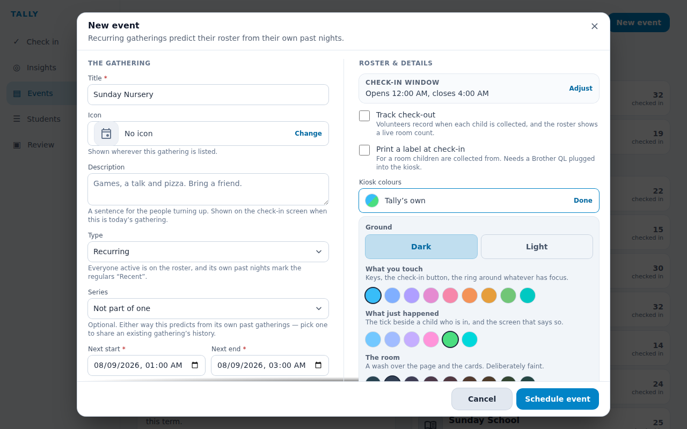

### The preview is the point

**Dark · violet** — The screen being themed is on a shelf in another room, and a row of swatches does not tell anybody what a teal tick on a violet page will look like. So the preview paints one — from the same resolver the kiosk is sent, which is what stops the two disagreeing.

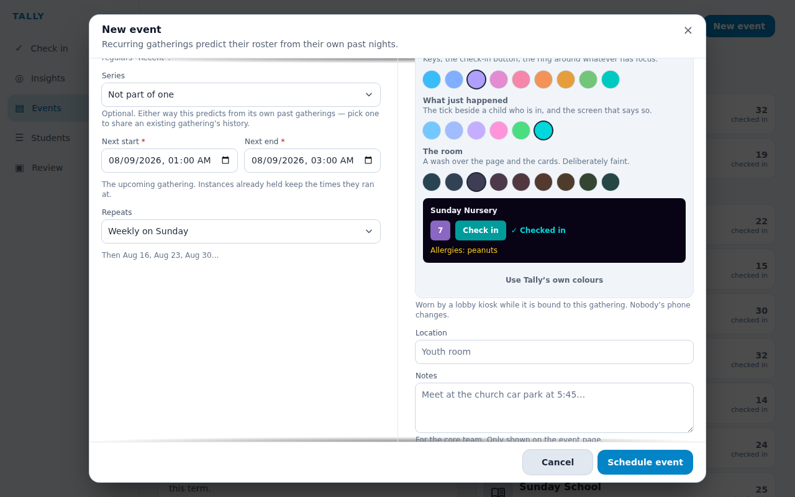

### The same four choices on a light ground

**Light · forest** — Ground is a separate axis from hue, and it reuses the light theme the app already had — the whole ink ramp flipped and the accents re-picked rather than lightened. A hue means the same thing on either ground because every ramp holds its lightness and turns only its hue. Two things are also missing from this picker, on purpose: the amber band is absent from “what just happened”, and warning amber is absent from every row. That is what an allergy line is painted in, on the screen and on the printed label, and a gathering that softened it to match its theme would be recolouring the one thing whose whole job is to stop a child being handed the wrong food. It stays amber in the preview above whatever else moves — visible here rather than discovered in a lobby.

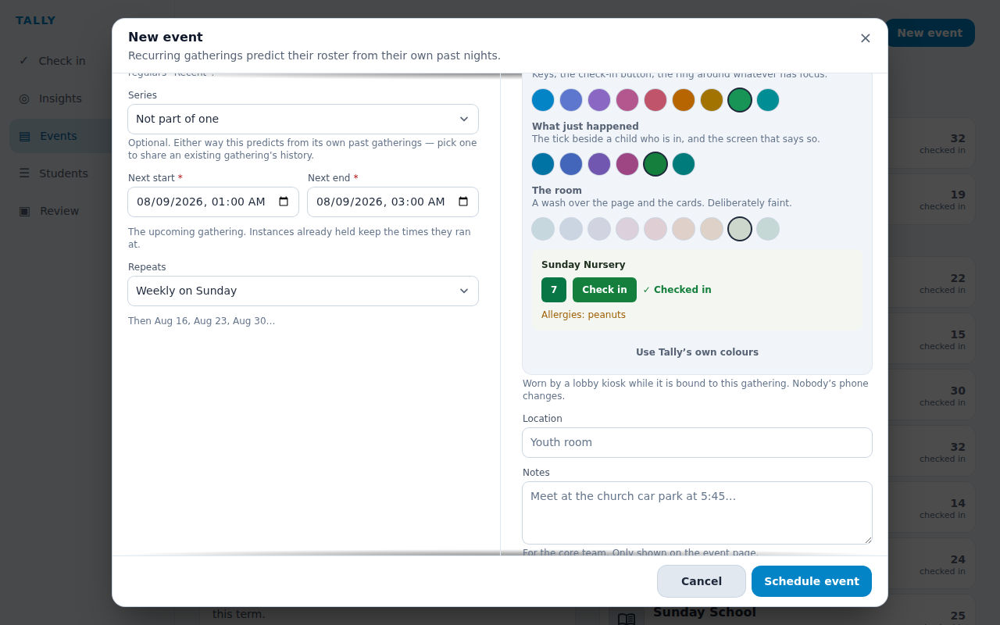

## Wearing

### The kiosk that shipped

**Unthemed** — Sky blue keys on near-black, which is what every kiosk looked like before this and what every unthemed gathering still looks like. Worth holding in mind for the eight frames below: none of them is a redesign, they are this screen with three hues turned.

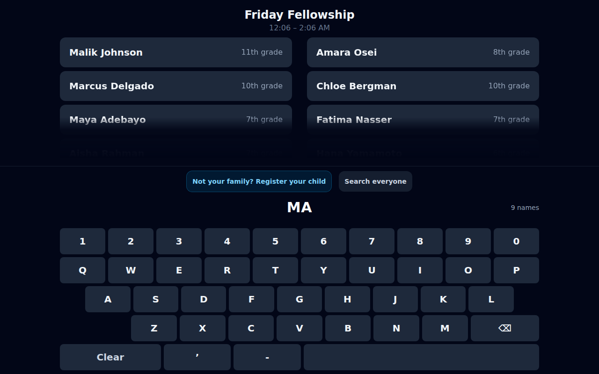

### Friday Fellowship — searching

**Dark · violet** — A youth night in a dim hall. The dark ground is the one the kiosk has always had; what changes is that the keys and the page now belong to this evening rather than to the app.

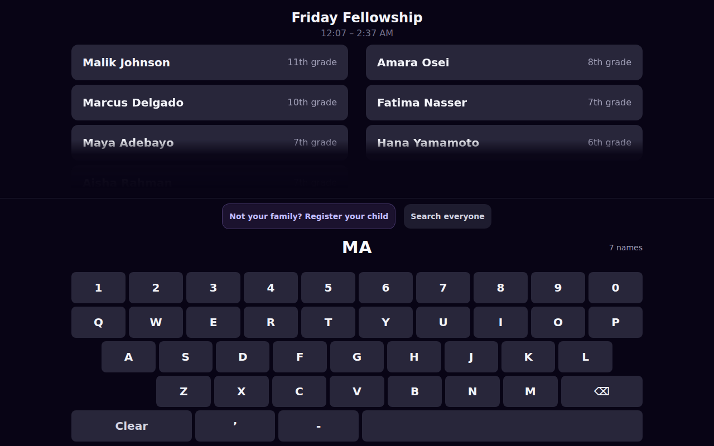

### Friday Fellowship — checked in

**Confirm · teal** — Friday Fellowship sets its confirmation to teal.

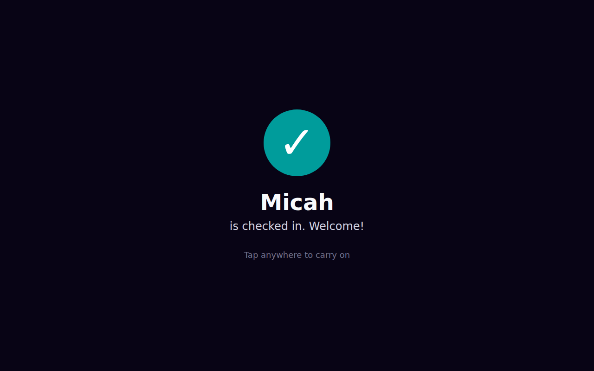

### Fall Lock-In — searching

**Dark · ember** — The same dark ground, and unmistakably not the same night. This is the comparison that matters: a ground is not a theme, and two gatherings sharing one still have to read as two rooms.

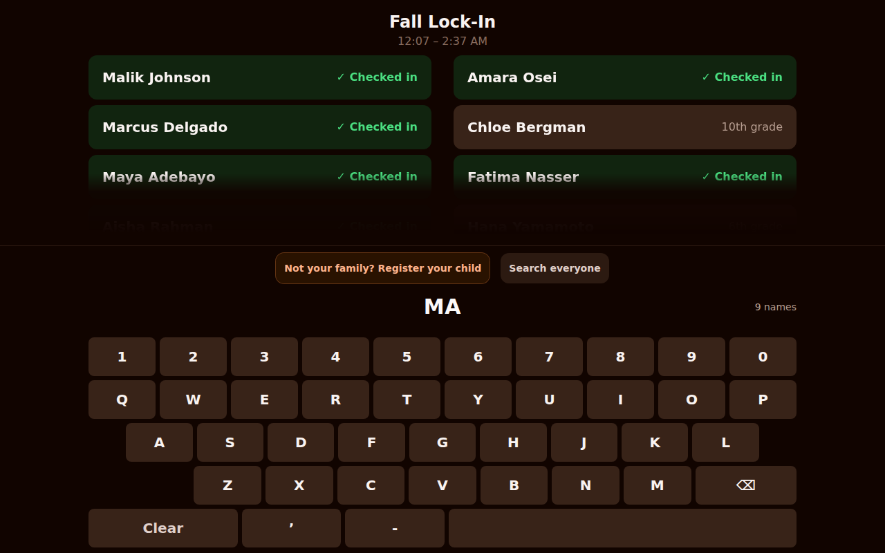

### Fall Lock-In — checked in

**Confirm · forest** — Fall Lock-In sets its confirmation to forest.

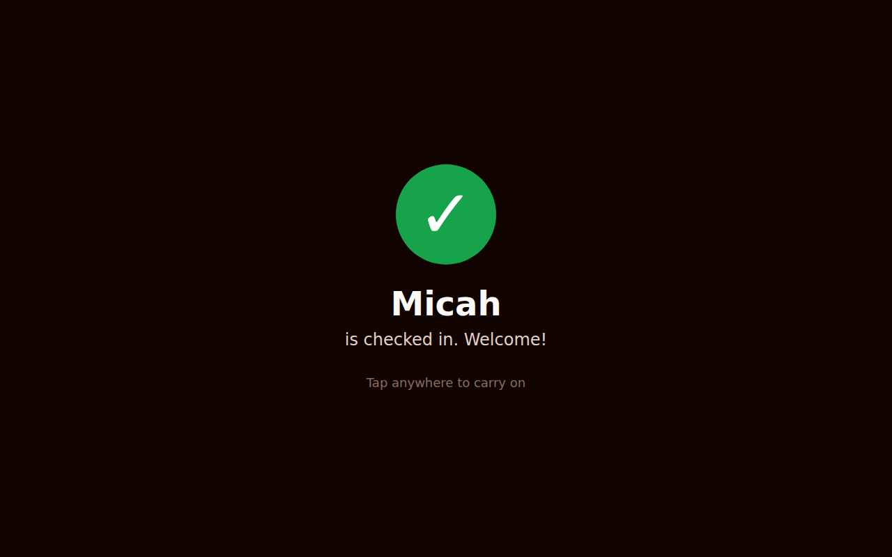

### Nursery — searching

**Light · forest** — A bright Sunday morning lobby, where a dark screen is the thing that looks broken. Note the cards stay white — pure white has no hue to turn, and a tinted card on paper reads as a stain.

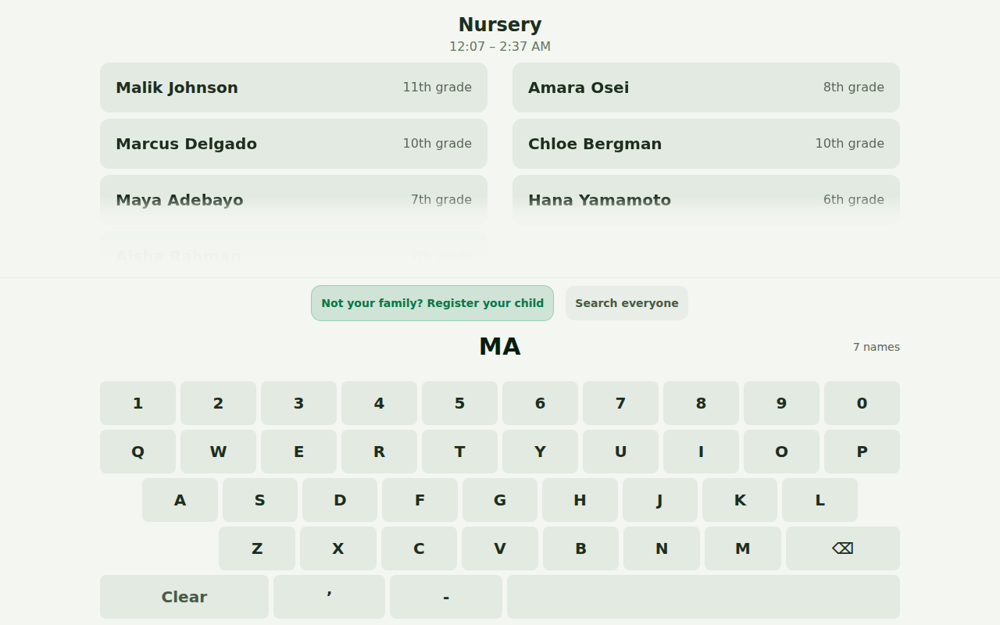

### Nursery — checked in

**Confirm · forest** — Nursery sets its confirmation to forest.

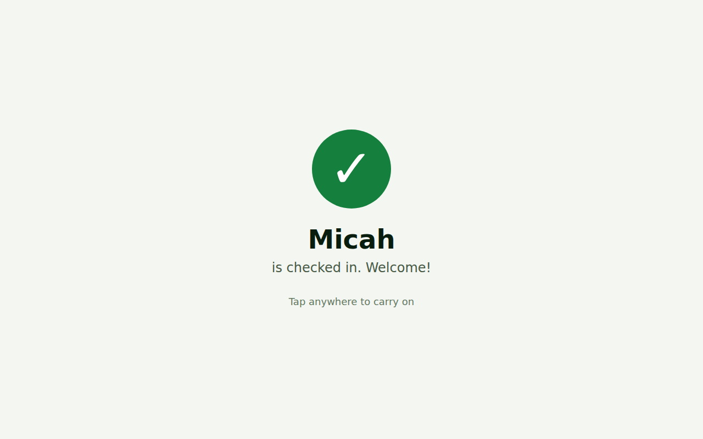

### Sunday School — searching

**Light · teal** — Light again, an hour after the nursery, in the same building. Two light rooms that a parent can still tell apart at a glance is the same test the two dark ones just passed.

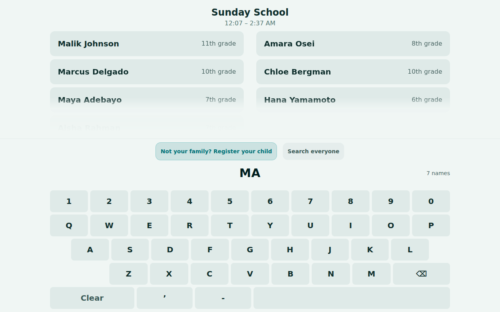

### Sunday School — checked in

**Confirm · sky** — Sunday School sets its confirmation to sky.

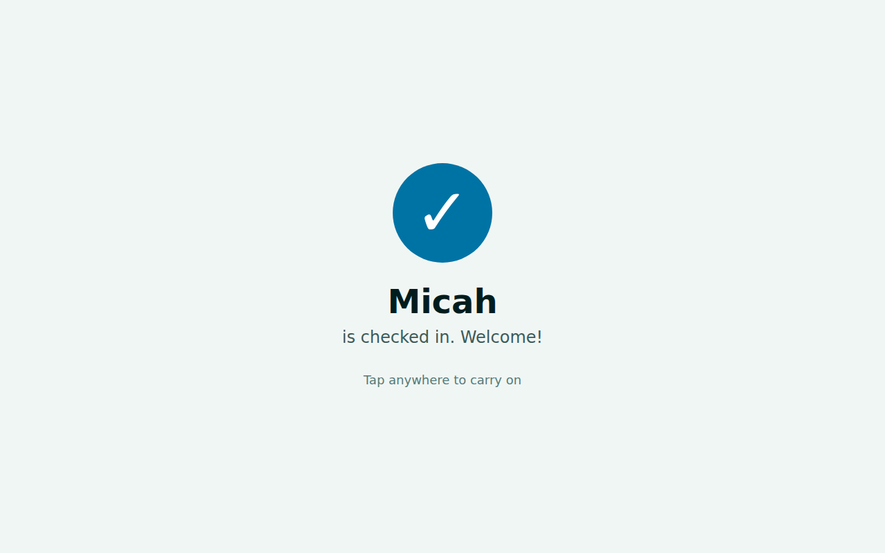
