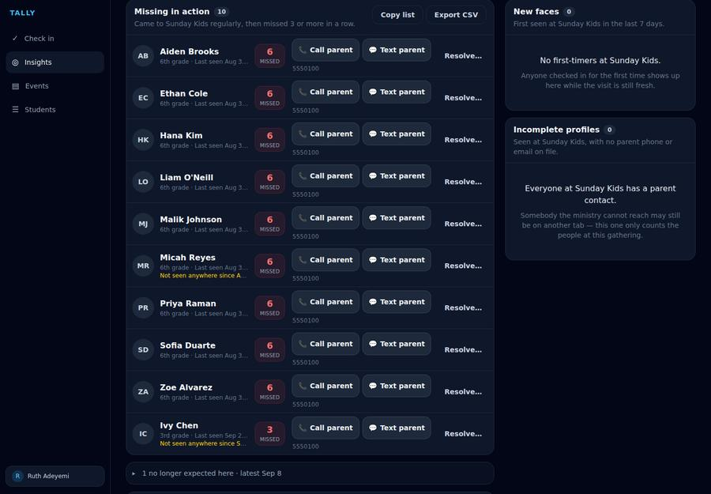
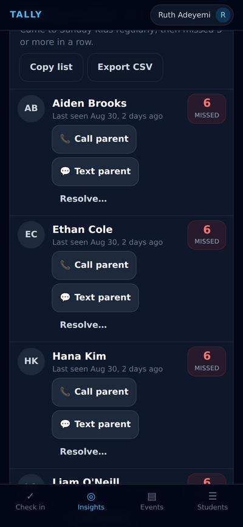
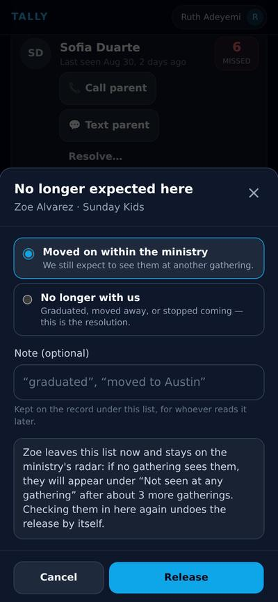
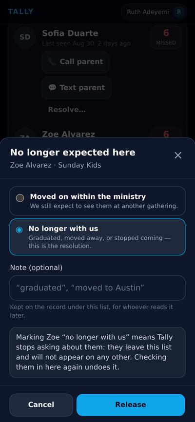
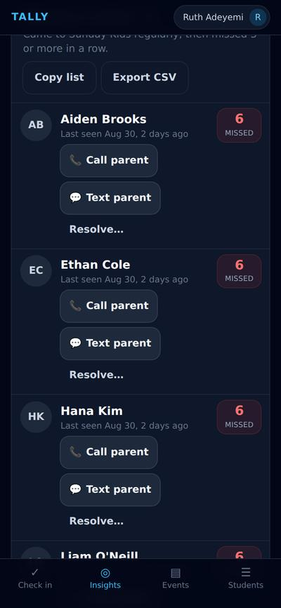
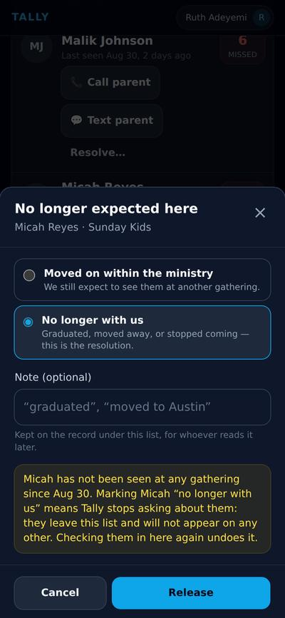
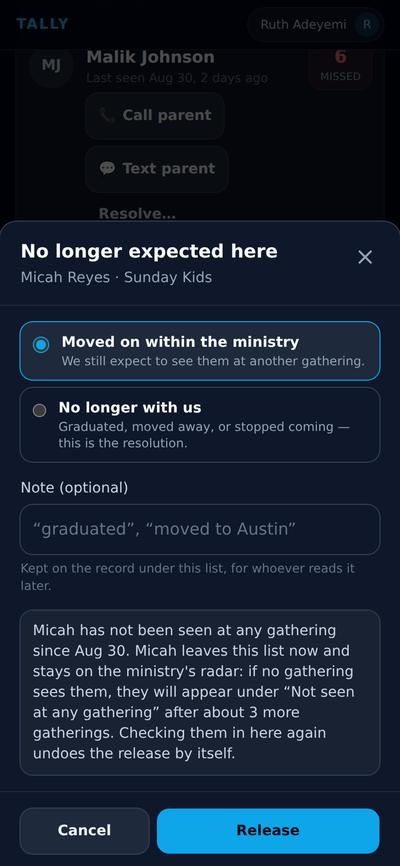
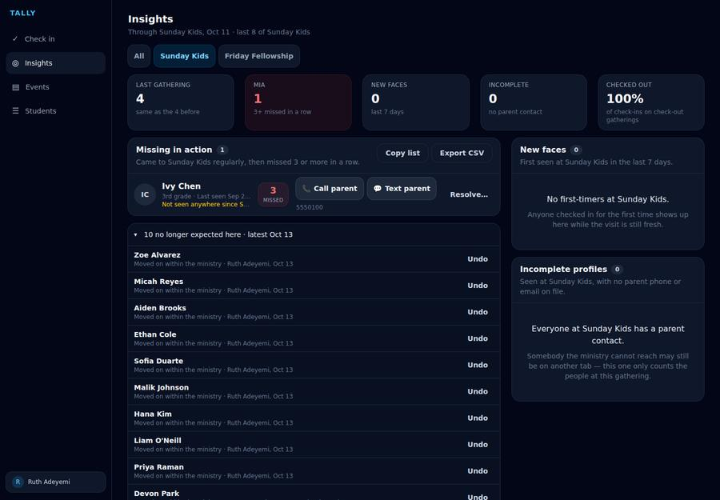
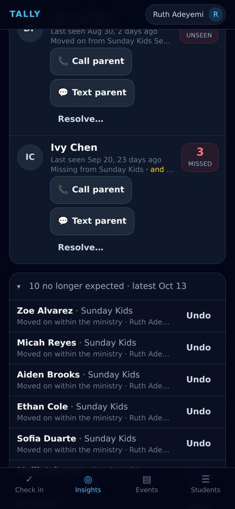

# Aging out of a gathering — a walkthrough

One ministry, four weeks after promotion Sunday, walked through the act that says a
gathering no longer expects a student — and the two questions the reason answers.
The design and its five rounds of critique are in [aging-out.md](../../aging-out.md).

Every frame is the application’s own Insights screen — the same component `src/App.tsx` routes to, rendered by Vite with the app’s own stylesheet. Nothing here is staged: the fixture supplies two months of two gatherings’ attendance and `computeMiaByGathering` decides who is missing, exactly as it does against Firestore. What is faked is Firestore, the session and the two Planning Center reads (`uxr/transitions-live/`), and the release writes really mutate, because the consequences are the subject.

Regenerate with:

```bash
npx tsx uxr/transitions-live/shoot.ts   # capture
npx tsx scripts/build-transitions-walkthrough.ts   # build the page
```

## The Tuesday the call list cries wolf

### Nine children who did not go missing

Sunday Kids, four weeks after promotion Sunday. Every row here is derived, not staged: nine 5th graders cleared this gathering’s Recent bar in August, moved up to the youth ministry on 7 September, and have missed every Sunday since — so the rule that exists to find drifting families reports all nine of them, six misses each. The list sorts longest-absent first, which is the order a leader should work the phone, so the cohort sits *above* the one row that is a real absence. Until now the only in-app remedy was to mark them inactive, which would also have removed them from the Friday night they now actually attend, and the volunteer who could not find them at that door would have quick-added a second copy of each.





### The one row that must not be resolved on momentum

Eight of the nine turn up on Fridays, and the derivation can see it — so their rows say nothing more than that they have stopped coming *here*. Two rows are marked, in amber, before anything has been pressed: **Micah Reyes**, who moved up with the others and has been seen at nothing since, and **Ivy Chen**, the 3rd grader whose family simply stopped coming in September. That mark is the row asking a different question. Eight of these ten are bookkeeping; two are children nobody has seen anywhere, and they are the two a leader must not resolve on momentum. It is also why the act is one student at a time rather than a select-all — a bulk gesture would stamp one answer onto all ten, and the two that matter are the ones it would get wrong.


## The act

### Two reasons, and only two

The picker offers what the record stores, and nothing else: *moved on within the ministry* and *no longer with us*. Two, because only two differ in effect — everything else a leader might want to say goes in the note, which nothing ever parses. “Moved on” arrives pre-selected and the silencing answer never does: a wrong “moved on” surfaces the student on the pooled list in a few weeks, which is a phone call probably worth making anyway, while a wrong “no longer with us” is a year of silence about a family nobody resolved. The default leans the recoverable way.




### The sentence says which way the press will fall

Both choices carry their consequence above the buttons, and the silencing one carries the stronger sentence — a caption that only warned about the surfacing choice would teach a reader that the sentence never matters. This is the review screen’s own grammar: a leader should not have to press a button to find out what it does. Note what “no longer with us” actually promises — Tally stops asking about them — and that checking the student in here again undoes the whole thing by itself.




### A released row greys where it stood

Zoe has been released as moved on, and her row has not vanished from under the reader who pressed the button — it greys in place, holding the position its streak earned, and carries a one-tap Undo for the rest of the session. Everything interactive about the live row is gone with it: Call and Text on a resolved row would invite exactly the phone call the press was ending. The count in the header has come down by one; nothing else has moved.




## The one that must not be silenced

### The strongest sentence, for the row that earned it

Micah’s dialog is not the same dialog. Because the window has seen him nowhere since 31 August, the consequence sentence opens by saying so — by name, with the date — and the silencing choice paints itself in the warning tint the rest of the app reserves for things that need reading. A leader clearing a tab in a hurry, months after the fact, is the person this sentence is written for: it is the difference between filing nine children correctly and quietly closing the only row that was still asking about a child nobody has seen.




### Kept on the ministry’s radar instead

So the leader chooses “moved on” for him too — the honest answer, since nobody has decided this family is gone — and the sentence changes to what that costs: if no gathering sees Micah, he will appear under “Not seen at any gathering” after about three more gatherings. The record is not a verdict about a child; it is a statement about what this gathering expects, and it leaves the ministry still watching for him.




## What the list becomes

### One row, and it is the right one

The whole cohort released, and Sunday Kids’ call list is Ivy Chen — the family that actually drifted, no longer ninth in a queue of children who simply grew up. This is the failure the record was built for: not the one embarrassing phone call, but the tab that becomes known noise, stops being read by December, and takes the real row down with it. Nothing about Ivy’s row changed; what changed is that it can be seen.


### Locked, not hidden

Nine rows left this list, so the list says so. A call list that is nine rows shorter with no explanation reads as good news, and the person reading it in March is not the person who pressed the buttons in October. The strip is deliberately not conditional on the list above it having anything in it: months on, the cohort fragments — somebody deactivates one from their page, the window retires another — and “the tab is clean” must never be the only record of what was decided here.


### Who decided, when, and the way back

Opened, it is the ledger: every release with its reason, its note, the person who made it and the date, each with an Undo that outlives the session the act was made in. Devon Park’s entry is older than the rest — released on promotion Sunday by the children’s director, with “up to youth group” written on it — and it is about to matter, because six weeks later nothing has seen him.




## The safety net, six weeks later

### The child who moved on and landed nowhere

This is the half of the design that only happens weeks after the act, and the reason the reason is load-bearing. Devon was released as *moved on* — the ministry still expected to see him somewhere — so his own old Sunday sightings stopped shielding him, and now that no gathering has seen him since, the pooled list surfaces him with the release named: “Moved on from Sunday Kids 8 Sep — not seen since”. Had he been marked “no longer with us”, this row would correctly never appear. The check is anchored to the act rather than the calendar, which is what makes a release performed in January detect a lost family exactly as well as one performed in September.



